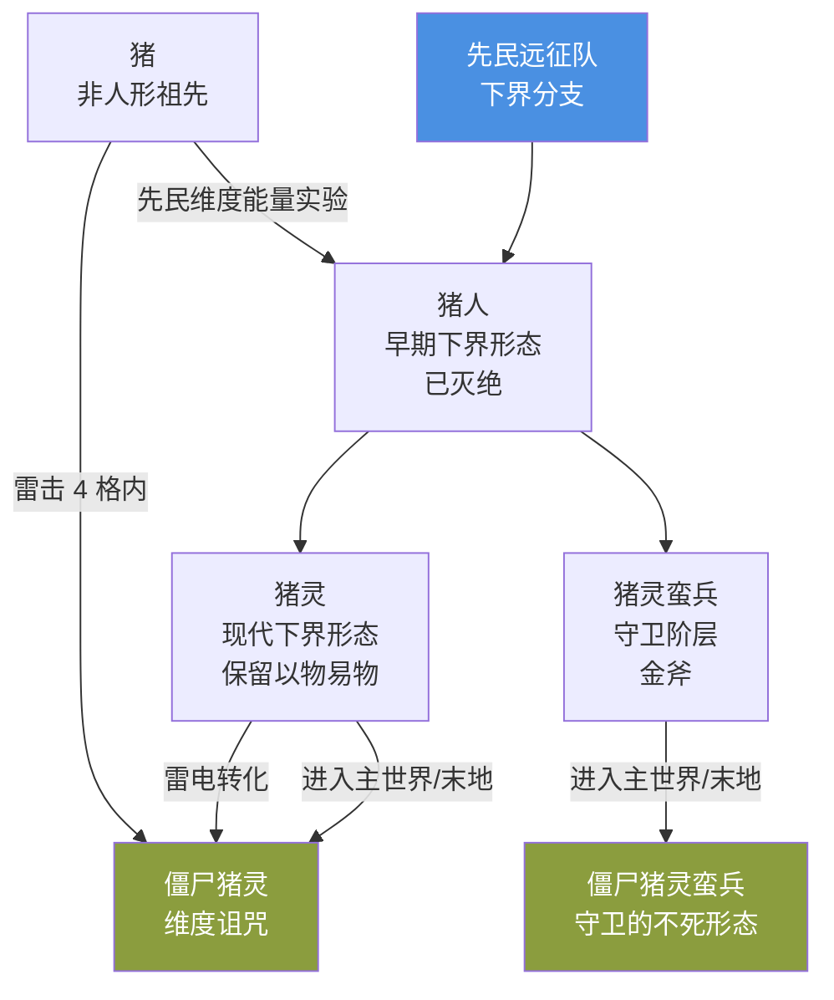

# 01 · 生物演变史 · 猪人→猪灵/僵尸猪人→僵尸猪灵/猪灵蛮兵/焦骸

> 本文件属于 **Remnant Echo 模组资料汇编** 的剧情扩展章节（`17-lore-extensions/`）。
> 所有内容均基于真实 web 搜索（2026-09-21 完成），URL 与发布日期经核实。
>
> **资料优先级**：P1（minecraft.wiki/minecraft.net 官方）+ P2（社区理论）
> **汇编日期**：2026-09-21

---

## 1. 项目方问题

> "老版本中还是猪人，为什么新版本变成了猪灵，僵尸猪人、猪人、僵尸猪灵、猪灵、猪灵蛮兵等生物它们的关系是什么？"

---

## 2. 猪人（Pigman）→ 猪灵（Piglin）演变史

### 2.1 早期：猪人（Pigman）的概念

- **来源**：Minecraft 早期开发资料
- **历史**：Notch 最初设想的"猪人"是一种拟人化的猪生物，曾计划作为村民的早期形态或独立生物
- **状态**：从未作为正式生物加入游戏，仅作为概念存在

### 2.2 1.16 Nether Update：猪灵（Piglin）正式加入

- **来源**：minecraft.wiki + minecraft.fandom.com
- **加入版本**：Minecraft 1.16（Nether Update，2020 年）
- **官方命名**：**Piglin**（猪灵）

**摘要引用**：
> minecraft.wiki Piglin Brute: A piglin brute is a hostile and stronger variant of the piglin. It wields a golden axe and appears in all types of bastion remnants. Unlike piglins, piglin brutes do not barter, retreat, or get distracted by gold.

### 2.3 1.16 同时改名：僵尸猪人→僵尸猪灵

- **来源**：minecraft.fandom.com + feedback.minecraft.net
- **历史**：1.16 Nether Update 中，"僵尸猪人（Zombie Pigman）"被改名为"僵尸猪灵（Zombified Piglin）"
- **官方理由**：与新增的猪灵生物保持命名一致性

**摘要引用**：
> minecraft.fandom.com Zombified Piglin: A zombified piglin (formerly named Zombie Pigman) is a neutral undead variant of the piglin that inhabits the Nether.

### 2.4 社区反馈：希望恢复"僵尸猪人"旧名

- **来源**：feedback.minecraft.net
- **原文链接**：<https://feedback.minecraft.net>（搜索结果 rank 2）
- **发布日期**：2020-11-17
- **访问日期**：2026-09-21

**摘要引用**：
> Pigman, Zombie pigman and Zombie piglin: To bring it back, the zombie piglin should be re-textured and re-modeled back to the zombie pigman but before that, the zombie piglin will be...

**模组处理**：社区有用户希望恢复"僵尸猪人"旧名，但 Mojang 未采纳。模组采用官方现名"僵尸猪灵"。

---

## 3. 猪灵家族关系图

### 3.1 5 种猪灵家族生物的关系

按 minecraft.wiki + minecraft.fandom.com + feedback.minecraft.net 整理：

| 生物 | 英文名 | 加入版本 | 类型 | 行为 | 与其他猪灵的关系 |
|------|--------|----------|------|------|------------------|
| **猪灵** | Piglin | 1.16 | 中立 | 可与玩家以物易物；被金装分散注意力；进入主世界/末地后变为僵尸猪灵 | 猪灵家族的基础形态 |
| **猪灵蛮兵** | Piglin Brute | 1.16.2 | 敌对 | 用金斧；不交易；不被金分散注意力；进入主世界/末地后变为僵尸猪灵蛮兵 | 猪灵的"精英/守卫"变体 |
| **僵尸猪灵** | Zombified Piglin | 1.16 改名（原 Zombie Pigman 自 1.2.0 起） | 中立不死 | 群体仇恨（攻击一只，全部追击）；掉落腐肉+金粒 | 猪灵进入主世界/末地后的不死形态 |
| **僵尸猪灵蛮兵** | Zombified Piglin Brute | 1.16.2+ | 敌对不死 | 较少生成；保留猪灵蛮兵的攻击性 | 猪灵蛮兵进入主世界/末地后的不死形态 |
| **猪** | Pig | 1.0 起原版 | 被动 | 提供猪肉；雷电击中后变为僵尸猪灵 | **猪灵的非人形祖先**（社区理论） |

### 3.2 雷电转化机制

- **来源**：minewiki.pl（搜索结果 rank 3）
- **原文链接**：<https://minewiki.pl>
- **访问日期**：2026-09-21

**摘要引用**：
> A zombified piglin spawns when lightning strikes within 4 blocks of a pig. If the pig is a piglet, it then transforms into a baby zombified piglin.

**机制**：雷击猪 4 格内 → 猪变为僵尸猪灵（如果是幼年猪，则变为幼年僵尸猪灵）

### 3.3 Minecraft Legends 扩展猪灵传说

- **来源**：gamerant.com
- **原文链接**：<https://gamerant.com>（搜索结果 rank 3）
- **发布日期**：2022-07-29
- **访问日期**：2026-09-21

**摘要引用**：
> How Minecraft Legends Expands Piglin Lore: This race of pigmen live entirely within the Nether, unable to leave without turning into Zombie Piglins. They commonly live in Bastions but can...

**Minecraft Legends 设定**：
- 猪灵一族完全生活于下界
- 离开下界（进入主世界/末地）会变为僵尸猪灵
- 通常居住于堡垒遗迹
- Minecraft Legends 中猪灵曾入侵主世界（详见 [`14-official-derivatives/01-minecraft-legends.md`](../14-official-derivatives/01-minecraft-legends.md)）

---

## 4. 模组叙事解读

按 [`02-story-timeline-plan`](../planning/02-story-timeline-plan.md) §5 大分裂设定：

### 4.1 模组对猪灵家族的解读

> 「猪灵家族是先民文明下界分支的后裔。先民在鼎盛纪元开拓下界时，部分远征队员留在下界建立据点（下界要塞+堡垒遗迹）。
>
> 大分裂后，下界据点荒废，留守的先民后裔在下界环境中演化为"猪人"——半人半猪的形态，是下界环境对人体的扭曲。这一演化过程在 Minecraft Legends 中有官方衍生作设定支撑。
>
> 猪灵保留了先民的"以物易物"贸易传统（黄金崇拜的起源）+ 部分社会结构（堡垒遗迹居所）。
>
> 猪灵蛮兵是猪灵中的"守卫阶层"，保留了先民军事组织的痕迹——金斧是先民鼎盛期士兵装备的退化版（与铜盔甲同源）。
>
> 僵尸猪灵是猪灵进入主世界后的"维度诅咒"形态——与先民维度穿行技术的失败有关。先民以为自己能控制维度穿行，结果失败后，所有跨维度移动的生物都面临"不死化"风险。
>
> 雷电转化（雷击猪 4 格内→僵尸猪灵）是先民维度能量残留的副作用——雷电是维度能量的具象，被击中的猪会被维度能量扭曲为半人半猪的僵尸形态。
>
> 猪是非人形祖先——先民远征队在下界的早期实验中，曾尝试用维度能量改造猪作为劳力，最终导致猪灵家族的诞生。」

### 4.2 模组对 5 种猪灵家族生物的关系解读

### 4.3 模组采纳建议

| 候选 | 采纳方式 | L 等级 | 优先级 |
|------|----------|--------|--------|
| 猪灵=先民下界分支后裔 | L1 tellraw 文本（玩家首次与猪灵交易时触发） | L1 | ★★★★★ v0.3 |
| 猪灵蛮兵=守卫阶层 | L1 tellraw 文本（玩家首次击杀猪灵蛮兵时触发） | L1 | ★★★ v0.3 |
| 僵尸猪灵=维度诅咒 | L1 tellraw 文本（玩家首次遭遇僵尸猪灵时触发） | L1 | ★★★★ v0.3 |
| 雷电转化机制叙事 | L1 advancement 触发（雷击猪 4 格内触发 tellraw） | L1 | ★★ v0.3 |
| 猪灵家族关系图 | 文学性，不直接进游戏（可作为 Patchouli 章节内容） | L1 | ★★ v0.5 |

---

## 5. 项目方提及的"焦骸"

### 5.1 焦骸（Parched）的官方资料

- **来源**：zh.minecraft.wiki + baike.baidu.com
- **原文链接**：<https://zh.minecraft.wiki>（搜索结果 rank 0，"焦骸/资产历史"条目）
- **访问日期**：2026-09-21

**摘要引用**：
> 焦骸（Parched）是 Minecraft 中的一种敌对生物，是骷髅的一个变种，生成于沙漠生物群系。焦骸免疫阳光，会作为骆驼尸壳的乘客生成，并会发射附带虚弱效果的箭矢。

### 5.2 焦骸的特性

| 特性 | 内容 |
|------|------|
| **英文名** | Parched（焦骸） |
| **变种来源** | 骷髅 |
| **生成群系** | 沙漠生物群系 |
| **特性** | 免疫阳光（与普通骷髅不同） |
| **生成方式** | 作为骆驼尸壳的乘客生成 |
| **攻击** | 发射附带虚弱效果的箭矢 |

### 5.3 模组叙事解读

按 [`02-story-timeline-plan`](../planning/02-story-timeline-plan.md) §5.5 大分裂设定：

> 「焦骸是先民射手阶层遗骨在沙漠群系的"干燥化"演化形态。
>
> 与骷髅（普通主世界地下）→ 流髑（雪原分支，附加冰元素）→ Bogged（湿地/试炼密室分支，附加毒元素）的演化路径一致——焦骸是沙漠分支，附加"虚弱"元素（沙漠的干燥感对应"虚弱"）。
>
> 焦骸免疫阳光——这是沙漠环境的特殊适应（普通骷髅在阳光下会燃烧，焦骸因沙漠的干燥环境而免疫）。
>
> 焦骸作为骆驼尸壳的乘客生成——模组解读为"先民射手阶层与坐骑（骆驼）的退化形态配对"，沙漠中的先民射手曾骑骆驼巡逻，大分裂后两者都退化为不死形态。」

---

## 6. 骷髅家族演变史

按模组对骷髅家族的整理，与焦骸一起列出：

| 生物 | 群系 | 附加元素 | 与原版骷髅的关系 |
|------|------|----------|------------------|
| 骷髅 | 主世界地下 | — | 基础形态 |
| 流髑 | 雪原 | 冰 | 雪原分支 |
| Bogged | 湿地/试炼密室 | 毒 | 湿地分支 |
| **焦骸（Parched）** | **沙漠** | **虚弱** | **沙漠分支（新增）** |
| 凋灵骷髅 | 下界要塞 | 凋零 | 凋灵之灾产物 |

**5 种骷髅家族生物按群系演化**——这是模组对原版骷髅家族的完整解读。

---

## 7. 待补充调研

- [ ] 猪人（Pigman）概念的最早官方资料（Notch 早期推文/博客？）
- [ ] Minecraft Legends 中猪灵入侵主世界的具体剧情
- [ ] 1.16 改名"僵尸猪人→僵尸猪灵"的官方说明
- [ ] 焦骸加入版本与具体特性（搜到的资料较少，待 minecraft.wiki 英文版补充）

---

## 8. 修订历史

| 日期 | 版本 | 修订内容 | 修订者 |
|------|------|----------|--------|
| 2026-09-21 | v0.1 | 初稿，基于真实 web 搜索汇编猪灵家族演变史+5 种生物关系图+雷电转化机制+Minecraft Legends 扩展传说+焦骸（Parched）原版生物确认+5 种骷髅家族按群系演化+模组叙事解读 | 项目方 |
