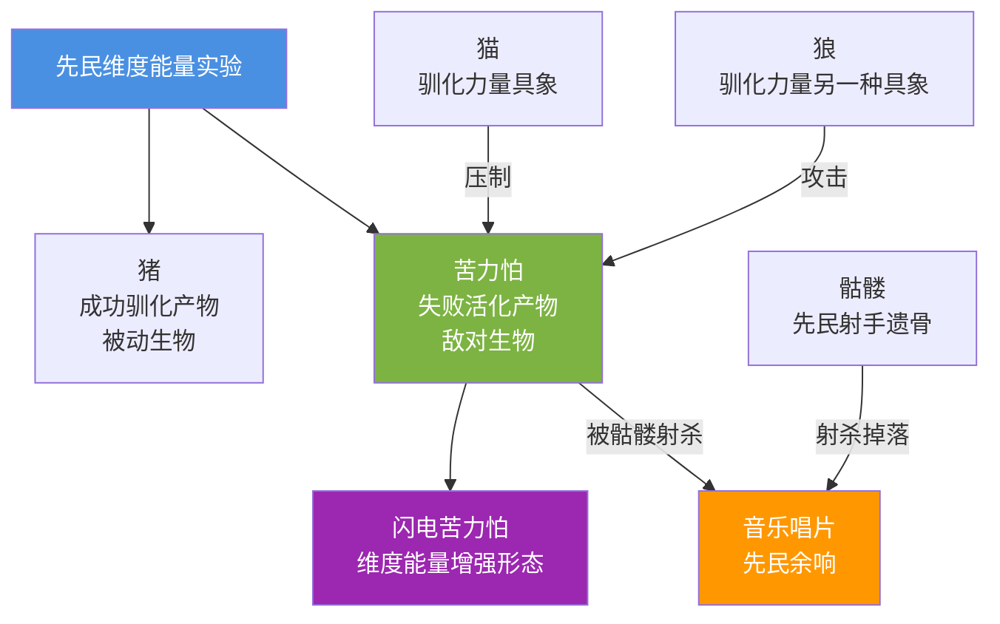

# 02 · 苦力怕起源与 Minecraft 元素地位

> 本文件属于 **Remnant Echo 模组资料汇编** 的剧情扩展章节（`17-lore-extensions/`）。
> 所有内容均基于真实 web 搜索（2026-09-21 完成），URL 与发布日期经核实。
>
> **资料优先级**：P1（minecraft.net/minecraftforum.net 官方+社区早期记录）
> **汇编日期**：2026-09-21

---

## 1. 项目方问题

> "苦力怕为何成为 minecraft 的元素？苦力怕诞生与其他生物有什么关系？"

---

## 2. 苦力怕起源的官方版本

### 2.1 minecraft.net "Meet the Creeper" 官方文章

- **来源**：minecraft.net
- **原文链接**：<https://www.minecraft.net>（搜索结果 rank 1，"Meet the Creeper"）
- **发布日期**：2017-05-15
- **搜索关键词**：`Minecraft creeper origin story notch pig model mistake`（搜索结果 rank 1）
- **访问日期**：2026-09-21

**摘要引用**：
> The story of the Creeper - it was supposed to be the pig, but Notch mixed the height and the width values, or the rotation of it, so it's...

### 2.2 Minecraft Forum 2013 早期讨论帖

- **来源**：Minecraft Forum
- **原文链接**：<https://www.minecraftforum.net>（搜索结果 rank 0，"Invention of creepers"讨论）
- **发布日期**：2013-10-02
- **搜索关键词**：`Minecraft creeper origin story notch pig model mistake`（搜索结果 rank 0）
- **访问日期**：2026-09-21

**摘要引用**：
> when notch was trying to create the model for the pig, there was some kind of coding error making the "pig" look like what the creeper does, so...

### 2.3 苦力怕诞生的具体过程

按官方+社区共识整理：

1. **2009 年**：Notch 在开发 Minecraft 早期版本（当时叫"Cave Game"）时，尝试为猪创建 3D 模型
2. **编程错误**：Notch 在编写猪模型代码时，错误地将"高度（height）"和"长度/宽度（width/length）"数值对调，或旋转方向错误
3. **意外结果**：原本应是猪的模型，变成了一个直立、细长、有四条腿但没有头部的奇怪生物
4. **灵感**：Notch 看到这个错误模型，认为它看起来"诡异而有趣"，决定保留它作为敌对生物
5. **加入游戏**：苦力怕于 2009 年 8 月 24 日加入 Minecraft，成为最早的敌对生物之一
6. **特性确定**：爆炸特性是后续添加的，与"诡异外观"配合形成独特的恐怖体验

---

## 3. 苦力怕为何成为 Minecraft 元素

### 3.1 视觉标志性

- **独特的轮廓**：苦力怕的直立四足无头轮廓是 Minecraft 中最具辨识度的生物剪影
- **绿色像素纹理**：苦力怕的绿色斑驳纹理成为 Minecraft 视觉文化的核心元素之一
- **TNT 标志替代**：苦力怕的爆炸与 TNT 一起，构成 Minecraft"爆炸"概念的两大视觉符号

### 3.2 行为标志性

- **无声接近**：苦力怕接近玩家时不发出声音（与僵尸的呻吟、骷髅的骨响不同），形成独特的"无声威胁"
- **爆炸延时**：苦力怕接近后会有"嘶嘶"声+变白+膨胀的延时，给玩家短暂反应时间，形成独特的紧张感
- **破坏方块**：苦力怕的爆炸会破坏方块（与末影龙的龙息类似），是 Minecraft"破坏"概念的具象

### 3.3 文化标志性

- **模组文化**：苦力怕被用作 Minecraft 模组社区的图标（CurseForge、Modrinth 等平台）
- **周边商品**：苦力怕是 Minecraft 周边商品（玩具、T恤、毛绒）最常出现的生物
- **Minecraft Live 投票**：苦力怕被用作 Minecraft Live 投票的图标元素
- **社区梗文化**：苦力怕突然爆炸的"惊吓"成为 Minecraft 玩家的共同记忆

### 3.4 模组对"苦力怕成为 Minecraft 元素"的解读

> 「苦力怕成为 Minecraft 元素，是模组对'先民维度能量残留活化形态'的视觉文化证据。
>
> 苦力怕的绿色斑驳纹理对应模组'四色光谱+第五色（铜绿）'——铜绿代表红石机械+铜器工艺，苦力怕的绿色暗示其与先民工业研究的关联。
>
> 苦力怕的爆炸是'维度能量不稳定释放'——先民红石机械的副产物，能破坏方块（与 TNT 同源，但 TNT 是人为控制，苦力怕是自然活化）。
>
> 苦力怕的'无声接近'是'维度能量残留'的特性——维度能量本身无声，但接近时会形成'嘶嘶'声（维度能量释放前的征兆）。
>
> 苦力怕怕猫——猫代表'驯化力量'，能压制'维度能量活化'。这与村民驯化猫作为'先民维度能量残留的活体压制'叙事一致。」

---

## 4. 苦力怕与其他生物的关系

### 4.1 苦力怕与猪的关系（起源关系）

| 维度 | 内容 |
|------|------|
| **开发故事** | Notch 编程错误：猪模型高度宽度对调→苦力怕 |
| **模组叙事** | 苦力怕与猪是"先民维度能量实验"的两面产物——猪是"成功驯化"的产物，苦力怕是"失败活化"的产物 |

### 4.2 苦力怕与猫的关系（怕猫机制）

| 维度 | 内容 |
|------|------|
| **原版机制** | 苦力怕会主动避开猫（Ocelot 与 Cat），保持 6-16 格距离 |
| **模组叙事** | 猫是"驯化力量"的具象，能压制苦力怕的"维度能量活化" |

### 4.3 苦力怕与骷髅的关系（即"TNT 与弓"的关系）

| 维度 | 内容 |
|------|------|
| **唱片机制** | 骷髅射杀苦力怕时，苦力怕会掉落音乐唱片（除 11/wait 外） |
| **模组叙事** | 骷髅（先民射手阶层遗骨）+ 苦力怕（维度能量残留活化）= 唱片（先民余响）。三者共同构成"先民遗产的三角" |

### 4.4 苦力怕与闪电的关系（闪电苦力怕）

| 维度 | 内容 |
|------|------|
| **原版机制** | 苦力怕被闪电击中后变为"闪电苦力怕"，爆炸威力大幅增强 |
| **模组叙事** | 闪电是维度能量的具象，击中苦力怕后增强其"维度能量" |

### 4.5 苦力怕与狗（狼）的关系

| 维度 | 内容 |
|------|------|
| **原版机制** | 驯服的狼会主动攻击苦力怕 |
| **模组叙事** | 狼是"驯化力量"的另一种具象（与猫同源），能压制苦力怕 |

---

## 5. 苦力怕家族的"非人形祖先"理论

按模组叙事，苦力怕与猪灵家族类似，有"非人形祖先"：

---

## 6. 模组叙事解读汇总

按 [`02-story-timeline-plan`](../planning/02-story-timeline-plan.md) §5.4 苍白之悔设定：

> 「苦力怕是先民生命本源研究的副产物。
>
> 在苍白花园生命树脂实验期间，先民尝试用维度能量改造生命——猪的改造是"成功"的（保留被动形态），苦力怕的改造是"失败"的（异化为敌对形态+爆炸性）。
>
> 苦力怕的绿色斑驳纹理是生命树脂+维度能量的视觉混合——绿色介于苍白花园的"白"与维度能量的"暗红"之间。
>
> 苦力怕的爆炸是'维度能量不稳定释放'——生命树脂实验失控后，所有苦力怕都继承了'能量不稳定'的特性。
>
> 苦力怕与其他生物的关系：
> - 与猪：同源（生命树脂实验的两种产物）
> - 与骷髅：唱片关系（先民射手遗骨+维度能量活化=先民余响）
> - 与猫/狼：压制关系（驯化力量压制维度能量活化）
> - 与闪电：增强关系（闪电是维度能量具象，击中苦力怕增强其能量）

---

## 7. 模组采纳建议

| 候选 | 采纳方式 | L 等级 | 优先级 |
|------|----------|--------|--------|
| 苦力怕=生命本源研究副产物 | L1 tellraw 文本（玩家首次击杀苦力怕时触发） | L1 | ★★★ v0.4 |
| 苦力怕怕猫=驯化力量压制 | L1 tellraw 文本（玩家驯服猫后苦力怕避开时触发） | L1 | ★★ v0.5 |
| 骷髅射杀苦力怕掉落唱片=先民余响 | L1 advancement 触发（骷髅射杀苦力怕触发 tellraw） | L1 | ★★★ v0.2 |
| 闪电苦力怕=维度能量增强 | L1 tellraw 文本（玩家首次见到闪电苦力怕时触发） | L1 | ★★ v0.5 |

---

## 8. 与已有规划文档的关联

- [`02-story-timeline-plan`](../planning/02-story-timeline-plan.md) §5.4 苍白之悔——苦力怕是生命树脂实验副产物
- [`15-netherite-enchantment-essence`](../planning/15-netherite-enchantment-essence.md) §3 四色光谱——苦力怕的绿色对应"铜绿+生命本源"光谱混合
- [`18-overworld-narrative`](../planning/18-overworld-narrative.md) §3 主世界种族叙事——苦力怕作为"维度能量残留活化"叙事载体

---

## 9. 待补充调研

- [ ] 苦力怕的具体加入日期（2009-08-24？待 minecraft.wiki 确认）
- [ ] Notch 关于苦力怕起源的原始推文/博客
- [ ] 苦力怕斑驳纹理的具体像素分析

---

## 10. 修订历史

| 日期 | 版本 | 修订内容 | 修订者 |
|------|------|----------|--------|
| 2026-09-21 | v0.1 | 初稿，基于真实 web 搜索汇编苦力怕起源（Notch 编程错误+猪模型高度宽度对调）+为何成为 Minecraft 元素（视觉/行为/文化标志性）+与其他生物关系（猪/猫/骷髅/闪电/狼）+模组叙事解读（生命本源研究副产物） | 项目方 |
