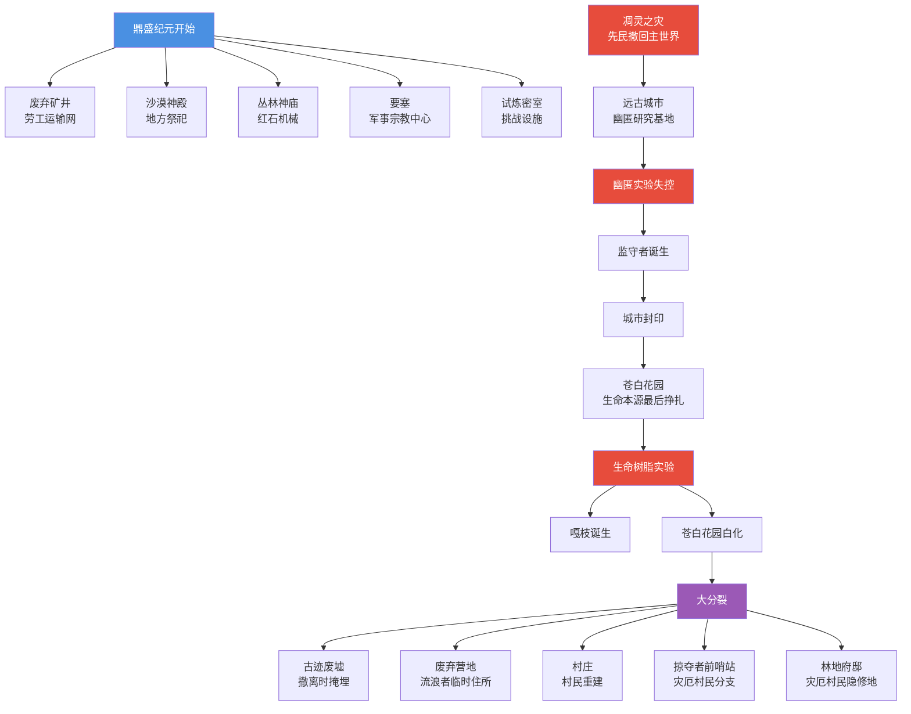

# 04 · 主世界结构起源

> 本文件属于 **Remnant Echo 模组资料汇编** 的剧情扩展章节（`17-lore-extensions/`）。
> 所有内容均基于真实 web 搜索（2026-09-21 完成），URL 与发布日期经核实。
>
> **资料优先级**：P1（minecraft.net 官方）+ P2（社区理论）
> **汇编日期**：2026-09-21

---

## 1. 项目方问题

> "试炼室、古城等主世界结构是怎么出现的为什么出现与世界观有什么关系"

---

## 2. 远古城市（Ancient City）起源

### 2.1 minecraft.net 官方文章

- **来源**：minecraft.net
- **原文链接**：<https://www.minecraft.net>（搜索结果 rank 2，"Building Blocks: Ancient City"）
- **发布日期**：2025-04-25
- **搜索关键词**：`Minecraft trial chambers ancient city why built lore ancient builders`（搜索结果 rank 2）
- **访问日期**：2026-09-21

**摘要引用**：
> Building Blocks: Ancient City: Ancient cities are built within large caverns - so heed the golden rule of Minecraft and never dig straight downward.

### 2.2 SyntaxMine 古代建造者理论

- **来源**：syntaxmine.com
- **原文链接**：<https://syntaxmine.com>（搜索结果 rank 1，"The Ancient Builders Theory"）
- **发布日期**：2026-06-02
- **访问日期**：2026-09-21

**摘要引用**：
> Ancient Cities beneath the deepest caves show a Builder culture that specifically feared the Warden, building around and away from it.

**关键观点**：远古城市的建造者文化"特意恐惧并避开监守者"建造——这暗示监守者比城市更早存在，或城市建造时已知道监守者的危险。

### 2.3 Minecraft Forum 远古城市悲剧理论

- **来源**：Minecraft Forum
- **原文链接**：<https://www.minecraftforum.net>（搜索结果 rank 0，"Lore ~ The Tragedy of the Ancient Cities"）
- **发布日期**：2022-04-01
- **访问日期**：2026-09-21

**摘要引用**：
> It has long been theorized that the Overworld was at one time inhabited by an ancient race of builders - those responsible for the temples...

### 2.4 Minecraft Fanon Wiki 沙漠丛林神殿祭祀说

- **来源**：minecraftfanon.fandom.com
- **原文链接**：<https://minecraftfanon.fandom.com>（搜索结果 rank 3）
- **访问日期**：2026-09-21

**摘要引用**：
> Temples in desert and jungles were built to worship the gods, monuments and cities were built. The ancient builders have everything ahead. Nether Discovery. One...

### 2.5 模组对远古城市起源的解读

按 [`02-story-timeline-plan`](../planning/02-story-timeline-plan.md) §5.3 幽匿之厄：

> 「远古城市是先民在鼎盛纪元末期建造的"灵魂能量研究基地"。
>
> 按社区理论+模组叙事，远古城市的建造顺序：
> 1. 先民在下界要塞研究灵魂能量→凋灵之灾失控→撤回主世界
> 2. 撤回主世界后，先民在地下深处（Y=-52）建造远古城市，集中研究幽匿
> 3. 远古城市的建造者**特意避开监守者**（按 SyntaxMine 解读）——但模组修正：监守者尚未存在，建造者避开的是"幽匿感知区域"
> 4. 远古城市中心的门框是"封印幽匿的仪式门"——按模组叙事
> 5. 幽匿实验失控→监守者诞生（被吞噬的科研贵族灵魂聚合）→城市封印
>
> 远古城市的"被遗忘的远古文明"叙事与模组"幽匿之厄"纪元完全契合。」

---

## 3. 试炼密室（Trial Chambers）起源

### 3.1 1.21 Tricky Trials 更新

- **加入版本**：Minecraft 1.21（Tricky Trials 更新，2024 年）
- **官方定位**：地下挑战结构，使用凝灰岩+铜质构件

### 3.2 模组对试炼密室起源的解读

按 [`14-trial-chamber-narrative`](../planning/14-trial-chamber-narrative.md) §2：

> 「试炼密室是先民鼎盛纪元建造的"挑战与继承测试设施"。
>
> 按模组叙事，试炼密室的建造目的：
> 1. 先民意识到自己可能因灾变而崩解
> 2. 为后裔设计"挑战与继承测试"——通过测试的后裔可获得先民储物（Vault）
> 3. 试炼刷怪笼的"按玩家数量调整"是先民维度能量感知技术
> 4. Vault 的"每人仅一次开启"是防止滥用的设计
>
> 试炼密室与远古城市的对比：
> - 试炼密室=先民红石机械受控的活化石
> - 远古城市=先民幽匿实验失控的废墟
> - 两者共同呈现先民研究的"受控 vs 失控"两面」

### 3.3 模组对试炼密室与世界观关系的解读

按 [`14-trial-chamber-narrative`](../planning/14-trial-chamber-narrative.md) §2.3：

| 维度 | 关系 |
|------|------|
| 试炼密室 vs 远古城市 | 受控 vs 失控的对照（同为红石机械+灵魂能量研究） |
| 试炼密室 vs 苍白花园 | 鼎盛 vs 末期的对照（同为生命本源研究的不同阶段） |
| 试炼密室 vs 下界要塞 | 主世界 vs 下界的对照（同为挑战设施） |

---

## 4. 沙漠神殿/丛林神庙起源

### 4.1 Minecraft Fanon Wiki 祭祀说

按 §2.4 引用："Temples in desert and jungles were built to worship the gods"——沙漠神殿/丛林神庙是先民为"崇拜神"而建造的祭祀场所。

### 4.2 模组对沙漠神殿/丛林神庙起源的解读

按 [`18-overworld-narrative`](../planning/18-overworld-narrative.md) §2.1：

> 「沙漠神殿+丛林神庙是先民鼎盛纪元在主世界地方群系建造的"祭祀与仓储设施"。
>
> 沙漠神殿的 4 个箱子+TNT 陷阱——是先民"防止外人盗掘祭祀品"的简易红石机械
> 丛林神庙的绊线陷阱+拉杆密室——是先民"对声音感知"的早期研究（与幽匿感知声音形成对照）
>
> 两者都是先民在主世界地方群系的"祭祀分支"，与下界要塞的"军事分支"形成对照。」

---

## 5. 废弃矿井起源

### 5.1 模组对废弃矿井起源的解读

按 [`18-overworld-narrative`](../planning/18-overworld-narrative.md) §2.1：

> 「废弃矿井是先民鼎盛纪元在主世界地下建造的"劳工阶层运输网"。
>
> 矿车轨道系统是先民大规模开采的运输基础
> 桥梁+支柱是先民地下工程的结构支撑
> 洞穴蜘蛛刷怪笼被社区解读为"先民实验室的产物"——模组采纳此解读
>
> 废弃矿井与试炼密室的对比：
> - 废弃矿井=劳工阶层的简易运输网
> - 试炼密室=贵族阶层的挑战设施
> - 两者共同呈现先民社会的"劳工 vs 贵族"分层」

---

## 6. 要塞起源

### 6.1 模组对要塞起源的解读

按 [`18-overworld-narrative`](../planning/18-overworld-narrative.md) §2.1：

> 「要塞是先民鼎盛纪元在主世界地下深处建造的"军事/宗教中心"。
>
> 要塞是先民维度穿行技术的核心枢纽——末地传送门是"通往末地殖民军的回程通道"
> 要塞图书馆是先民贵族/学者研究附魔的场所
> 要塞的监牢是先民"关押敌对生物"的设施
>
> 要塞与下界要塞的对比：
> - 主世界要塞=军事/宗教中心（维度穿行核心）
> - 下界要塞=前哨站+凋灵实验基地
> - 两者都是先民鼎盛纪元的"军事设施"，但维度不同」

---

## 7. 古迹废墟起源

### 7.1 1.20 考古更新引入

- **加入版本**：Minecraft 1.20（Trails & Tales 更新，2023 年）

### 7.2 模组对古迹废墟起源的解读

按 [`18-overworld-narrative`](../planning/18-overworld-narrative.md) §2.1：

> 「古迹废墟是先民大分裂期"撤离主世界据点时掩埋的早期居所"。
>
> 大分裂后，先民从主世界撤回（部分去下界，部分去末地），将早期居所掩埋
> 掩埋的物资中残留着撤离记录（笔记 #15 撤退者记录）
> 玩家用刷子考古可发掘这些掩埋物资
>
> 古迹废墟与其他主世界遗迹的对比：
> - 古迹废墟=大分裂期掩埋（鼎盛纪元末）
> - 沙漠神殿/丛林神庙=鼎盛期祭祀
> - 试炼密室=鼎盛期挑战
> - 远古城市=幽厄之灾（大分裂前夕）
> - 苍白花园=苍白之悔（大分裂前夕最后挣扎）」

---

## 8. 主世界结构起源时间线

按模组六大纪元整理：

| 纪元 | 结构 | 起源原因 |
|------|------|----------|
| **鼎盛纪元** | 废弃矿井、沙漠神殿、丛林神庙、要塞、试炼密室 | 先民鼎盛期建设：劳工运输+地方祭祀+军事宗教+挑战设施 |
| **凋灵之灾** | （无主世界新结构） | 凋灵之灾主要影响下界 |
| **幽匿之厄** | 远古城市 | 先民集中研究幽匿的基地，最终失控 |
| **苍白之悔** | 苍白花园 | 先民退守研究生命本源的最后挣扎 |
| **大分裂** | 古迹废墟、废弃营地（1.21.5+ 新增） | 先民撤离时掩埋的居所+流浪者临时营地 |
| **现代纪元** | 村庄、掠夺者前哨站、林地府邸 | 后裔（村民+灾厄村民）的现代文明 |

---

## 9. 主世界结构起源 Mermaid 图

---

## 10. 模组采纳建议

| 候选 | 采纳方式 | L 等级 | 优先级 |
|------|----------|--------|--------|
| 远古城市=幽匿研究基地（避开监守者建造） | L1 tellraw 文本（玩家进入远古城市时触发） | L1 | ★★★★★ v0.4 |
| 试炼密室=先民挑战设施 | L1 tellraw 文本（玩家进入试炼密室时触发） | L1 | ★★★ v0.4 |
| 沙漠神殿/丛林神庙=祭祀设施 | L1 tellraw 文本（玩家进入时触发） | L1 | ★★★ v0.2 |
| 废弃矿井=劳工运输网 | L1 tellraw 文本（玩家进入时触发） | L1 | ★★★ v0.2 |
| 要塞=军事宗教中心 | L1 tellraw 文本（玩家进入时触发） | L1 | ★★★★ v0.5 |
| 古迹废墟=大分裂期掩埋居所 | L1 tellraw 文本（玩家考古时触发） | L1 | ★★★ v0.2 |
| 废弃营地=大分裂后流浪者遗迹 | L1 tellraw 文本（玩家进入时触发） | L1 | ★★★ v0.2 |

---

## 11. 与已有规划文档的关联

- [`02-story-timeline-plan`](../planning/02-story-timeline-plan.md) 六大纪元——结构起源时间线
- [`14-trial-chamber-narrative`](../planning/14-trial-chamber-narrative.md) 试炼密室叙事
- [`15-netherite-enchantment-essence`](../planning/15-netherite-enchantment-essence.md) §3 远古城市+幽匿
- [`18-overworld-narrative`](../planning/18-overworld-narrative.md) 主世界遗迹叙事矩阵
- [`16-version-updates/01`](../16-version-updates/01-minecraft-26.3-wilderness-bound.md) 26.3 废弃营地=大分裂后流浪者遗迹

---

## 12. 待补充调研

- [ ] minecraft.net "Building Blocks: Ancient City" 完整文章
- [ ] minecraft.net 关于试炼密室的官方文章（已在 [`04-trial-chambers/`](../04-trial-chambers/) 收录）
- [ ] Minecraft Forum 远古城市悲剧长帖的完整内容
- [ ] 古迹废墟的官方"考古"叙事

---

## 13. 修订历史

| 日期 | 版本 | 修订内容 | 修订者 |
|------|------|----------|--------|
| 2026-09-21 | v0.1 | 初稿，基于真实 web 搜索汇编主世界结构起源（远古城市/试炼密室/沙漠神殿/丛林神庙/废弃矿井/要塞/古迹废墟/废弃营地），含 SyntaxMine"避开监守者建造"理论+Minecraft Forum 远古城市悲剧理论+Minecraft Fanon Wiki 祭祀说+模组叙事解读+主世界结构起源时间线 Mermaid 图 | 项目方 |
