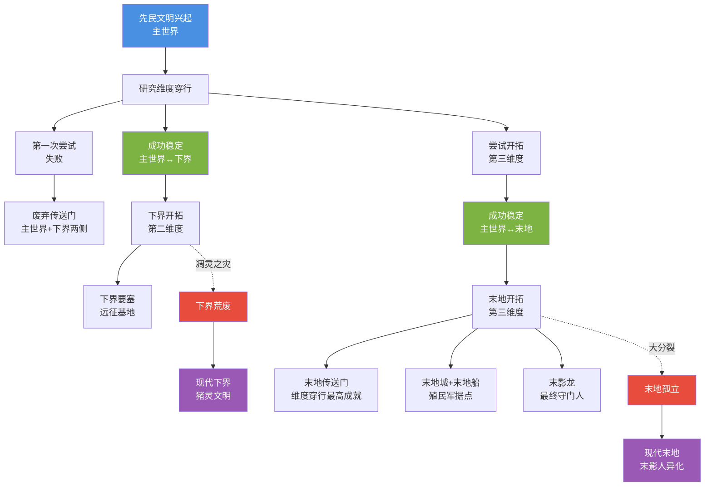

# 05 · 末地/下界起源

> 本文件属于 **Remnant Echo 模组资料汇编** 的剧情扩展章节（`17-lore-extensions/`）。
> 所有内容均基于真实 web 搜索（2026-09-21 完成），URL 与发布日期经核实。
>
> **资料优先级**：P1（minecraft.net 官方）+ P2（社区理论）
> **汇编日期**：2026-09-21

---

## 1. 项目方问题

> "末地、地狱是怎么出现的为何出现及后续的生物与该维度与其他生物有什么关系"

---

## 2. 下界（Nether）起源

### 2.1 minecraft.net "A briefish history of the Nether"

- **来源**：minecraft.net
- **原文链接**：<https://www.minecraft.net>（搜索结果 rank 0，"A briefish history of the Nether"）
- **发布日期**：2021-03-08
- **搜索关键词**：`Minecraft nether end dimension origin story how created lore`（搜索结果 rank 0）
- **访问日期**：2026-09-21

**摘要引用**：
> The first shock came when I discovered that the Nether didn't exist in the very first version of the game, it was voluntarily added as a map in...

### 2.2 下界起源的关键事实

按 minecraft.net 官方文章+社区共识：

| 维度 | 内容 |
|------|------|
| **不存在于最初版本** | Minecraft 最初版本（2009 年 Cave Game）没有下界 |
| **自愿添加** | 下界是 Notch 主动决定添加的"地图"（dimension） |
| **加入版本** | 2010 年 10 月（Alpha 1.2.0 Halloween Update） |
| **灵感来源** | Notch 受"地狱"概念启发，但避免宗教敏感性，命名为"Nether"（暗指"低于"） |
| **初始内容** | 早期下界仅有下界岩+岩浆+恶魂+僵尸猪人（当时叫 Zombie Pigman） |

### 2.3 模组对下界起源的解读

按 [`02-story-timeline-plan`](../planning/02-story-timeline-plan.md) §5.1 鼎盛纪元：

> 「下界是先民鼎盛纪元开拓的"第二维度"。
>
> 按模组叙事，下界的起源：
> 1. 先民在主世界研究维度穿行技术
> 2. 第一次维度穿行尝试失败，留下了"废弃传送门"（主世界+下界两侧都有）
> 3. 经过多次实验，先民成功稳定了主世界↔下界的维度穿行
> 4. 下界被先民开拓为"远征基地"——下界要塞是前哨站
>
> 下界的环境（高温+岩浆+硫磺）对先民是严酷的，但先民通过维度能量研究适应了下界——这就是为什么下界要塞使用黑砖+黑曜石（与主世界石砖同源但材质不同）。
>
> 下界的"暗红"色调对应模组四色光谱的"维度穿行"研究领域。」

### 2.4 下界后续生物与维度的关系

按模组对下界生物的整理：

| 生物 | 与下界的关系 | 与其他生物的关系 |
|------|--------------|------------------|
| **猪灵** | 下界原生生物（先民远征队后裔） | 与猪同源（非人形祖先） |
| **僵尸猪灵** | 猪灵进入主世界后的不死形态（维度诅咒） | 与僵尸同源（不死变体） |
| **恶魂** | 下界原生灵魂生物（善魂被污染后形态） | 与善魂同源（灾变前温和形态） |
| **凋灵骷髅** | 下界要塞生成（先民射手被凋灵能量波转化） | 与骷髅同源（变种） |
| **烈焰人** | 下界要塞刷怪笼生成（先民制造的生物兵器） | 与苦力怕同源（维度能量实验产物） |
| **岩浆怪** | 下界原生（液态下界合金生命） | 与史莱姆同源（变种） |
| **炽足兽** | 下界原生（猪灵驯化的坐骑） | 与疣猪兽同源（驯化产物） |
| **疣猪兽** | 下界原生（猪灵驯化的食物来源） | 与猪同源（非人形祖先） |
| **苦力怕**（罕见下界） | 主世界原生，下界罕见 | 详见 [`02-creeper-origin-and-elements`](./02-creeper-origin-and-elements.md) |
| **末影人**（罕见下界） | 主世界原生，下界罕见 | 详见 [`06-mob-behaviors-explained`](./06-mob-behaviors-explained.md) |

---

## 3. 末地（The End）起源

### 3.1 minecraft.wiki "The End" 条目

- **来源**：minecraft.wiki
- **原文链接**：<https://minecraft.wiki>（搜索结果 rank 2，"The End"条目）
- **访问日期**：2026-09-21

**摘要引用**：
> It is inhabited by endermen and shulkers. The original concept of the Sky Dimension was officially rebranded as "The End." Jeb explained the reason behind the...

### 3.2 minecraft.fandom.com "The End" 条目

- **来源**：minecraft.fandom.com
- **原文链接**：<https://minecraft.fandom.com>（搜索结果 rank 1）
- **访问日期**：2026-09-21

**摘要引用**：
> The End is a dark, space-like dimension consisting of separate islands in the void, made out of end stone. It is inhabited by endermen and shulkers.

### 3.3 末地起源的关键事实

按 minecraft.wiki + minecraft.fandom.com：

| 维度 | 内容 |
|------|------|
| **原概念** | 末地原概念是"Sky Dimension"（空岛维度），Notch 早期设想 |
| **重命名** | Jeb 解释了将 Sky Dimension 重命名为"The End"的原因（具体内容待补充） |
| **加入版本** | 2011 年 11 月（Minecraft 1.0 正式版） |
| **进入方式** | 通过要塞的末地传送门（用末影之眼激活） |
| **初始内容** | 末影人+末影龙+末地石+黑曜石柱+回归传送门 |
| **后续扩展** | 1.9（2015 年）加入末地城+末地船+潜影贝+鞘翅+折跃门 |

### 3.4 SyntaxMine 末影龙与末地传说

- **来源**：syntaxmine.com
- **原文链接**：<https://syntaxmine.com>（搜索结果 rank 3，"The Ender Dragon and the End"）
- **发布日期**：2026-06-16
- **访问日期**：2026-09-21

**摘要引用**：
> The End is the third dimension, reached by activating an End Portal found inside a stronghold. Strongholds generate deep underground, and the...

### 3.5 模组对末地起源的解读

按 [`02-story-timeline-plan`](../planning/02-story-timeline-plan.md) §5.1 鼎盛纪元 + [`20-end-narrative`](../planning/20-end-narrative.md) §3：

> 「末地是先民鼎盛纪元开拓的"第三维度"，也是维度穿行技术的"最高成就"。
>
> 按模组叙事，末地的起源：
> 1. 先民在主世界+下界研究维度穿行
> 2. 经过下界经验，先民尝试开拓"第三维度"——末地
> 3. 末地的"虚空+岛屿"环境对先民是最大的挑战——虚空能量是维度穿行技术的最高难度
> 4. 末地传送门是先民维度穿行技术的"最高成就"——需要 12 个末影之眼激活
> 5. 末影龙是先民制造的"最终守门人"——防止外人进入末地
> 6. 末地城+末地船是先民末地殖民军的"据点+等待接应的飞船"
>
> 末地的"紫"色调对应模组四色光谱的"维度异化"研究领域——末地是维度穿行技术最复杂、副作用最大的维度。」

### 3.6 末地后续生物与维度的关系

按模组对末地生物的整理：

| 生物 | 与末地的关系 | 与其他生物的关系 |
|------|--------------|------------------|
| **末影人** | 末地原生（先民末地殖民军异化后裔） | 与村民/猪灵同源（先民后裔三界分支之一） |
| **末影龙** | 末地原生（先民制造的最终守门人） | 与凋灵同源（皆为先民制造的"守门人"型 Boss） |
| **潜影贝** | 末地城原生（先民遗留的防御机械） | 与铁傀儡同源（皆为先民守卫的退化/变体） |
| **终界螨** | 末影人传送副产物（维度能量具象） | 与末影人同源（维度能量残留） |
| **苦力怕**（罕见末地） | 主世界原生，末地罕见 | 详见 [`02-creeper-origin-and-elements`](./02-creeper-origin-and-elements.md) |

---

## 4. 三个维度起源对比

| 维度 | 加入版本 | 原版起源 | 模组叙事起源 | 四色光谱 |
|------|----------|----------|--------------|----------|
| **主世界** | 2009（最初版本） | 游戏开始就有 | 先民文明的"母维度" | 全光谱 |
| **下界** | 2010-10（Alpha 1.2.0） | Notch 自愿添加的"地图" | 先民开拓的"第二维度"（远征基地） | 暗红（维度穿行） |
| **末地** | 2011-11（1.0 正式版） | Sky Dimension 重命名 | 先民开拓的"第三维度"（殖民军据点） | 紫（维度异化） |

---

## 5. 维度起源 Mermaid 图

---

## 6. 模组采纳建议

| 候选 | 采纳方式 | L 等级 | 优先级 |
|------|----------|--------|--------|
| 下界=先民开拓的第二维度 | L1 tellraw 文本（玩家首次进入下界时触发） | L1 | ★★★★★ v0.3 |
| 末地=先民开拓的第三维度 | L1 tellraw 文本（玩家首次进入末地时触发） | L1 | ★★★★★ v0.5 |
| 末地传送门=维度穿行最高成就 | L1 tellraw 文本（玩家激活末地传送门时触发） | L1 | ★★★★ v0.5 |
| 末影龙=先民制造的最终守门人 | L1 tellraw 文本（玩家击败末影龙时触发） | L1 | ★★★★★ v0.5 |
| 下界生物与维度关系 | L1 tellraw 文本（玩家首次遭遇各下界生物时触发） | L1 | ★★★ v0.3 |
| 末地生物与维度关系 | L1 tellraw 文本（玩家首次遭遇各末地生物时触发） | L1 | ★★★ v0.5 |

---

## 7. 与已有规划文档的关联

- [`02-story-timeline-plan`](../planning/02-story-timeline-plan.md) §5.1 鼎盛纪元——三界开拓
- [`16-worldview-overview`](../planning/16-worldview-overview.md) §3 三界同源视觉证据
- [`19-nether-narrative`](../planning/19-nether-narrative.md) 下界叙事细化
- [`20-end-narrative`](../planning/20-end-narrative.md) 末地叙事+真结局
- [`15-netherite-enchantment-essence`](../planning/15-netherite-enchantment-essence.md) §3 四色光谱

---

## 8. 待补充调研

- [ ] minecraft.net "A briefish history of the Nether" 完整文章
- [ ] Jeb 关于 Sky Dimension 重命名为 The End 的具体解释
- [ ] 末地传送门的官方"维度穿行最高成就"叙事
- [ ] 1.9 末地城+末地船的官方更新公告

---

## 9. 修订历史

| 日期 | 版本 | 修订内容 | 修订者 |
|------|------|----------|--------|
| 2026-09-21 | v0.1 | 初稿，基于真实 web 搜索汇编下界+末地起源（minecraft.net 下界简史+minecraft.wiki The End 条目+Sky Dimension 重命名+SyntaxMine 末影龙传说），含三维度起源对比+下界/末地后续生物与维度关系+维度起源 Mermaid 图+模组叙事解读 | 项目方 |
