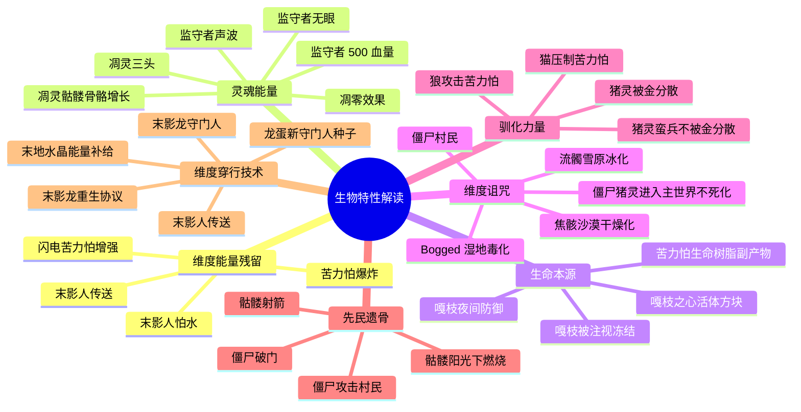

# 06 · 生物特性解读（基于最新版本）

> 本文件属于 **Remnant Echo 模组资料汇编** 的剧情扩展章节（`17-lore-extensions/`）。
> 所有内容均基于真实 web 搜索（2026-09-21 完成），URL 与发布日期经核实。
>
> **资料优先级**：P1（minecraft.wiki 官方）+ P2（SyntaxMine 社区理论）
> **汇编日期**：2026-09-21

---

## 1. 项目方问题

> "根据最新版本所有生物的特性能够解读为什么会有这些特性"

---

## 2. SyntaxMine 完整生物特性解读

### 2.1 SyntaxMine "Minecraft Lore, Explained: The Full Story Timeline"

- **来源**：syntaxmine.com
- **原文链接**：<https://syntaxmine.com>（搜索结果 rank 0）
- **发布日期**：2026-06-17
- **搜索关键词**：`Minecraft mob behaviors explained 2026 lore warden ancient builders enderman`（搜索结果 rank 0）
- **访问日期**：2026-09-21

**摘要引用**：
> The Warden is the strongest naturally spawning mob in the game, with 500 health, an armor-ignoring sonic boom, and no eyes. It hunts by...

### 2.2 minecraft-archive.fandom Enderman 条目

- **来源**：minecraft-archive.fandom.com
- **原文链接**：<https://minecraft-archive.fandom.com>（搜索结果 rank 1）
- **访问日期**：2026-09-21

**摘要引用**：
> An Enderman is a neutral mob with unique teleportation abilities, who will only attack players who look at its eyes or attacked them first.

---

## 3. 关键生物特性解读

### 3.1 监守者（Warden）

| 原版特性 | 模组叙事解读 |
|----------|--------------|
| 500 血量（最强原版生物） | 监守者是"科研贵族灵魂聚合体"——多个灵魂的能量使其异常强大 |
| 无眼（blind） | 灵魂聚合体无视觉——监守者是被吞噬的科研贵族失去视觉，仅保留听觉 |
| 靠声音狩猎（sonic boom） | 幽匿感知声音的核心机制——监守者是幽匿能量具象，能感知所有声音 |
| 无视护甲的声波攻击 | 声波是维度能量层级——护甲无法防御维度能量 |
| 不可被玩家永久击杀（重生） | 监守者是幽匿能量的聚合，只要幽匿存在，监守者就能重生 |
| 在深暗之域生成 | 深暗之域是幽匿能量最浓集的区域——监守者是幽匿的"守护者" |

### 3.2 末影人（Enderman）

| 原版特性 | 模组叙事解读 |
|----------|--------------|
| 跨维度传送 | 先民维度穿行技术的残留——末影人保留了部分维度穿行能力 |
| 怕水/怕雨 | 维度异化的副作用——末影人的细胞结构在主世界环境中不稳定，水会使其崩解 |
| 怕光（在阳光下燃烧？实际不会） | 实际原版末影人不怕光，但会在阳光下随机传送——模组解读为"主世界强光对末影人维度能量的干扰" |
| 拾取方块 | 殖民军"执行最后命令"的残留行为——曾奉命收集末地资源 |
| 被攻击时集体追击 | 军事防御协议的残留——殖民军曾是集体行动的军队 |
| 掉落末影珍珠 | 末影珍珠是先民维度穿行技术的"残留载体" |
| 被注视时攻击 | 末影人对"被注视"敏感——模组解读为殖民军对"监视"的警惕反应 |

### 3.3 末影龙（Ender Dragon）

| 原版特性 | 模组叙事解读 |
|----------|--------------|
| 末地岛中心盘旋 | 末影龙是"守门人"，守护末地入口 |
| 末地水晶回血 | 末地水晶是先民为守门人设计的"能量补给站" |
| 龙息攻击 | 龙息是维度能量层级攻击——与监守者声波同源 |
| 可重生（4 个末地水晶） | 先民设计的守门人重启协议——防止守门人被永久击败 |
| 掉落龙蛋 | 龙蛋是"新守门人种子"——按模组解读 |
| 破坏方块（除 obsidian/铁栏杆/末地石等） | 末影龙是维度能量层级生物，能破坏维度稳定材料以下的方块 |

### 3.4 凋灵（Wither）

| 原版特性 | 模组叙事解读 |
|----------|--------------|
| 3 个头 | 先民召唤阵的"三重灵魂"产物——3 个头代表 3 种灵魂扭曲 |
| 凋零效果 | 凋灵之灾的"灵魂扭曲波"残留——被击中的生物会持续受到灵魂扭曲 |
| 飞行 | 凋灵的灵魂能量使其脱离物理束缚——飞行是灵魂自由的具象 |
| 破坏方块 | 凋灵能量能破坏维度稳定材料以下的方块 |
| 凋零玫瑰 | 凋灵能量残留生长的花——凋灵之灾后下界生长的"灾变植物" |
| 蓝色头颅（增强攻击） | 蓝色头颅是凋灵最强能量形态——与下界合金/青金石的蓝色对应 |

### 3.5 凋灵骷髅（Wither Skeleton）

| 原版特性 | 模组叙事解读 |
|----------|--------------|
| 在下界要塞生成 | 凋灵之灾时下界要塞的先民射手被灵魂扭曲波转化 |
| 4 格高（高于普通骷髅） | 凋灵能量使其骨骼异常增长 |
| 凋零效果攻击 | 凋灵之灾的灵魂扭曲波残留 |
| 掉落凋灵骷髅头颅 | 头颅是先民召唤凋灵的"钥匙"——3 个头颅+灵魂沙可重召凋灵 |
| 不在阳光下燃烧 | 下界无阳光——凋灵骷髅已适应下界环境 |

### 3.6 恶魂（Ghast）

| 原版特性 | 模组叙事解读 |
|----------|--------------|
| 哭泣声 | 善魂被污染为恶魂的痛苦回响——哭声是失去温和形态的悲哀 |
| 飞行 | 恶魂是灵魂生物，飞行是其自然状态 |
| 火球攻击 | 火球是恶魂的"愤怒能量"——善魂原本温和，被污染后形成攻击性 |
| 掉落恶魂之泪 | 恶魂之泪是善魂被污染时的"悲伤结晶"——仍有治愈效果（用于炼药） |
| 哭泣者（变体） | 1.21.11 哭泣者+快乐恶魂：1.21.11+ 的快乐恶魂是"灾变前善魂的残留温和变体" |

### 3.7 猪灵（Piglin）

| 原版特性 | 模组叙事解读 |
|----------|--------------|
| 以物易物（黄金交易） | 猪灵保留了先民的"以物易物"贸易传统——黄金崇拜是先民鼎盛期黄金货币的残留 |
| 被金装分散注意力 | 黄金对猪灵有"维度能量残留的吸引力"——金装让猪灵感到"先民能量" |
| 进入主世界后变为僵尸猪灵 | 维度诅咒——猪灵在下界环境适应，离开下界后被维度能量扭曲为不死形态 |
| 在堡垒遗迹生成 | 堡垒遗迹是猪灵现代文明的重启标志——大分裂后猪灵开智自建 |
| 攻击猪灵蛮兵守卫的箱子 | 猪灵蛮兵是堡垒守卫，玩家偷箱子会激怒 |

### 3.8 猪灵蛮兵（Piglin Brute）

| 原版特性 | 模组叙事解读 |
|----------|--------------|
| 用金斧 | 金斧是先民鼎盛期士兵装备的退化版（与铜盔甲同源） |
| 不交易 | 猪灵蛮兵是"守卫阶层"，不参与贸易 |
| 不被金分散注意力 | 守卫阶层对金的认知不同于普通猪灵——他们知道金是工具，不是崇拜对象 |
| 进入主世界后变为僵尸猪灵蛮兵 | 与普通猪灵同受维度诅咒 |
| 60 血量（高于普通猪灵的 30） | 守卫阶层保留了更多先民士兵的能量 |

### 3.9 嘎枝（Creaking）

| 原版特性 | 模组叙事解读 |
|----------|--------------|
| 不能直接伤害（只能破坏嘎枝之心） | 嘎枝是"防御程序回响"——程序本身不可被伤害，只能破坏其核心 |
| 仅在夜晚活动 | 嘎枝之心在夜晚激活——这是先民设计的"夜间防御"模式 |
| 不动时玩家看它会冻结 | 嘎枝的"感知"机制——被注视时无法移动 |
| 玩家移开视线时嘎枝移动 | 与"被注视冻结"对应——视觉是嘎枝的活动开关 |
| 在苍白花园生成 | 嘎枝是苍白之悔的产物——生命树脂实验的防御程序回响 |

### 3.10 苦力怕（Creeper）

| 原版特性 | 模组叙事解读 |
|----------|--------------|
| 接近玩家时爆炸 | 维度能量不稳定释放——苦力怕是先民生命树脂实验的失败产物 |
| 无声接近 | 维度能量本身无声——但接近时会形成"嘶嘶"声（能量释放前征兆） |
| 绿色斑驳纹理 | 绿色是"铜绿+生命本源"光谱混合——苦力怕与铜器工艺+生命树脂实验关联 |
| 怕猫 | 猫是"驯化力量"具象，能压制维度能量活化 |
| 闪电后增强 | 闪电是维度能量具象，击中苦力怕后增强其能量 |
| 被骷髅射杀掉落唱片 | 骷髅（先民射手遗骨）+苦力怕（维度能量活化）=唱片（先民余响） |

### 3.11 焦骸（Parched）

| 原版特性 | 模组叙事解读 |
|----------|--------------|
| 沙漠群系生成 | 焦骸是骷髅在沙漠群系的"干燥化"演化形态 |
| 免疫阳光 | 沙漠环境的特殊适应——普通骷髅在阳光下燃烧，焦骸因沙漠干燥而免疫 |
| 作为骆驼尸壳的乘客生成 | 先民射手阶层与坐骑（骆驼）的退化形态配对 |
| 发射虚弱箭 | 沙漠的"干燥感"对应"虚弱"元素（与流髑的冰/ Bogged 的毒对应） |

### 3.12 烈焰人（Blaze）

| 原版特性 | 模组叙事解读 |
|----------|--------------|
| 在下界要塞刷怪笼生成 | 烈焰人是先民为战争制造的"生物兵器"——刷怪笼是先民的批量生产设施 |
| 火球攻击 | 火元素是烈焰人的核心——与恶魂（被污染的火元素灵魂）同源 |
| 飞行 | 烈焰人是能量生物，飞行是其自然状态 |
| 掉落烈焰棒 | 烈焰棒是先民维度能量研究的"火元素结晶"——可用于合成末影之眼（维度穿行触媒） |

### 3.13 潜影贝（Shulker）

| 原版特性 | 模组叙事解读 |
|----------|--------------|
| 在末地城生成 | 潜影贝是先民遗留的"防御机械"——守护末地城 |
| 闭合时免疫伤害 | 闭合是潜影贝的"防御模式"——先民设计的防护机制 |
| 开口时攻击 | 开口是潜影贝的"攻击模式"——发射子弹 |
| 拾取方块（潜影贝伪装） | 潜影贝能模仿周围方块——这是先民"伪装防御"的设计 |
| 掉落潜影壳 | 潜影壳可用于制作潜影盒——先民储物技术的残留 |

### 3.14 骷髅（Skeleton）

| 原版特性 | 模组叙事解读 |
|----------|--------------|
| 用弓攻击 | 骷髅是先民射手阶层遗骨——保留射箭能力 |
| 在阳光下燃烧 | 骷髅的"维度能量残留"在阳光下不稳定——主世界阳光对其有伤害 |
| 在主世界地下生成 | 骷髅在地下避光环境生成——避开阳光 |
| 骑蜘蛛（蜘蛛骑手） | 蜘蛛骑手是先民射手+坐骑的退化配对（与焦骸骑骆驼尸壳同源） |

### 3.15 僵尸（Zombie）

| 原版特性 | 模组叙事解读 |
|----------|--------------|
| 攻击村民 | 僵尸是先民平民阶层遗骨的腐化形态——攻击村民是"后裔攻击后裔"的悲剧 |
| 在阳光下燃烧 | 与骷髅同源——维度能量残留在阳光下不稳定 |
| 僵尸村民 | 僵尸村民是村民被僵尸感染的不死形态——维度诅咒的另一种表现 |
| 破门 | 僵尸的"攻击性"是先民遗骨的"残存敌意" |

---

## 4. 生物特性解读 Mermaid 总图

---

## 5. 模组采纳建议

| 候选 | 采纳方式 | L 等级 | 优先级 |
|------|----------|--------|--------|
| 监守者特性解读 | L1 tellraw 文本（玩家首次遭遇监守者时触发） | L1 | ★★★★★ v0.4 |
| 末影人特性解读 | L1 tellraw 文本（玩家首次遭遇末影人时触发） | L1 | ★★★★★ v0.5 |
| 末影龙特性解读 | L1 tellraw 文本（玩家末影龙战时触发） | L1 | ★★★★★ v0.5 |
| 凋灵特性解读 | L1 tellraw 文本（玩家召唤凋灵时触发） | L1 | ★★★★ v0.3 |
| 猪灵/猪灵蛮兵特性解读 | L1 tellraw 文本（玩家首次与猪灵交易时触发） | L1 | ★★★ v0.3 |
| 嘎枝特性解读 | L1 tellraw 文本（玩家首次遭遇嘎枝时触发） | L1 | ★★★ v0.4 |
| 苦力怕特性解读 | L1 tellraw 文本（玩家首次击杀苦力怕时触发） | L1 | ★★★ v0.4 |
| 焦骸特性解读 | L1 tellraw 文本（玩家首次遭遇焦骸时触发） | L1 | ★★ v0.2 |
| 烈焰人特性解读 | L1 tellraw 文本（玩家首次遭遇烈焰人时触发） | L1 | ★★ v0.3 |
| 潜影贝特性解读 | L1 tellraw 文本（玩家首次遭遇潜影贝时触发） | L1 | ★★★ v0.5 |

---

## 6. 与已有规划文档的关联

- [`02-story-timeline-plan`](../planning/02-story-timeline-plan.md) 六大纪元——生物特性与纪元对应
- [`07-boss-narrative-binding`](../planning/07-boss-narrative-binding.md) Boss 叙事绑定
- [`18-overworld-narrative`](../planning/18-overworld-narrative.md) 主世界种族叙事矩阵
- [`19-nether-narrative`](../planning/19-nether-narrative.md) 下界种族演化矩阵
- [`20-end-narrative`](../planning/20-end-narrative.md) 末地种族叙事矩阵
- [`15-community-lore/01-syntaxmine-ancient-builders`](../15-community-lore/01-syntaxmine-ancient-builders.md) SyntaxMine 古代建造者理论

---

## 7. 待补充调研

- [ ] SyntaxMine "Minecraft Lore, Explained: The Full Story Timeline" 完整文章
- [ ] 其他生物（蜘蛛/洞穴蜘蛛/女巫/掠夺者/卫道士/唤魔者/劫掠兽/恼鬼等）的特性解读
- [ ] 1.21.11+ 新增生物（骆驼尸壳/僵尸鹦鹉螺/焦骸）的完整特性
- [ ] 26.1+ 新增生物（硫磺立方体）的完整特性

---

## 8. 修订历史

| 日期 | 版本 | 修订内容 | 修订者 |
|------|------|----------|--------|
| 2026-09-21 | v0.1 | 初稿，基于真实 web 搜索汇编 15 个关键生物（监守者/末影人/末影龙/凋灵/凋灵骷髅/恶魂/猪灵/猪灵蛮兵/嘎枝/苦力怕/焦骸/烈焰人/潜影贝/骷髅/僵尸）的特性解读，按"维度能量残留/灵魂能量/生命本源/维度诅咒/驯化力量/先民遗骨/维度穿行技术"7 大类整理+Mermaid mindmap 总图 | 项目方 |
