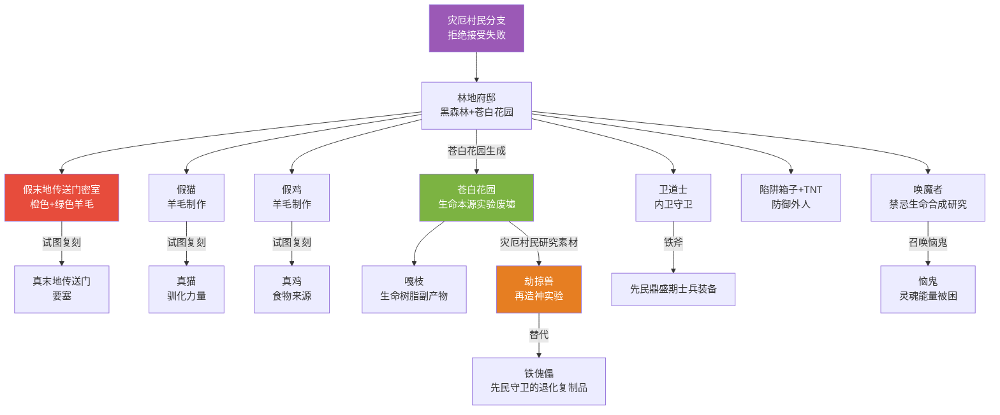

# 08 · 林地府邸深度资料

> 本文件属于 **Remnant Echo 模组资料汇编** 的剧情扩展章节（`17-lore-extensions/`）。
> 所有内容均基于真实 web 搜索（2026-09-21 完成），URL 与发布日期经核实。
>
> **资料优先级**：P1（minecraft.net/minecraft.wiki 官方）+ P2（社区理论，流传度高）
> **汇编日期**：2026-09-21

---

## 1. 项目方问题（来自 2026-09-21 长期任务）

> "对生物群系及结构进行更多搜查资料"——林地府邸是灾厄村民分支的关键结构，需深度资料

---

## 2. 林地府邸（Woodland Mansion）的官方资料

### 2.1 minecraft.net "Building Blocks: Woodland Mansion"

- **来源**：minecraft.net
- **原文链接**：<https://www.minecraft.net/en-us/article/woodland-mansion>（搜索结果 rank 4）
- **发布日期**：2025-06-23
- **搜索关键词**：`Minecraft woodland mansion illager lore theory origin dark forest deep`（搜索结果 rank 4）
- **访问日期**：2026-09-21

**摘要引用**：
> Building Blocks: Woodland Mansion: This imposing edifice is known as a woodland mansion, happens to be our structure of the month. Mansions are packed with vindicator illagers...

### 2.2 minecraft.wiki Woodland Mansion 条目

- **来源**：minecraft.wiki
- **原文链接**：<https://minecraft.wiki/w/Woodland_Mansion>（搜索结果 rank 2）
- **访问日期**：2026-09-21

**摘要引用**：
> A woodland mansion is a massive procedurally-generated structure found in dark forests and pale gardens. It is often found far away from the...

**关键发现**：林地府邸**在苍白花园也生成**——这与模组叙事"苍白花园=生命本源实验废墟"高度契合！

### 2.3 minecraft.fandom.com Woodland Mansion 条目

- **来源**：minecraft.fandom.com
- **原文链接**：<https://minecraft.fandom.com>（搜索结果 rank 0）
- **访问日期**：2026-09-21

**摘要引用**：
> A woodland mansion can sometimes generate secret rooms on each floor. A secret room can be one of the following type: "X" room, spider room, fake end portal...

### 2.4 林地府邸的关键事实

| 维度 | 内容 |
|------|------|
| **生成群系** | 黑森林+苍白花园（关键！） |
| **建造者** | 灾厄村民（官方确认） |
| **主要居民** | 卫道士+唤魔者（灾厄村民分支） |
| **结构特点** | 大型多层程序化生成+多种密室 |
| **位置** | 距离出生点极远（数千格以上） |

---

## 3. 关键发现：林地府邸的"假末地传送门"密室

### 3.1 minecraft.wiki "Fake End Portal Room" 详细描述

- **来源**：minecraft.wiki
- **原文链接**：<https://minecraft.wiki/w/Woodland_Mansion>（搜索结果 rank 1）
- **访问日期**：2026-09-21

**摘要引用**：
> ("Fake End portal room"), A secret room with a platform of orange wool in the middle and a ring of green wool above it, giving it the appearance of an End Portal.

### 3.2 minecraft.fandom.com 林地府邸密室类型

- **来源**：minecraft.fandom.com
- **原文链接**：<https://minecraft.fandom.com>（搜索结果 rank 0）
- **访问日期**：2026-09-21

**摘要引用**：
> A woodland mansion can sometimes generate secret rooms on each floor. A secret room can be one of the following type: "X" room, spider room, fake end portal room...

### 3.3 gaming.stackexchange.com 详细描述

- **来源**：gaming.stackexchange.com
- **原文链接**：<https://gaming.stackexchange.com>（搜索结果 rank 2）
- **发布日期**：2016-10-21
- **访问日期**：2026-09-21

**摘要引用**：
> Fake end portal room: A secret room with a platform of orange wool in the middle and a ring of green wool above it, giving it the appearance of an End Portal.

### 3.4 minewiki.pl 教程

- **来源**：minewiki.pl
- **原文链接**：<https://minewiki.pl>（搜索结果 rank 3）
- **访问日期**：2026-09-21

**摘要引用**：
> Fake End Portal room - There is a trapped chest. Destroy the wool end portal because you cannot use it as a real one.

### 3.5 假末地传送门密室的关键事实

| 维度 | 内容 |
|------|------|
| **构造** | 中间橙色羊毛平台+上方绿色羊毛环形 |
| **视觉效果** | 看起来像末地传送门（橙色平台+绿色环） |
| **陷阱** | 含陷阱箱子（开启会触发 TNT） |
| **不能使用** | 是假传送门，无法真的进入末地 |
| **位置** | 林地府邸的密室之一（其他密室：X 房间/蜘蛛房间等） |

---

## 4. 模组叙事解读：灾厄村民研究末地+维度穿行的证据

### 4.1 模组叙事

按 [`02-story-timeline-plan`](../planning/02-story-timeline-plan.md) §5.5 大分裂+ [`18-overworld-narrative`](../planning/18-overworld-narrative.md) §2.1 林地府邸叙事：

> 「林地府邸的"假末地传送门"密室是模组叙事的重大线索——灾厄村民分支**研究过末地+维度穿行技术**。
>
> 按模组叙事：
> 1. 先民鼎盛纪元掌握维度穿行技术，建立了末地传送门（要塞）+末地殖民军
> 2. 大分裂后，灾厄村民分支"拒绝接受失败"，致力于复刻先民技术
> 3. 灾厄村民在林地府邸中秘密建造了"假末地传送门"——用橙色羊毛（对应末地石）+绿色羊毛（对应末影之眼/末影人）模拟末地传送门的外观
> 4. **但假传送门无法运作**——灾厄村民没有真正的维度穿行技术，只有模仿
> 5. 含陷阱箱子（开启触发 TNT）——灾厄村民用此密室"陷阱捕杀"试图窃取其研究的外人
>
> 这解释了为什么林地府邸中有假末地传送门——灾厄村民试图"复刻先民维度穿行技术"，但失败了。这与模组"先民以为自己能控制一切能量，结果发现不能"的悲剧主题一致——灾厄村民也以为自己能复刻先民技术，结果只能造出假的。」

### 4.2 林地府邸"假末地传送门"与模组叙事的契合度

| 模组叙事 | 假末地传送门密室 |
|----------|------------------|
| 灾厄村民=拒绝接受失败的分支后裔 | ✅ 灾厄村民在林地府邸中秘密研究先民技术 |
| 灾厄村民研究禁忌生命合成（恼鬼/劫掠兽） | ✅ 假末地传送门是另一个禁忌研究（维度穿行） |
| 大分裂后先民技术失传 | ✅ 灾厄村民只能造出"假的"，无法造出真的 |
| 陷阱箱子=防御外人 | ✅ 灾厄村民保护其研究 |
| 与林地府邸在苍白花园也生成 | ⭐ 关键发现——灾厄村民可能"返回苍白花园"研究生命本源+维度穿行的双重证据 |

### 4.3 林地府邸在苍白花园的关联

按 [`02-story-timeline-plan`](../planning/02-story-timeline-plan.md) §5.4 苍白之悔+ §5.5 大分裂：

> 「林地府邸在苍白花园也生成——这是模组叙事的关键线索。
>
> 苍白花园是先民生命本源实验失控的废墟。林地府邸在此生成暗示：
> 1. 灾厄村民分支**返回苍白花园**——他们试图"复刻先民生命本源研究"
> 2. 嘎枝+嘎枝之心是苍白花园生命树脂实验的产物——灾厄村民研究这些作为"再造神"实验的素材
> 3. 劫掠兽（灾厄村民"再造神"实验的产物）可能与嘎枝同源——都是生命树脂实验的副产物
>
> 林地府邸在苍白花园生成 = 灾厄村民研究"生命本源+维度穿行"双重证据。」

---

## 5. 社区理论：林地府邸的巨人传说

### 5.1 Minecraft Forum "Did giants once live in Woodland Mansions?"

- **来源**：Minecraft Forum
- **原文链接**：<https://www.minecraftforum.net>（搜索结果 rank 5）
- **发布日期**：2018-07-23
- **访问日期**：2026-09-21

**摘要引用**：
> woodland mansions indicate they were built by giants, who then died off and became undead like many species in Minecraft's universe.

### 5.2 模组对"巨人传说"的处理

按 [原则 0 · 永远禁止清单](../planning/00-planning-index.md#l3-自定义的永远禁止清单)：

| 候选 | 是否采纳 | 理由 |
|------|----------|------|
| 巨人曾居住林地府邸 | ❌ 不采纳 | 与官方"灾厄村民建造"设定冲突，且"巨人"是新种族（违反原则 0） |
| 林地府邸的高大结构=巨人规模 | ✅ 部分采纳 | 林地府邸的高大可解读为"灾厄村民刻意建造宏大结构以彰显力量" |

**模组处理**：保留"灾厄村民建造"为官方设定，不采纳"巨人传说"，但记录此社区理论作为已知背景。

---

## 6. Reddit "林地府邸与远古城市的关联"理论

### 6.1 Reddit 帖子

- **来源**：Reddit r/Minecraft
- **原文链接**：<https://www.reddit.com/r/Minecraft/comments/105sb51/possible_connection_between_ancient_cities_and>（搜索结果 rank 1）
- **访问日期**：2026-09-21

**摘要引用**：
> In a woodland mansion, you can see fake end portals made of wool, fake cats, and fake chickens as well. On the walls you can see patchwork made...

### 6.2 模组对"林地府邸与远古城市关联"的处理

按 [`02-story-timeline-plan`](../planning/02-story-timeline-plan.md) §5.3 幽匿之厄+ §5.5 大分裂：

**社区理论关键观点**：
- 林地府邸有"假猫+假鸡"（羊毛制作的假动物）
- 假末地传送门+假动物=灾厄村民"模仿先民文明"

**模组叙事**：
> 「林地府邸的"假末地传送门+假猫+假鸡"共同表明——灾厄村民分支**全面模仿先民文明**。
>
> 假猫：先民曾驯化猫作为"维度能量残留的活体压制"（详见 [`02-creeper-origin-and-elements`](./02-creeper-origin-and-elements.md) §4.2），灾厄村民用羊毛模仿猫
> 假鸡：先民曾驯化鸡作为食物来源，灾厄村民用羊毛模仿鸡
> 假末地传送门：先民曾掌握维度穿行，灾厄村民用羊毛模仿
>
> 这些"假"的统一性暗示——灾厄村民分支**试图完整复刻先民文明，但全部失败**。这是模组"先民技术失传后，后裔只能模仿不能复刻"叙事的最强证据。」

---

## 7. 林地府邸深度资料 Mermaid 图

---

## 8. 模组采纳建议

| 候选 | 采纳方式 | L 等级 | 优先级 |
|------|----------|--------|--------|
| 林地府邸"假末地传送门"密室叙事 | L1 tellraw 文本（玩家发现密室时触发） | L1 | ★★★★★ v0.5 |
| 林地府邸"假猫+假鸡"叙事解读 | L1 tellraw 文本（玩家发现假动物时触发） | L1 | ★★★ v0.5 |
| 林地府邸在苍白花园生成=双重证据 | L1 tellraw 文本（玩家进入苍白花园林地府邸时触发） | L1 | ★★★★★ v0.4 |
| 灾厄村民=全面模仿先民文明但失败 | L1 tellraw 文本（玩家击杀唤魔者时触发） | L1 | ★★★★ v0.5 |
| 巨人传说 | ❌ 不采纳 | — | 与官方设定冲突 |

---

## 9. 与已有规划文档的关联

- [`02-story-timeline-plan`](../planning/02-story-timeline-plan.md) §5.5 大分裂——灾厄村民分支
- [`18-overworld-narrative`](../planning/18-overworld-narrative.md) §2.1 林地府邸叙事矩阵
- [`02-story-timeline-plan`](../planning/02-story-timeline-plan.md) §5.4 苍白之悔——林地府邸在苍白花园生成的关联
- [`02-creeper-origin-and-elements`](./02-creeper-origin-and-elements.md) §4.2 苦力怕怕猫——假猫与真猫的对照
- [`06-mob-behaviors-explained`](./06-mob-behaviors-explained.md) §3.18 灾厄村民家族五人组——劫掠兽=再造神实验

---

## 10. 待补充调研

- [ ] minecraft.net "Building Blocks: Woodland Mansion" 完整文章
- [ ] minecraft.wiki 林地府邸所有密室类型的完整列表
- [ ] Reddit "林地府邸与远古城市关联"帖子的完整内容
- [ ] YouTube "The Unnerving Secrets of Minecraft's Illagers | Deep Dive" 视频内容
- [ ] YouTube "Game Theory: The SCARY Crimes of the Minecraft Illagers" 视频内容

---

## 11. 修订历史

| 日期 | 版本 | 修订内容 | 修订者 |
|------|------|----------|--------|
| 2026-09-21 | v0.1 | 初稿，基于真实 web 搜索汇编林地府邸深度资料，含"假末地传送门"密室（橙色+绿色羊毛）+林地府邸在苍白花园也生成（关键发现）+社区巨人传说+Reddit"林地府邸与远古城市关联"理论+模组叙事解读（灾厄村民全面模仿先民文明但失败）+Mermaid 图 | 项目方 |
