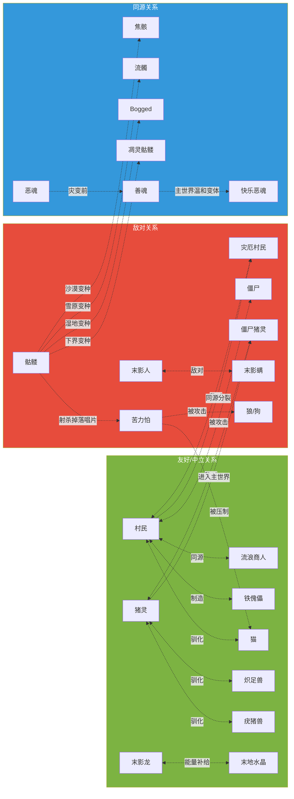

# 09 · 完整生物关系图

> 本文件属于 **Remnant Echo 模组资料汇编** 的剧情扩展章节（`17-lore-extensions/`）。
> 所有内容均基于真实 web 搜索（2026-09-21 完成）+ 已有 17 章节其他文档的整理。
>
> **资料优先级**：P1+P2 综合（社区流传度高的理论与官方设定同优先级）
> **汇编日期**：2026-09-21

---

## 1. 目的

本文档是 **Remnant Echo 模组的完整生物关系图**——把模组叙事中所有生物的关系按时序+因果链+维度+演化路径整理成可视化图谱。

**核心约束**：
- 所有关系基于已有 17 章节文档的整理
- 不引入新设定，仅作关系可视化
- 严格遵循 L1/L2/L3 原则——本文档是文学性参考，不涉及机制实现

---

## 2. 生物关系总图（按先民后裔三界分支）

```mermaid
flowchart TD
    Ancestor[远古先民文明<br/>鼎盛纪元]
    
    Ancestor --> Overworld[主世界分支<br/>定居者]
    Ancestor --> Nether[下界分支<br/>远征队]
    Ancestor --> End[末地分支<br/>殖民军]
    Ancestor --> BlackForest[黑森林分支<br/>拒绝接受失败]
    Ancestor --> Underground[地下分支<br/>科研贵族+射手阶层]
    
    %% 主世界演化
    Overworld --> Villager[村民<br/>保留古法但失忆]
    Overworld --> WanderingTrader[流浪商人<br/>承袭游走遗风]
    Overworld --> Nitwit[傻瓜村民<br/>智力退化特异分支]
    Overworld --> IronGolem[铁傀儡<br/>先民守卫的退化复制品]
    Overworld --> Cat[猫<br/>驯化力量具象]
    Overworld --> Wolf[狼/狗<br/>驯化力量另一种具象]
    
    %% 黑森林演化
    BlackForest --> IllagerFamily[灾厄村民家族]
    IllagerFamily --> Pillager[掠夺者<br/>前哨士兵]
    IllagerFamily --> Vindicator[卫道士<br/>内卫守卫]
    IllagerFamily --> Evoker[唤魔者<br/>禁忌生命合成研究者]
    IllagerFamily --> Ravager[劫掠兽<br/>再造神实验]
    IllagerFamily --> Vex[恼鬼<br/>召唤实验副产物]
    BlackForest --> Witch[女巫<br/>独自流浪的炼金研究者]
    
    %% 下界演化
    Nether --> Pigman[猪人<br/>早期下界形态 已灭绝]
    Pigman --> Piglin[猪灵<br/>现代下界形态]
    Pigman --> PiglinBrute[猪灵蛮兵<br/>守卫阶层]
    Piglin -->|进入主世界/末地| ZPiglin[僵尸猪灵<br/>维度诅咒]
    PiglinBrute -->|进入主世界/末地| ZPiglinBrute[僵尸猪灵蛮兵<br/>守卫的不死形态]
    Pig[猪<br/>非人形祖先] -->|雷击 4 格内| ZPiglin
    Nether --> Ghastling[善魂<br/>温和灵魂生物]
    Ghastling -->|凋灵之灾污染| Ghast[恶魂<br/>哭泣的灵魂]
    Ghastling -->|主世界水+低温| HappyGhast[快乐恶魂<br/>1.21.11+温和变体]
    Nether --> WitherSkeleton[凋灵骷髅<br/>被凋灵能量波转化的先民射手]
    Nether --> Blaze[烈焰人<br/>先民制造的生物兵器]
    Nether --> MagmaCube[岩浆怪<br/>液态下界合金生命]
    Nether --> Strider[炽足兽<br/>猪灵驯化的下界坐骑]
    Nether --> Hoglin[疣猪兽<br/>猪灵驯化的食物来源]
    
    %% 末地演化
    End --> Enderman[末影人<br/>殖民军异化后裔]
    End --> EnderDragon[末影龙<br/>先民制造的最终守门人]
    End --> Shulker[潜影贝<br/>末地城防御机械]
    End --> Endermite[末影螨<br/>末影人传送副产物]
    Enderman -->|传送副产物| Endermite
    
    %% 地下演化
    Underground --> Skeleton[骷髅<br/>先民射手阶层遗骨]
    Underground --> Zombie[僵尸<br/>先民平民阶层遗骨腐化]
    Underground --> CaveSpider[洞穴蜘蛛<br/>先民实验室改造产物]
    Underground --> Spider[蜘蛛<br/>主世界原生非人形生物]
    
    %% 灾变产物
    Ancestor -->|凋灵之灾| Wither[凋灵<br/>玩家召唤复现]
    Ancestor -->|幽匿之厄| Warden[监守者<br/>科研贵族灵魂聚合]
    Ancestor -->|苍白之悔| Creaking[嘎枝<br/>生命树脂副产物]
    Ancestor -->|生命本源研究| Creeper[苦力怕<br/>失败活化产物]
    Ancestor -->|维度能量残留| Phantom[幻翼<br/>不眠具象]
    Pig[猪<br/>非人形祖先] -->|先民维度能量实验| Creeper
    
    %% 维度诅咒变体
    Zombie -->|沙漠| Husk[尸壳<br/>沙漠分支]
    Zombie -->|雪原| Stray[流髑<br/>雪原分支]
    Skeleton -->|沙漠| Parched[焦骸<br/>沙漠分支 免疫阳光]
    Skeleton -->|湿地/试炼密室| Bogged[Bogged<br/>湿地分支]
    Skeleton -->|下界要塞| WitherSkeleton
    Zombie -->|村民被感染| ZombieVillager[僵尸村民]
    Piglin -->|进入主世界| ZPiglin
    Camel[骆驼] -->|沙漠| CamelHusk[骆驼尸壳<br/>沙漠不死变体]
    Parched -->|骑骆驼尸壳| CamelHusk

    style Ancestor fill:#4a90e2,color:#fff
    style Wither fill:#e74c3c,color:#fff
    style Warden fill:#e74c3c,color:#fff
    style Creaking fill:#e74c3c,color:#fff
    style Enderman fill:#9b59b6,color:#fff
    style ZPiglin fill:#8b9d3e,color:#fff
```

---

## 3. 按维度分类的生物关系矩阵

### 3.1 主世界生物

| 生物 | 起源 | 行为 | 与其他生物关系 |
|------|------|------|----------------|
| 村民 | 先民主世界后裔 | 中立被动+可交易 | 与流浪商人同源；与灾厄村民同源但分裂；制造铁傀儡作为守卫 |
| 流浪商人 | 与村民同源 | 中立被动+游走交易 | 与村民同源；以羊驼为伴 |
| 傻瓜村民 | 村民的特异分支 | 中立被动+不可交易 | 村民的智力退化形态 |
| 铁傀儡 | 村民制造 | 中立守护 | 村民对先民守卫的退化复制品；与铜傀儡（1.21.9）同源 |
| 猫 | 主世界原生+可被驯服 | 被动+压制苦力怕 | 驯化力量具象；压制苦力怕的维度能量活化 |
| 狼/狗 | 主世界原生+可被驯服 | 中立+攻击苦力怕 | 驯化力量另一种具象；攻击苦力怕 |
| 猪 | 主世界原生+可被驯化 | 被动 | 非人形祖先；雷击可变为僵尸猪灵；与苦力怕同源（先民维度能量实验） |
| 苦力怕 | 先民生命本源研究副产物 | 敌对+爆炸 | 与猪同源；怕猫/狼；与骷髅配合掉落唱片；闪电后增强 |
| 蜘蛛 | 主世界原生非人形 | 中立（白天）/敌对（夜晚） | 与洞穴蜘蛛同源；与骷髅配对形成蜘蛛骑手 |
| 洞穴蜘蛛 | 先民实验室改造产物 | 敌对+毒性 | 与蜘蛛同源但加毒元素；只在废弃矿井刷怪笼生成 |
| 牛/羊/鸡 | 主世界原生 | 被动 | 非人形生物，无特殊叙事 |
| 美西螈 | 先民水下研究副产物 | 被动+攻击水下敌对 | 与守卫者同源但被驯化为友好形态 |
| 海豚 | 先民水下研究站导航员 | 中立+引导到沉船 | 保留先民制图传统 |
| 蜜蜂 | 先民生命本源研究温和产物 | 被动+攻击后死亡 | 与嘎枝同源但更温和 |

### 3.2 主世界不死变体

| 生物 | 起源 | 行为 | 与其他生物关系 |
|------|------|------|----------------|
| 僵尸 | 先民平民阶层遗骨腐化 | 敌对+攻击村民+破门 | 与骷髅同源；阳光下燃烧；可感染村民→僵尸村民 |
| 尸壳 | 僵尸沙漠分支 | 敌对 | 僵尸的沙漠变种 |
| 僵尸村民 | 村民被僵尸感染 | 敌对 | 僵尸+村民的中间形态 |
| 骷髅 | 先民射手阶层遗骨 | 敌对+用弓 | 与僵尸同源；阳光下燃烧；可骑蜘蛛形成蜘蛛骑手 |
| 流髑 | 骷髅雪原分支 | 敌对+缓速箭 | 骷髅的雪原变种+冰元素 |
| 焦骸 | 骷髅沙漠分支（1.21.11+） | 敌对+虚弱箭+免疫阳光 | 骷髅的沙漠变种+虚弱元素；作为骆驼尸壳的乘客生成 |
| Bogged | 骷髅湿地/试炼密室分支 | 敌对+毒箭 | 骷髅的湿地变种+毒元素 |
| 骆驼尸壳 | 骆驼的不死变体 | 被动不死 | 骆驼的沙漠不死形态；可被焦骸骑乘 |
| 幻翼 | 不眠具象+维度能量残留 | 敌对+飞行俯冲 | 与末影龙同源（按 MatPat 鞘翅理论）；阳光下燃烧；掉落幻影膜修复鞘翅 |

### 3.3 灾厄村民分支

| 生物 | 起源 | 行为 | 与其他生物关系 |
|------|------|------|----------------|
| 掠夺者 | 灾厄村民分支前哨士兵 | 敌对+用弩 | 与卫道士/唤魔者同源 |
| 卫道士 | 灾厄村民分支内卫守卫 | 敌对+用铁斧 | 与掠夺者同源；铁斧是先民士兵装备退化版 |
| 唤魔者 | 灾厄村民分支禁忌研究者 | 敌对+召唤恼鬼+尖牙 | 与掠夺者同源；召唤恼鬼是"再造神"实验 |
| 劫掠兽 | 灾厄村民"再造神"实验 | 敌对+冲撞 | 与嘎枝同源（都是生命树脂实验副产物）；替代铁傀儡 |
| 恼鬼 | 唤魔者召唤实验副产物 | 敌对+飞行+铁剑 | 灵魂能量被困在小形体中 |
| 女巫 | 灾厄村民分支流浪研究者 | 敌对+药水 | 与灾厄村民同源但独自流浪；与村民"炼金古法"同源 |

### 3.4 下界生物

| 生物 | 起源 | 行为 | 与其他生物关系 |
|------|------|------|----------------|
| 猪灵 | 先民下界分支后裔 | 中立+以物易物 | 与猪同源；进入主世界变僵尸猪灵；被金装分散注意力 |
| 猪灵蛮兵 | 猪灵的精英/守卫变体 | 敌对+金斧 | 与猪灵同源；不交易不被金分散 |
| 僵尸猪灵 | 猪灵进入主世界后的不死形态 | 中立+群体仇恨 | 与猪灵同源；雷击猪也可生成 |
| 僵尸猪灵蛮兵 | 猪灵蛮兵进入主世界后的不死形态 | 敌对 | 与猪灵蛮兵同源 |
| 恶魂 | 善魂被凋灵能量污染 | 敌对+火球+哭泣 | 与善魂同源；与烈焰人同源（火元素） |
| 善魂/快乐恶魂 | 善魂的残留温和变体 | 中立被动 | 与恶魂同源但未被污染 |
| 凋灵骷髅 | 先民射手被凋灵能量波转化 | 敌对+凋零效果 | 与骷髅同源；4 格高 |
| 烈焰人 | 先民制造的生物兵器 | 敌对+火球+飞行 | 与恶魂同源（火元素）；掉落烈焰棒合成末影之眼 |
| 岩浆怪 | 液态下界合金生命 | 敌对+分裂 | 与史莱姆同源；与下界合金同源 |
| 炽足兽 | 猪灵驯化的下界坐骑 | 中立+可骑乘 | 与疣猪兽同源（驯化产物） |
| 疣猪兽 | 猪灵驯化的食物来源 | 敌对 | 与猪同源（非人形祖先） |
| 凋灵 | 玩家召唤的 Boss | 敌对+凋零+飞行 | 3 个头代表 3 种灵魂扭曲；与末影龙同源（守门人型 Boss） |

### 3.5 末地生物

| 生物 | 起源 | 行为 | 与其他生物关系 |
|------|------|------|----------------|
| 末影人 | 末地殖民军异化后裔 | 中立+传送+怕水/被注视攻击 | 与村民/猪灵同源（先民后裔三界分支）；掉落末影珍珠；与末影螨同源 |
| 末影龙 | 先民制造的最终守门人 | 敌对+龙息+飞行 | 与凋灵同源（守门人型 Boss）；掉落龙蛋；可重生 |
| 潜影贝 | 末地城防御机械 | 敌对+闭合防御+子弹 | 与铁傀儡/铜傀儡同源（机械守卫） |
| 末影螨 | 末影人传送副产物 | 敌对 | 与末影人同源；末影人会攻击末影螨 |

### 3.6 灾变产物

| 生物 | 起源 | 行为 | 与其他生物关系 |
|------|------|------|----------------|
| 监守者 | 远古城市科研贵族灵魂聚合 | 敌对+声波+500 血量 | 与凋灵同源（先民灾变产物）；不可被永久击杀 |
| 嘎枝 | 苍白花园生命树脂副产物 | 敌对+被注视冻结 | 与劫掠兽同源（生命树脂实验）；只能破坏嘎枝之心 |
| 苦力怕 | 先民生命本源研究失败活化产物 | 敌对+爆炸 | 与猪同源；怕猫/狼；与骷髅配合掉落唱片 |

### 3.7 水下生物

| 生物 | 起源 | 行为 | 与其他生物关系 |
|------|------|------|----------------|
| 守卫者 | 海底神殿防御机械 | 敌对+激光+尖刺 | 与潜影贝同源（机械守卫） |
| 远古守卫者 | 水下研究站指挥官 | 敌对+挖掘疲劳 | 3 个对应先民三大研究领域水下分支 |
| 美西螈 | 先民水下研究副产物 | 被动+攻击水下敌对 | 与守卫者同源但被驯化 |
| 海豚 | 先民水下研究站导航员 | 中立+引导到沉船 | 保留先民制图传统 |

---

## 4. 生物关系的"七大类"整理

按 [`06-mob-behaviors-explained`](./06-mob-behaviors-explained.md) §4 的 7 大类：

### 4.1 维度能量残留类
- 苦力怕（爆炸）
- 闪电苦力怕（增强）
- 末影人（传送+怕水）
- 末影螨（传送副产物）
- 幻翼（不眠具象）

### 4.2 灵魂能量类
- 监守者（500 血量+无眼+声波）
- 凋灵（三头+凋零效果）
- 凋灵骷髅（骨骼增长+凋零）
- 恼鬼（灵魂能量被困）

### 4.3 生命本源类
- 嘎枝之心（活体方块）
- 嘎枝（夜间防御+被注视冻结）
- 苦力怕（生命树脂副产物）
- 蜜蜂（温和产物+攻击后死亡）

### 4.4 维度诅咒类
- 僵尸猪灵（猪灵进入主世界不死化）
- 僵尸猪灵蛮兵（猪灵蛮兵进入主世界不死化）
- 焦骸（沙漠干燥化）
- Bogged（湿地毒化）
- 流髑（雪原冰化）
- 僵尸村民（村民被感染）
- 骆驼尸壳（骆驼不死变体）
- 尸壳（僵尸沙漠变种）
- 幻翼（飞行不死）

### 4.5 驯化力量类
- 猫（压制苦力怕）
- 狼/狗（攻击苦力怕）
- 猪灵（被金分散）
- 猪灵蛮兵（不被金分散）
- 铁傀儡（村民制造）
- 铜傀儡（1.21.9 新增）

### 4.6 先民遗骨类
- 骷髅（射箭+阳光下燃烧）
- 僵尸（攻击村民+破门）
- 凋灵骷髅（被凋灵能量波转化）
- 焦骸（沙漠变种+免疫阳光）
- 流髑（雪原变种）
- Bogged（湿地变种）

### 4.7 维度穿行技术类
- 末影人（传送）
- 末影龙（守门人）
- 末地水晶（能量补给）
- 末影龙重生（守门人重启协议）
- 龙蛋（新守门人种子）

---

## 5. 生物之间的"敌对/友好"关系图

---

## 6. 与已有规划文档的关联

| 文档 | 与本章节关系 |
|------|--------------|
| [`02-story-timeline-plan`](../planning/02-story-timeline-plan.md) 六大纪元 | 本章节是其生物演化矩阵的可视化 |
| [`16-worldview-overview`](../planning/16-worldview-overview.md) 三界同源 | 本章节是其生物分支关系的展开 |
| [`18-overworld-narrative`](../planning/18-overworld-narrative.md) 主世界种族 | 本章节是其生物关系的扩展 |
| [`19-nether-narrative`](../planning/19-nether-narrative.md) 下界种族 | 本章节是其生物关系的扩展 |
| [`20-end-narrative`](../planning/20-end-narrative.md) 末地种族 | 本章节是其生物关系的扩展 |
| [`01-mob-evolution-history`](./01-mob-evolution-history.md) 猪灵家族 | 本章节是其关系图的扩展 |
| [`02-creeper-origin-and-elements`](./02-creeper-origin-and-elements.md) 苦力怕起源 | 本章节是其关系的整合 |
| [`06-mob-behaviors-explained`](./06-mob-behaviors-explained.md) 生物特性 | 本章节是其 7 大类的可视化 |
| [`08-woodland-mansion-deep`](./08-woodland-mansion-deep.md) 林地府邸深度 | 本章节是灾厄村民分支的扩展 |

---

## 7. 待补充调研

- [ ] 其他生物的关系（蝙蝠/北极熊/海龟/狐狸/熊猫/羊/牛/鸡等）的具体深度资料
- [ ] 各生物之间的具体交互行为（如末影人攻击末影螨的触发条件）
- [ ] 1.21.11+ 新增生物（骆驼尸壳/僵尸鹦鹉螺/焦骸）的完整关系
- [ ] 26.1+ 新增生物（硫磺立方体）的关系

---

## 8. 修订历史

| 日期 | 版本 | 修订内容 | 修订者 |
|------|------|----------|--------|
| 2026-09-21 | v0.1 | 初稿，基于已有 17 章节文档整理完整生物关系图，含按维度分类的关系矩阵+7 大类整理+敌对/友好/同源关系 Mermaid 图 | 项目方 |
