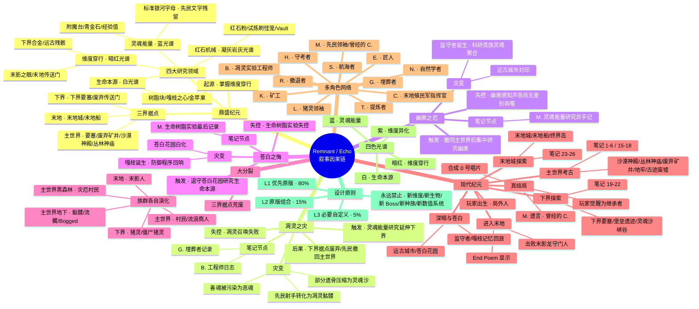
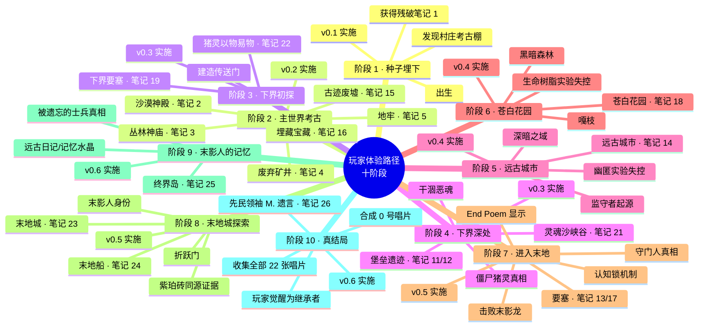
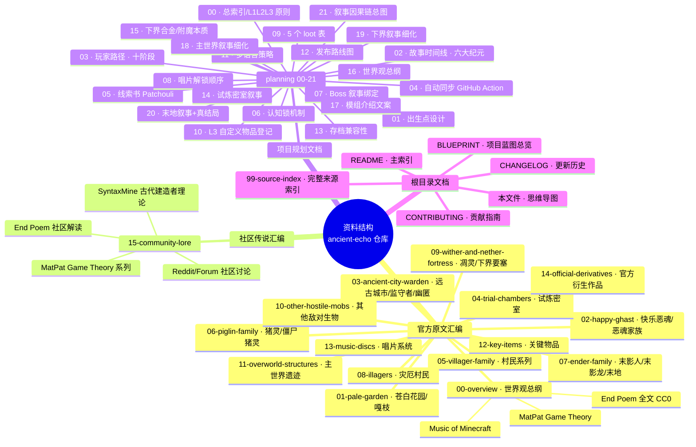
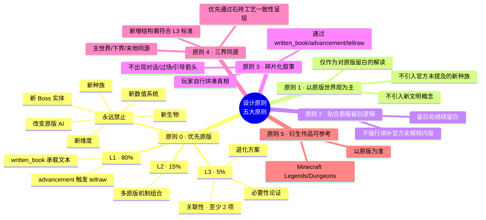
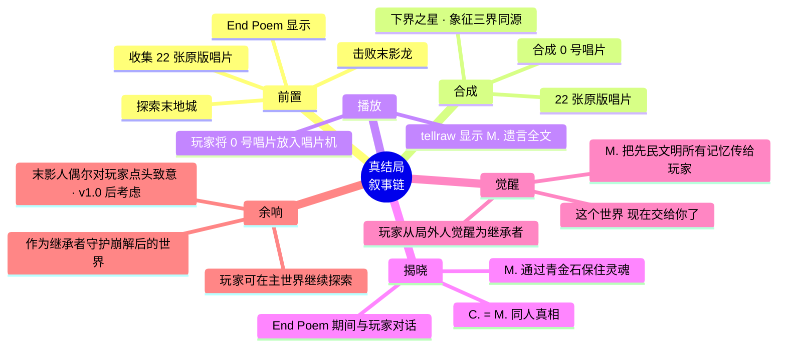
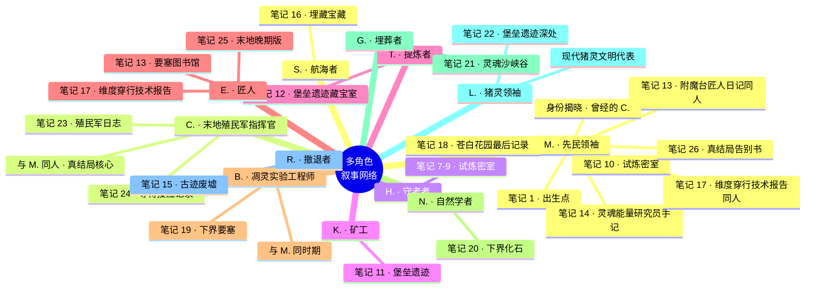

# Remnant / Echo · 项目思维导图

> 本文档以 Mermaid mindmap 格式呈现模组叙事的核心思维结构。
> GitHub 原生渲染 Mermaid 思维导图，可直接查看；亦可下载 PNG 版本作为参考。
>
> **PNG 版本**：[`download/mindmap/remnant-echo-mindmap.png`](./download/mindmap/remnant-echo-mindmap.png)（由 mermaid-cli 渲染）
> **源代码**：见下方 Mermaid 代码块，可粘贴至 [mermaid.live](https://mermaid.live) 在线编辑

---

## 1. 模组叙事因果链思维导图

---

## 2. 玩家体验路径思维导图

---

## 3. 模组资料结构思维导图

---

## 4. 模组设计原则思维导图

---

## 5. 真结局叙事链思维导图

---

## 6. 模组多角色叙事网络

---

## 7. 修订历史

| 日期 | 版本 | 修订内容 | 修订者 |
|------|------|----------|--------|
| 2026-09-18 | v0.1 | 初稿，6 张 Mermaid 思维导图：叙事因果链 / 玩家路径 / 资料结构 / 设计原则 / 真结局 / 多角色网络 | 项目方 |
