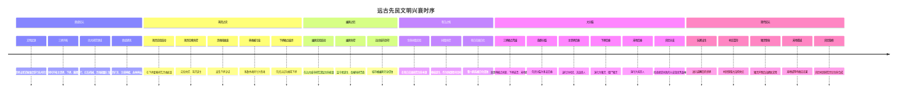
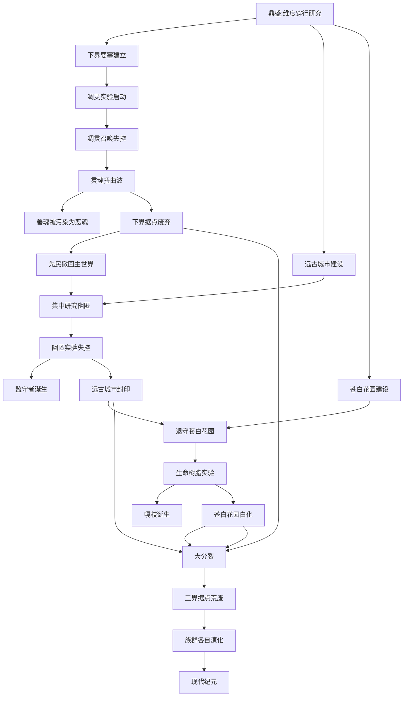

# 02 · 故事时间线规划

> **状态**：🟡 设计讨论中
> **对应模组版本**：贯穿全部版本（叙事骨架）
> **创建日期**：2026-09-18
> **最后更新**：2026-09-18
> **设计原则**：[补不是添](./00-planning-index.md#原则-0补不是添) · [以原版世界观为主](./00-planning-index.md#原则-1以原版世界观为主)

---

## 1. 目的

确立 **远古先民文明从兴起到崩解** 的内部时序，作为整个模组叙事的骨架。

**重要说明**：本时序**不是新世界观的创造**，而是**对原版已有线索的合理串联与解读**。所有纪元名称、事件描述必须能在原版资料中找到对应的线索（建筑、生物、物品、Boss 设定）。

**与玩家体验路径的区别**：
- **故事时间线**（本文档）：剧情内部时序，先民文明的因果链。开发者用，确保叙事自洽。
- **玩家体验路径**（`03-player-journey-map.md`）：玩家探索的渐进解锁顺序。玩家用，决定线索书章节顺序。

---

## 2. 总览：六大纪元

按蓝图文档「灾变与分裂」段落的设定，将远古先民文明划分为以下六大纪元：

| 纪元 | 名称 | 核心事件 | 关键遗迹/种族 |
|------|------|----------|---------------|
| I | 鼎盛纪元 | 文明三界开拓，四大研究领域并行 | 要塞、废弃矿井、沙漠神殿、丛林神庙 |
| II | 凋灵之灾 | 凋灵实验失控，灵魂扭曲波席卷下界 | 下界要塞、凋灵骷髅、恶魂 |
| III | 幽匿之厄 | 幽匿实验失控，远古城市被侵蚀 | 远古城市、监守者、幽匿 |
| IV | 苍白之悔 | 生命树脂实验失控，苍白花园白化 | 苍白花园、嘎枝、嘎枝之心 |
| V | 大分裂 | 文明崩解，三界据点荒废，族群各自演化 | 废弃村庄、猪灵堡垒、末地城 |
| VI | 现代纪元 | 玩家出生时的世界状态 | 村民、流浪商人、猪灵、末影人、灾厄村民 |

---

## 3. Mermaid 时序图（草稿）

---

## 4. 因果链分析

### 4.1 三大实验的先后顺序

按蓝图文档，灾变顺序为：
1. 凋灵实验失控 → 灵魂扭曲波席卷下界
2. 幽匿实验失控 → 远古城市被侵蚀
3. 生命树脂实验失控 → 苍白花园白化

**待讨论的设计问题**：这三大实验是同时进行、还是依次进行？

**方案对比**：

| 选项 | 设定 | 叙事效果 | 推荐度 |
|------|------|----------|--------|
| 同时进行 | 三大实验同时失控 | 灾变是瞬间的，文明瞬间崩塌 | ★★ 戏剧性过强，缺乏因果层次 |
| 依次进行 | 凋灵→幽匿→苍白 | 一环扣一环，每个灾变都加剧下一次 | ★★★★ 推荐主方案 |
| 凋灵同时幽匿 | 凋灵与幽匿同时，苍白在后 | 下界+深暗双灾变，苍白为最后挣扎 | ★★★ 备选 |

**推荐：依次进行**。理由：
- 凋灵之灾削弱了下界据点 → 先民撤回主世界 → 集中精力研究幽匿 → 幽匿失控 → 退守苍白花园 → 苍白失控 → 大分裂
- 每个灾变都为下一个埋下伏笔，符合"灾难链"叙事

### 4.2 跨纪元的因果链

---

## 5. 各纪元详细设定

### 5.1 鼎盛纪元

**时间跨度**：未定（建议设定为"千年之前"，具体数字留白）

**核心事件**：
- 一支掌握维度穿行技术的文明在主世界兴起
- 同时开拓主世界、下界、末地三界
- 三界遗迹的石砖、楼梯、柱式等砌筑工艺高度一致，仅配色因本地材质而异
- 文明鼎盛期研究四大领域：
  - 维度穿行（要塞、传送门、末地城）
  - 红石机械（废弃矿井、试炼密室）
  - 灵魂能量（下界要塞、凋灵实验）
  - 生命本源（苍白花园、树脂实验）

**关键遗迹**：
- 主世界：要塞、废弃矿井、沙漠神殿、丛林神庙
- 下界：下界要塞（前哨站）
- 末地：末地城、末地船（殖民军据点）

**叙事线索**：
- 沙漠神殿、丛林神庙的祭祀物品暗示先民信仰体系
- 废弃矿井的红石机械暗示劳工阶层
- 要塞的传送门房间暗示维度穿行技术
- 末地城的紫珀砖与主世界石砖工艺一致（同源证据）

### 5.2 凋灵之灾

**触发**：先民在下界要塞研究灵魂能量，尝试召唤凋灵

**核心事件**：
1. 凋灵实验启动：在下界要塞建造凋灵召唤阵
2. 凋灵召唤失控：凋灵能量超出预期，无法控制
3. 灵魂扭曲波：从下界要塞向四周扩散，扭曲所到之处的灵魂
4. 善魂被污染：原本温和的下界灵魂生物"善魂"被扭曲为恶魂
5. 凋灵骷髅诞生：被凋灵能量波抹去灵魂的先民射手转化为凋灵骷髅
6. 下界据点废弃：先民远征队被迫撤离下界

**关键遗迹/种族**：
- 下界要塞：凋灵实验遗址
- 凋灵骷髅：先民射手的转化体
- 恶魂：被污染的善魂
- 调零玫瑰：凋灵能量残留生长出的花

**叙事线索**：
- 下界要塞的凋灵骷髅头颅暗示召唤阵位置
- 凋灵骷髅掉落凋灵骷髅头颅（玩家可重新召唤凋灵，重现灾变）
- 恶魂的哭泣声是善魂被扭曲的痛苦回响
- 干涸恶魂（1.21.11+ 设定）是灾变后下界残留能量的产物

### 5.3 幽匿之厄

**触发**：凋灵之灾后，先民撤回主世界，集中精力在远古城市研究深层生命能量

**核心事件**：
1. 幽匿实验启动：在远古城市深层研究"幽匿"——一种能感知声音的生命能量
2. 幽匿失控：幽匿感知到玩家的存在，开始无差别吞噬生命
3. 监守者诞生：被幽匿吞噬的科研贵族灵魂聚合为监守者
4. 远古城市封印：城市被幽匿完全侵蚀，幸存者封印入口撤离

**关键遗迹/种族**：
- 远古城市：幽匿实验遗址
- 监守者：科研贵族的灵魂聚合体
- 幽匿（Sculk）：感知声音的生命能量
- 远古城市中心的"门型结构"：传闻用于召唤监守者，或为先民尝试封印幽匿的遗迹

**叙事线索**：
- 远古城市中心的无门门框（warden head shape）暗示召唤/封印仪式
- 监守者的盲眼与回声定位暗示"幽匿感知声音"的设定
- 唱片 5（碎片）暗示灾变时的录音
- 远古城市的箱子中有"灵魂沙"等下界材料，暗示与凋灵之灾的关联

### 5.4 苍白之悔

**触发**：幽匿失控后，先民退守苍白花园，研究生命本源作为最后挣扎

**核心事件**：
1. 生命树脂实验启动：在苍白花园研究"生命树脂"——一种能赋予无生命物体意识的物质
2. 树脂失控：树脂实验失控，整个苍白花园被白化
3. 嘎枝诞生：作为防御程序回响，嘎枝之心被激活
4. 苍白花园白化：所有植物、动物被白化侵蚀

**关键遗迹/种族**：
- 苍白花园：生命树脂实验废墟
- 嘎枝：防御程序回响
- 嘎枝之心：激活嘎枝的"活体方块"
- 苍白橡树：白化后的橡树变种
- 树脂块：实验残留物

**叙事线索**：
- 嘎枝之心的"活体方块"特性暗示生命树脂的本质
- 嘎枝不能直接伤害，只能破坏嘎枝之心——暗示"防御程序"的设定
- 苍白花园无动物生成，暗示生命已被白化吞噬
- 1.21.11+ 的"快乐恶魂"设定（先民维度残留能量与主世界水、低温作用）可关联至此纪元

### 5.5 大分裂

**触发**：三大灾变连续打击后，文明崩解

**核心事件**：
1. 三界据点荒废：主世界据点失联，下界崩溃，末地孤立
2. 族群分裂：先民分裂为多支后裔
3. 主世界后裔：退化为村民、流浪商人（保留古法但失忆）
4. 下界后裔：演化为猪灵、僵尸猪灵（环境变异，部分开智）
5. 末地后裔：演化为末影人（维度异化，记忆残缺）
6. 灾厄分支：拒绝接受失败的分支隐居黑森林，研究禁忌生命合成（恼鬼）与再造神（劫掠兽）
7. 骷髅遗骨：先民射手阶层遗骨灵魂被困，执行最后命令

**关键种族演化**：

| 维度 | 原初分支 | 现代后裔 | 演化逻辑 |
|------|----------|----------|----------|
| 主世界 | 先民定居者 | 村民、流浪商人 | 技术退化，社会延续 |
| 下界 | 先民远征队 | 猪灵、僵尸猪灵 | 环境变异，部分开智 |
| 末地 | 末地殖民军 | 末影人 | 维度异化，记忆残缺 |
| 黑森林 | 拒绝接受失败的分支 | 灾厄村民 | 研究禁忌生命合成 |
| 主世界地下 | 先民射手阶层 | 骷髅、流髑、尸壳 | 灵魂被困，执行最后命令 |

**叙事线索**：
- 村民与流浪商人的同源（同为主世界后裔）
- 灾厄村民与村民的敌对（同源但分裂）
- 末影人怕水、怕光（维度异化的副作用）
- 僵尸猪灵是猪灵进入主世界后的退化形态（维度能量冲突）
- 铁傀儡是村民以精铁与刻纹南瓜仿造的古代守卫（先民守卫的退化复制品）

### 5.6 现代纪元

**时间点**：玩家出生时

**核心状态**：
- 主世界：村民保留古法但失忆，流浪商人承袭游走探索遗风
- 下界：猪灵开智后自建堡垒（猪灵堡垒），形成新文明
- 末地：末地城空置，末影人保留跨维度能力但记忆残缺
- 黑森林：灾厄村民研究禁忌生命合成，与村民为敌

**玩家角色定位**：
- 玩家不是先民后裔，而是"局外人"
- 通过考古、线索、Boss 击杀，逐步拼凑远古文明真相
- 最终通过 0 号唱片合成，听到先民领袖遗言

---

## 6. 与官方原版的兼容性

### 6.1 完全兼容的设定（原版已明确）

- ✅ 三大遗迹（沙漠神殿、丛林神庙、要塞）的存在与定位
- ✅ 远古城市、监守者、幽匿的设定
- ✅ 苍白花园、嘎枝、嘎枝之心的设定
- ✅ 灾厄村民、恼鬼、劫掠兽的设定
- ✅ 末影人怕水、怕光的设定
- ✅ 凋灵骷髅在下界要塞生成
- ✅ 末地城、末地船、紫珀砖的存在

### 6.2 模组的"补完"设定（基于原版留白的合理串联）

**这些设定不引入新内容，只是把原版零散线索串起来**：

| 串联点 | 原版线索 | 模组补完解读 | 是否符合"补不是添" |
|--------|----------|-------------|---------------------|
| 三界同源 | 三界遗迹的石砖工艺一致 | 解读为"同源文明的产物" | ✅ 仅解读，不新增 |
| 凋灵实验失控 | 凋灵骷髅在下界要塞生成 | 解读为"凋灵召唤失控的产物" | ✅ 仅解读，不新增 |
| 善魂设定 | 1.21.11+ 快乐恶魂为温和变体 | 解读为"灾变前善魂的残留形态" | ✅ 仅解读，不新增 |
| 村民/猪灵/末影人同源 | 建筑工艺一致、生物行为相似 | 解读为"同源文明的后裔" | ✅ 仅解读，不新增 |
| 铁傀儡来源 | 村民可制造铁傀儡 | 解读为"先民守卫的退化复制品" | ✅ 仅解读，不新增 |
| 远古城市门框 | 原版未明确用途 | 解读为"封印幽匿的仪式门" | ✅ 仅解读，不新增 |
| 试炼密室建造者 | 原版未明确建造者 | 解读为"先民后裔挑战体系" | ✅ 仅解读，不新增 |
| 末地城等待接应 | 末地城空置、紫珀砖工艺一致 | 解读为"殖民军等待接应无果" | ✅ 仅解读，不新增 |

### 6.3 严格禁止的"添"

| 禁止项 | 原因 |
|--------|------|
| ❌ 自定义新纪元名称（如"光之纪元"、"暗之纪元"） | 原版无对应线索 |
| ❌ 自定义新种族（如"光之民"、"暗之子"） | 原版无对应生物 |
| ❌ 自定义新文明（如"亚特兰蒂斯先民"） | 原版无对应建筑 |
| ❌ 自定义新维度（如"灵界"、"梦境"） | 原版无对应维度 |
| ❌ 自定义新 Boss（如"守门人"、"先民领袖"） | 原版无对应 Boss |
| ❌ 自定义新物品（如"残破笔记"、"记忆水晶"） | 必须用原版物品承载 |

### 6.4 待讨论的潜在串联点

- [ ] 凋灵召唤阵的位置：原版下界要塞是否有凋灵召唤阵的视觉痕迹？需要通过凋灵骷髅头颅的生成位置反推
- [ ] 远古城市中心的"门型结构"：原版未明确其用途，模组可解读为"封印幽匿的仪式门"——但**不能新增自定义结构**，只能在叙事文本中**解读**原版结构
- [ ] 试炼密室的建造者：原版未明确，模组设定为"先民后裔挑战体系"需进一步论证（基于试炼密室的石砖工艺与要塞一致）
- [ ] 末地城与末地船的等待接应设定：原版未明确，但末地城的紫珀砖与主世界工艺一致暗示同源

---

## 7. 实施计划

### 7.1 v0.1 ~ v0.2：基础时序确认

- [ ] 在本文档基础上确定三大实验的先后顺序（推荐"依次进行"）
- [ ] 确定各纪元的时间跨度（留白 vs 具体数字）
- [ ] 确定玩家角色定位（局外人也 vs 后裔）
- [ ] 在 lore 仓库新建 `timeline/` 目录存放各纪元详细文档

### 7.2 v0.3 ~ v0.5：遗迹叙事绑定

- [ ] 每个遗迹（沙漠神殿、丛林神庙、废弃矿井、要塞、远古城市、下界要塞、末地城、苍白花园、试炼密室）绑定到对应纪元
- [ ] 设计每个遗迹的"叙事线索"（残破笔记、壁画、铭文、唱片）
- [ ] 验证遗迹之间的因果链时序

### 7.3 v0.6 ~ v0.9：叙事文本编写

- [ ] 编写各纪元的叙事文本（先民视角、后裔视角、玩家视角）
- [ ] 编写线索书章节内容
- [ ] 编写 Boss 击杀触发的记忆回放文本
- [ ] 编写 0 号唱片的先民领袖遗言

### 7.4 v1.0：发布前最终校对

- [ ] 全时序一致性校对
- [ ] 与原版设定冲突点最终复核
- [ ] 翻译为多语言（中文、英文、日文等）

---

## 8. 修订历史

| 日期 | 版本 | 修订内容 | 修订者 |
|------|------|----------|--------|
| 2026-09-18 | v0.1 | 初稿，提出六大纪元划分与因果链 | 项目方 |
| 2026-09-18 | v0.2 | 增加"补不是添"原则检查，明确所有设定为原版留白的解读而非新创造 | 项目方 |
