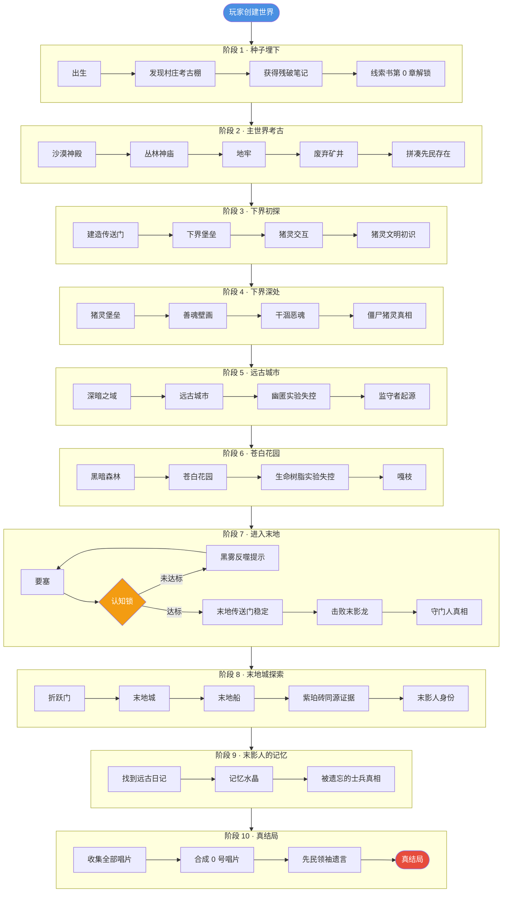

# 03 · 玩家体验路径图

> **状态**：🟡 设计讨论中
> **对应模组版本**：v0.1 ~ v1.0
> **创建日期**：2026-09-18
> **最后更新**：2026-09-18
> **设计原则**：[补不是添](./00-planning-index.md#原则-0补不是添) · [以原版世界观为主](./00-planning-index.md#原则-1以原版世界观为主)

---

## 1. 目的

确立玩家从创建世界到完成真结局的**渐进解锁顺序**，作为线索书章节顺序、Boss 触发条件、唱片解锁顺序的设计依据。

**重要说明**：本路径**不新增强制引导机制**，玩家可自由探索。所有"解锁"均通过原版 `advancement` 触发器实现，叙事文本通过原版 `tellraw` 命令显示，不新增自定义机制。

**与故事时间线的区别**：
- **故事时间线**（`02-story-timeline-plan.md`）：剧情内部时序。开发者用，确保叙事自洽。
- **玩家体验路径**（本文档）：玩家探索的渐进解锁顺序。玩家用，决定线索书章节顺序。

---

## 2. 设计原则

1. **非线性但有序**：玩家可自由探索，但叙事线索按推荐顺序解锁
2. **认知锁机制**：未达到认知标准的玩家进入末地传送门时会出现"黑雾反噬"提示，但不强制阻止
   - **实现方式**：基于原版 `advancement` 触发器判定（不新增自定义机制）
   - 玩家需先解锁特定 `advancement`（如 `minecraft:story/find_stronghold`、模组自定义 `read_lore_chapter_X`）才会触发末地传送门正常激活
   - 这本质是原版 `advancement` 触发器，**不是新机制**
3. **三幕结构**：分主世界幕、下界幕、末地幕，每幕有独立的高潮
4. **碎片化奖励**：每完成一个里程碑，解锁一张唱片或一段叙事文本
5. **补不是添**：所有里程碑均通过原版 `advancement` 触发，叙事文本通过 `tellraw` 显示，不新增自定义物品、Boss、机制

---

## 3. 总览：十阶段路径

按蓝图文档「玩家体验流程」段落，划分为十个阶段：

| 阶段 | 名称 | 推荐版本 | 主要活动 | 解锁内容 |
|------|------|----------|----------|----------|
| 1 | 种子埋下 | v0.1 | 出生 → 发现村庄考古棚 → 获得残破笔记 | 线索书第 0 章 |
| 2 | 主世界考古 | v0.2 | 探索沙漠神殿、丛林神庙、地牢、废弃矿井 | 线索书第 1~4 章 + 唱片 13/cat/blocks/chirp |
| 3 | 下界初探 | v0.3 | 建造传送门 → 下界堡垒 → 猪灵交互 | 线索书第 5 章 + 唱片 Pigstep |
| 4 | 下界深处 | v0.3 | 猪灵堡垒 → 善魂壁画 → 干涸恶魂 → 僵尸猪灵真相 | 线索书第 6 章 + 唱片 Pigstep/otherside |
| 5 | 远古城市 | v0.4 | 深暗之域 → 远古城市 → 幽匿实验失控 → 监守者起源 | 线索书第 7 章 + 唱片 5 |
| 6 | 苍白花园 | v0.4 | 黑暗森林 → 苍白花园 → 生命树脂实验失控 → 嘎枝 | 线索书第 8 章 + 唱片 Relic |
| 7 | 进入末地 | v0.5 | 要塞 → 认知锁 → 击败末影龙 → 守门人真相 | 线索书第 9 章 + End Poem |
| 8 | 末地城探索 | v0.5 | 折跃门 → 末地城/末地船 → 紫珀砖同源证据 → 末影人身份 | 线索书第 10 章 + 唱片 ward |
| 9 | 末影人的记忆 | v0.6 | 找到远古日记/记忆水晶 → "被遗忘的士兵"真相 | 线索书第 11 章 + 唱片 11 |
| 10 | 真结局 | v0.6 | 收集全部唱片 → 合成 0 号唱片 → 先民领袖遗言 | 线索书终章 + 0 号唱片 |

---

## 4. Mermaid 流程图

---

## 5. 阶段详细设计

### 阶段 1：种子埋下（v0.1）

**详见**：[`01-spawn-point-design.md`](./01-spawn-point-design.md)

**核心交付**：
- 出生点附近保证有村庄
- 村庄中有考古棚
- 考古棚桌上有残破笔记
- 拾取笔记触发线索书第 0 章解锁

**线索书第 0 章内容**（草稿）：
> 「寻找那座塔。它会告诉你我们是谁。
> 不要相信猪灵。也不要相信我们。
> —— M.」

### 阶段 2：主世界考古（v0.2）

**目标遗迹**：沙漠神殿、丛林神庙、地牢、废弃矿井

**叙事线索**：
- 沙漠神殿：祭祀信仰体系（mellohi 唱片、金苹果）
- 丛林神庙：红石机械雏形（绊线陷阱）
- 地牢：监禁/储存设施（刷怪笼、 Mossy Cobblestone）
- 废弃矿井：劳工阶层的运输网络（矿车轨道）

**解锁内容**：
- 线索书第 1~4 章（每个遗迹对应一章）
- 唱片 13（洞穴探索录音）
- 唱片 cat（村庄日常氛围）
- 唱片 blocks（建造工地氛围）
- 唱片 chirp（早期电路音乐）

**阶段高潮**：玩家拼凑出"远古先民文明曾存在"的认知

### 阶段 3：下界初探（v0.3）

**目标遗迹**：下界要塞、猪灵堡垒（部分）

**叙事线索**：
- 下界要塞：凋灵实验遗址（凋灵骷髅头颅暗示召唤阵）
- 猪灵交互：以物易物文明（黄金崇拜的起源）
- 堡垒壁画：善魂原本形态的描绘

**解锁内容**：
- 线索书第 5 章「下界前哨站」
- 唱片 Pigstep（猪灵战舞）

### 阶段 4：下界深处（v0.3）

**目标内容**：猪灵堡垒深处、干涸恶魂、僵尸猪灵真相

**叙事线索**：
- 猪灵堡垒：开智后自建的新文明（文明重启标志）
- 善魂壁画：描绘灾变前下界灵魂生物的温和形态
- 干涸恶魂：凋灵之灾残留能量的产物
- 僵尸猪灵真相：猪灵进入主世界后的退化形态（维度能量冲突）

**解锁内容**：
- 线索书第 6 章「灾变与分裂」
- 唱片 otherside（异界回响）

### 阶段 5：远古城市（v0.4）

**目标遗迹**：远古城市、深暗之域

**叙事线索**：
- 远古城市：幽匿实验失控的科研贵族遗址
- 监守者：被幽匿吞噬的科研贵族灵魂聚合体
- 城市中心门型结构：召唤/封印仪式
- 唱片 5 碎片：灾变时的录音

**解锁内容**：
- 线索书第 7 章「幽匿之厄」
- 唱片 5（监守者觉醒）

**阶段高潮**：玩家击败监守者（或避开），获得灾变时的录音

### 阶段 6：苍白花园（v0.4）

**目标遗迹**：苍白花园

**叙事线索**：
- 苍白花园：生命树脂实验废墟
- 嘎枝：防御程序回响
- 嘎枝之心：激活嘎枝的活体方块
- 树脂块：实验残留物

**解锁内容**：
- 线索书第 8 章「苍白之悔」
- 唱片 Relic（文明残响）

### 阶段 7：进入末地（v0.5）

**目标遗迹**：要塞、末地传送门、末影龙

**叙事线索**：
- 要塞：先民军事/宗教中心
- 末地传送门：维度穿行技术的最高成就
- 认知锁机制：未达到认知标准的玩家进入时出现"黑雾反噬"提示
- 末影龙：末地的"守门人"，原版 Boss
- 守门人真相：击败末影龙后触发的记忆回放

**解锁内容**：
- 线索书第 9 章「守门人真相」
- End Poem（原版终末诗，由模组重新解读）

**阶段高潮**：玩家击败末影龙，触发守门人真相的记忆回放

### 阶段 8：末地城探索（v0.5）

**目标遗迹**：末地城、末地船

**叙事线索**：
- 末地城：先民末地殖民军的最后据点
- 末地船：等待接应的飞船
- 紫珀砖：与主世界石砖工艺一致（同源证据）
- 鞘翅：殖民军的飞行装备
- 末影人：先民末地分支后裔（维度异化）

**解锁内容**：
- 线索书第 10 章「末地殖民军」
- 唱片 ward（虚空入侵）

### 阶段 9：末影人的记忆（v0.6）

**目标内容**：远古日记、记忆水晶

**叙事线索**：
- 远古日记：末地殖民军指挥官的日志
- 记忆水晶：末影人残留的记忆碎片
- "被遗忘的士兵"真相：末地殖民军等待接应无果，逐渐异化为末影人

**解锁内容**：
- 线索书第 11 章「被遗忘的士兵」
- 唱片 11（最后逃亡录音）

**阶段高潮**：玩家理解末影人的真实身份——他们不是怪物，是被遗忘的士兵

### 阶段 10：真结局（v0.6）

**目标内容**：0 号唱片合成

**叙事线索**：
- 收集全部 22 张唱片
- 合成 0 号唱片（特殊合成配方）
- 播放 0 号唱片：先民领袖的遗言

**先民领袖遗言（草稿）**：
> 「他们不是英雄，不是叛徒，不是怪物。
> 他们只是一群完成任务的士兵，在任务完成后发现……
> 总部已经不在了。
> —— M.」

**解锁内容**：
- 线索书终章「M. 的遗言」
- 0 号唱片（模组新增物品）

**真结局**：玩家完成全部线索收集，听到先民领袖的遗言，理解整个文明的兴衰。

---

## 6. 认知锁机制详解

### 6.1 设计目的

避免玩家跳过叙事直接冲末地。**不强制阻止**，但通过"黑雾反噬"提示引导玩家回头补叙事。

### 6.2 实现方式（基于原版 advancement，不新增自定义机制）

**认知达标判定**：
- 玩家需先解锁特定 `advancement`（包括原版与模组自定义）：
  - 原版：`minecraft:story/find_stronghold`（找到要塞）
  - 模组自定义：`remnant:lore/read_chapter_0` ~ `remnant:lore/read_chapter_8`
  - 模组自定义：`remnant:boss/warden_killed`、`remnant:boss/wither_killed`
- 这些 `advancement` 是**原版机制**，模组仅通过 data pack 添加自定义 advancement 条目，不引入新机制

**未达标进入末地传送门时**：
- 通过原版 `advancement` 触发器检测玩家未解锁关键 advancement
- 触发 function 调用 `tellraw` 显示提示文本：「你还没有准备好。回去看看那些遗迹。」
- **不阻止玩家进入**——传送门仍正常激活，仅显示提示
- 玩家进入末地后会看到 `tellraw` 持续提示

**达标进入末地传送门时**：
- 触发额外叙事文本：「认知已达边界。你将看到他们留下的最后一道门。」
- 这同样通过 `advancement` + `tellraw` 实现

### 6.3 兼容性分析

- ✅ 不强制阻止玩家（只是提示）
- ✅ 不伤害玩家
- ✅ 不改变原版末地传送门机制（只是叠加 advancement 判定）
- ✅ 不新增自定义机制（仅用原版 advancement + tellraw）
- ✅ 玩家可通过 `/gamemode` 等指令绕过，符合"不强制阻止"原则
- ✅ 完全符合"补不是添"——仅"补"原版 advancement 树，不"添"新机制

---

## 7. 唱片解锁顺序与剧情对应

| 唱片 | 解锁阶段 | 叙事对应 |
|------|----------|----------|
| 13 | 阶段 2 | 洞穴探索录音（先民早期地下探索） |
| cat | 阶段 2 | 村庄日常氛围（文明安定期生活） |
| blocks | 阶段 2 | 建造工地氛围（鼎盛期大兴土木） |
| chirp | 阶段 2 | 早期电路音乐（红石发明前娱乐） |
| far | 阶段 2 | 高空旷野漫游（大陆探索） |
| mall | 阶段 2 | 大型集市氛围（商业繁荣） |
| mellohi | 阶段 2 | 祭祀/庆典（信仰体系） |
| stal | 阶段 2 | 要塞军营警戒（军事防御） |
| strad | 阶段 2 | 贵族/学者书房（文化学术） |
| ward | 阶段 8 | 黑暗之地守卫（虚空入侵） |
| 11 | 阶段 9 | 最后逃亡录音（文明崩溃） |
| wait | 阶段 7 | 文明余响（追忆与等待） |
| Pigstep | 阶段 3 | 猪灵战舞（下界分支文化） |
| otherside | 阶段 4 | 异界回响（幽匿/虚空探索） |
| 5 | 阶段 5 | 监守者觉醒（远古城市悲剧） |
| Relic | 阶段 6 | 文明残响（考古发现） |
| Creator | 阶段 7 | 创造者意志（试炼体系） |
| Creator（八音盒） | 阶段 7 | 治愈变体（试炼休憩） |
| Precipice | 阶段 7 | 悬崖边缘（试炼哲学） |
| 0 号唱片 | 阶段 10 | 先民领袖遗言（真结局） |

---

## 8. 与开发路线图的对应

| 模组版本 | 玩家阶段 | 详见蓝图 |
|----------|----------|----------|
| v0.1 | 阶段 1 | 线索书框架、村庄新增建筑、残破笔记 |
| v0.2 | 阶段 2 | 主世界线：沙漠神殿/丛林神庙/地牢/废弃矿井笔记 |
| v0.3 | 阶段 3-4 | 下界线：下界堡垒壁画、猪灵交互文本、干涸恶魂 |
| v0.4 | 阶段 5-6 | 深暗线：远古城市幽匿叙事、苍白花园嘎枝叙事 |
| v0.5 | 阶段 7-8 | 末地线：传送门认知锁、末地城笔记、末影龙战后叙事 |
| v0.6 | 阶段 9-10 | 唱片与真结局：全部唱片解读、0 号唱片合成 |
| v0.9 | 全部 | 预发布：完整主线 Beta |
| v1.0 | 全部 | 正式发布：2029 年 5 月 |

---

## 9. 待讨论的设计问题

- [ ] 认知锁的具体判定标准：阅读章节 vs 探索遗迹 vs 击败 Boss，哪些是必须的？
- [ ] 玩家是否可跳过阶段 1~6 直接挑战末影龙？还是必须按顺序？
- [ ] 0 号唱片的合成配方：22 张唱片 + ？（建议加 1 个下界之星，象征三界同源）
- [ ] 真结局后是否提供"二周目"内容？还是仅结束？
- [ ] 多人服务器中，认知锁是否每个玩家独立判定？

---

## 10. 修订历史

| 日期 | 版本 | 修订内容 | 修订者 |
|------|------|----------|--------|
| 2026-09-18 | v0.1 | 初稿，提出十阶段路径与认知锁机制 | 项目方 |
| 2026-09-18 | v0.2 | 修订认知锁机制为基于原版 advancement 实现，符合"补不是添"原则 | 项目方 |
