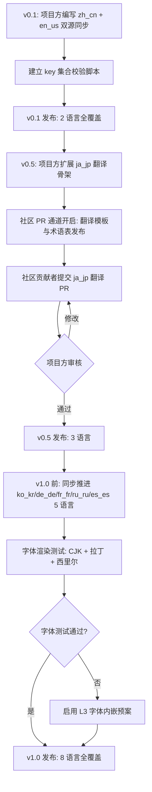

# 11 · 多语言支持策略

> **状态**：🟡 设计讨论中
> **对应模组版本**：v0.1（zh_cn + en_us 首发）→ v0.5（追加 ja_jp）→ v1.0（8 语言扩展）
> **创建日期**：2026-09-18
> **最后更新**：2026-09-18
> **设计原则**：[原则 0 · L1/L2/L3 判定](./00-planning-index.md#原则-0优先原版实在没辙才自定义且必须与原版有关) · [原则 1 · 以原版世界观为主](./00-planning-index.md#原则-1以原版世界观为主)

---

## 1. 目的

为 **Remnant / Echo** 模组建立一套覆盖全部叙事文本、物品名、advancement 文案、tellraw 提示与 Patchouli 章节内容的多语言支持体系，使同一份模组资产在不修改任何代码的前提下，能够同时服务于中文玩家、英文玩家以及后续扩展的日韩、欧洲多语社区。本策略是 [05-clue-book-system.md 第 5 节"叙事文本的本地化"](./05-clue-book-system.md#5-叙事文本的本地化) 的扩展与总成，将原本仅作为线索书附属说明的本地化机制，提升为贯穿整个模组的一等公民机制，并对所有可能出现在玩家面前的字符串进行统一管理。

本策略的**核心立场**是：**严格遵循 L1 原则**——完全使用原版 Minecraft 提供的 `lang/` JSON 体系作为唯一本地化入口，**不引入任何自定义本地化框架**，不编写"按玩家 UUID 选择语言包"之类的运行时分支，也不在物品 NBT 中硬编码任何具体语言的字符串。所有面向玩家的可见文本——无论是物品名、advancement 标题与描述、tellraw 提示、Patchouli 章节正文、合成提示，还是 Boss 击杀记忆回放文本——都必须以 `remnant.` 为前缀的 lang key 形式存在，由游戏运行时按玩家语言设置动态翻译。

之所以坚持 L1 而非自定义：原版 `lang/` JSON 是 Minecraft 1.6+ 起即稳定存在、社区文档完备、所有资源包与模组共同遵循的标准；任何自定义本地化机制要么需要重写客户端文本渲染管线，要么需要构造并行于原版的字符串表，会带来与第三方模组资源包、与原版字幕/讲台书/告示牌的兼容性问题。原版机制已经足够承载叙事模组的多语言需求，"补优先于添"原则在此处体现得尤为彻底：本地化不是新机制，只是对原版机制的系统化应用。

---

## 2. 方案对比

在确定本模组的多语言实现路径前，对比了三种可能的方案。对比维度包括：对原版机制的偏离程度、社区熟悉度、是否需要 Java 代码介入、CJK 字体表现、与 Patchouli 软依赖场景的兼容性、以及未来扩展新语言时的成本。

| 方案 | 描述 | L 等级 | 是否引入自定义 | 是否采用 |
|------|------|--------|----------------|----------|
| A. **纯原版 `lang/` JSON**（推荐 ✅） | 所有可见字符串均以 lang key 形式存在，存放于 `assets/remnant/lang/<lang>.json`；Patchouli 章节按语言目录加载；缺失语言时由游戏自身 fallback 至 en_us | **L1** | 否 | ✅ 采用 |
| B. 自定义本地化框架 | 编写 Java 模组代码注册独立的 `LanguageProvider`，运行时按玩家语言选择字符串 | L3（自定义机制） | 是 | ❌ 不采用 |
| C. 在 NBT 中硬编码多语言副本 | 在 `written_book` 的 `pages` NBT 内同时存入多种语言文本，按玩家语言切换显示 | L3（自定义渲染） | 是 | ❌ 不采用 |

**方案 A 之所以被采纳**，关键原因有三：其一，原版 `lang/` JSON 是所有资源包开发者与模组开发者共同遵循的标准，社区对其路径规范、key 命名习惯、fallback 行为都已熟悉，零学习成本；其二，方案 A 完全在数据包/资源包层完成本地化，不需要任何 Java 代码，与本项目"叙事资产闭源、数据可开源"的版权策略天然契合；其三，方案 A 在 Patchouli 未安装的退化场景下仍能完整工作——`tellraw` 直接读取 lang key，行为与原版一致。

方案 B 与方案 C 的核心缺陷在于**违反 L1/L2/L3 判定流程**：在原版 `lang/` 体系已能 100% 满足需求的前提下，任何自定义机制都无法通过 L3 必要性论证（"原版无任何方式可实现"），因此不予采纳。即便方案 B 在某些细节上看似更灵活（例如可按玩家 UUID 而非客户端语言设置切换），这种灵活性对本模组的叙事场景并无价值——叙事模组的目标是"玩家用自己看得懂的语言读故事"，而非"在同一服务器内为不同玩家显示不同语言"，后者反而会破坏多人共享一本线索书时的体验一致性。

---

## 3. 多语言覆盖范围

本模组所有可能出现在玩家面前的字符串均纳入多语言管理范围，按出现载体分为以下七类。每一类对应不同的字符串 key 命名规范与不同的资源文件位置，但全部统一存放于 `assets/remnant/lang/<lang>.json` 中（Patchouli 章节正文除外，因其特殊机制见第 5 节）。下表给出七类文本的范围、示例 key 与文件归属：

| 序号 | 文本类别 | 出现场景 | 命名前缀 | 文件归属 |
|------|----------|----------|----------|----------|
| 1 | 物品名 | 残破笔记、线索书（`patchouli:guide_book`）、0 号唱片等物品在背包/快捷栏的显示 | `item.remnant.<id>` | `assets/remnant/lang/<lang>.json` |
| 2 | advancement 文本 | 线索书章节解锁 toast、Boss 击杀触发记忆回放等 advancement 的 `title` / `description` | `advancements.remnant.<path>.title` / `.description` | `assets/remnant/lang/<lang>.json` |
| 3 | tellraw 消息 | 认知锁未就绪提示、章节解锁聊天栏提示、铭文/壁画解读文本 | `remnant.message.<scene>.<id>` | `assets/remnant/lang/<lang>.json` |
| 4 | Patchouli 章节文本 | 线索书章节正文（按语言目录区分） | `remnant.lore.chapter_X.page_Y` 或章节内直接硬编码 | `data/remnant/patchouli_books/remnant/<lang>/entries/*.json` |
| 5 | lore 文本 | 残破笔记物品内文本、铭文/壁画右键解读弹出的 `tellraw` 长文 | `remnant.lore.<scene>.<id>` | `assets/remnant/lang/<lang>.json` |
| 6 | 合成提示 | 0 号唱片合成触发时的提示消息、关键合成解锁 toast | `remnant.message.craft.<id>` | `assets/remnant/lang/<lang>.json` |
| 7 | Boss 击杀记忆回放文本 | 击败末影龙/凋灵/守门人（末影龙 NBT 变体）后通过 advancement reward function 调用的 `tellraw` 多段文本 | `remnant.memory.boss_<name>.<page>` | `assets/remnant/lang/<lang>.json` |

**统一原则**：上表中第 1、2、3、5、6、7 类全部走原版 `lang/` JSON 体系；第 4 类因 Patchouli 章节文本的特殊机制（按语言目录加载，支持 `$(l:)` 标签反向引用 lang 文件），采取"按语言目录硬编码 + 选择性 `$(l:)` 引用 lang 文件"的混合策略，详见第 5 节。这样设计的根本动机是：在 Patchouli 已安装时利用其原生多语言目录机制（最自然），在 Patchouli 未安装时让退化文本仍由 `lang/` JSON 统一管理（最一致）。

---

## 4. 文件结构与命名空间

### 4.1 资源目录布局

本模组的多语言资产分布在两个目录树下：`assets/remnant/`（客户端可见资源，主要承载 lang JSON）与 `data/remnant/`（服务端/世界数据，承载 Patchouli 章节文本）。完整目录结构如下：

```
assets/remnant/
├── lang/
│   ├── en_us.json          ← 国际通用基准，fallback 源
│   ├── zh_cn.json          ← 用户母语，首发主语
│   ├── ja_jp.json          ← v0.5 引入
│   ├── ko_kr.json          ← v1.0 引入
│   ├── de_de.json          ← v1.0 引入
│   ├── fr_fr.json          ← v1.0 引入
│   ├── ru_ru.json          ← v1.0 引入
│   ├── es_es.json          ← v1.0 引入
│   ├── pt_br.json          ← v1.0 后社区扩展
│   └── it_it.json          ← v1.0 后社区扩展
├── models/
│   └── item/               ← 物品模型（与多语言无关，此处略）
└── textures/               ← 纹理（与多语言无关，此处略）

data/remnant/
└── patchouli_books/
    └── remnant/            ← Patchouli 书 ID 为 "remnant:remnant"
        ├── en_us/
        │   ├── categories.json
        │   ├── entries/
        │   │   ├── chapter_0.json
        │   │   ├── chapter_1.json
        │   │   └── ...
        │   └── templates/
        │       └── default.json
        ├── zh_cn/
        │   ├── categories.json
        │   ├── entries/...
        │   └── templates/...
        ├── ja_jp/...
        └── ...（其他语言同构）
```

**关键设计点**：所有 Patchouli 章节文本的 JSON 结构在所有语言下**完全镜像**——`zh_cn/entries/chapter_0.json` 与 `en_us/entries/chapter_0.json` 拥有相同的 `pages` 数量、相同的 `type` 字段、相同的 `advancement` 关联，仅 `text` 字段的字符串内容不同。这样设计确保不同语言版本之间页面跳转、章节解锁逻辑完全一致，不会因翻译疏漏导致某一语言的玩家读到更短的章节。

### 4.2 命名空间与冲突规避

模组统一使用 `remnant` 作为命名空间，所有 lang key 以 `remnant.` 为前缀。这一前缀选择有三个考量：其一，`remnant` 是模组代号，与原版 `minecraft.` 命名空间及常见社区模组（`patchouli.`、`jei.`、`create.` 等）均无冲突；其二，`remnant.` 前缀作为可视化标识，让翻译贡献者一眼辨认出哪些 key 属于本模组；其三，前缀足够短，避免 lang JSON 文件体积膨胀（叙事模组字符串量大，每个 key 多 5-10 字符在数千 key 累积下显著）。

下表对比本模组与原版/常见模组的命名空间使用，确认无冲突：

| 来源 | 命名空间前缀 | 是否与本模组冲突 |
|------|--------------|------------------|
| Minecraft 原版 | `minecraft.`、`item.minecraft.`、`advancements.minecraft.` | 否（前缀不同） |
| Patchouli 模组 | `item.patchouli.`、`patchouli.book.` | 否（前缀不同） |
| 本模组 Remnant | `item.remnant.`、`advancements.remnant.`、`remnant.message.`、`remnant.lore.`、`remnant.memory.` | — |

---

## 5. 字符串 key 命名规范

### 5.1 命名总则

所有 lang key 遵循 `<域>.remnant.<场景>.<标识>[.<子段>]` 的层级命名规范。其中 `<域>` 取自原版约定的几个固定域（`item`、`advancements`、`block`、`entity`、`death.attack` 等），自定义域（`remnant.message.*`、`remnant.lore.*`、`remnant.memory.*`）统一以 `remnant.` 起首以便翻译工具识别。命名规范的设计目标是：**翻译贡献者仅看 key 名即可定位字符串用途**，无需反复跳转查看上下文。

下表给出各类字符串 key 的命名规范与示例：

| 类别 | key 模板 | 示例 | 示例含义 |
|------|----------|------|----------|
| 物品名 | `item.remnant.<id>` | `item.remnant.tattered_note` | 残破笔记物品名 |
| 物品 lore 描述 | `item.remnant.<id>.desc` | `item.remnant.music_disc_0.desc` | 0 号唱片灰度提示（仿原版 `music_disc.cat.desc`） |
| advancement 标题 | `advancements.remnant.<path>.title` | `advancements.remnant.lore.chapter_0.title` | 线索书第 0 章解锁 toast 标题 |
| advancement 描述 | `advancements.remnant.<path>.description` | `advancements.remnant.lore.chapter_0.description` | 同上的副标题 |
| tellraw 通用消息 | `remnant.message.<scene>.<id>` | `remnant.message.cognitive_lock.not_ready` | 认知锁未就绪提示 |
| 铭文/壁画解读长文 | `remnant.lore.<scene>.<id>` | `remnant.lore.inscription.mossy_stone_bricks_line_3` | 苔石砖右键触发的第 3 段铭文 |
| 合成提示消息 | `remnant.message.craft.<id>` | `remnant.message.craft.disc_0.synthesized` | 0 号唱片合成完成提示 |
| Boss 记忆回放页 | `remnant.memory.boss_<name>.<page>` | `remnant.memory.boss_ender_dragon.page_2` | 击败末影龙后第 2 段记忆回放文本 |

### 5.2 命名禁忌

为避免与原版/社区翻译工具产生意外碰撞，下述命名一律禁止使用：

| 禁忌 | 原因 |
|------|------|
| 使用 `minecraft.` 前缀 | 会覆盖原版字符串，破坏游戏基础 UI |
| 使用空字符串 key（如 `remnant.`） | 易被自动化工具误判为模板，引发误删 |
| key 内出现空格或非 ASCII 字符 | 原版 `lang/` JSON 解析器对 key 字符集有要求，非 ASCII 可能不被识别 |
| 在 key 内嵌入版本号（如 `remnant.v0_1.note_1`） | 一旦版本演进会导致翻译需全量迁移，应使用语义 key 而非版本 key |
| key 大小写混用（如 `remnant.lore.Chapter_0.Page_1`） | Minecraft lang 查找对大小写敏感，社区惯例全小写 |

### 5.3 lang JSON 示例

以下是 `assets/remnant/lang/zh_cn.json` 的片段示例，覆盖物品名、advancement、tellraw、铭文、合成提示、Boss 记忆六类文本：

```json
{
  "item.remnant.tattered_note": "残破的笔记",
  "item.remnant.music_disc_0": "音乐唱片",
  "item.remnant.music_disc_0.desc": "— M.",
  "item.remnant.guide_book": "线索书",

  "advancements.remnant.lore.chapter_0.title": "线索书第 0 章已解锁",
  "advancements.remnant.lore.chapter_0.description": "残破笔记",
  "advancements.remnant.lore.chapter_final.title": "M. 的遗言",
  "advancements.remnant.lore.chapter_final.description": "合成 0 号唱片",

  "remnant.message.cognitive_lock.not_ready": "§7你尚未理解这段记忆。继续探索……",
  "remnant.message.chapter_unlocked": "§a线索书 §6%s §a已解锁，可在背包中打开线索书阅读。",
  "remnant.message.craft.disc_0.synthesized": "§d0 号唱片在合成台中发出微弱共鸣。",

  "remnant.lore.inscription.mossy_stone_bricks_line_1": "三界本是同一座花园。",
  "remnant.lore.inscription.mossy_stone_bricks_line_2": "我们打开门，他们也打开门。",
  "remnant.lore.inscription.mossy_stone_bricks_line_3": "门开后，门后没有我们，也没有他们。",

  "remnant.memory.boss_ender_dragon.page_1": "守门人在天枢塔顶看见最后一艘飞船升空。",
  "remnant.memory.boss_ender_dragon.page_2": "他没有挥手，只是把钥匙留在了石砖里。",
  "remnant.memory.boss_ender_dragon.page_3": "钥匙的形状是一只眼睛。"
}
```

对应的 `assets/remnant/lang/en_us.json` 必须包含完全相同的 key 集合（互为翻译参考），仅值不同：

```json
{
  "item.remnant.tattered_note": "Tattered Note",
  "item.remnant.music_disc_0": "Music Disc",
  "item.remnant.music_disc_0.desc": "— M.",
  "item.remnant.guide_book": "Clue Book",

  "advancements.remnant.lore.chapter_0.title": "Clue Book · Chapter 0 Unlocked",
  "advancements.remnant.lore.chapter_0.description": "Tattered Note",
  "advancements.remnant.lore.chapter_final.title": "M.'s Last Words",
  "advancements.remnant.lore.chapter_final.description": "Craft Disc 0",

  "remnant.message.cognitive_lock.not_ready": "§7You do not yet understand this memory. Keep exploring...",
  "remnant.message.chapter_unlocked": "§aClue Book §6%s §ahas been unlocked. Open it from your inventory.",
  "remnant.message.craft.disc_0.synthesized": "§dDisc 0 emits a faint resonance on the crafting table.",

  "remnant.lore.inscription.mossy_stone_bricks_line_1": "The three realms were once a single garden.",
  "remnant.lore.inscription.mossy_stone_bricks_line_2": "We opened the door, and so did they.",
  "remnant.lore.inscription.mossy_stone_bricks_line_3": "When the door opened, neither we nor they were behind it.",

  "remnant.memory.boss_ender_dragon.page_1": "The Gatekeeper watched the last ship ascend from the spire of the North Star Tower.",
  "remnant.memory.boss_ender_dragon.page_2": "He did not wave. He only left the key in the stone bricks.",
  "remnant.memory.boss_ender_dragon.page_3": "The key was shaped like an eye."
}
```

**双源同步**：项目方编写 zh_cn 与 en_us 时采取"互为参考、双源同步"的策略——任一语言先成稿，另一语言对照翻译，发现新增 key 必须同时同步到两个文件。这一策略在第 7 节"翻译流程"中进一步规范。

---

## 6. Patchouli 多语言策略

### 6.1 Patchouli 原生多语言机制

Patchouli 模组原生支持按语言目录加载章节文本：在 `data/<namespace>/patchouli_books/<book_id>/<lang>/` 下的 `entries/*.json`、`categories.json`、`templates/*.json` 会被客户端按当前语言设置加载。当玩家客户端语言为 `zh_cn` 时，Patchouli 优先加载 `zh_cn/` 目录；当对应语言目录不存在时，Patchouli 会回退到 `en_us/`（这是 Patchouli 内置的 fallback 行为，与原版 `lang/` JSON 的回退语义一致）。这一原生机制完全满足本模组的多语言需求，**无需任何自定义代码介入**。

### 6.2 章节文本的两种写法

Patchouli 章节内的 `text` 字段可采用两种写法：

| 写法 | 描述 | 优点 | 缺点 | 本模组采用场景 |
|------|------|------|------|------------------|
| A. **按语言目录硬编码** | `zh_cn/entries/chapter_0.json` 与 `en_us/entries/chapter_0.json` 各自直接写入对应语言文本 | 翻译者可整段通读上下文，文学性强 | 长文本跨语言同步成本高 | 章节正文、长段叙事 |
| B. **`$(l:lang_key)` 引用 lang JSON** | 章节内 `text` 字段写 `"$(l:remnant.lore.chapter_0.page_1)"`，由 Patchouli 在渲染时反向查找 lang 文件 | 与 `lang/` JSON 统一管理，可被其他场景复用 | 翻译者需在两处文件间跳转，文学连贯性差 | 章节标题、图标提示、跨场景复用文本 |

**本模组的混合策略**：章节正文（page 正文）采用写法 A，按语言目录硬编码，让翻译者保留文学再创作的自由度——同一句"寻找那座塔"在中文语境下可能需要更隐晦的修辞，英文则更直接，硬编码允许翻译者按目标语言文学习惯重写。章节标题、`name` 字段、图标 tooltip 等短文本采用写法 B，通过 `$(l:)` 引用 lang JSON，便于与 advancement、tellraw 共用同一 key。

### 6.3 Patchouli 章节文本示例

以下是 `data/remnant/patchouli_books/remnant/zh_cn/entries/chapter_0.json` 的示例（采用写法 A 硬编码正文 + 写法 B 引用标题）：

```json
{
  "name": "$(l:advancements.remnant.lore.chapter_0.title)",
  "icon": "minecraft:writable_book",
  "category": "remnant:lore",
  "advancement": "remnant:lore/chapter_0",
  "pages": [
    {
      "type": "text",
      "text": "寻找那座塔。它会告诉你我们是谁。$(br2)不要相信猪灵。也不要相信我们。$(br2)—— M."
    },
    {
      "type": "text",
      "text": "笔记的纸张泛黄，墨迹模糊。$(br)字迹似乎在颤抖——是写的人害怕，还是阅读的人？$(br2)最后一行有一个符号，像是字母 M。"
    }
  ]
}
```

对应的 `data/remnant/patchouli_books/remnant/en_us/entries/chapter_0.json`：

```json
{
  "name": "$(l:advancements.remnant.lore.chapter_0.title)",
  "icon": "minecraft:writable_book",
  "category": "remnant:lore",
  "advancement": "remnant:lore/chapter_0",
  "pages": [
    {
      "type": "text",
      "text": "Seek the tower. It will tell you who we are.$(br2)Do not trust the piglins. Do not trust us either.$(br2)— M."
    },
    {
      "type": "text",
      "text": "The pages are yellowed, the ink faded.$(br)The handwriting seems to tremble—was the writer afraid, or the reader?$(br2)The last line bears a symbol, resembling the letter M."
    }
  ]
}
```

注意两份 JSON 的 `pages` 数组长度、`type` 字段、`advancement` 关联完全一致，仅 `text` 字符串不同——这是镜像结构原则的具体体现。`name` 字段通过 `$(l:)` 引用 lang JSON，因此两个文件的 `name` 字段值完全相同，翻译贡献者只需在 `lang/<lang>.json` 内维护一次。

---

## 7. 退化方案：Patchouli 未安装时的本地化一致性

### 7.1 退化场景设计

当玩家未安装 Patchouli 时，模组不能完全失效——叙事文本仍须以某种形式呈现给玩家。退化方案设计如下：所有 Patchouli 章节的解锁触发器（即原版 `advancement`）在解锁时，由其 `rewards.function` 调用一个 `tellraw`，把章节正文以聊天栏长消息形式逐页显示。这些 `tellraw` 文本全部来自 `assets/remnant/lang/<lang>.json`，**与 Patchouli 已安装场景共用同一份本地化资产**，确保两种场景下玩家看到的文本完全一致（仅排版形式不同：Patchouli 是翻页式 GUI，退化方案是聊天栏滚动）。

### 7.2 退化调用链示例

以第 0 章解锁为例，advancement 配置在 `data/remnant/advancements/lore/chapter_0.json`：

```json
{
  "display": {
    "icon": { "item": "minecraft:writable_book" },
    "title": "线索书第 0 章已解锁",
    "description": "残破笔记",
    "show_toast": true,
    "announce_to_chat": false,
    "hidden": false
  },
  "criteria": {
    "find_first_note": {
      "trigger": "minecraft:inventory_changed",
      "conditions": {
        "items": [
          {
            "items": ["minecraft:written_book"],
            "nbt": "{display:{Name:\"{\\\"text\\\":\\\"item.remnant.tattered_note\\\",\\\"translate\\\":\\\"item.remnant.tattered_note\\\"}\"}}"
          }
        ]
      }
    }
  },
  "rewards": {
    "function": "remnant:lore/unlock_chapter_0"
  }
}
```

退化 function `data/remnant/functions/lore/unlock_chapter_0.mcfunction`：

```mcfunction
# 退化方案：未安装 Patchouli 时通过 tellraw 显示章节正文
# 章节正文以 lang key 引用，由客户端按语言设置翻译
tellraw @s [{"translate":"remnant.message.chapter_unlocked","with":[{"translate":"advancements.remnant.lore.chapter_0.title"}]}]
tellraw @s {"translate":"remnant.lore.chapter_0.page_1","color":"gray"}
tellraw @s {"translate":"remnant.lore.chapter_0.page_2","color":"gray"}
```

**关键设计**：上述 `tellraw` 中所有文本均使用 `"translate": "<lang_key>"` 形式，**不硬编码任何具体语言字符串**。这意味着无论玩家客户端设置为 zh_cn、en_us 还是后续扩展的 ja_jp 等，聊天栏显示的都是玩家自身语言的文本，与原版字幕、告示牌、物品名的语言切换行为完全一致。

### 7.3 退化方案与正常方案的字符串复用关系

退化方案之所以能复用 `lang/` JSON 中的 key，前提是**所有 Patchouli 章节正文同时也在 `lang/` JSON 中以 `remnant.lore.chapter_X.page_Y` 形式存在一份镜像**。这看似违背第 6.2 节"章节正文采用写法 A 硬编码"的决策，实则是补充：章节正文在两处各有一份——Patchouli 章节 JSON 内的硬编码（用于 Patchouli 已安装场景的文学化排版）与 `lang/` JSON 内的 key 镜像（用于退化场景的 `tellraw` 调用）。两者文本内容**完全相同**，由自动化脚本（见第 9 节）检测同步。

---

## 8. 翻译流程与质量保证

### 8.1 双源同步原则

zh_cn 与 en_us 由项目方亲自编写，**互为翻译参考、互为校对源**。这一原则基于以下考量：项目方对叙事基调、术语体系（如"先民"、"三界同源"、"认知锁"等专有名词）有最完整的把握，由项目方亲自编写两版主语可避免社区翻译者因不理解设定而产生的术语漂移；同时，两版主语互为校对可显著降低漏译、错译率——若 zh_cn 中某 key 的值在 en_us 中找不到对应翻译，必然存在疏漏。

**不允许机器翻译作为最终交付**：机器翻译对叙事文学文本的处理能力极弱，会破坏"碎片化叙事"的悬疑感与文学性。社区贡献者可使用机器翻译作为草稿起点，但提交 PR 时必须有人工润色痕迹，PR 描述需说明翻译思路（如"将'三界本是同一座花园'译为'The three realms were once a single garden'，保留园艺隐喻"）。

### 8.2 社区贡献流程

社区贡献者提交新语言翻译的流程：

```
1. 贡献者 fork 仓库，创建分支 i18n/<lang>
        ↓
2. 复制 assets/remnant/lang/en_us.json 为 <lang>.json，翻译所有 value
        ↓
3. 复制 data/remnant/patchouli_books/remnant/en_us/ 为 <lang>/，翻译所有 entries
        ↓
4. 本地启动 Minecraft，切换客户端语言为 <lang>，全流程测试
        ↓
5. 提交 GitHub PR，PR 模板要求：
   ├─ 翻译思路简述
   ├─ 关键术语对应表（如 "先民" → "the ancients" / "先人たち"）
   └─ 自测截图（至少 3 张：物品名、advancement、Patchouli 章节）
        ↓
6. 项目方审核：
   ├─ 检查 key 集合是否与 en_us.json 完全一致
   ├─ 检查 Patchouli 章节结构是否镜像
   ├─ 检查术语一致性
   └─ 检查 CJK 字体渲染（如适用）
        ↓
7. 合并 PR，新语言在下一版本生效
```

### 8.3 key 集合一致性自动化校验

为防止翻译滞后导致部分语言缺失新增 key，本模组在 GitHub Actions 中加入自动化校验任务（与 [04-auto-sync-strategy.md](./04-auto-sync-strategy.md) 的 GitHub Action 体系集成），每周对比各语言文件 key 集合差异。校验脚本逻辑：

```python
# scripts/check_lang_keys.py（伪代码）
import json
from pathlib import Path

LANG_DIR = Path("assets/remnant/lang")
BASELINE = "en_us"

def load_keys(lang):
    return set(json.loads((LANG_DIR / f"{lang}.json").read_text(encoding="utf-8")).keys())

def main():
    baseline_keys = load_keys(BASELINE)
    missing_report = {}
    for lang_file in LANG_DIR.glob("*.json"):
        lang = lang_file.stem
        if lang == BASELINE:
            continue
        lang_keys = load_keys(lang)
        missing = baseline_keys - lang_keys
        extra = lang_keys - baseline_keys
        if missing or extra:
            missing_report[lang] = {"missing": missing, "extra": extra}
    if missing_report:
        # 创建 GitHub Issue 提示翻译滞后
        ...
```

**输出形式**：脚本检测到任一语言缺失 key 时，自动创建 GitHub Issue 标题如"i18n: ja_jp 缺失 12 个新增 key（v0.5 翻译滞后）"，Issue body 列出全部缺失 key 与 en_us 中的对应值供翻译者参考。

---

## 9. 实施路线图（v0.1 / v0.5 / v1.0）

### 9.1 多语言交付里程碑

下表给出各版本的多语言交付目标与对应文档/代码任务：

| 模组版本 | 交付语言 | 主要任务 | 验收标准 |
|----------|----------|----------|----------|
| v0.1（概念验证） | zh_cn + en_us | 建立 `assets/remnant/lang/` 与 `data/remnant/patchouli_books/remnant/<lang>/` 目录骨架；完成第 0 章双语言翻译；建立 key 集合校验脚本 | 客户端切换 zh_cn / en_us 均能正确显示所有 v0.1 文本；无 key 缺失 |
| v0.5（公开测试） | zh_cn + en_us + ja_jp | 完成全部 11 章的 zh_cn + en_us 翻译；引入 ja_jp 作为首个社区扩展语言；建立 PR 翻译模板 | 8 语言中至少 3 语言 100% key 覆盖；ja_jp PR 通过项目方审核 |
| v1.0（正式发布） | zh_cn + en_us + ja_jp + ko_kr + de_de + fr_fr + ru_ru + es_es | 8 种语言全部 100% key 覆盖；CJK 字体渲染测试通过；tellraw 在所有语言下宽度可读 | 8 语言切换无残缺；CJK 字符在聊天栏与 Patchouli 内均正常显示 |

### 9.2 v0.1 → v0.5 → v1.0 的多语言工作流



上图展示三个版本阶段的多语言推进路径。其中 v0.5 → v1.0 阶段有一处**条件分支**：若字体测试未通过（CJK/西里尔字符在某些 Patchouli 版本中渲染异常），则启用 L3 字体内嵌预案——在资源包内嵌 Noto Sans SC + Noto Sans JP + Noto Sans KR + Noto Sans CJK 等 SIL OFL 协议字体，作为原版 Unicode 字体的补丁。该预案属 L3 自定义（详见第 10 节"字体兼容性"），仅在原版字体无法满足时启用，符合"实在没辙才自定义"原则。

---

## 10. 字体兼容性

### 10.1 原版字体的现状

原版 Minecraft 自 1.13 起内置 Unicode 字体（默认字体 `alt`），1.20+ 起进一步改善了 CJK 字符的默认渲染。绝大多数 CJK 字符在物品名、advancement toast、聊天栏 `tellraw`、告示牌等场景下均能正确显示，无需额外处理。这是本模组坚持 L1（用原版 `lang/` JSON + 原版字体）的物理基础。

### 10.2 Patchouli 渲染的潜在问题

Patchouli 在某些 Minecraft 版本（特别是 1.18 ~ 1.20 早期版本）中，因其在 `gui` 层自行调用 `FontRenderer` 渲染章节文本，绕过了部分原版 Unicode 字体回退逻辑，导致 CJK 字符在某些 Patchouli 版本中显示为方框或缺失。这一问题在 v1.0 前需通过实测验证，若存在则启用 L3 字体内嵌预案。

### 10.3 L3 字体内嵌预案（仅在必要时启用）

字体内嵌属 L3 自定义，必须通过 L1/L2/L3 判定流程论证：

| 判定维度 | 论证 |
|----------|------|
| L1 可行性 | ❌ 不可行：原版字体无法覆盖所有 CJK/西里尔字符在 Patchouli 内的渲染 |
| L2 可行性 | ❌ 不可行：原版字体组合（`default` + `alt`）无法补足 Patchouli 渲染路径缺失 |
| L3 必要性 | ✅ 仅在实测证明原版字体在 Patchouli 内渲染缺失时启用 |
| L3 关联性（视觉） | ✅ 内嵌字体基于原版 `default` 字体风格选择无衬线字体，字号/字距对齐原版 |
| L3 关联性（退化） | ✅ 失去字体内嵌后，Patchouli 仍能加载章节（仅 CJK 字符渲染异常），退化方案仍可用 |

若启用 L3 字体内嵌，资源包结构：

```
assets/remnant/font/
├── default.json               ← 覆盖原版 default 字体（仅追加缺失字符映射）
└── ...
assets/remnant/textures/font/
├── noto_sans_sc.png           ← Noto Sans SC 字体图集
├── noto_sans_jp.png
└── ...
```

**该 L3 预案不立即实施**，仅作为风险缓解的 fallback 方案，待 v0.5 阶段实测字体表现后再决定是否启用。

### 10.4 tellraw 中 CJK 文本宽度

CJK 字符在原版 Unicode 字体下的渲染宽度约为拉丁字符的 2 倍，这导致同一段 tellraw 在 zh_cn 与 en_us 下的总像素宽度差异显著。本模组在设计 tellraw 格式化时遵循以下规则：

| 规则 | 描述 | 示例 |
|------|------|------|
| 1. 避免长行 | 单条 `tellraw` 不超过 40 个 CJK 字符或 80 个拉丁字符 | 铭文按行 key 切分（`_line_1`、`_line_2`、`_line_3`），不合并 |
| 2. 不依赖换行 | 不假设客户端自动换行，主动用 `\\n` 在 lang JSON 内分段 | `"remnant.lore.inscription.mossy_stone_bricks_line_1": "三界本是同一座花园。\\n—— 铭文第一行"` |
| 3. 居中技巧 | CJK 长文本居中显示时使用前导空格补齐，与拉丁版本对齐 | `"§7    寻找那座塔。"`（4 个空格前导） |
| 4. 颜色码一致性 | `§` 颜色码在所有语言版本中保持一致 | `§7`（灰色）在 zh_cn / en_us / ja_jp 中含义一致 |

---

## 11. 风险与讨论点

### 11.1 风险

1. **CJK 字体在 Patchouli 中的渲染**
   - **影响范围**：zh_cn / ja_jp / ko_kr 玩家在 Patchouli 章节内可能看到方框
   - **缓解 v0.1**：仅交付 zh_cn + en_us，先观察原版字体在 v0.1 阶段的表现
   - **缓解 v0.5**：引入 ja_jp 时同步实测；如缺失则启用 L3 字体内嵌预案（见第 10.3 节）
   - **缓解 v1.0**：8 语言全覆盖前完成字体回归测试

2. **lang key 与原版冲突**
   - **影响范围**：若误用 `minecraft.` 前缀会覆盖原版字符串
   - **缓解**：严格 `remnant.` 前缀；自动化脚本扫描 lang JSON 内是否存在 `minecraft.` 开头的 key，发现即报错

3. **翻译质量保证**
   - **影响范围**：社区翻译者水平参差，可能产生术语漂移、文学性降低
   - **缓解**：zh_cn + en_us 由项目方双源同步作为术语基准；社区 PR 须附术语对应表与翻译思路说明；不接受机器翻译作为最终交付；项目方人工审核

4. **字符串更新滞后**
   - **影响范围**：v0.5 引入新章节时，新 key 在 ja_jp / ko_kr 等语言中可能滞后数周才补全
   - **缓解**：每周 GitHub Actions 自动校验 key 集合差异，自动 Issue 提示；缺失 key 的语言在该语言客户端下 fallback 至 en_us（原版 `lang/` JSON 行为），不致功能损坏

5. **tellraw 中 CJK 文本宽度溢出**
   - **影响范围**：长 tellraw 在 zh_cn 下超出聊天栏宽度，被截断或自动换行错乱
   - **缓解**：按第 10.4 节规则主动分段；测试时检查 zh_cn 全部 tellraw 在 1080p 默认聊天栏宽度下表现

6. **Patchouli 章节结构镜像破坏**
   - **影响范围**：社区翻译者修改了 `pages` 数组长度或 `type` 字段，导致不同语言版本行为不一致
   - **缓解**：自动化脚本对比各语言 Patchouli 章节文件的 `pages.length`、`type` 字段；不一致则 PR 拒绝

7. **退化方案与正常方案文本不一致**
   - **影响范围**：`lang/` JSON 中的 `remnant.lore.chapter_X.page_Y` 镜像与 Patchouli 章节内硬编码文本不同步
   - **缓解**：自动化脚本提取 Patchouli 章节 `text` 字段，与 `lang/` JSON 中对应 key 比对；不一致则报警

### 11.2 待讨论的设计问题

- [ ] 是否在 v0.1 即引入 ja_jp？倾向：否，v0.1 仅交付 zh_cn + en_us，避免概念验证阶段翻译负担；ja_jp 在 v0.5 引入
- [ ] Patchouli 章节正文是否完全改用 `$(l:)` 引用 lang JSON，放弃硬编码？倾向：否，保留文学化翻译自由度；但需脚本维护两处同步
- [ ] 退化方案是否在玩家安装 Patchouli 时也作为兜底（如玩家想关掉 GUI 阅读）？倾向：否，避免冗余 tellraw 干扰；仅在 Patchouli 未安装时启用
- [ ] 是否提供繁体中文（zh_tw）？倾向：是，但作为社区扩展语言，v1.0 后开放 PR 通道
- [ ] 8 语言之外的小语种（如越南语 vi_vn、泰语 th_th）是否接受 PR？倾向：是，但需社区维护承诺，PR 模板要求贡献者声明长期维护意愿
- [ ] L3 字体内嵌预案是否在 v0.5 即启用作为预防？倾向：否，先观察 v0.1 原版字体表现，避免过早自定义

---

## 12. 修订历史

| 日期 | 版本 | 修订内容 | 修订者 |
|------|------|----------|--------|
| 2026-09-18 | v0.1 | 初稿，确立 L1 多语言策略（原版 `lang/` JSON + Patchouli 原生语言目录），整合并扩展 [05-clue-book-system.md 第 5 节](./05-clue-book-system.md#5-叙事文本的本地化)；定义七类文本范围、命名规范、双源同步翻译流程、v0.1/v0.5/v1.0 三阶段路线图 | 项目方 |
