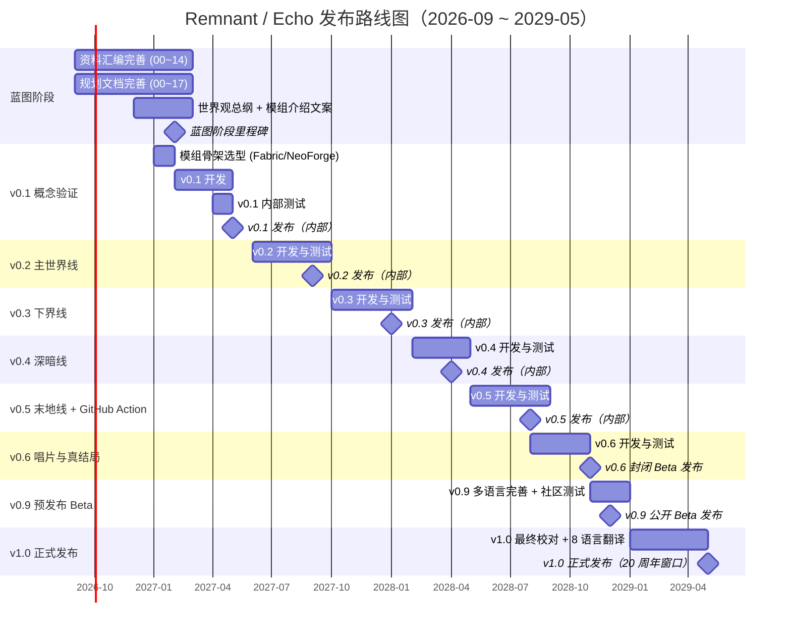

# 12 · 发布路线图

> **状态**：🟡 设计中
> **对应模组版本**：v0.1 ~ v1.0
> **创建日期**：2026-09-18
> **最后更新**：2026-09-18
> **设计原则**：[原则 0 · L1/L2/L3 判定](./00-planning-index.md#原则-0优先原版实在没辙才自定义且必须与原版有关)

---

## 1. 目的

本文档为 **Remnant / Echo** 模组提供从蓝图阶段到正式发布的全周期路线图，明确每个版本（v0.1 ~ v1.0）的交付物、测试范围、发布渠道与回滚策略，作为开发节奏与社区沟通的统一依据。它把 [`03-player-journey-map.md`](./03-player-journey-map.md) 第 8 节给出的"版本与玩家阶段对应表"展开为可执行的里程碑计划，把 [`02-story-timeline-plan.md`](./02-story-timeline-plan.md) 的六大纪元映射到具体版本的叙事开发任务，并把 [`04-auto-sync-strategy.md`](./04-auto-sync-strategy.md) 的 GitHub Action 落地时点纳入版本节奏中。

路线图的最高原则与全部规划文档一致——**优先原版、实在没辙才自定义、自定义必须与原版有强关联**。任何版本在引入新的 L3 自定义前，必须先完成 [`00-planning-index.md`](./00-planning-index.md) 的判定流程并登记到 [`10-custom-items-registry.md`](./10-custom-items-registry.md)。文档内不包含任何代码逻辑实现，只提供规划层面的决策、对照分析表与配置示例，目的是让项目方与未来加入的协作者对"什么时候该做什么"形成共识。文档随开发进度持续更新，重大里程碑达成或日期调整时在末尾修订历史中追加记录。

---

## 2. 总览

### 2.1 里程碑总表

下表给出从 v0.1 到 v1.0 共 8 个里程碑版本的关键日期、玩家阶段（引用 03）、主要交付与当前状态。所有日期均以"项目方内部节奏"为准，公开承诺仅在 v0.9 / v1.0 两个节点对外发出，其余版本仅对邀请测试者开放。

| 版本 | 阶段名 | 计划日期 | 玩家阶段（见 03） | 主要交付 | 状态 |
|------|--------|----------|------------------|----------|------|
| v0.1 | 概念验证 | 2027 Q1 | 阶段 1 | 线索书框架 + 村庄 loot 扩展 + 残破笔记 | 🟡 设计中 |
| v0.2 | 主世界线 | 2027 Q3 | 阶段 2 | 沙漠神殿 / 丛林神庙 / 地牢 / 废弃矿井笔记 | ⬜ 未开始 |
| v0.3 | 下界线 | 2028 Q1 | 阶段 3-4 | 下界堡垒壁画 / 猪灵交互 / 干涸恶魂 | ⬜ 未开始 |
| v0.4 | 深暗线 | 2028 Q2 | 阶段 5-6 | 远古城市幽匿叙事 / 苍白花园嘎枝叙事 | ⬜ 未开始 |
| v0.5 | 末地线 + GitHub Action | 2028 Q3 | 阶段 7-8 | 传送门认知锁 / 末地城笔记 / 末影龙战后叙事 / 自动同步 Action | ⬜ 未开始 |
| v0.6 | 唱片与真结局 | 2028 Q4 | 阶段 9-10 | 全部唱片解读 / 0 号唱片合成 / 远古日记 | ⬜ 未开始 |
| v0.9 | 预发布 Beta | 2028-12 | 全部 | 完整主线 Beta + 多语言（zh_cn + en_us + ja_jp）+ 社区测试 | ⬜ 未开始 |
| v1.0 | 正式发布 | 2029-05 | 全部 | Minecraft 20 周年窗口 + 完整 8 语言 + CurseForge / Modrinth 发布 | ⬜ 未开始 |

### 2.2 全期 Gantt 图



Gantt 图采用「6 个月蓝图阶段 + 22 个月分版本开发 + 5 个月预发布到正式发布」的节奏。每个开发版本预留约 3–4 个月，最后一个月用于内部测试与文档校对。v0.5 与 v0.6 之间略有重叠，原因是 v0.5 末地线开发完成时 v0.6 唱片线的素材可并行启动。v0.9 与 v1.0 之间的 5 个月专门留给多语言翻译与社区反馈消化，不安排新叙事内容。

### 2.3 与玩家体验路径 / 故事时间线的对应

下表把版本号、玩家阶段（03）、故事纪元（02）三者并列展示，方便核对叙事时序与开发节奏的一致性。每个开发版本只承担一或两个纪元的叙事内容，避免单版本信息密度过高导致碎片化叙事失效。

| 版本 | 玩家阶段（03） | 故事纪元（02） | 主要叙事开发任务 |
|------|----------------|----------------|------------------|
| v0.1 | 阶段 1 · 种子埋下 | 现代纪元 · 引子 | 残破笔记内容、线索书第 0 章框架 |
| v0.2 | 阶段 2 · 主世界考古 | 鼎盛纪元（主世界部分） | 沙漠神殿、丛林神庙、地牢、废弃矿井的笔记与线索书第 1~4 章 |
| v0.3 | 阶段 3-4 · 下界初探 + 下界深处 | 凋灵之灾 + 大分裂早期 | 下界要塞壁画、猪灵堡垒叙事、干涸恶魂线索、线索书第 5~6 章 |
| v0.4 | 阶段 5-6 · 远古城市 + 苍白花园 | 幽匿之厄 + 苍白之悔 | 远古城市幽匿叙事、苍白花园嘎枝叙事、线索书第 7~8 章 |
| v0.5 | 阶段 7-8 · 进入末地 + 末地城 | 大分裂末期 | 认知锁、末影龙战后记忆回放、末地城笔记、线索书第 9~10 章 + GitHub Action |
| v0.6 | 阶段 9-10 · 末影人记忆 + 真结局 | 全纪元收束 | 全部唱片解读、0 号唱片合成、远古日记、先民领袖遗言、线索书终章 |
| v0.9 | 全部 | 全部 | 多语言 + 平衡性修订 + 社区反馈整合 |
| v1.0 | 全部 | 全部 | 最终校对 + 8 语言发布 |

---

## 3. 蓝图阶段工作清单（当前阶段）

当前处于 2026-09 蓝图阶段，预计延续至 2027 Q1 末（约 6 个月）。蓝图阶段不开发任何模组代码，全部精力用于把仓库从"原文资料汇编"打磨为"可指导开发的完整设计文档集"。蓝图阶段产出的所有文档都将作为后续开发的"信源"——任何代码实现与文档冲突时，以文档为准；任何文档调整必须先回到本阶段产出物上讨论。

### 3.1 资料汇编完善

资料汇编目录 `00-overview/` ~ `14-official-derivatives/` 共 15 个章节是整个叙事的原版依据，蓝图阶段需要全部达到"原文不可改写 + 来源链接完整 + 章节归档正确"的状态。具体工作如下：

| 章节目录 | 当前状态 | 蓝图阶段任务 |
|----------|----------|--------------|
| `00-overview/` | 初版完成 | 补齐 End Poem 公共领域说明、音乐总览章节 |
| `01-pale-garden/` | 初版完成 | 校对 minecraft.net 文章全文、补 wiki 条目 |
| `02-happy-ghast/` | 初版完成 | 补齐 1.21.11+ 官方公告与 wiki 漏抓取条目 |
| `03-ancient-city-warden/` | 初版完成 | 校对监守者 Meet the Mob 系列全文 |
| `04-trial-chambers/` | 初版完成 | 校对试炼密室官方公告与 wiki 全文 |
| `05-villager-family/` | 初版完成 | 补流浪商人、傻子村民、铁傀儡条目 |
| `06-piglin-family/` | 初版完成 | 补猪灵堡垒与僵尸猪灵退化机制条目 |
| `07-ender-family/` | 初版完成 | 补末地城、紫珀砖、鞘翅来源条目 |
| `08-illagers/` | 初版完成 | 补恼鬼、劫掠兽、林地府邸条目 |
| `09-wither-and-nether-fortress/` | 初版完成 | 补凋灵召唤机制与凋零玫瑰条目 |
| `10-other-hostile-mobs/` | 初版完成 | 补骷髅、流髑、尸壳条目 |
| `11-overworld-structures/` | 初版完成 | 补要塞、废弃矿井、沙漠神殿、丛林神庙、可疑沙、考古刷条目 |
| `12-key-items/` | 初版完成 | 补下界合金、附魔台、紫颂果条目 |
| `13-music-discs/` | 初版完成 | 补 22 张原版唱片的完整 wiki 条目 |
| `14-official-derivatives/` | 初版完成 | 校对 Minecraft Legends、Dungeons 叙事设定 |

### 3.2 规划文档完善

`planning/00-planning-index.md` ~ `planning/17-mod-introduction-copy.md` 共 18 份规划文档是开发阶段的"信源"。蓝图阶段结束时全部必须达到至少 v0.2 状态（设计基本定稿、L1/L2/L3 判定完成）。下表列出蓝图阶段需要补齐或定稿的规划文档：

| 编号 | 文档 | 蓝图阶段目标状态 |
|------|------|------------------|
| 00 | `00-planning-index.md` | 🟢 v0.3 已定稿 |
| 01 | `01-spawn-point-design.md` | 🟢 定稿至 v0.3 |
| 02 | `02-story-timeline-plan.md` | 🟢 定稿至 v0.3 |
| 03 | `03-player-journey-map.md` | 🟢 定稿至 v0.3 |
| 04 | `04-auto-sync-strategy.md` | 🟢 v0.1，需补 v0.2 节奏细节 |
| 05 | `05-clue-book-system.md` | 🟢 v0.1，需补 Patchouli 章节模板 |
| 06 | `06-cognitive-lock-mechanism.md` | 🟢 v0.1，需补判定 function 模板 |
| 07 | `07-boss-narrative-binding.md` | 🟡 需补 Boss 击杀记忆回放模板 |
| 08 | `08-music-disc-unlock-order.md` | 🟡 需补 22 张唱片完整对应表 |
| 09 | `09-village-loot-extension.md` | 🟡 需补 5 个 loot 表完整 JSON |
| 10 | `10-custom-items-registry.md` | 🟢 v0.1，需补每项 L3 的退化测试用例 |
| 11 | `11-localization-strategy.md` | ⬜ 计划新建（多语言策略） |
| 12 | `12-release-roadmap.md` | 🟢 本文 |
| 13 | `13-save-compatibility.md` | ⬜ 计划新建（存档兼容性策略） |
| 14 | `14-internal-test-plan.md` | ⬜ 计划新建（内部测试与回归用例） |
| 15 | `15-community-feedback-loop.md` | ⬜ 计划新建（社区反馈处理流程） |
| 16 | `16-worldview-overview.md` | ⬜ 计划新建（世界观总纲，对 02 的高度浓缩） |
| 17 | `17-mod-introduction-copy.md` | ⬜ 计划新建（模组对外宣传文案） |

### 3.3 蓝图阶段退出条件

蓝图阶段退出需同时满足下列所有条件，否则 v0.1 不启动开发。退出条件的核心目的是确保开发期不再回头讨论设计层面的问题——任何设计变更都应在蓝图阶段完成，开发期发现的设计冲突按"先实现、后文档、回补修订"的方式处理。

- [ ] `00-overview/` ~ `14-official-derivatives/` 全部章节完成校对，`99-source-index.md` URL 列表无断链
- [ ] `planning/00` ~ `planning/17` 全部文档达到 v0.2 以上状态
- [ ] `16-worldview-overview.md` 完成叙事总纲，作为所有开发者必读信源
- [ ] `17-mod-introduction-copy.md` 完成对外宣传文案（中英日三语）
- [ ] 蓝图阶段中期评审通过（预计 2027-01），项目方确认可进入 v0.1 开发

---

## 4. 开发前置依赖与模组骨架选型

v0.1 启动前需要先完成两项前置工作：**模组加载器选型**与**代码骨架搭建**。这两项工作预计占用 2027-01 整月，可与蓝图阶段收尾并行。

### 4.1 加载器选型

加载器选型直接决定后续所有版本的依赖管理与发布渠道。当前主流候选为 Fabric 与 NeoForge，二者各有取舍。Fabric 启动快、依赖小、社区活跃，但 API 覆盖面较窄；NeoForge（Forge 的官方延续分支）API 丰富、生态成熟，但启动慢、依赖臃肿。对叙事模组而言，二者均能满足需求，差异主要在生态与维护成本。

| 维度 | Fabric | NeoForge | 推荐 |
|------|--------|----------|------|
| 启动速度 | ★★★★★ | ★★★☆☆ | Fabric |
| API 覆盖 | ★★★☆☆ | ★★★★★ | NeoForge |
| Patchouli 兼容 | ✅ 支持 | ✅ 支持 | 平手 |
| CurseForge / Modrinth 双发布 | ✅ 支持 | ✅ 支持 | 平手 |
| 社区活跃度 | ★★★★★ | ★★★★☆ | Fabric 略胜 |
| 维护成本 | ★★★★☆ | ★★★☆☆ | Fabric 略胜 |

**推荐：Fabric 为主**。理由：叙事模组对底层 API 覆盖要求不高，Patchouli 在两端均完整支持，Fabric 的启动速度优势对开发期反复调试更友好。NeoForge 作为可选编译目标在 v0.9 阶段再评估。

### 4.2 代码骨架

v0.1 启动前搭建的代码骨架不实现任何叙事功能，只搭出目录结构与构建脚本。骨架包含：`build.gradle`、`src/main/java/.../RemnantEcho.java`（主类）、`src/main/resources/assets/remnant/`（资源根）、`src/main/resources/data/remnant/`（数据根）、`.github/workflows/`（CI 占位）、`README.md`（指向仓库根 README）。骨架搭好后立即跑通"创建空模组、加载进游戏、退出无报错"的最小回归用例，作为后续每次提交的 CI 校验项。

### 4.3 与原版 1.21.11+ 的对齐

v0.1 起即对齐 Minecraft 1.21.11+，**不向下兼容 1.20 / 1.21.0~1.21.10**。理由是叙事核心包含"快乐恶魂"、"苍白花园"、"试炼密室"等 1.21.11+ 才稳定存在的原版内容，向下兼容会牺牲叙事完整度。后续 Minecraft 版本升级时，模组跟随升级，旧版本停止维护（详见第 7 节）。

---

## 5. v0.1 详细里程碑（概念验证）

### 5.1 玩家阶段

引用 [`03-player-journey-map.md`](./03-player-journey-map.md) 第 3 节阶段 1「种子埋下」。v0.1 只承担"出生 → 发现村庄考古棚 → 获得残破笔记 → 线索书第 0 章解锁"这一段玩家体验，目的是验证叙事种子能在玩家自然探索过程中埋下，不验证任何后续阶段。这是整个模组叙事的"零号节点"，验证失败则后续所有版本无从谈起。

### 5.2 主要交付物清单

| 交付物 | 来源文档 | L 等级 | 备注 |
|--------|----------|--------|------|
| 5 个原版 loot 表追加残破笔记条目 | [`09-village-loot-extension.md`](./09-village-loot-extension.md) | L1 | 村庄图书馆、沙漠神殿、丛林神庙、废弃矿井、地牢 |
| 残破笔记物品 | [`10-custom-items-registry.md`](./10-custom-items-registry.md) §2.1 | L3 | `written_book` + `CustomModelData` |
| Patchouli 软依赖 + 线索书物品 | [`05-clue-book-system.md`](./05-clue-book-system.md) | L3 | `patchouli:guide_book` 指向 `remnant:remnant` |
| 第 0 章 Patchouli JSON | [`05-clue-book-system.md`](./05-clue-book-system.md) §3.3 | L1 | 章节内容来自原文 |
| 第 0 章 advancement 触发器 | [`05-clue-book-system.md`](./05-clue-book-system.md) §3.2 | L1 | `minecraft:inventory_changed` |
| 残破笔记 zh_cn lang | [`05-clue-book-system.md`](./05-clue-book-system.md) §5 | L1 | 仅中文，en_us 留至 v0.6 |
| 模组骨架（Fabric） | 第 4 节 | — | build.gradle + 资源/数据目录 |

### 5.3 L1 / L2 / L3 自定义清单

v0.1 上线的 L3 自定义共 **2 项**：残破笔记（`remnant:tattered_note`）、Patchouli 线索书（`patchouli:guide_book`）。两者均已在 [`10-custom-items-registry.md`](./10-custom-items-registry.md) §2.1 ~ §2.2 完成必要性 + 关联性论证，满足"视觉 / 行为 / 来源 / 数据 / 退化"4~5 项关联性。除此之外，v0.1 不引入任何新方块、新生物、新机制——所有功能均通过原版 loot 表、原版 advancement、原版 `tellraw` 实现，符合 L1/L2 占比 ~95% 的预期。

### 5.4 多语言覆盖目标

v0.1 仅交付 **zh_cn**。理由：v0.1 仅作内部概念验证，无对外发布需求，en_us 翻译工作留至 v0.6 封闭 Beta 启动前。多语言策略详见 `11-localization-strategy.md`（计划文档，蓝图阶段新建）。

### 5.5 验收标准

参照 [`01-spawn-point-design.md`](./01-spawn-point-design.md) §6.1 的 v0.1 验收清单，v0.1 验收必须全部满足：

- [ ] 创建新世界，玩家在主世界随机出生
- [ ] 玩家自由探索，发现任意原版结构，箱子按设定概率生成残破笔记
- [ ] 玩家右键阅读笔记，看到 zh_cn 叙事文本
- [ ] 笔记进入背包后触发 advancement，显示线索书第 0 章解锁提示
- [ ] 玩家可通过合成（`book` + `ender_eye` + `paper`×3）获得线索书
- [ ] 线索书打开后显示第 0 章内容
- [ ] 多次创建世界测试，每次都能在合理时间内（数小时内）触发叙事种子
- [ ] 不改变任何原版结构生成逻辑、不新增任何 Boss / 生物 / 维度
- [ ] 卸载模组后，玩家背包中的残破笔记退化为普通 `written_book`，仍可阅读完整文本

### 5.6 测试范围

| 测试类型 | 范围 |
|----------|------|
| 功能测试 | 5 个 loot 表的残破笔记生成概率、advancement 触发、Patchouli 章节解锁 |
| 兼容性测试 | 与 Patchouli 同时安装/单独卸载两种组合 |
| 多人测试 | 2 人服务器，确认每个玩家独立判定 advancement |
| 长存档测试 | 单存档连续游玩 20 小时，确认无 advancement 失同步、无 loot 表重复生成 |

### 5.7 已知风险与缓解

| 风险 | 等级 | 缓解 |
|------|------|------|
| Patchouli 版本变更导致软依赖失效 | 🟡 中 | 锁定 Patchouli 主版本，CI 中加入版本检测 |
| 玩家长期不接触含 loot 的结构 | 🟢 低 | 5 种早期结构覆盖，玩家终会触发其一 |
| 多人服务器共享箱子，首个玩家拿走笔记 | 🟡 中 | loot 概率上调至 15%，附 `/loot` 命令重置说明 |

---

## 6. v0.2 详细里程碑（主世界线）

### 6.1 玩家阶段

引用 03 阶段 2「主世界考古」。v0.2 承担玩家在主世界四个核心遗迹（沙漠神殿、丛林神庙、地牢、废弃矿井）的探索叙事，每处遗迹对应线索书的一章，玩家集齐 4 处笔记后通过 advancement 触发"先民存在"认知。本版本不引入下界、末地相关任何内容，叙事密度刻意控制在"每遗迹一章"，避免一次性涌入过多信息。

### 6.2 主要交付物清单

| 交付物 | 来源文档 | L 等级 |
|--------|----------|--------|
| 4 处遗迹各自残破笔记（笔记 #2~#5） | [`01-spawn-point-design.md`](./01-spawn-point-design.md) §4.3 | L3 |
| 村庄图书馆 `bookshelf` NBT 变体（方案 B） | [`01-spawn-point-design.md`](./01-spawn-point-design.md) §3 方案 B | L2 |
| 线索书第 1~4 章 Patchouli JSON | [`05-clue-book-system.md`](./05-clue-book-system.md) §3.1 | L1 |
| 第 1~4 章 advancement 触发器 | [`05-clue-book-system.md`](./05-clue-book-system.md) §6 | L1 |
| 唱片 13 / cat / blocks / chirp 叙事绑定 | [`08-music-disc-unlock-order.md`](./08-music-disc-unlock-order.md) | L1 |
| zh_cn lang 扩展 | `11-localization-strategy.md`（计划） | L1 |

### 6.3 L1 / L2 / L3 自定义清单

v0.2 上线的 L3 自定义为 **0 项新增**（残破笔记物品已在 v0.1 上线，v0.2 仅追加 4 种新 NBT 文本变体，本质是同一物品不同 `display.Title`）。L2 新增 1 项：村庄图书馆 `bookshelf` NBT 替换（方案 B）。其余全部为 L1：原版 loot 表追加、原版 advancement、原版 Patchouli JSON、原版唱片 loot 关联。本版本是对 L1/L2/L3 占比预期（~80% / ~15% / ~5%）的最佳示范。

### 6.4 多语言覆盖目标

仍仅 zh_cn。v0.2 仍为内部测试，不引入新语言。

### 6.5 验收标准

参照 [`01-spawn-point-design.md`](./01-spawn-point-design.md) §6.2 的 v0.2 验收清单：

- [ ] 4 处遗迹箱子中按设定概率生成各自笔记
- [ ] 村庄图书馆生成时有概率将 1 个 `bookshelf` 替换为带 NBT 变体
- [ ] 玩家右键 NBT `bookshelf` 触发 `tellraw`，文本与笔记 #1 互补不重复
- [ ] 集齐 4 份笔记触发线索书第 1~4 章解锁
- [ ] 唱片 13 / cat / blocks / chirp 在主世界结构箱子中按原版概率生成
- [ ] 不破坏原版村庄结构、不破坏原版遗迹生成

### 6.6 测试范围

| 测试类型 | 范围 |
|----------|------|
| 功能测试 | 4 处遗迹 loot 概率、`bookshelf` NBT 替换、集齐触发 |
| 兼容性测试 | 与原版 loot 表 mod（如 Loot Beams）共存 |
| 多人测试 | 多人开箱时首人拿走笔记后的补充机制 |
| 长存档测试 | 单存档 40 小时，确认 4 处遗迹都能在合理时间内接触 |

### 6.7 已知风险与缓解

| 风险 | 等级 | 缓解 |
|------|------|------|
| `bookshelf` NBT 替换可能与村庄结构 mod 冲突 | 🟡 中 | 通过 Structure Processor 拦截，不修改原版村庄文件 |
| 玩家未集齐 4 份笔记就转入下界 | 🟢 低 | v0.3 不强制主世界集齐，下界线独立 |

---

## 7. v0.3 详细里程碑（下界线）

### 7.1 玩家阶段与故事纪元

引用 03 阶段 3「下界初探」+ 阶段 4「下界深处」，对应 02 纪元 II「凋灵之灾」与纪元 V「大分裂」早期。本版本是模组首次跨入下界，承担凋灵实验遗址、猪灵堡垒新文明、干涸恶魂（1.21.11+ 原版内容）三条叙事线，是叙事密度最高的开发版本之一。

### 7.2 主要交付物清单

| 交付物 | 来源文档 | L 等级 |
|--------|----------|--------|
| 下界要塞凋灵召唤阵叙事（`tellraw` 解读原版结构） | [`02-story-timeline-plan.md`](./02-story-timeline-plan.md) §5.2 | L1 |
| 猪灵堡垒壁画叙事 | 02 §5.5 + 03 §5 阶段 4 | L1 |
| 干涸恶魂叙事（解读 1.21.11+ 原版内容） | 02 §5.2 + 02 §5.4 | L1 |
| 僵尸猪灵退化叙事 | 02 §5.5 | L1 |
| 线索书第 5~6 章 Patchouli JSON | 05 §3.1 | L1 |
| 先民储藏室结构变体（方案 C，废弃矿井变体追加） | [`01-spawn-point-design.md`](./01-spawn-point-design.md) §3 方案 C | L3 |
| 残破石碑方块（方案 C 配套） | 01 §3 方案 C | L3 |
| 唱片 Pigstep / otherside 叙事绑定 | 08 | L1 |

### 7.3 L1 / L2 / L3 自定义清单

v0.3 上线的 L3 自定义为 **2 项新增**：先民储藏室（结构）、残破石碑（方块）。两者已在 [`10-custom-items-registry.md`](./10-custom-items-registry.md) §3 完成初步论证，v0.3 开发前需补完必要性 + 关联性 + 退化方案三项记录并定稿。L3 占比仍控制在 ~5% 以内。本版本不引入新 Boss、不引入新维度、不改变原版凋灵骷髅 / 恶魂 AI，所有叙事通过解读原版结构 + `tellraw` 实现。

### 7.4 多语言覆盖目标

仍仅 zh_cn。

### 7.5 验收标准

参照 [`01-spawn-point-design.md`](./01-spawn-point-design.md) §6.3 的 v0.3 验收清单：

- [ ] 自定义"先民储藏室"作为废弃矿井变体追加生成，概率 5%
- [ ] 结构使用原版石砖 + 苔石工艺
- [ ] 结构内"残破石碑"方块右键触发 `tellraw` 显示铭文
- [ ] 玩家挖掘"残破石碑"获得原版 `stone_bricks`（不新增掉落）
- [ ] 不破坏原版废弃矿井生成逻辑
- [ ] 下界要塞、猪灵堡垒的 `tellraw` 解读文本与原版结构视觉一致
- [ ] 干涸恶魂叙事文本不与原版 1.21.11+ 设定冲突

### 7.6 测试范围

| 测试类型 | 范围 |
|----------|------|
| 功能测试 | 先民储藏室生成概率、残破石碑右键交互、`tellraw` 触发 |
| 兼容性测试 | 与原版结构 mod（如 Repurposed Structures）共存，先民储藏室仅在原版废弃矿井追加 |
| 多人测试 | 多人服务器中残破石碑右键的 `tellraw` 广播范围 |
| 长存档测试 | 单存档 60 小时，确认 5% 概率的储藏室在合理探索量内出现 |

### 7.7 已知风险与缓解

| 风险 | 等级 | 缓解 |
|------|------|------|
| 自定义结构生成与原版废弃矿井 mod 冲突 | 🟡 中 | 仅作为原版废弃矿井变体追加，不替换原版 |
| 残破石碑方块可能过于"添" | 🟡 中 | 材质基于原版石砖衍生，雕刻参考原版 `chiseled_stone_bricks` |
| 干涸恶魂叙事文本随原版更新被打破 | 🟡 中 | v0.5 起 GitHub Action 自动追踪原版更新（见 04） |

---

## 8. v0.4 详细里程碑（深暗线）

### 8.1 玩家阶段与故事纪元

引用 03 阶段 5「远古城市」+ 阶段 6「苍白花园」，对应 02 纪元 III「幽匿之厄」与纪元 IV「苍白之悔」。本版本承担两段"灾变"叙事，是模组情感最浓重的章节，也是首次让玩家面对 Boss（监守者、嘎枝）的击杀触发记忆回放（[`07-boss-narrative-binding.md`](./07-boss-narrative-binding.md)）。

### 8.2 主要交付物清单

| 交付物 | 来源文档 | L 等级 |
|--------|----------|--------|
| 远古城市幽匿实验叙事（解读原版结构） | 02 §5.3 | L1 |
| 远古城市门框仪式解读 | 02 §5.3 + 03 §5 阶段 5 | L1 |
| 监守者击杀记忆回放 | [`07-boss-narrative-binding.md`](./07-boss-narrative-binding.md) | L1 |
| 苍白花园生命树脂实验叙事 | 02 §5.4 | L1 |
| 嘎枝击杀记忆回放 | 07 | L1 |
| 唱片 5 / Relic 叙事绑定 | 08 | L1 |
| 线索书第 7~8 章 Patchouli JSON | 05 §3.1 | L1 |

### 8.3 L1 / L2 / L3 自定义清单

v0.4 上线的 L3 自定义为 **0 项新增**。所有叙事通过原版结构解读、原版 Boss 击杀触发、原版 advancement + `tellraw` 实现。监守者与嘎枝均为原版 Boss，不引入新实体、不修改原版 Boss NBT，符合原则 0 中"新 Boss 作为新实体永远禁止"的条款。

### 8.4 多语言覆盖目标

仍仅 zh_cn。

### 8.5 验收标准

- [ ] 进入远古城市触发线索书第 7 章解锁
- [ ] 击败监守者触发记忆回放 `tellraw`（首次击败触发，重复击败不重复）
- [ ] 进入苍白花园触发线索书第 8 章解锁
- [ ] 击败嘎枝（破坏嘎枝之心）触发记忆回放
- [ ] 唱片 5 / Relic 在原版 loot 路径下生成
- [ ] 不改变原版监守者 AI、不改变原版嘎枝之心破坏逻辑

### 8.6 测试范围

| 测试类型 | 范围 |
|----------|------|
| 功能测试 | 监守者 / 嘎枝击杀触发、唱片 loot、章节解锁 |
| 兼容性测试 | 与原版 Boss 增强 mod（如 Epic Fight）共存，确认击杀触发不冲突 |
| 多人测试 | 多人击败同一 Boss 时只有最后击杀者触发记忆回放 |
| 长存档测试 | 单存档 80 小时，覆盖远古城市与苍白花园两处深层内容 |

### 8.7 已知风险与缓解

| 风险 | 等级 | 缓解 |
|------|------|------|
| 监守者记忆回放在多人服务器多次触发 | 🟡 中 | 通过 advancement 单次触发，复用原版 `player_killed_entity` |
| 苍白花园叙事密度过高导致玩家跳读 | 🟡 中 | 每段 `tellraw` 控制在 3~5 句，分多段推送 |

---

## 9. v0.5 详细里程碑（末地线 + GitHub Action）

### 9.1 玩家阶段与故事纪元

引用 03 阶段 7「进入末地」+ 阶段 8「末地城探索」，对应 02 纪元 V「大分裂」末期。本版本首次落地认知锁机制（[`06-cognitive-lock-mechanism.md`](./06-cognitive-lock-mechanism.md)），首次落地 GitHub Action 自动同步（[`04-auto-sync-strategy.md`](./04-auto-sync-strategy.md)），是模组从"叙事扩展"过渡到"叙事 + 工具链"的转折版本。

### 9.2 主要交付物清单

| 交付物 | 来源文档 | L 等级 |
|--------|----------|--------|
| 认知锁 advancement + function（基于原版 `location` 触发器） | 06 | L2 |
| 末影龙击杀守门人真相记忆回放 | 07 | L1 |
| 末地城笔记 + 紫珀砖同源叙事 | 02 §5.5 + 03 §5 阶段 8 | L1 |
| 线索书第 9~10 章 Patchouli JSON | 05 | L1 |
| 唱片 ward 叙事绑定 | 08 | L1 |
| GitHub Action 自动同步 | 04 | — |
| End Poem 模组解读 | [`00-overview/01-end-poem.md`](../00-overview/01-end-poem.md) | L1 |

### 9.3 L1 / L2 / L3 自定义清单

v0.5 上线的 L3 自定义为 **0 项新增**。认知锁按 06 §2 推荐方案 C（基于原版 `advancement` + `tellraw`），属于 L2，不引入任何新机制、不修改原版末地传送门。GitHub Action 是仓库工具链，不计入 L3 自定义。

### 9.4 多语言覆盖目标

仍仅 zh_cn。en_us 翻译在 v0.5 末启动，目标在 v0.6 封闭 Beta 前完成 zh_cn + en_us 两语。

### 9.5 验收标准

- [ ] 玩家进入末地传送门触发认知锁 function
- [ ] 未集齐第 0~6 章时显示「你还没有准备好」`tellraw`
- [ ] 集齐第 0~6 章时显示「认知已达边界」`tellraw`
- [ ] 玩家**不被阻止**进入末地（仅提示）
- [ ] 击败末影龙触发守门人真相记忆回放
- [ ] 进入末地城触发线索书第 10 章解锁
- [ ] GitHub Action 每周一 09:00 UTC 自动运行，发现新官方文章创建 Issue
- [ ] End Poem 模组解读在末影龙死后展示

### 9.6 测试范围

| 测试类型 | 范围 |
|----------|------|
| 功能测试 | 认知锁 0~6 章判定、末影龙记忆回放、GitHub Action 触发 |
| 兼容性测试 | 与原版末地 mod（如 Better End）共存，确认 `end_portal` 触发不冲突 |
| 多人测试 | 多人服务器中认知锁每个玩家独立判定 |
| 长存档测试 | 单存档 100 小时，覆盖从主世界到末地完整路径 |

### 9.7 已知风险与缓解

| 风险 | 等级 | 缓解 |
|------|------|------|
| GitHub Action 误报频繁 | 🟡 中 | 每周一次频率，避免告警疲劳（04 §6） |
| 认知锁被玩家用 `/gamemode` 绕过 | 🟢 低 | 符合"不强制阻止"原则（06 §5） |
| 末影龙记忆回放在末影龙重生 mod 中重复触发 | 🟡 中 | 通过 advancement 单次触发 |

---

## 10. v0.6 详细里程碑（唱片与真结局）

### 10.1 玩家阶段与故事纪元

引用 03 阶段 9「末影人的记忆」+ 阶段 10「真结局」。本版本是模组叙事的收束，所有六大纪元的故事线在此汇合到先民领袖遗言。同时本版本是封闭 Beta 的首发版本，首次面向 GitHub Release 上的限定用户发布。

### 10.2 主要交付物清单

| 交付物 | 来源文档 | L 等级 |
|--------|----------|--------|
| 全部 22 张原版唱片叙事解读 | 08 | L1 |
| 0 号唱片合成配方（22 张唱片 + 下界之星） | [`10-custom-items-registry.md`](./10-custom-items-registry.md) §2.3 | L3 |
| 远古日记内容（末地殖民军指挥官日志） | 02 §5.5 + 03 §5 阶段 9 | L1 |
| 先民领袖遗言 `tellraw`（合成 0 号唱片后触发） | 03 §5 阶段 10 | L1 |
| 线索书终章 Patchouli JSON | 05 §3.1 | L1 |
| zh_cn + en_us 双语 | `11-localization-strategy.md`（计划） | L1 |
| GitHub Action 扩展 minecraft.wiki 条目检测 | 04 §6 | — |

### 10.3 L1 / L2 / L3 自定义清单

v0.6 上线的 L3 自定义为 **1 项新增**：0 号唱片（`remnant:music_disc_0`），基于原版 `music_disc_13` + `CustomModelData`，已在 [`10-custom-items-registry.md`](./10-custom-items-registry.md) §2.3 完成论证。0 号唱片的合成配方为 22 张原版唱片 + 1 个下界之星（象征三界同源，下界之星由凋灵掉落、与三界叙事呼应）。本版本是模组 L3 自定义的最后一项上线。

### 10.4 多语言覆盖目标

**zh_cn + en_us 双语**。en_us 翻译在 v0.5 末启动，v0.6 发布前完成。翻译策略详见 `11-localization-strategy.md`（蓝图阶段新建）。

### 10.5 验收标准

- [ ] 收集全部 22 张原版唱片后可合成 0 号唱片
- [ ] 0 号唱片放入唱片机播放原版 13 号音轨
- [ ] 玩家播放 0 号唱片时通过 NBT 检测触发先民领袖遗言 `tellraw`
- [ ] 远古日记在末地城/末地船箱子中按概率生成
- [ ] 线索书终章在合成 0 号唱片后解锁
- [ ] 全部 22 张唱片在 Patchouli 线索书中可查阅叙事解读
- [ ] 卸载模组后 0 号唱片退化为原版 13 号唱片，仍可在唱片机播放原音轨
- [ ] zh_cn 与 en_us 双语同时发布

### 10.6 测试范围

| 测试类型 | 范围 |
|----------|------|
| 功能测试 | 0 号唱片合成、遗言 `tellraw` 触发、唱片叙事查阅 |
| 兼容性测试 | 与原版唱片 mod（如 Music Player）共存 |
| 多人测试 | 多人服务器中合成 0 号唱片触发的遗言仅对合成者广播 |
| 长存档测试 | 单存档 120 小时，覆盖完整真结局路径 |

### 10.7 已知风险与缓解

| 风险 | 等级 | 缓解 |
|------|------|------|
| en_us 翻译质量阻塞 v0.6 发布 | 🟡 中 | en_us 完成度不足时退回 zh_cn 单语发布，en_us 推迟到 v0.9 |
| 0 号唱片合成材料过难导致玩家放弃 | 🟡 中 | 合成仅要求 22 张原版唱片 + 1 个下界之星，不引入额外自定义材料 |
| 远古日记在末地城箱子中被首人玩家拿走 | 🟡 中 | 与 v0.2 同样的多人服务器 loot 共享问题，概率上调 + `/loot` 重置说明 |

---

## 11. v0.9 详细里程碑（预发布 Beta）

### 11.1 玩家阶段

覆盖 03 全部十阶段。v0.9 不新增任何叙事内容，专注多语言完善、社区测试、平衡性修订与文档校对。本版本对应 README 中"计划预发布 2028-12"。

### 11.2 主要交付物清单

| 交付物 | 来源 | 备注 |
|--------|------|------|
| 完整主线 Beta（v0.1~v0.6 全部内容整合） | — | 单一可玩包 |
| zh_cn + en_us + ja_jp 三语完整覆盖 | `11-localization-strategy.md` | 日语为新增 |
| GitHub Action 完善发布前最终复核报告 | 04 §3.4 | v0.9 阶段 |
| 社区反馈 Issue 模板与处理流程 | `15-community-feedback-loop.md`（计划） | 蓝图阶段新建 |
| CurseForge Beta / Modrinth Beta 渠道就绪 | 第 12 节 | 公开 Beta 渠道 |
| 内部测试用例全量回归通过 | `14-internal-test-plan.md`（计划） | 蓝图阶段新建 |

### 11.3 L1 / L2 / L3 自定义清单

v0.9 不引入任何新 L3 自定义。所有 L3 自定义已在 v0.1~v0.6 上线，v0.9 仅做回归与校对。

### 11.4 多语言覆盖目标

**zh_cn + en_us + ja_jp 三语完整覆盖**。日语翻译在 v0.9 启动前完成。其余 5 种语言（ru_ru / de_de / fr_fr / es_es / zh_tw）在 v0.9 公开 Beta 期间通过社区贡献者扩展（详见 `11-localization-strategy.md`）。

### 11.5 验收标准

- [ ] v0.1~v0.6 全部内容在一个 mod 包内可玩
- [ ] zh_cn + en_us + ja_jp 三语切换无遗漏 key
- [ ] GitHub Action 每周自动同步报告稳定运行
- [ ] 内部测试用例全量回归通过
- [ ] CurseForge Beta / Modrinth Beta 渠道可上传
- [ ] 社区反馈 Issue 模板就绪
- [ ] 长存档测试 200 小时无崩溃

### 11.6 测试范围

| 测试类型 | 范围 |
|----------|------|
| 功能测试 | 全主线回归 |
| 兼容性测试 | 与主流 mod 整合包测试（Fabric API、Patchouli、JEI、REI 等） |
| 多人测试 | 4~8 人服务器全主线测试 |
| 长存档测试 | 单存档 200 小时无崩溃、无 advancement 失同步 |
| 社区测试 | 限定 20~50 名邀请测试者，2 个月反馈期 |

### 11.7 已知风险与缓解

| 风险 | 等级 | 缓解 |
|------|------|------|
| ja_jp 翻译阻塞 v0.9 公开 Beta | 🟡 中 | ja_jp 可推迟到 v1.0，v0.9 公开 Beta 仅 zh_cn + en_us |
| 社区反馈数量超出处理能力 | 🟡 中 | 设置 Issue 模板与优先级标签，分流处理（详见 `15-community-feedback-loop.md`） |
| 整合包兼容性问题集中暴露 | 🟡 中 | v0.9 阶段集中修复整合包相关 bug，v1.0 前清零 |

---

## 12. v1.0 详细里程碑（正式发布）

### 12.1 玩家阶段

覆盖 03 全部十阶段。v1.0 是模组首次面向 Minecraft 全社区正式发布，对应 README 中"计划正式发布 2029-05"（Minecraft 20 周年窗口）。

### 12.2 主要交付物清单

| 交付物 | 来源 | 备注 |
|--------|------|------|
| 正式版 mod 包（v0.1~v0.6 全部内容 + v0.9 修复） | — | 单一可玩包 |
| 8 种语言完整覆盖 | `11-localization-strategy.md` | zh_cn / zh_tw / en_us / ja_jp / ru_ru / de_de / fr_fr / es_es |
| CurseForge + Modrinth 正式发布 | 第 12 节 | 双平台 |
| MC 百科同步词条 | — | 中文社区百科 |
| GitHub Action 稳定运行 | 04 §4 | 与模组正式发布同步 |
| 完整对外文档（README + BLUEPRINT + 17） | — | 公开源 |
| 开源协议生效 | README | 代码 MIT/LGPL，叙事资产闭源 |

### 12.3 L1 / L2 / L3 自定义清单

v1.0 不引入新 L3 自定义。所有 L3 自定义（残破笔记、Patchouli 线索书、先民储藏室、残破石碑、0 号唱片共 5 项）已在前期版本上线并通过测试。

### 12.4 多语言覆盖目标

**8 种语言完整覆盖**：zh_cn、zh_tw、en_us、ja_jp、ru_ru、de_de、fr_fr、es_es。覆盖中文区、英语区、日本、俄语区、德语区、法语区、西语区共 Minecraft 主要玩家地区。

### 12.5 验收标准

- [ ] v0.9 全部 bug 已修复或归类为"已知问题"清单
- [ ] 8 种语言完整覆盖，无遗漏 key
- [ ] CurseForge 与 Modrinth 双平台审核通过
- [ ] MC 百科词条上线
- [ ] GitHub Action 稳定运行 ≥3 个月
- [ ] 长存档测试 500 小时无崩溃
- [ ] 完整对外文档发布（README + BLUEPRINT + 17）
- [ ] 开源协议生效

### 12.6 测试范围

| 测试类型 | 范围 |
|----------|------|
| 功能测试 | 全主线最终回归 |
| 兼容性测试 | 与主流 mod 整合包 + 主流资源包 + 主流光影 |
| 多人测试 | 16+ 人服务器压力测试 |
| 长存档测试 | 500 小时无崩溃 |
| 社区测试 | v0.9 公开 Beta 期间的社区反馈全部归类处理 |

### 12.7 已知风险与缓解

| 风险 | 等级 | 缓解 |
|------|------|------|
| Minecraft 20 周年窗口与原版更新冲突 | 🟡 中 | 紧盯 2029 Q1~Q2 Mojang 公告，必要时延后 v1.0 至 2029 Q3 |
| 8 种语言翻译质量参差 | 🟡 中 | 社区贡献者翻译，项目方母语审校 zh_cn / zh_tw / en_us / ja_jp，其余语言以社区贡献为准 |
| CurseForge / Modrinth 审核延误 | 🟢 低 | 提前 2 周提交审核，预留缓冲 |

---

## 13. 发布渠道策略

不同版本采用不同发布渠道，目的是控制反馈规模与节奏。早期版本（v0.1~v0.5）仅项目方与少量邀请测试者接触，反馈量小、迭代快；后期版本（v0.6~v0.9）逐步扩大到封闭 Beta 与公开 Beta；v1.0 正式面向全社区发布。

| 版本 | 渠道 | 受众 | 反馈渠道 | 期望反馈量 |
|------|------|------|----------|------------|
| v0.1~v0.5 | 内部 | 项目方 + ≤5 邀请测试者 | 私人沟通 | 每版本 5~20 条 |
| v0.6 | 封闭 Beta | GitHub Release 限定用户（≤50 人） | GitHub Issue | 20~100 条 |
| v0.9 | 公开 Beta | CurseForge Beta / Modrinth Beta | CurseForge 评论 + GitHub Issue | 100~500 条 |
| v1.0 | 正式发布 | CurseForge + Modrinth + MC 百科 | 全渠道 | 1000+ 条 |

### 13.1 内部测试期（v0.1~v0.5）

不公开发布，仅项目方与少量邀请测试者通过直接获取 mod 包测试。反馈通过私人沟通渠道收集，不进入 GitHub Issue 系统。此阶段重点是验证叙事机制本身是否成立，无需应对外部兼容性压力。

### 13.2 封闭 Beta 期（v0.6）

通过 GitHub Release 发布限定版本，仅向申请并通过审核的用户开放。反馈通过 GitHub Issue 收集，启用 `beta-feedback` 标签。此阶段首次引入外部反馈，需要 `15-community-feedback-loop.md`（蓝图阶段新建）定义的处理流程。

### 13.3 公开 Beta 期（v0.9）

通过 CurseForge Beta 与 Modrinth Beta 渠道公开发布。任何玩家均可下载，但默认标记为 Beta 版本。反馈通过 CurseForge 评论 + GitHub Issue 双渠道收集。此阶段重点验证整合包兼容性与多人服务器稳定性。

### 13.4 正式发布期（v1.0）

CurseForge + Modrinth 双平台正式发布，MC 百科同步上线中文词条。GitHub Action 进入稳定运行。开源协议生效，代码以 MIT/LGPL 协议开源，叙事资产（文本、纹理、结构布局）保持闭源。

---

## 14. 多版本 Minecraft 兼容策略

### 14.1 目标版本

v1.0 目标 Minecraft 1.21.11+，**不向下兼容 1.20 / 1.21.0~1.21.10**。理由详见第 4.3 节——叙事核心依赖 1.21.11+ 才稳定存在的原版内容（快乐恶魂、苍白花园、试炼密室等）。

### 14.2 后续版本扩展策略

| 原版更新类型 | 模组响应策略 |
|---------------|--------------|
| 小版本（1.21.12, 1.21.13...） | 跟随升级，发布 v1.0.X hotfix |
| 中版本（1.22, 1.23...） | 跟随升级，发布 v1.X.0，需评估是否引入新叙事内容 |
| 大版本（2.0...） | 评估是否启动 v2.0 重构 |

### 14.3 不向下兼容的承诺

模组**不承诺**向下兼容旧版本。理由：叙事模组维护成本主要在文本与原版结构对应关系，向下兼容会倍增维护成本且无实际收益。旧版本用户应升级到当前 Minecraft 版本使用本模组。

---

## 15. 回滚与紧急修复策略

### 15.1 版本号语义化

采用 `v{major}.{minor}.{patch}` 三段式语义化版本：

| 段 | 含义 | 示例 |
|----|------|------|
| `major` | 主版本号，叙事阶段发生重大变化 | v0 → v1（v1.0 正式发布） |
| `minor` | 次版本号，新增一个玩家阶段的内容 | v0.1 → v0.2（新增阶段 2） |
| `patch` | 修订号，仅修复 bug 不新增内容 | v0.1.1（修复 v0.1 的 bug） |

### 15.2 Hotfix 流程

发现重大 bug 时的 hotfix 流程如下：

```
发现重大 bug
    ↓
项目方评估严重程度：
    ├─ 阻断主线 → 立即启动 hotfix（24 小时内）
    ├─ 影响体验 → 排入下个 patch 版本（1 周内）
    └─ 仅表现层 → 排入下个 minor 版本
    ↓
从当前 tag 拉取 hotfix 分支
    ↓
仅修复目标 bug，不引入其他变更
    ↓
回归测试（最小集：bug 复现 + 主线冒烟）
    ↓
发布 v{major}.{minor}.{patch+1}
    ↓
合并回 main 分支
```

### 15.3 回滚机制

若 hotfix 引入新问题，可立即回滚到上一个稳定版本。回滚通过 GitHub Release 历史实现，CurseForge / Modrinth 历史版本保留至少 3 个稳定点。社区测试期间（v0.9+）回滚公告需在 24 小时内同步到 CurseForge / Modrinth 评论与 GitHub Issue。

### 15.4 不可回滚的变更

某些变更不可回滚——例如 advancement 状态变更、NBT 结构变更、loot 表概率变更。这类变更必须在发布前通过 [`13-save-compatibility.md`](./13-save-compatibility.md)（蓝图阶段新建）的兼容性评估，确保旧存档升级到新版本后不破坏已解锁的 advancement 与已生成的物品。

---

## 16. 风险与讨论点

### 16.1 全期主要风险

| 风险 | 等级 | 缓解 |
|------|------|------|
| 开发周期延后 | 🟡 中 | 每个 minor 版本预留 1 个月缓冲；v0.9 公开 Beta 可顺延至 2029 Q1 |
| 原版更新打破设定 | 🟡 中 | v0.5 起 GitHub Action 自动追踪 + 人工审核（详见 04） |
| 多语言阻塞主线 | 🟢 低 | 首发仅 zh_cn + en_us 不阻塞主线，其余 6 语靠社区扩展 |
| Patchouli 版本变更 | 🟡 中 | 锁定 Patchouli 主版本，CI 版本检测，未安装时降级为 `tellraw` |
| Fabric API 变更 | 🟡 中 | 紧盯 Fabric API 更新公告，每次小版本升级做最小回归 |
| 社区反馈超出处理能力 | 🟡 中 | v0.9 公开 Beta 前完成 `15-community-feedback-loop.md` 流程定义 |
| Minecraft 20 周年窗口与原版更新冲突 | 🟡 中 | 紧盯 2029 Q1~Q2 Mojang 公告，必要时 v1.0 延后至 2029 Q3 |
| L3 自定义超标 | 🟡 中 | 每版本明确"本版本上线的 L3 自定义清单"，控制在 ~5% 占比 |
| 多人服务器 advancement 同步问题 | 🟡 中 | 每个玩家独立判定，复用原版多人逻辑（详见 05 §8.1） |

### 16.2 待讨论的设计问题

- [ ] v0.1 内部测试是否需要邀请非项目方测试者？倾向：是，邀请 ≤5 名熟悉 Minecraft 叙事 mod 的玩家
- [ ] v0.6 封闭 Beta 是否收取费用？倾向：否，纯邀请制
- [ ] v0.9 公开 Beta 期间是否接受 Pull Request？倾向：是，仅接受代码 PR，叙事文本仍闭源
- [ ] v1.0 是否同步发布到 CurseForge 与 Modrinth？倾向：是，同步发布
- [ ] v1.0 后是否启动 v1.X 长期维护？倾向：是，跟随 Minecraft 版本升级维护，直到下个大版本
- [ ] 是否在 v0.5 GitHub Action 上线前手动追踪原版更新？倾向：是，v0.1~v0.4 期间项目方人工追踪
- [ ] ja_jp 翻译是否外包？倾向：否，社区贡献者翻译，项目方审校

---

## 17. 修订历史

| 日期 | 版本 | 修订内容 | 修订者 |
|------|------|----------|--------|
| 2026-09-18 | v0.1 | 初稿，确立 v0.1~v1.0 八里程碑、Gantt 图、各版本 L3 自定义清单、发布渠道策略、回滚流程、风险表 | 项目方 |
