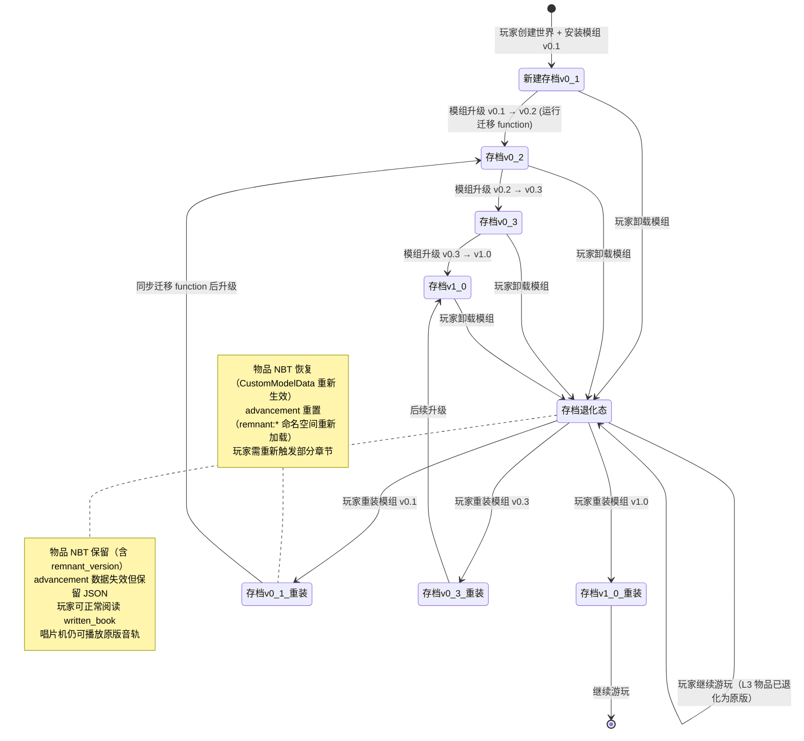

# 13 · 存档兼容性策略

> **状态**：🟡 设计讨论中 > **对应模组版本**：v0.1+ > **创建日期**：2026-09-18 > **最后更新**：2026-09-18 > **设计原则**：[原则 0 · L1/L2/L3 判定](./00-planning-index.md#原则-0优先原版实在没辙才自定义且必须与原版有关)

---

## 1. 目的

定义 **Remnant / Echo** 模组在全生命周期内对玩家存档的兼容性策略，确保在以下三种情况下，玩家的存档始终可用、可继续游玩，且模组内容能优雅地升级、退化或重置。本策略是「原则 0」中**退化关联**标准（失去模组时退化为原版物品，仍能正常运作）在存档层级的系统性落实，也是对 [10-custom-items-registry.md](./10-custom-items-registry.md) 中已论证的三个 L3 物品退化方案的扩展与汇总。

**核心约束**：

1. 模组升级（v0.1 → v0.2 → ... → v1.0）：旧存档必须能继续游玩，新内容自动并入。
2. 模组卸载：玩家移除模组后，存档不崩溃，所有模组物品自动退化为原版等价物。
3. 模组重装：玩家卸载后重装，物品 NBT 保留，advancement 按既定规则重置或保留。
4. 多人服务器：作为 server-side mod 时，玩家客户端无需安装即可正常游玩。
5. 严格遵循「退化关联」标准——所有 L3 自定义物品必须能在失去模组时自动退化，不存在"模组卸载即存档崩溃"的情况。

本文档不涉及具体代码实现，仅描述策略、NBT 结构示例、数据流与验收清单。

---

## 2. 总览：三大风险场景与策略

存档兼容性问题可归约为三种典型场景，每种场景对应不同的策略与责任主体。

| 场景 | 触发条件 | 主要风险 | 应对策略 | 责任主体 |
|------|----------|----------|----------|----------|
| **A · 模组升级** | 玩家将模组从 v0.X 升级到 v0.Y | 旧 NBT 结构与新代码不匹配；新增 advancement 不被旧存档识别 | 数据迁移 function + NBT 版本号机制 + advancement 自动重判 | 项目方（每次发版提供迁移 function） |
| **B · 模组卸载** | 玩家或服务器移除模组 | `remnant:tattered_note` 等模组 ID 在原版游戏中无注册 → 紫色"缺失物品"占位符 | 所有 L3 物品基于"原版物品 + CustomModelData"实现，模组卸载后自动退化为原版物品 | 项目方（设计阶段就保证可退化） |
| **C · 模组重装** | 玩家卸载一段时间后重新安装 | 已解锁的 advancement 是否保留？已生成的模组物品是否恢复？ | NBT 持久化（物品保留） + advancement 重置（玩家重新触发） | 项目方 + 玩家（重装后需重新触发部分流程） |

**核心结论**：场景 A 与场景 C 通过 NBT 版本号 + advancement 机制天然解决；场景 B 必须在设计阶段就保证——所有 L3 物品均"基于原版物品 + CustomModelData"实现，而非新增独立 `Item` 注册。这是「退化关联」标准在存档层级的体现。

---

## 3. L3 自定义物品的退化矩阵

下表扩展自 [10-custom-items-registry.md](./10-custom-items-registry.md) 中已论证的三个 L3 物品退化方案，列出完整的退化行为。该矩阵是本模组存档兼容性的**核心保证**——只要这三个物品的退化行为符合预期，模组卸载场景的存档安全就有保障。

| L3 物品 | 模组 ID | 退化为 | NBT 保留 | 玩家可否继续使用 | 视觉变化 |
|---------|---------|--------|----------|------------------|----------|
| 残破笔记 | `remnant:tattered_note` | `minecraft:written_book` | 是（`pages` / `author` / `title` / `display`） | 是，可右键阅读完整文本 | 退化为原版 `written_book` 纹理（无泛黄/烧焦） |
| 线索书 | `patchouli:guide_book`（NBT 指向 `remnant:remnant`） | `minecraft:written_book` | 是（`patchouli:book` 字段被原版忽略） | 不可打开 Patchouli UI，但物品保留在背包 | 退化为原版 `written_book` 纹理 |
| 0 号唱片 | `remnant:music_disc_0` | `minecraft:music_disc_13` | 是（`CustomModelData` 被忽略） | 是，仍可在唱片机播放 C418 - 13 的原版音轨 | 退化为原版 13 号唱片纹理 |

**退化矩阵的实现前提**：

1. 三个 L3 物品均**不通过独立 `Item` 类注册**，而是通过原版物品 + `CustomModelData` + 资源包纹理覆写实现。模组 ID（如 `remnant:tattered_note`）在内部通过 `ItemTags` 或 `CustomModelData` 区分，物品本体仍是原版 `written_book` / `music_disc_13`。
2. `patchouli:guide_book` 是 Patchouli 提供的 L3 物品，本身也基于原版 `written_book`。Patchouli 作为软依赖缺失时，物品自然退化为 `written_book`。
3. 退化后玩家**仍可正常使用物品的所有原版功能**——可阅读、可在唱片机播放、可放入讲台。仅"模组专属叙事层"（Patchouli UI、自定义纹理、特殊音轨叙事）失效。

---

## 4. 数据持久化层级

存档中的数据按层级分布在不同的原版数据载体上，每层级的兼容性风险不同，应对策略也不同。

| 数据层级 | 载体 | 跨模组版本持久性 | 模组卸载时行为 | 模组重装时行为 |
|----------|------|------------------|----------------|----------------|
| **玩家物品 NBT** | 玩家背包、ender chest 中的物品 NBT | ★★★★★ 持久（物品 NBT 跨版本兼容） | 物品 ID 退化，NBT 保留 | 物品 ID 恢复，NBT 保留 |
| **世界数据** | chunk 中的方块、block entity | ★★★★★ 持久（模组仅修改原版 loot 表，不新增 block entity） | 无影响（无自定义 block entity） | 无影响（无自定义 block entity） |
| **advancement 数据** | `world/data/advancements/<uuid>.json` | ★★★★☆ 持久（JSON 文件持久存在） | 失效（advancement 命名空间 `remnant:` 不再被识别） | 重置（`remnant:` 命名空间重新加载，但旧解锁状态会因 JSON 解析失败而清空） |
| **Patchouli 解锁状态** | 玩家 advancement 内的 `patchouli:*` 命名空间 | ★★★★☆ 持久 | 与 advancement 一致，失效 | 与 advancement 一致，重置 |
| **loot 表条目** | `data/minecraft/loot_tables/` 下的覆写 | N/A（每次结构生成都按当前 loot 表） | 旧存档已生成结构不变，新生成结构按原版 | 旧存档不变，新生成结构按模组覆写后的 loot 表 |

**关键设计决策**：

1. **不新增自定义 block entity**：模组仅在原版 loot 表中追加 `written_book` 条目，不引入任何自定义方块实体。这意味着 chunk 数据中没有模组专属字段，世界数据层级的存档风险为零。
2. **advancement 数据采用原版 JSON 格式**：玩家进度存于 `world/data/advancements/<uuid>.json`，命名空间为 `remnant:`。这是原版机制，无自定义风险。
3. **loot 表覆写不影响已生成结构**：玩家已开启的箱子内容是物品堆叠实例，不会随模组版本变化。新生成结构按当前 loot 表生成，这是原版机制，无风险。

---

## 5. 版本迁移策略

模组从 v0.1 逐步迭代到 v1.0 的过程中，每次版本升级可能涉及多种内容变更，每种变更对应不同的迁移策略。

| 变更类型 | 旧存档行为 | 应对策略 | 风险等级 |
|----------|------------|----------|----------|
| **新增 advancement** | 旧存档玩家加载时自动重判触发器，已满足条件的立即解锁 | 无需额外处理，原版机制自动重判 | 无 |
| **新增 loot 表条目** | 旧存档的已生成结构箱子不变；新生成结构按新表 | 无需处理，原版机制区分"已生成"与"新生成" | 无 |
| **新增 Patchouli 章节** | 旧存档玩家上线后立即同步新章节内容 | Patchouli 原生支持动态加载，无需额外处理 | 无 |
| **修改 L3 物品 NBT 结构** | 旧物品 NBT 与新代码预期不一致 | NBT 版本号机制 + function 升级脚本批量迁移 | 中 |
| **删除某 advancement** | 旧存档玩家保留已解锁状态，但 reward function 不再触发 | 无副作用，玩家已获得的物品保留，新增功能不可触发 | 低 |
| **重命名模组 ID** | 旧存档中旧 ID 的物品退化为缺失物品占位符 | 严禁重命名模组 ID；如必须重命名，需通过 fallback 注册表 | 高（原则上禁止） |

### 5.1 NBT 版本号机制

为应对未来 NBT 结构变更，所有 L3 物品的 NBT 中均追加 `remnant_version` 字段。该字段从 v0.1 开始引入，作为后续所有版本迁移脚本的基础判别依据。

```nbt
# 残破笔记的标准 NBT（v0.1）
{
  remnant_version: 1,
  CustomModelData: 1,
  display: { Title: "残破的笔记" },
  pages: [
    '{"text":"寻找那座塔。它会告诉你我们是谁。\\n\\n不要相信猪灵。也不要相信我们。\\n\\n—— M."}'
  ],
  author: "M.",
  title: "残破的笔记",
  resolved: 1b
}
```

```nbt
# 0 号唱片的标准 NBT（v0.6）
{
  remnant_version: 1,
  CustomModelData: 0,
  display: { Title: "0 号唱片", Lore: ["先民领袖的遗言"] }
}
```

### 5.2 版本迁移 function 示例

当 v0.2 引入新的 NBT 字段时，迁移 function 自动检测旧版本物品并升级 NBT 结构。

```mcfunction
# data/remnant/functions/upgrade/v0_2_migration.mcfunction
# 检测 remnant_version < 2 的残破笔记，迁移 NBT 后更新版本号
execute as @a[nbt={Inventory:[{id:"minecraft:written_book",tag:{remnant_version:1}}]}] run function remnant:upgrade/migrate_tattered_note_v1_to_v2

# data/remnant/functions/upgrade/migrate_tattered_note_v1_to_v2.mcfunction
# 假设 v0.2 在 NBT 中追加 remnant_chapter_index 字段用于追踪章节归属
data modify entity @s Inventory[{tag:{remnant_version:1}}].tag.remnant_chapter_index set value 0
data modify entity @s Inventory[{tag:{remnant_version:1}}].tag.remnant_version set value 2
```

迁移 function 通过 `/function remnant:upgrade/v0_2_migration` 在服务器启动时自动执行（借助 ` advancements` 的 `tick` 触发器或服务端启动 hook），玩家无感知。

---

## 6. 状态转换图：存档在三种场景下的生命周期

下图描述一个典型玩家存档在模组升级、卸载、重装三种场景下的状态流转。图中节点为存档状态，边为触发事件。



状态图核心保证：

1. 从任意状态到「存档退化态」的转移是**幂等且无副作用**的——物品自动退化为原版等价物，玩家可立即继续游玩。
2. 从「存档退化态」回到任意版本状态时，物品 NBT 保留并恢复显示，但 advancement 重置（这是可接受的设计取舍）。
3. 模组升级路径（v0.1 → v0.2 → ... → v1.0）单向递进，每次升级通过迁移 function 自动处理旧版本 NBT。

---

## 7. 模组卸载检测与缓解

模组卸载后，玩家启动游戏时原版会扫描存档中的物品 ID。对于在原版注册表中不存在的 ID（如 `remnant:tattered_note`），原版默认渲染为紫色立方体"缺失物品"占位符，物品无法使用。本节描述该问题的缓解方案与最优设计。

### 7.1 缓解方案对比

| 方案 | 描述 | 实现复杂度 | 玩家体验 | 是否采用 |
|------|------|------------|----------|----------|
| A · fallback 注册表 | 在 `remnant.mixins.json`（Fabric）或 NeoForge 注册表中为 `remnant:tattered_note` 注册 fallback 为 `minecraft:written_book` | ★★★☆☆ 需平台特定代码 | 物品退化为原版，但仍需模组在场 | ❌ 模组卸载后无 mixin 加载，方案失效 |
| B · 原版 NBT 化 | `remnant:tattered_note` 本质就是带 `CustomModelData` 的 `minecraft:written_book`，模组仅通过 loot 表 function 给原版 `written_book` 写入特殊 NBT | ★☆☆☆☆ 仅 loot 表 function 配置 | 物品本身就是 `minecraft:written_book`，模组卸载后无任何变化 | ✅ 采用 |
| C · 自定义 Item 注册 | 注册独立的 `class TatteredNoteItem extends WrittenBookItem` | ★★★★☆ Java 代码 + 注册表管理 | 模组卸载后物品退化为缺失占位符 | ❌ 违反退化关联 |

**结论**：方案 B 是最优雅且符合「退化关联」标准的方案。所有 L3 物品均不通过独立 `Item` 类注册，而是通过给原版物品写入 `CustomModelData` + 模组专属 NBT 字段实现差异化。模组仅通过 loot 表 function（给箱子生成的 `written_book` 写入 NBT）和合成配方（给玩家合成的物品写入 NBT）操作物品。

### 7.2 方案 B 的物品注册逻辑

```text
原版 minecraft:written_book
    ├─ 玩家拾取（来自 remnant 覆写的 loot 表）
    │   └─ loot 表 function 写入 NBT: {CustomModelData:1, remnant_version:1, ...}
    │       → 在玩家眼中是"残破笔记"（模组资源包覆写纹理）
    └─ 模组卸载
        └─ 物品仍是 minecraft:written_book，NBT 字段 CustomModelData/remnant_version 被原版忽略
            → 在玩家眼中退化为普通 written_book
```

这意味着模组实际上**不新增任何独立 Item 注册**。`remnant:tattered_note` 只是 `minecraft:written_book` 在资源包中通过 `CustomModelData` 区分的视觉变体，物品 ID 在存档中始终是 `minecraft:written_book`。同理 `remnant:music_disc_0` 在存档中是 `minecraft:music_disc_13` + `CustomModelData:0`。

### 7.3 关键设计原则

> **所有 L3 自定义物品均应"基于原版物品 + CustomModelData"实现，而非新增独立 Item 注册。**

这是退化关联标准在注册表层级的落地，也是存档兼容性的根本保证。设计阶段就必须论证每个 L3 物品如何映射到原版物品，本节将此论证作为 L3 决策的强制前置条件（已在 [10-custom-items-registry.md](./10-custom-items-registry.md) 中体现）。

---

## 8. 多人服务器场景

模组作为 server-side mod 时，玩家客户端无需安装即可正常游玩。本节描述服务器在不同操作下的玩家体验。

| 服务器操作 | 客户端玩家行为 | 风险 | 应对策略 |
|------------|----------------|------|----------|
| 服务器安装模组 v0.1 | 玩家客户端无需安装，自动收到服务器下发的资源包（含纹理） | 资源包未启用 → 物品显示原版纹理 | 提示玩家在选项中启用服务器资源包 |
| 服务器升级模组 v0.X → v0.Y | 玩家客户端自动收到新资源包 | 资源包未及时更新 → 物品仍显示旧纹理 | 自动重连或手动刷新资源包 |
| 服务器卸载模组 | 玩家背包中的模组物品自动退化为原版等价物（基于本节方案 B 设计） | 无 | 物品 NBT 保留，玩家可继续使用 |
| 服务器重装模组 | 物品 NBT 恢复生效，advancement 重置 | 玩家需重新触发部分章节 | 通过 NBT 标记"已完成"状态的可选保留机制（见第 9 节风险讨论） |
| 服务器混合版本（部分玩家旧模组、部分新模组） | NBT 字段不一致 | 高 | 不支持，要求服务器与所有客户端统一版本 |

**关键保证**：服务器卸载模组时，由于所有 L3 物品在存档中本身就是原版 ID（如 `minecraft:written_book`），玩家背包中的物品不会退化为紫色占位符，而是直接以原版形态继续可用。这是 server-side mod 设计的核心优势。

---

## 9. 风险与讨论点

### 9.1 已识别的风险

| 风险 | 严重程度 | 缓解方案 |
|------|----------|----------|
| 模组重装后 advancement 重置，玩家需重新触发部分章节 | 中 | 可接受设计取舍；可选方案：通过 NBT 标记 "已完成" 状态在物品 NBT 中保留 |
| Patchouli 版本不兼容（升级后旧书无法打开） | 中 | 作为软依赖，缺失时降级为 tellraw 显示章节文本 |
| 服务器混合版本（部分玩家旧模组、部分新模组） | 高 | 不支持，要求统一版本；服务器启动时检测所有客户端版本一致性 |
| 与其他模组的 ID 冲突（如其他模组也用 `remnant:` 前缀） | 低 | 严格 `remnant:` 前缀（项目代号独占）；通过 mod_id 冲突检测在启动时报错 |
| NBT 版本号字段在原版 `written_book` 中被其他模组读取冲突 | 低 | `remnant_version` 命名空间足够独特，避免通用名 |
| loot 表覆写与其他模组的 loot 表覆写冲突 | 中 | 使用 Fabric/NeoForge 的 loot 表注入机制（如 `replace: false`），追加而非替换 |

### 9.2 待讨论的设计问题

- [ ] advancement 重置是否可接受？还是需要通过物品 NBT 中标记 `remnant_completed: 1b` 字段实现"已完成但 advancement 重置"的兼容状态？
- [ ] Patchouli 缺失时的 tellraw 降级方案——具体降级到什么程度？仅显示章节文本，还是包含 advancement 提示？
- [ ] 服务器卸载模组后，玩家背包中的"线索书"（`patchouli:guide_book`）在客户端未安装 Patchouli 时会显示为什么？需测试。
- [ ] 是否提供 `/function remnant:reset_player_progress` 命令让玩家主动重置自己的模组进度？
- [ ] 迁移 function 是否在玩家登录时自动触发（通过 advancement `tick` 触发器），还是需要管理员手动调用？
- [ ] 模组重装后，已解锁的 Patchouli 章节是否可通过 NBT 中保留的 `remnant_version` 字段反推已读状态？还是必须完全依赖 advancement？
- [ ] 0 号唱片（`remnant:music_disc_0`）退化为 `minecraft:music_disc_13` 后，玩家若再合成一次仍可获得新的 0 号唱片——这是否合理？
- [ ] 与 JEI / Create 等主流模组的兼容性测试范围如何界定？是否需要在 v0.9 预发布前完成全量测试？

---

## 10. 测试矩阵

v0.9 预发布前必做的存档兼容性测试矩阵。每项测试都需在单机与多人服务器两种环境下执行。

| 测试项 | 步骤 | 验收标准 | 单机 | 多人 |
|--------|------|----------|------|------|
| TC-01 · 跨版本升级链 | 创建存档 v0.1 → 升级到 v0.2 → ... → v0.9 | 所有 L3 物品 NBT 一致，迁移 function 运行无报错 | ☐ | ☐ |
| TC-02 · 模组卸载 | 创建存档 v0.5 → 卸载模组 → 启动游戏 | 所有 L3 物品退化为可用原版物品，无紫色占位符 | ☐ | ☐ |
| TC-03 · 模组重装 | 创建存档 v0.5 → 卸载 → 重装 v0.5 | NBT 保留，advancement 重置后玩家可重新触发 | ☐ | ☐ |
| TC-04 · 跨版本重装 | 创建存档 v0.3 → 卸载 → 重装 v0.5 | 迁移 function 自动运行，物品 NBT 升级到 v0.5 版本 | ☐ | ☐ |
| TC-05 · 服务器混合版本 | 服务器装 v0.5，部分客户端装 v0.3 | 启动时报错并禁止连接（强制统一版本） | N/A | ☐ |
| TC-06 · 与 Patchouli 兼容 | 安装 Patchouli 与卸载 Patchouli 两种状态 | 线索书物品保留，缺失时降级为 tellraw | ☐ | ☐ |
| TC-07 · 与 JEI 兼容 | 安装 JEI，查看模组物品与配方 | JEI 正确显示，无报错 | ☐ | ☐ |
| TC-08 · 与 Create 兼容 | 安装 Create，检查 loot 表与物品冲突 | 无 ID 冲突，无 loot 表覆写冲突 | ☐ | ☐ |
| TC-09 · 玩家背包物品退化 | 创建存档 v0.5 → 模组卸载 → 检查背包内残破笔记 | 退化为可阅读的 written_book，文本完整 | ☐ | ☐ |
| TC-10 · 唱片机退化行为 | 模组卸载后将 0 号唱片放入唱片机 | 播放原版 13 号唱片音轨，无报错 | ☐ | ☐ |

**测试要求**：

- 每项测试需创建独立测试世界，避免测试间相互污染。
- 多人测试需在 dedicated server 与集成 server 两种模式下分别执行。
- TC-06 ~ TC-08 的兼容性测试需在 v0.9 前完成，目标版本为 Minecraft 1.21.x。
- 测试结果需记录到独立的测试报告中，本矩阵仅作为清单。

---

## 11. 修订历史

| 日期 | 版本 | 修订内容 | 修订者 |
|------|------|----------|--------|
| 2026-09-18 | v0.1 | 初稿，定义三大风险场景与策略、L3 物品退化矩阵、NBT 版本号机制、状态转换图、测试矩阵 | 项目方 |
