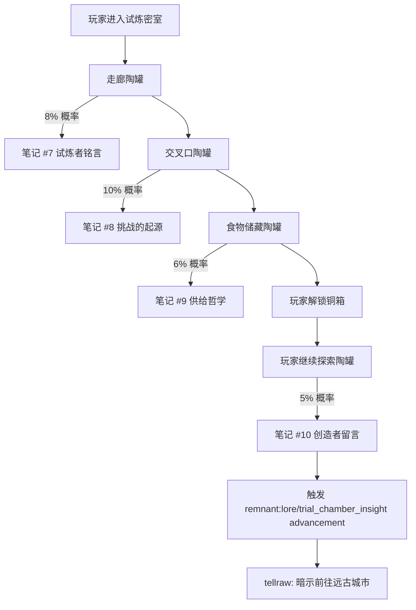

# 14 · 试炼密室叙事

> **状态**：🟡 设计讨论中
> **对应模组版本**：v0.4（深暗线补充）/ v0.5（末地线补充）
> **创建日期**：2026-09-18
> **最后更新**：2026-09-18
> **设计原则**：[原则 0 · L1/L2/L3 判定](./00-planning-index.md#原则-0优先原版实在没辙才自定义且必须与原版有关)
> **关联章节**：[`04-trial-chambers/`](../04-trial-chambers/) · [`02-story-timeline-plan.md`](./02-story-timeline-plan.md) · [`03-player-journey-map.md`](./03-player-journey-map.md)

---

## 1. 目的

将 Minecraft 1.21 Tricky Trials 更新引入的 **试炼密室（Trial Chambers）** 合理串联进模组的"远古先民文明"叙事框架，使其成为先民为后裔设计的"挑战与继承"测试体系，而非孤立的新结构。

**核心约束**：
- 试炼密室是 1.21 原版结构，**不新增、不替换、不魔改**其生成逻辑、方块构成、刷怪机制
- 仅通过 **原版 loot 表追加 `written_book`**、**原版 advancement 触发 tellraw** 实现叙事
- 试炼密室内的所有原版物品（试炼钥匙、Vault、试炼刷怪笼、装饰陶罐、铜质楼梯、凝灰岩砖等）**仅作解读，不作修改**
- 严格遵循 L1 优先原则——本章节**不引入任何 L3 自定义**

---

## 2. 试炼密室在叙事中的定位

### 2.1 三界同源视角下的试炼密室

按 [`02-story-timeline-plan.md`](./02-story-timeline-plan.md) 的六大纪元划分，试炼密室归入 **鼎盛纪元** 的"红石机械"研究领域分支。先民在主世界地下建造试炼密室，作为**面向后裔的挑战与继承测试设施**——既是为训诫后裔保留战斗技艺，也是为合格后裔留下物资储备（Vault）。

**关键串联点**：

| 原版线索 | 模组解读 | 是否新增内容 |
|----------|----------|--------------|
| 试炼密室使用凝灰岩（Tuff）+ 铜质构件建造 | 凝灰岩是先民在主世界地下深处开采的特殊石材，与下界要塞的黑石、末地城的紫珀砖工艺同源——皆为"先民砌筑工艺"的本地变体 | ✅ 仅解读，不新增 |
| 试炼刷怪笼（Trial Spawner）按玩家数量调整生成 | 先民遗留的红石机械，通过维度能量残留感知入侵者数量；玩家越多，机械越激烈 | ✅ 仅解读 |
| Vault 必须用试炼钥匙解锁，且每个玩家仅能开启一次 | Vault 是先民为"通过测试的后裔"准备的物资储备；试炼钥匙是继承凭证，每人仅一份（防滥用） | ✅ 仅解读 |
| 不祥试炼（Ominous Trial）由 Bad Omen 触发，掉落更好但更危险 | 不祥试炼是先民为"高阶后裔"设计的额外考验；Bad Omen 是先民维度能量在玩家身上的残留标记 | ✅ 仅解读 |
| Breeze（旋风怪）使用风能攻击，与下界恶魂的火球攻击呼应 | Breeze 与恶魂同源——皆为"灵魂/元素能量"的具象化，前者偏风元素、后者偏火元素 | ✅ 仅解读，串联到 02-story-timeline 凋灵之灾 |
| Bogged（沼骸）是骷髅变体，吐毒箭 | Bogged 是先民射手阶层"自然回归"后的产物——被湿地植被覆盖的遗骨，仍执行"远程守卫"最后命令 | ✅ 仅解读，串联到 02 大分裂的骷髅叙事 |
| 制图师村民可出售试炼探险家地图 | 制图师保留了先民制图传统的退化残余；地图是其祖辈留下的指引工具 | ✅ 仅解读，强化村民=先民后裔设定 |
| 装饰陶罐中可获得 Creator / Creator (Music Box) / Precipice 三张唱片 | 试炼密室陶罐是先民贵族在此场所的"冥想音乐"留存；Creator 系列指向"创造者意志"，Precipice 指向"挑战的哲学边界" | ✅ 仅解读，与 08-music-disc 章节呼应 |

### 2.2 试炼密室与六大纪元的时序定位

按 [02-story-timeline-plan §5.1](./02-story-timeline-plan.md#51-鼎盛纪元) 鼎盛纪元的四大研究领域：

| 研究领域 | 主要遗迹 | 试炼密室属于 |
|----------|----------|--------------|
| 维度穿行 | 要塞、传送门、末地城 | ❌ |
| 红石机械 | 废弃矿井、试炼密室 | ✅ |
| 灵魂能量 | 下界要塞、凋灵实验 | ❌ |
| 生命本源 | 苍白花园、树脂实验 | ❌ |

试炼密室属"红石机械"分支，但与"灵魂能量"有交叉——试炼刷怪笼的"按玩家数量调整"机制暗示了灵魂感知能力，**可能是鼎盛纪元末期先民尝试将红石机械与灵魂能量结合的早期实验**。这一解读与 02 中"鼎盛→凋灵之灾"的过渡相吻合：先民在试炼密室初步尝试灵魂感知，未失控；后将类似技术用于下界要塞，引发凋灵之灾。

### 2.3 试炼密室与玩家路径的关系

按 [`03-player-journey-map.md`](./03-player-journey-map.md) 的十阶段路径，试炼密室**不在主线必经路径上**，作为可选支线：

| 阶段 | 主线 | 试炼密室支线（可选） |
|------|------|----------------------|
| 阶段 2 主世界考古 | 沙漠神殿 / 丛林神庙 / 地牢 / 废弃矿井 | 玩家若发现试炼密室（或购买制图师地图），可在此阶段提前接触"先民挑战体系"叙事 |
| 阶段 5 远古城市 | 深暗之域 / 远古城市 | 玩家可对比"试炼密室的红石机械"与"远古城市的幽匿实验"——前者受控、后者失控，形成叙事对比 |
| 阶段 7 进入末地 | 要塞 / 末影龙 | 玩家可对比"试炼密室的不祥试炼"与"末影龙战"——前者是先民为后裔设计的考验，后者是先民遗留的"守门人" |

**设计意图**：试炼密室作为"红石机械受控"的叙事对照组，让玩家在远古城市见到"红石+灵魂能量失控"的版本时，能产生更强烈的悲剧感。

---

## 3. 叙事文本设计

### 3.1 整体方案：原版陶罐 loot 表追加 `written_book`

按 [`09-village-loot-extension.md`](./09-village-loot-extension.md) 已建立的"L1 优先"模式，本节延续**仅在原版 loot 表中追加 `written_book` 条目**的方式，不在试炼密室内新增任何结构、方块、物品。

**目标 loot 表**：

| 原版 loot 表 | 路径 | 追加物品 | 触发概率 | 叙事文本编号 |
|--------------|------|----------|----------|--------------|
| 试炼密室走廊陶罐 | `archaeology/trial_chambers/pottery` | `written_book`（笔记 #7） | 8% | 试炼者铭言 |
| 试炼密室交叉口陶罐 | `archaeology/trail_chambers_intersection/pottery` | `written_book`（笔记 #8） | 10% | 挑战的起源 |
| 试炼密室食物储藏陶罐 | `archaeology/trial_chambers_supply/pottery` | `written_book`（笔记 #9） | 6% | 供给哲学 |
| 试炼密室装饰陶罐（共通） | `archaeology/trial_chambers/pottery`（fallback） | `written_book`（笔记 #10） | 5% | 创造者留言 |

**注**：所有路径均为原版 archaeology loot 表，模组仅向其中追加条目；触发概率与 [`09-village-loot-extension.md`](./09-village-loot-extension.md) 中 5% ~ 15% 的设定保持量级一致。

### 3.2 四份笔记的内容设计

#### 3.2.1 笔记 #7 · 试炼者铭言

**来源结构**：试炼密室走廊陶罐

**正文**：
> 「不要把这里当作坟场。
> 这里是一座考场。
>
> 我们离开后，留下的孩子需要证明自己有资格继承我们留下的钥匙。
> 如果他们通过，铜箱子会为他们打开。
> 如果失败——至少他们死得明白。
>
> —— 守考者 H.」

**叙事意义**：
- 第 1-2 句确立"试炼密室=考场"的核心解读
- 第 3 句呼应原版 Vault 用试炼钥匙解锁、每人仅一次的机制——这是"继承凭证"
- 第 4 句解释铜箱（Vault）的开启条件
- 第 5 句的黑色幽默暗示先民接受后裔失败的可能
- 落款 "H." 为新角色，与 [`01-spawn-point-design.md`](./01-spawn-point-design.md) 中的 "M." 形成对话关系

#### 3.2.2 笔记 #8 · 挑战的起源

**来源结构**：试炼密室交叉口陶罐

**正文**：
> 「我们曾经以为，文明的延续靠血缘。
> 后来我们发现，血缘会退化、会异化——下界的兄弟已经不像我们了。
>
> 所以我们改用考验。
> 谁能在这里活下来，谁就是我们的人。
> 不管他的父亲是谁。
>
> —— H.」

**叙事意义**：
- 第 1-2 句直接呼应 [`02-story-timeline-plan.md`](./02-story-timeline-plan.md) 大分裂的"族群分裂"——下界兄弟（猪灵）已经异化
- 第 3-5 句解释试炼密室作为"考验替代血缘"的设计哲学
- 与笔记 #7 形成互补：#7 是规则、#8 是理由
- 暗示先民已意识到"维度异化"问题，主动调整继承规则

#### 3.2.3 笔记 #9 · 供给哲学

**来源结构**：试炼密室食物储藏陶罐

**正文**：
> 「铜箱里放的不是奖励，是份额。
>
> 通过考验的孩子，拿走他应得的那一份。
> 没通过的孩子，份额会留给下一个尝试者。
> 这样，即使一百年没有人来，仓库也不会空。
>
> —— H.」

**叙事意义**：
- 第 1 句直接对应原版 Vault"每人仅一次"机制——不是奖励，是"应得份额"
- 第 2-3 句解释原版"每个玩家仅能开启 Vault 一次"的设定
- 第 4 句解释 Vault 长期不空的原因——这是模组对原版机制最直接的解读
- 强化"先民=系统性设计者"的整体形象

#### 3.2.4 笔记 #10 · 创造者留言

**来源结构**：试炼密室装饰陶罐（fallback，最低概率）

**正文**：
> 「如果你看到这张纸条，你大概是这个世纪里第六个走完所有铜箱的人。
>
> 那三张唱片是我留下的——
> Creator 是我们建造这一切时的声音，
> Creator 的另一个版本是疲惫后的休憩，
> Precipice 是我们站在边界时的犹豫。
>
> 听它们，然后决定你要不要继续往下走。
> 往下，是远古城市，那里是我们失败的地方。
>
> —— M.」

**叙事意义**：
- 第 1 句呼应原版 22 张唱片中的 Creator / Creator (Music Box) / Precipice 三张均来自试炼密室陶罐
- 第 2-4 句为这三张唱片赋予叙事解读（与 [`08-music-disc-unlock-order.md`](./08-music-disc-unlock-order.md) 第 2.1 节的"创造者意志 / 试炼休憩 / 试炼哲学"对应）
- 第 5-6 句**关键转折**：指引玩家前往远古城市（阶段 5），形成试炼密室→远古城市的叙事衔接
- 落款 "M." 与 [`01-spawn-point-design.md`](./01-spawn-point-design.md) 笔记 #1 的 "M." 同人——这是 M. 在试炼密室的留言

### 3.3 笔记触发顺序与 advancement 配置

按"碎片化叙事"原则，四份笔记按试炼密室探索的自然顺序触发：



**advancement 配置示例**（玩家拾取笔记 #10 后触发）：

```json
// data/remnant/advancement/lore/trial_chamber_insight.json
{
  "display": {
    "icon": { "item": "minecraft:trial_key" },
    "title": "试炼的终点",
    "description": "M. 的留言指向了更深处",
    "show_toast": true,
    "announce_to_chat": false,
    "hidden": true,
    "frame": "goal"
  },
  "criteria": {
    "find_note_10": {
      "trigger": "minecraft:inventory_changed",
      "conditions": {
        "items": [
          {
            "items": ["minecraft:written_book"],
            "nbt": "{display:{Title:\"创造者留言\"}}"
          }
        ]
      }
    }
  },
  "rewards": {
    "function": "remnant:lore/on_trial_chamber_insight"
  }
}
```

**触发 function**：
```mcfunction
# data/remnant/functions/lore/on_trial_chamber_insight.mcfunction
tellraw @s {"text":"「往下，是远古城市，那里是我们失败的地方。」","color":"gray","italic":true}
tellraw @s {"text":"—— M. 的留言似乎在催促你前往深暗之域。","color":"dark_gray","italic":true}
```

---

## 4. 不祥试炼的叙事绑定

### 4.1 不祥试炼作为"高阶考验"

原版不祥试炼由玩家携带 Bad Omen 进入试炼密室触发，难度提升但 Vault 物品更好。模组将其解读为"先民为高阶后裔准备的额外考验"。

**叙事线索**：
- Bad Omen 在原版是与灾厄村民关联的状态效果，模组设定为"先民维度能量在玩家身上的残留标记"
- 携带 Bad Omen 进入试炼密室 = 玩家已被先民能量"识别"为高阶挑战者
- 不祥试炼的更激烈战斗 + 更优掉落 = 先民对高阶后裔的"毕业考试"

### 4.2 实现方式：监听原版触发器（L2）

不新增任何机制，仅通过原版 `player_killed_entity` 与 advancement 触发器组合监听玩家在 Bad Omen 状态下完成试炼：

```json
// data/remnant/advancement/lore/ominous_trial_completion.json
{
  "display": {
    "icon": { "item": "minecraft:trial_key", "nbt": "{Enchantments:[{}]}" },
    "title": "毕业考试",
    "description": "在 不祥 试炼中存活",
    "show_toast": true,
    "frame": "challenge"
  },
  "criteria": {
    "open_vault_with_bad_omen": {
      "trigger": "minecraft:inventory_changed",
      "conditions": {
        "player": {
          "effects": {
            "minecraft:bad_omen": {}
          }
        },
        "items": [
          {
            "items": ["minecraft:wind_charge", "minecraft:breeze_rod", "minecraft:ominous_bottle"]
          }
        ]
      }
    }
  },
  "rewards": {
    "function": "remnant:lore/on_ominous_completion"
  }
}
```

**触发 function**（`tellraw` 显示叙事文本）：
```mcfunction
# data/remnant/functions/lore/on_ominous_completion.mcfunction
tellraw @s {"text":"铜箱为你打开。你已通过先民的高阶考验。","color":"gold"}
tellraw @s {"text":"你听到的不是机械声，是一句古老的祝福。","color":"gray","italic":true}
```

**L 等级判定**：L2（原版 advancement 触发器 + 原版 Bad Omen 效果 + 原版物品组合），不新增任何机制。

---

## 5. Breeze 与 Bogged 的叙事串联

### 5.1 Breeze（旋风怪）的叙事

原版 Breeze 出现在试炼密室，使用风能攻击，外观与下界恶魂的"小白"形象呼应。模组将其解读为"先民在试炼密室中遗留的元素能量生物"。

**与恶魂的串联**（[02-story-timeline 凋灵之灾](./02-story-timeline-plan.md#52-凋灵之灾)）：

| 维度 | 生物 | 元素 | 来源 |
|------|------|------|------|
| 主世界地下（试炼密室） | Breeze | 风 | 先民维度能量的温和残留 |
| 下界（凋灵之灾前） | 善魂（Ghastling） | 火 | 先民维度能量在下界的温和形态 |
| 下界（凋灵之灾后） | 恶魂 | 火（被扭曲） | 善魂被凋灵能量污染后的形态 |

**叙事意义**：Breeze 是"先民能量受控状态"的活化石——它证明了先民曾能控制元素能量作为防御机制，凋灵之灾后这种控制能力失传，下界的善魂失控并恶魂化。

### 5.2 Bogged（沼骸）的叙事

原版 Bogged 是骷髅变体，出现在试炼密室与沼泽，使用毒箭攻击。模组将其解读为"先民射手阶层遗骨在湿地的演化形态"。

**与骷髅的串联**（[02-story-timeline 大分裂](./02-story-timeline-plan.md#55-大分裂)）：

| 部位 | 骷髅（普通） | 流髑（雪原） | Bogged（湿地/试炼密室） |
|------|--------------|--------------|--------------------------|
| 部位 | 主世界地下 | 雪原 | 湿地 / 试炼密室 |
| 武器 | 弓 | 弓（缓速箭） | 弓（毒箭） |
| 演化逻辑 | 灵魂被困、执行最后命令 | 雪原气候腐化、附加冰元素 | 湿地植被寄生、附加毒元素 |

**叙事意义**：Bogged 是先民射手阶层"与环境融合"的演化分支，与流髑（雪原分支）形成平行叙事——同一支先民射手的遗骨在不同环境下呈现不同形态。试炼密室中的 Bogged 则是先民刻意保留的"挑战用守卫"，与上述自然演化的 Bogged 同源但用途不同。

### 5.3 不新增生物的明确说明

按 [原则 0 · 永远禁止清单](./00-planning-index.md#l3-自定义的永远禁止清单)，本章节**不新增任何自定义生物**。Breeze、Bogged、试炼刷怪笼生成的所有生物均为原版生物，模组仅对其存在作叙事解读，不修改其 AI、属性、掉落。

---

## 6. 试炼密室与原版物品的关联

### 6.1 试炼钥匙（Trial Key）与不祥试炼钥匙

| 原版物品 | 模组解读 |
|----------|----------|
| 试炼钥匙 | 通过考验的继承凭证；先民为合格后裔留下的"通行证" |
| 不祥试炼钥匙 | 通过不祥考验的高阶凭证；铜箱中更深处的"荣誉份额"标记 |

**L 等级**：L1（用原版物品 + 解读，不新增自定义）。

### 6.2 Vault（铜箱）

原版 Vault 必须用试炼钥匙解锁，且每个玩家仅能开启一次。模组解读已在 §3.2.3 笔记 #9 中明确：
- "铜箱里放的不是奖励，是份额"
- "每人仅一次"是先民防止滥用的设计

### 6.3 试炼刷怪笼（Trial Spawner）

原版试炼刷怪笼按玩家数量调整生成数量。模组解读为"先民红石机械+维度能量感知"的产物。**不修改其行为**，仅在叙事文本中解读。

### 6.4 制图师村民的试炼探险家地图

原版制图师村民可出售试炼探险家地图。模组解读为"制图师保留了先民制图传统的退化残余"——这与 [`05-villager-family`](../05-villager-family/) 章节中"村民是先民主世界后裔"的设定强化呼应。

**L 等级**：L1（用原版交易机制，不新增）。

### 6.5 凝灰岩与铜质构件

原版试炼密室使用凝灰岩（Tuff）与铜质构件建造。模组解读为"先民在主世界地下深处开采的特殊石材 + 容易氧化变绿的金属"——凝灰岩的灰白色与铜的氧化绿色形成独特的"先民试炼美学"。**不新增自定义方块**。

---

## 7. 与 03-player-journey-map 的关系修订

试炼密室原本不在 [`03-player-journey-map.md`](./03-player-journey-map.md) 的十阶段路径上。本文档建议将试炼密室作为"可选支线"在阶段 2-5 期间出现，但不强制加入主线。

### 7.1 阶段 2 主世界考古的可选支线

- 玩家在主世界探索时，若发现制图师村民，可购买试炼探险家地图
- 玩家若前往试炼密室，可拾取笔记 #7-#10
- 笔记 #10 的 tellraw 会暗示玩家前往远古城市（阶段 5）

### 7.2 阶段 5 远古城市的对照组

- 玩家在远古城市见到幽匿实验失控的遗迹
- 若玩家之前去过试炼密室，可通过 tellraw 显示对比文本：
  - 「你曾见过试炼密室的红石机械——它们仍按设计运转。」
  - 「这里不同。这里的机械被灵魂吞噬了。」

**实现**：通过 advancement 触发器检测玩家是否已解锁 `remnant:lore/trial_chamber_insight`，若已解锁则在玩家进入远古城市时显示对比文本。

### 7.3 阶段 7 进入末地的对照

- 玩家在末影龙战前若已通过不祥试炼，可触发额外 tellraw：
  - 「你已通过先民的高阶考验。这一战，是他们留给你的最后一关。」

**实现**：通过 advancement 触发器检测玩家是否已解锁 `remnant:lore/ominous_trial_completion`，若已解锁则在玩家进入末地传送门时显示对照文本。

---

## 8. L1/L2/L3 判定总结

### 8.1 本章方案的 L 等级分布

| 方案 | L 等级 | 是否采用 |
|------|--------|----------|
| 在原版陶罐 loot 表中追加 `written_book` 笔记 | L1 | ✅ 采用 |
| 通过原版 `advancement` 触发器监听玩家拾取笔记 | L1 | ✅ 采用 |
| 通过原版 `tellraw` 显示叙事文本 | L1 | ✅ 采用 |
| 通过原版 advancement 检测 Bad Omen 状态 + 物品拾取 | L2 | ✅ 采用 |
| 监听玩家进入远古城市时检测已解锁 advancement | L2 | ✅ 采用 |
| 自定义试炼密室变体结构 | L3 | ❌ 不采用（无必要性） |
| 自定义试炼刷怪笼变体 | L3 | ❌ 不采用（违反"不魔改原版交互"） |
| 自定义 Breeze / Bogged 变体 | L3 | ❌ 不采用（违反"永远禁止"清单） |

**结论**：本章方案**100% L1/L2 实现**，不引入任何 L3 自定义。这是 L1/L2/L3 原则的最佳实践案例——通过纯原版机制与文本解读即可承载完整叙事。

### 8.2 为何试炼密室不需要 L3 自定义

按 [原则 0 · L3 判定流程](./00-planning-index.md#判定流程)：

```
试炼密室叙事提案
    ↓
L1: 能否用纯原版物品/方块/机制承载？
    ├─ 能（陶罐 loot 表追加 written_book + advancement 触发 tellraw）→ 用 L1 ✅
    └─ 否（不需要进入 L2/L3）
```

试炼密室本身已是原版结构，其陶罐 loot 表是原版 archaeology loot 表，仅需向其追加 `written_book` 条目即可承载所有叙事。**完全不需要 L3 自定义**。

---

## 9. v0.4 实施验收标准

- [ ] 试炼密室走廊陶罐按 8% 概率生成笔记 #7 `written_book`
- [ ] 试炼密室交叉口陶罐按 10% 概率生成笔记 #8 `written_book`
- [ ] 试炼密室食物储藏陶罐按 6% 概率生成笔记 #9 `written_book`
- [ ] 试炼密室装饰陶罐按 5% 概率生成笔记 #10 `written_book`
- [ ] 玩家拾取笔记 #10 后触发 advancement `remnant:lore/trial_chamber_insight`
- [ ] advancement reward function 调用 `tellraw` 显示暗示文本
- [ ] 玩家在 Bad Omen 状态下完成试炼（解锁 Vault）触发 advancement `remnant:lore/ominous_trial_completion`
- [ ] 玩家进入远古城市时，若已解锁 `trial_chamber_insight`，显示对比 tellraw
- [ ] 玩家进入末地传送门时，若已解锁 `ominous_trial_completion`，显示对照 tellraw
- [ ] 不修改任何试炼密室的原版结构生成逻辑
- [ ] 不修改任何试炼密室的原版方块（凝灰岩、铜、试炼刷怪笼、Vault、试炼钥匙）
- [ ] 不修改任何试炼密室的原版生物 AI / 属性 / 掉落
- [ ] 多语言支持：zh_cn + en_us 全覆盖（按 [`11-localization-strategy.md`](./11-localization-strategy.md)）

---

## 10. 风险与讨论点

### 10.1 风险

1. **陶罐 loot 表追加可能与原版冲突**
   - 缓解：仅追加条目，不删除原有内容
   - 缓解：触发概率（5-10%）与原版 archaeology loot 表其他条目量级一致
   - 缓解：通过 Fabric API 的 Loot Table 修改事件，不直接覆盖原版 JSON

2. **玩家可能长期不接触试炼密室**
   - 缓解：试炼密室作为可选支线，不强制触发
   - 缓解：制图师村民出售试炼地图是原版机制，玩家有可能接触
   - 接受：符合"碎片化叙事"原则，不强制触发

3. **Breeze / Bogged 的解读可能与原版冲突**
   - 缓解：所有解读仅作为模组叙事文本，不修改原版生物行为
   - 缓解：解读基于原版已有线索（Breeze 风元素、Bogged 毒元素），属"对原版留白的合理串联"

4. **笔记 #10 的 tellraw 可能误导玩家跳过其他遗迹直奔远古城市**
   - 缓解：tellraw 仅暗示，不阻止玩家继续其他探索
   - 缓解：远古城市本身是阶段 5 的主线，提前暗示不会破坏叙事顺序

### 10.2 待讨论的设计问题

- [ ] 笔记 #7-#10 是否使用 `CustomModelData` 改变外观？（倾向：是，与笔记 #1-#6 保持一致，按 [`10-custom-items-registry.md`](./10-custom-items-registry.md) §2.1 已论证的"残破笔记"L3 自定义统一处理）
- [ ] 落款 "H." 的身份设定？（倾向：守考者，与 M. 是同时期先民，但角色不同；预留至 v0.5 末地线揭晓身份）
- [ ] 是否需要为试炼密室增加"通关计数"advancement（玩家通关 X 个试炼密室触发额外文本）？（倾向：v0.5 后考虑）
- [ ] 不祥试炼的额外 tellraw 是否过于引导？（倾向：保持简洁，仅一句对照文本）
- [ ] Bogged 的湿地解读是否与原版 Bogged 的"沼骸"中文名冲突？（倾向：不冲突，沼=湿地，骸=遗骨，模组解读与原版名称一致）

---

## 11. 修订历史

| 日期 | 版本 | 修订内容 | 修订者 |
|------|------|----------|--------|
| 2026-09-18 | v0.1 | 初稿，确立试炼密室作为"先民挑战与继承测试设施"的叙事定位，100% L1/L2 实现 | 项目方 |
