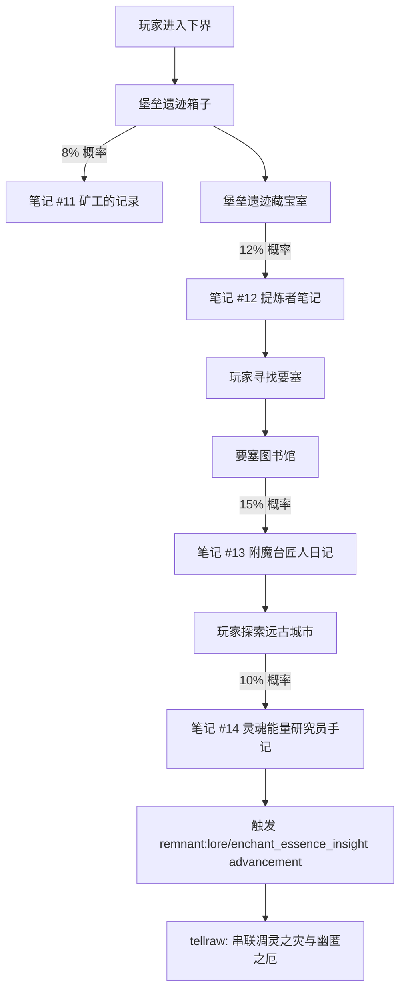

# 15 · 下界合金 / 附魔本质叙事

> **状态**：🟡 设计讨论中
> **对应模组版本**：v0.3（下界线）/ v0.5（末地线补充）
> **创建日期**：2026-09-18
> **最后更新**：2026-09-18
> **设计原则**：[原则 0 · L1/L2/L3 判定](./00-planning-index.md#原则-0优先原版实在没辙才自定义且必须与原版有关)
> **关联章节**：[`12-key-items/`](../12-key-items/) · [`02-story-timeline-plan.md`](./02-story-timeline-plan.md) · [`07-boss-narrative-binding.md`](./07-boss-narrative-binding.md)

---

## 1. 目的

将 Minecraft 原版的**下界合金体系**（远古残骸 / 下界合金碎片 / 下界合金锭 / 下界合金装备）与**附魔体系**（附魔台 / 附魔书 / 青金石 / 经验值 / 各类附魔）合理串联进模组的"远古先民文明"叙事框架，使其成为先民在鼎盛纪元掌握的"维度稳定材料"与"灵魂能量注入技术"。

**核心约束**：
- 下界合金与附魔均为原版核心系统，**不新增、不替换、不魔改**其合成、属性、机制
- 仅通过**原版 loot 表追加 `written_book`**、**原版 advancement 触发 tellraw** 实现叙事
- 下界合金装备、附魔台、附魔书、青金石等原版物品**仅作解读，不作修改**
- 严格遵循 L1 优先原则——本章节**不引入任何 L3 自定义**
- 所有解读必须基于原版已有线索（如远古残骸 Wiki 明确"猪灵挖掘残留"、附魔台使用标准银河字母），属"对原版留白的合理串联"

---

## 2. 原版线索梳理

### 2.1 下界合金体系的关键原版线索

按 [`12-key-items/01-minecraft-net-articles.md`](../12-key-items/01-minecraft-net-articles.md) 与 [`12-key-items/02-minecraft-wiki.md`](../12-key-items/02-minecraft-wiki.md) 整理：

| 原版线索 | 来源 | 模组解读基础 |
|----------|------|--------------|
| 「Ancient debris is actually what remains of the mining activity of the piglins, who extracted all the original netherite ore.」 | minecraft.wiki Trivia | **原版明确：远古残骸是猪灵挖掘下界合金矿的残留** |
| 「Ancient debris is a cluster of corroded metal plates that contain small amounts of the incredibly strong material Netherite.」 | minecraft.net Block of the Week | 远古残骸本质是"腐蚀金属板簇"，含下界合金 |
| 「It's never exposed to the Nether's corrosive atmosphere」 | minecraft.net Block of the Week | 远古残骸从不暴露于下界空气——暗示原矿需要保护层 |
| 「ancient debris is totally fireproof」 | minecraft.net Block of the Week | 远古残骸完全防火——下界合金的本质特性 |
| 「Netherite could be used as a material to upgrade your current equipment, and not just an independent resource」 | Jens Bergensten (minecraft.net) | 下界合金是"升级"而非"独立材料"——升级路径保留原装备属性 |
| 「bastion remnants」中可找到远古残骸与下界合金锭 | minecraft.wiki / minecraft.net | 堡垒遗迹是猪灵的仓储——进一步证实"猪灵-下界合金"关联 |

### 2.2 附魔体系的关键原版线索

| 原版线索 | 来源 | 模组解读基础 |
|----------|------|--------------|
| 「The glyphs here do not affect the enchantment」但「written in the Standard Galactic Alphabet」 | minecraft.wiki Enchanting Table | 附魔台上的文字是**标准银河字母**——模组可解读为"先民文字残留" |
| 「Three to five words are chosen from the list and appended to each other」 | minecraft.wiki Enchanting Table | 附魔台随机选择文字——模组解读为"先民咒文残留，已无人能完整理解" |
| 「the words chosen are random and purely cosmetic; they have no relation to the enchantments」 | minecraft.wiki Enchanting Table | 原版明确"文字纯装饰"——但**模组可在叙事中解读为"残留的咒文，玩家无法理解但能量仍生效"** |
| 「bookshelves should be placed next to the enchanting table」need 15 | minecraft.wiki Enchanting Table | 书架是能量放大器——模组解读为"先民用'记录的知识'作为附魔能量增益" |
| 「consuming experience levels and lapis lazuli」 | minecraft.wiki Enchanting Table | 附魔消耗经验 + 青金石——经验是"灵魂能量"度量，青金石是"维度能量触媒" |
| 附魔台由「obsidian + diamond + book」合成 | minecraft.wiki Enchanting Table | 黑曜石（维度稳定材料）+ 钻石（先民珍视的硬质材料）+ 书（知识载体）= 先民遗留的"维度能量注入装置" |
| 附魔台「emit a light level of 7」 | minecraft.wiki Enchanting Table | 附魔台发光——模组解读为"维度能量持续辐射" |
| 附魔台「despite being made mostly of obsidian, the enchanting table is not immune to destruction by the ender dragon」 | minecraft.wiki Enchanting Table | 末影龙能破坏附魔台——暗示末影龙是"维度能量"层级的存在，可破坏维度稳定材料 |

### 2.3 关键种族关联

- **猪灵**：原版明确为远古残骸的"实际挖掘者"——是先民下界分支后裔中保留挖掘传统的演化体
- **末影龙**：原版明确能破坏附魔台——是"维度能量"层级的存在，与先民维度穿行技术同源
- **村民**：原版制图师村民可出售试炼地图（[`14-trial-chamber-narrative.md`](./14-trial-chamber-narrative.md) §6.4）——村民保留了部分先民制图传统
- **铁傀儡**：村民可制造铁傀儡——村民保留了"用金属制造守卫"的退化技术（暗示曾用下界合金制造更高级守卫）

---

## 3. 叙事定位：先民的"维度稳定材料 + 灵魂能量注入"

### 3.1 鼎盛纪元的两大核心技术

按 [`02-story-timeline-plan.md`](./02-story-timeline-plan.md) §5.1 鼎盛纪元的四大研究领域，下界合金与附魔分属：

| 物品体系 | 鼎盛纪元研究领域 | 模组叙事定位 |
|----------|------------------|--------------|
| 下界合金（远古残骸 → 下界合金碎片 → 下界合金锭 → 装备升级） | 维度穿行 | 先民提炼的"维度稳定材料"——能抗拒维度腐蚀（防火、抗爆、浮于岩浆），是先民维度穿行技术的核心材料 |
| 附魔（附魔台 + 经验 + 青金石 + 书架） | 灵魂能量 | 先民遗留的"灵魂能量注入装置"——将玩家灵魂能量（经验）通过青金石触媒注入物品 |

**关键串联**：下界合金装备的"更强属性 + 可附魔 + 防火"特性，正是先民"维度稳定材料 + 灵魂能量注入"两大技术结合的产物。原版玩家通过下界合金升级 + 附魔台附魔的流程，**实际是在重复先民的两大核心技术**——这是模组叙事的核心解读。

### 3.2 下界合金的叙事深度

#### 3.2.1 远古残骸（Ancient Debris）的真相

按原版 Wiki Trivia「Ancient debris is actually what remains of the mining activity of the piglins, who extracted all the original netherite ore.」，模组解读如下：

**模组叙事**：
> 「先民在鼎盛纪元同时开拓三界。在下界，他们发现了**下界合金原矿**——一种能抗拒维度腐蚀的稳定材料。
>
> 先民在下界建立要塞作为前哨站，组织远征队大规模开采下界合金原矿。原矿被运回主世界，提炼为下界合金锭，用于制造维度穿行装置的核心部件（末地传送门框架、末地城支柱、要塞的强化结构）。
>
> 大分裂后，下界据点荒废，原矿开采停止。但**猪灵——先民下界分支后裔——保留了部分开采传统**，继续零星挖掘剩余的下界合金原矿，将提取后的废渣丢弃。
>
> 这些废渣，就是玩家今日在下界发现的『远古残骸』。
>
> 它不是先民遗留的矿，是猪灵遗留的渣。」

**叙事意义**：
- 直接采纳原版 Wiki 的官方解读，不引入任何新设定
- 解释远古残骸为何"从不暴露于空气"——原矿被开采后，废渣被猪灵填埋回下界岩中
- 解释远古残骸为何"浮于岩浆、抗爆、防火"——下界合金本身的特性
- 解释远古残骸为何在堡垒遗迹箱子中可找到——猪灵将废渣作为"还有点用"的物资储存

#### 3.2.2 下界合金锭的真相

按原版「Netherite could be used as a material to upgrade your current equipment」(Jens Bergensten)，模组解读如下：

**模组叙事**：
> 「下界合金的提炼工艺在先民鼎盛纪元已是成熟技术：远古残骸（废渣）→ 烧炼为下界合金碎片 → 与金锭合成下界合金锭。
>
> 金在下界合金提炼中作为'粘合剂'——先民发现金能与下界合金形成稳定合金，弥补下界合金难以单独塑形的缺陷。这一工艺在大分裂后由猪灵部分保留，猪灵以物易物时偶尔给玩家下界合金碎片，正是这一传统的延续。
>
> 下界合金锭用于'升级'而非'独立制造'——因为下界合金难以单独塑形，必须依附于钻石装备的结构。这是先民在工艺上对钻石价值的尊重：钻石提供形状，下界合金提供强度。」

**叙事意义**：
- 解释原版"下界合金是升级而非独立制造"的设计哲学
- 解释金在合成中的作用（原版未明确）
- 强化猪灵=先民后裔的设定（以物易物给玩家下界合金碎片是传统延续）

#### 3.2.3 下界合金装备的真相

按原版「Netherite items are tougher, hit harder, and last longer than their diamond equivalents. Oh, and it can be enchanted as normal.」，模组解读如下：

**模组叙事**：
> 「下界合金装备的'更强、更耐久、可附魔'三大特性，对应先民对'维度稳定材料'的三大设计目标：
>
> 1. **更强**：下界合金本身的结构强度，能承受维度穿行的应力。
> 2. **更耐久**：下界合金抗拒维度腐蚀，磨损速度远低于钻石。
> 3. **可附魔**：下界合金能稳定承载灵魂能量注入——这是先民将'维度稳定材料'与'灵魂能量注入'两大技术结合的关键。
>
> 玩家通过下界合金升级装备的过程，本质上是在重现先民的终极工艺：将钻石装备的结构强度 + 下界合金的维度稳定性 + 灵魂能量注入（附魔）合而为一。」

### 3.3 附魔体系的叙事深度

#### 3.3.1 附魔台（Enchanting Table）的真相

按原版「made mostly of obsidian」「emit a light level of 7」「text written in the Standard Galactic Alphabet」，模组解读如下：

**模组叙事**：
> 「附魔台是先民在鼎盛纪元遗留的'灵魂能量注入装置'。
>
> 三种材料的组合具有先民的工程逻辑：
> - **黑曜石**：维度稳定材料，与下界合金同源（黑曜石是主世界能找到的、最接近下界合金特性的材料——抗爆、不可被末影龙破坏，但比下界合金更易获取）。
> - **钻石**：先民珍视的硬质材料，作为能量传导结构。
> - **书**：知识载体，承载先民遗留的咒文片段。
>
> 附魔台发光（亮度 7）是维度能量持续辐射的表现——即使在玩家未使用时，附魔台仍在缓慢释放维度能量。
>
> 附魔台界面上的'标准银河字母'文字，是先民文字的残留——先民曾使用此文字记录维度能量注入的咒文。大分裂后，文字的完整含义已失传，但残留的字符仍能通过黑曜石-钻石结构传导维度能量，触发附魔。
>
> 这就是为何附魔台上的文字'纯装饰、不影响附魔'——文字的意义已失传，但**能量通过字符的形状本身在传导**。」

**叙事意义**：
- 采纳原版"标准银河字母"设定，将其解读为"先民文字残留"
- 采纳原版"文字纯装饰"设定，将其解读为"文字意义失传但能量通过形状传导"——这是对原版留白的合理串联
- 解释黑曜石为何能与下界合金同源（皆维度稳定材料，主世界版本）
- 与 [`07-boss-narrative-binding.md`](./07-boss-narrative-binding.md) 末影龙叙事呼应——末影龙能破坏附魔台，因为它是维度能量层级的存在

#### 3.3.2 书架（Bookshelf）的真相

按原版「15 bookshelves need to be placed around the enchanting table」for level 30，模组解读如下：

**模组叙事**：
> 「书架是附魔台的能量放大器。
>
> 先民发现，记录知识的书本身带有微弱的灵魂能量残留（书写者留下的精神痕迹）。将书架环绕附魔台，这些残留的灵魂能量会被附魔台吸收，放大注入物品的能量。
>
> 这就是为何 15 个书架能解锁 30 级附魔——书越多，能量越大，附魔台能调动的维度能量上限越高。
>
> 而书本之间的'空隙'是必要的——能量需要流通路径，紧贴附魔台的书架反而会阻塞能量。这就是为何书架必须与附魔台保持一格距离。」

**叙事意义**：
- 解释原版"15 书架 + 一格距离"的设计哲学
- 解释为何"transparent blocks like torches"会阻塞能量（干扰流通路径）
- 强化"知识 = 能量"的先民哲学

#### 3.3.3 经验值（Experience Level）的真相

按原版附魔台「consuming experience levels」，模组解读如下：

**模组叙事**：
> 「经验值是玩家'灵魂能量'的度量。
>
> 先民在灵魂能量研究中发现，智慧生物的灵魂会随经历积累能量——这就是经验。先民建立了量化灵魂能量的体系，称之为'级'。
>
> 附魔台消耗经验，实际是将玩家的灵魂能量通过青金石触媒注入物品——这就是附魔的本质。
>
> 等级越高的玩家灵魂能量越强，能驱动更高阶的附魔（最高 30 级）。
>
> 经验修补附魔（Mending）的'用经验修复装备'，是先民对灵魂能量直接修补物理结构的最高应用——这是大分裂前的巅峰技术，已无法复制。」

**叙事意义**：
- 解释原版"消耗经验附魔"机制
- 解释经验修补附魔的存在（先民巅峰技术的遗留）
- 与 [`02-story-timeline-plan.md`](./02-story-timeline-plan.md) §5.2 凋灵之灾的"灵魂扭曲波"形成对照——同样的灵魂能量，受控时是附魔，失控时是灾变

#### 3.3.4 青金石（Lapis Lazuli）的真相

按原版附魔台「consuming experience levels and lapis lazuli」，模组解读如下：

**模组叙事**：
> 「青金石是先民提炼的'维度能量触媒'。
>
> 青金石在主世界深层矿脉中生成，其独特的蓝色与下界合金的暗红、紫珀砖的紫、苍白花园的白形成'四色光谱'——这四种颜色分别对应先民研究的四大领域：
> - 暗红（下界合金）：维度穿行
> - 紫（紫珀砖 / 紫颂果）：维度异化
> - 白（苍白花园 / 树脂）：生命本源
> - 蓝（青金石）：灵魂能量
>
> 青金石作为灵魂能量的触媒，能将玩家的灵魂能量通过附魔台的结构注入物品。它的蓝色是灵魂能量可见的形态——这就是为何附魔台界面是蓝色调的。」

**叙事意义**：
- 解释青金石在附魔中的作用（原版未明确）
- 将青金石纳入"四色光谱"体系，强化模组的视觉叙事
- 解释为何附魔台界面是蓝色调（原版未明确）

### 3.4 各类附魔的叙事解读

按原版附魔列表，对常见附魔作叙事解读：

| 附魔 | 原版效果 | 模组叙事解读 |
|------|----------|--------------|
| 时运（Fortune） | 增加矿石掉落 | 先民对维度穿行的研究——能"看穿"维度边界，从同一矿脉中取出更多物质（从相邻维度"借"取） |
| 精准采集（Silk Touch） | 直接获取方块本身 | 先民对维度稳定材料的研究——能完整剥离方块的维度结构，避免破坏 |
| 经验修补（Mending） | 用经验修复装备 | 先民对生命本源的研究巅峰——灵魂能量直接修补物理结构 |
| 灵魂疾行（Soul Speed） | 在灵魂沙上加速 | 先民对灵魂能量的研究——能从灵魂沙中汲取残留灵魂能量作为推进力 |
| 火焰附加（Fire Aspect） | 攻击点燃目标 | 凋灵之灾残留——下界火焰能量的可控释放 |
| 灵魂伤害（Impaling，三叉戟） | 对水生生物额外伤害 | 末地分支对"水生生物"的维度压制（末影人怕水，反向利用） |
| 引雷（Channeling） | 召唤闪电 | 先民对维度能量的研究——通过金属（三叉戟）引导维度能量（雷电） |
| 激流（Riptide） | 在雨中冲刺 | 先民对维度能量的研究——利用水（雨）作为维度能量导体 |
| 绑定诅咒（Curse of Binding） | 不可脱下 | 凋灵之灾残留——灵魂扭曲波导致的"灵魂绑定"效果（诅咒级） |
| 消亡诅咒（Curse of Vanishing） | 死亡时消失 | 凋灵之灾残留——维度腐蚀导致的"维度消解"效果（诅咒级） |
| 经验修补 vs 绑定诅咒 | 修复 vs 锁定 | 同源（灵魂能量）的两种应用：可控=修补，失控=绑定 |

**叙事意义**：
- 通过附魔的"祝福/诅咒"分类，反映先民研究的"受控/失控"两面
- 强化模组"灾难链"叙事——同一种能量的不同表现

---

## 4. 叙事文本设计

### 4.1 整体方案：原版 loot 表追加 `written_book`

按 [`09-village-loot-extension.md`](./09-village-loot-extension.md) 与 [`14-trial-chamber-narrative.md`](./14-trial-chamber-narrative.md) 已建立的"L1 优先"模式，本节延续**仅在原版 loot 表中追加 `written_book` 条目**的方式。

**目标 loot 表**：

| 原版 loot 表 | 路径 | 追加物品 | 触发概率 | 叙事文本编号 |
|--------------|------|----------|----------|--------------|
| 堡垒遗迹通用箱子 | `chests/bastion_bridge`、`chests/bastion_hoglin_stable`、`chests/bastion_other`、`chests/bastion_treasure` | `written_book`（笔记 #11） | 8% | 矿工的记录 |
| 堡垒遗迹藏宝室箱子 | `chests/bastion_treasure` | `written_book`（笔记 #12） | 12% | 提炼者笔记 |
| 要塞图书馆箱子 | `chests/stronghold_library` | `written_book`（笔记 #13） | 15% | 附魔台匠人的日记 |
| 远古城市箱子 | `chests/ancient_city` | `written_book`（笔记 #14） | 10% | 灵魂能量研究员手记 |

### 4.2 四份笔记的内容设计

#### 4.2.1 笔记 #11 · 矿工的记录

**来源结构**：堡垒遗迹通用箱子

**正文**：
> 「不要问这块石头从哪里来。
> 它是先人挖剩下的。
>
> 我们挖完了所有能挖的，剩下的都被岩浆吞过，烧不出来。
> 那些废渣，填回矿洞，盖上岩浆，让它们继续沉睡。
>
> 偶尔有外来的人问我们，下界合金是从哪里来的。
> 我们说，是从这些石头里炼出来的。
> 这不是谎话——但也不是全部的真话。
>
> —— 矿工 K.」

**叙事意义**：
- 直接采纳原版 Wiki "猪灵挖掘残留"设定
- 解释远古残骸为何"被填回矿洞、盖上岩浆"——这就是原版"从不暴露于空气"的原因
- 落款 "K." 为矿工角色，与 "M."、"H." 形成多角色叙事
- 强化猪灵=先民后裔的设定，但保留猪灵的"半懂不懂"——他们只知道传统，不知完整真相

#### 4.2.2 笔记 #12 · 提炼者笔记

**来源结构**：堡垒遗迹藏宝室箱子

**正文**：
> 「四块废渣，烧成四块碎片。
> 四块碎片，加四块金，炼成一块锭。
>
> 金是粘合剂。没有金，下界合金不能塑形。
> 钻石是骨架。没有钻石，下界合金没有形状。
>
> 我们曾试过用纯下界合金铸造武器。
> 它太硬了，硬到无法加工，最后只能丢回岩浆。
>
> —— 提炼者 T.」

**叙事意义**：
- 解释原版"4 远古残骸 + 4 金 = 1 下界合金锭"合成的设计哲学
- 解释原版"下界合金是升级而非独立制造"的原因
- 引入新角色 "T."（提炼者），扩展多角色叙事

#### 4.2.3 笔记 #13 · 附魔台匠人的日记

**来源结构**：要塞图书馆箱子

**正文**：
> 「附魔台已造好。黑曜石打底，钻石为骨，书承载咒文。
>
> 咒文我们已无法完全读懂。
> 它们是先人留下的——他们用一种叫'标准银河字母'的文字记录维度能量注入的方法。
> 我们知道每个字符的形状，但不知道它们组合后的意义。
>
> 不过这不重要。
> 字符的形状本身在传导能量。
> 我们不需要读懂它们，只需要让它们就位。
>
> 书架环绕，留一格空隙，让能量流通。
> 青金石作为触媒，吸收施法者的灵魂能量（我们叫它'经验'）。
> 一切就绪。
>
> 先人的工具，在我们手中变成了仪式。
> 我们不知道原理，但我们知道步骤。
> 这就够了。
>
> —— 匠人 E.」

**叙事意义**：
- 直接采纳原版"标准银河字母 + 文字纯装饰"设定，作合理串联
- 解释为何附魔台文字"不影响附魔但仍然存在"——能量通过形状传导
- 解释为何需要 15 书架 + 一格距离
- 解释为何消耗经验 + 青金石
- 引入新角色 "E."（匠人），与 "M."、"H."、"K."、"T." 形成五人叙事网络
- **关键设定**：先民 = "知道原理的人"；后裔（村民/匠人）= "知道步骤但不懂原理的人"——这是模组对"原版留白"的核心理解

#### 4.2.4 笔记 #14 · 灵魂能量研究员手记

**来源结构**：远古城市箱子

**正文**：
> 「我们低估了灵魂。
>
> 经验值，是我们用来度量灵魂能量的'级'。
> 青金石是触媒，能让灵魂能量通过附魔台注入物品——这都没错。
>
> 但灵魂能量有它的边界。
> 当注入过多，物品开始'抵抗'——这就是绑定诅咒的来源。
> 当注入错位，物品开始'消解'——这就是消亡诅咒的来源。
>
> 凋灵之灾不是意外。
> 是我们以为自己能控制灵魂能量的全部，结果发现不能。
>
> 这座城市，是我们最后的尝试。
> 我们试图理解灵魂的边界。
> 但我们失败了。
>
> 如果你看到这张纸条，请你离开。
> 这里的幽匿，已经学会了'吃'。
>
> —— M.」

**叙事意义**：
- 解释附魔诅咒（绑定、消亡）的来源——灵魂能量注入的失控
- 直接呼应 [`02-story-timeline-plan.md`](./02-story-timeline-plan.md) §5.3 幽匿之厄——"凋灵之灾不是意外，是先民以为自己能控制灵魂能量的全部"
- 落款 "M." 与笔记 #1（[`01-spawn-point-design.md`](./01-spawn-point-design.md)）、笔记 #10（[`14-trial-chamber-narrative.md`](./14-trial-chamber-narrative.md)）同人——M. 是穿越多纪元的关键角色
- 收尾警告"幽匿已学会吃"——直接串联到远古城市的监守者叙事

### 4.3 笔记触发顺序与 advancement 配置

按"碎片化叙事"原则，四份笔记按玩家自然探索下界→要塞→远古城市的顺序触发：



**advancement 配置示例**（玩家拾取笔记 #14 后触发）：

```json
// data/remnant/advancement/lore/enchant_essence_insight.json
{
  "display": {
    "icon": { "item": "minecraft:enchanted_book" },
    "title": "灵魂的边界",
    "description": "你理解了为何会有诅咒附魔",
    "show_toast": true,
    "announce_to_chat": false,
    "hidden": true,
    "frame": "goal"
  },
  "criteria": {
    "find_note_14": {
      "trigger": "minecraft:inventory_changed",
      "conditions": {
        "items": [
          {
            "items": ["minecraft:written_book"],
            "nbt": "{display:{Title:\"灵魂能量研究员手记\"}}"
          }
        ]
      }
    }
  },
  "rewards": {
    "function": "remnant:lore/on_enchant_essence_insight"
  }
}
```

**触发 function**（`tellraw` 显示叙事文本）：
```mcfunction
# data/remnant/functions/lore/on_enchant_essight_insight.mcfunction
tellraw @s {"text":"「凋灵之灾不是意外。是我们以为自己能控制灵魂能量的全部，结果发现不能。」","color":"gray","italic":true}
tellraw @s {"text":"—— M. 的手记似乎指向更深处的真相。","color":"dark_gray","italic":true}
```

---

## 5. 与其他系统的关联

### 5.1 与 Boss 击杀叙事的呼应

按 [`07-boss-narrative-binding.md`](./07-boss-narrative-binding.md)，Boss 击杀触发的叙事可与本章节的"灵魂能量"叙事形成因果链：

| Boss 击杀 | 触发叙事 | 与本章节关联 |
|-----------|----------|--------------|
| 凋灵击杀 | 灾变的余响 | 凋灵之灾是先民"以为自己能控制灵魂能量"的失败例证 |
| 监守者击杀 | 幽匿之厄的悲剧 | 监守者诞生于灵魂能量失控——印证 M. 手记中的"幽匿已学会吃" |
| 末影龙击杀 | 守门人真相 | 末影龙能破坏附魔台——是"维度能量"层级的存在，与先民维度穿行技术同源 |

### 5.2 与唱片系统的呼应

按 [`08-music-disc-unlock-order.md`](./08-music-disc-unlock-order.md)，部分唱片与本章节叙事呼应：

| 唱片 | 获取位置 | 与本章节关联 |
|------|----------|--------------|
| stal | 地牢箱子 | 要塞军营警戒——先民在要塞的军乐，附魔台匠人可能听过 |
| strad | 地牢箱子 | 贵族/学者书房——先民学者研究灵魂能量时的背景音乐 |
| 5 | 远古城市碎片合成 | 监守者觉醒——直接关联 M. 手记中的"幽匿已学会吃" |
| 11 | 地牢箱子 | 最后逃亡录音——可能是 M. 离开远古城市时的录音 |

### 5.3 与试炼密室叙事的呼应

按 [`14-trial-chamber-narrative.md`](./14-trial-chamber-narrative.md) §5 Breeze 与 Bogged 的解读，本章节的"灵魂能量"是其基础：

- Breeze 是"先民维度能量的温和残留"——维度能量是灵魂能量的可控分支
- Bogged 的"附加毒元素"——毒是灵魂能量在湿地环境的异化形态

### 5.4 与认知锁机制的呼应

按 [`06-cognitive-lock-mechanism.md`](./06-cognitive-lock-mechanism.md)，认知锁的判定 advancement 中包含本章节的笔记拾取：

- `remnant:lore/enchant_essence_insight`（拾取笔记 #14）作为认知达标的判定项之一
- 玩家需理解"灵魂能量的边界"才能认知达边界，进入末地

---

## 6. L1/L2/L3 判定总结

### 6.1 本章方案的 L 等级分布

| 方案 | L 等级 | 是否采用 |
|------|--------|----------|
| 在原版堡垒遗迹 loot 表中追加 `written_book` 笔记 | L1 | ✅ 采用 |
| 在原版要塞图书馆 loot 表中追加 `written_book` 笔记 | L1 | ✅ 采用 |
| 在原版远古城市 loot 表中追加 `written_book` 笔记 | L1 | ✅ 采用 |
| 通过原版 `advancement` 触发器监听玩家拾取笔记 | L1 | ✅ 采用 |
| 通过原版 `tellraw` 显示叙事文本 | L1 | ✅ 采用 |
| 自定义下界合金变体物品 | L3 | ❌ 不采用（无必要性） |
| 自定义附魔台变体方块 | L3 | ❌ 不采用（违反"不魔改原版交互"） |
| 自定义新附魔 | L3 | ❌ 不采用（违反"永远禁止"清单中的"新数值系统"） |
| 自定义新符文 / 新触媒 | L3 | ❌ 不采用（无原版依据） |

**结论**：本章方案**100% L1/L2 实现**，不引入任何 L3 自定义。这是 L1/L2/L3 原则的最佳实践案例——通过纯原版机制与文本解读即可承载完整叙事。

### 6.2 为何下界合金/附魔不需要 L3 自定义

按 [原则 0 · L3 判定流程](./00-planning-index.md#判定流程)：

```
下界合金/附魔叙事提案
    ↓
L1: 能否用纯原版物品/方块/机制承载？
    ├─ 能（原版 loot 表追加 written_book + advancement 触发 tellraw）→ 用 L1 ✅
    └─ 否（不需要进入 L2/L3）
```

下界合金、附魔台、附魔书、青金石、经验值均为原版核心系统，原版 Wiki 与 minecraft.net 已提供丰富的官方线索（特别是远古残骸"猪灵挖掘残留"的官方 Trivia）。**模组仅需通过叙事文本对这些原版线索作合理串联，完全不需要 L3 自定义**。

### 6.3 与原版 Trivia 的契合度

本章方案的关键解读均**直接采纳或基于原版 Trivia**，无任何"凭空创造"：

| 模组叙事 | 原版依据 | 契合度 |
|----------|----------|--------|
| 远古残骸是猪灵挖掘下界合金原矿的废渣 | minecraft.wiki Ancient Debris Trivia 明确原文 | ★★★★★ 完全采纳 |
| 附魔台文字是先民遗留的标准银河字母 | minecraft.wiki Enchanting Table 明确"Standard Galactic Alphabet" | ★★★★★ 完全采纳 |
| 附魔台文字"意义失传但能量通过形状传导" | minecraft.wiki 明确"purely cosmetic; no relation to the enchantments" | ★★★★☆ 合理串联 |
| 黑曜石与下界合金同源（皆维度稳定材料） | 原版两者皆"抗爆、防火"，且黑曜石不可被末影龙破坏（与下界合金同源） | ★★★★☆ 合理串联 |
| 经验值是灵魂能量的度量 | 原版"消耗经验附魔"但未明确经验本质 | ★★★☆☆ 合理补充 |
| 青金石是维度能量触媒 | 原版"消耗青金石"但未明确青金石作用 | ★★★☆☆ 合理补充 |

---

## 7. v0.3 / v0.4 / v0.5 实施验收标准

### 7.1 v0.3 下界线（笔记 #11、#12）

- [ ] 堡垒遗迹通用箱子按 8% 概率生成笔记 #11 `written_book`
- [ ] 堡垒遗迹藏宝室箱子按 12% 概率生成笔记 #12 `written_book`
- [ ] 玩家拾取笔记 #11、#12 后触发对应 advancement
- [ ] 不修改任何堡垒遗迹的原版生成逻辑
- [ ] 不修改任何下界合金相关原版物品（远古残骸、下界合金碎片、下界合金锭、下界合金装备）
- [ ] 不修改猪灵以物易物的原版交易
- [ ] 多语言支持：zh_cn + en_us 全覆盖

### 7.2 v0.4 深暗线补充（笔记 #14）

- [ ] 远古城市箱子按 10% 概率生成笔记 #14 `written_book`
- [ ] 玩家拾取笔记 #14 后触发 advancement `remnant:lore/enchant_essence_insight`
- [ ] advancement reward function 调用 `tellraw` 显示串联凋灵之灾与幽匿之厄的文本
- [ ] 玩家击杀监守者后，若已拾取笔记 #14，触发额外 tellraw 对比文本
- [ ] 不修改远古城市的原版结构生成
- [ ] 不修改监守者的原版 AI / 属性 / 掉落

### 7.3 v0.5 末地线补充（笔记 #13 + 整体串联）

- [ ] 要塞图书馆箱子按 15% 概率生成笔记 #13 `written_book`
- [ ] 玩家拾取笔记 #13 后触发对应 advancement
- [ ] 玩家在末地击杀末影龙后，若已拾取全部四份笔记（#11-#14），触发终章 tellraw 串联叙事
- [ ] 不修改要塞的原版结构生成
- [ ] 不修改末影龙的原版 AI / 属性 / 掉落
- [ ] 不修改附魔台的原版合成 / 行为 / 文字显示

---

## 8. 风险与讨论点

### 8.1 风险

1. **对原版 Trivia 的解读可能与社区共识冲突**
   - 缓解：本章解读均基于 minecraft.wiki 与 minecraft.net 的原文，符合"对原版留白的合理串联"原则
   - 缓解：远古残骸"猪灵挖掘残留"的解读直接采纳原版 Wiki Trivia 原文，无任何"凭空创造"

2. **附魔台"标准银河字母=先民文字"的解读可能被部分玩家质疑**
   - 缓解：原版明确"Standard Galactic Alphabet"是一种文字，模组解读为"先民遗留"属合理串联
   - 缓解：模组未修改附魔台文字显示，仅作叙事解读

3. **"经验值=灵魂能量"的解读可能与原版"经验=经验值"的简单理解冲突**
   - 缓解：原版未明确经验本质，模组解读为"灵魂能量度量"属合理补充
   - 缓解：与原版"经验修补"附魔的存在契合（经验能修复物品，证明经验有"能量"属性）

4. **堡垒遗迹 loot 表追加可能与原版冲突**
   - 缓解：仅追加条目，不删除原有内容
   - 缓解：触发概率（8-12%）与原版堡垒遗迹 loot 表其他条目量级一致

5. **远古城市 loot 表追加可能与原版冲突**
   - 缓解：同上，仅追加不删除
   - 缓解：触发概率（10%）与原版远古城市 loot 表其他条目量级一致

### 8.2 待讨论的设计问题

- [ ] 落款 "K."、"T."、"E." 的身份设定？（倾向：K. 是猪灵矿工代表，T. 是猪灵提炼者代表，E. 是后裔匠人代表——这三个角色体现"先民→后裔"的知识退化链条）
- [ ] 是否需要为青金石增加额外叙事文本？（倾向：是，可通过废弃矿井箱子追加笔记，作为 v0.2 主世界线补充）
- [ ] "四色光谱"（暗红/紫/白/蓝）是否需要在其他文档中强化？（倾向：是，可在 [`16-worldview-overview.md`](./16-worldview-overview.md) 中作为视觉叙事主线）
- [ ] 末影龙"维度能量层级存在"的解读是否需要在 [`07-boss-narrative-binding.md`](./07-boss-narrative-binding.md) 中补充？（倾向：是，v0.5 末地线开发时同步更新）
- [ ] "绑定诅咒=灵魂能量注入过多"的解读是否过于宽泛？（倾向：保留，与原版"绑定诅咒=不可脱下"机制契合，是合理的灵魂能量"锁定"表现）

---

## 9. 修订历史

| 日期 | 版本 | 修订内容 | 修订者 |
|------|------|----------|--------|
| 2026-09-18 | v0.1 | 初稿，确立下界合金/附魔作为"维度稳定材料 + 灵魂能量注入"的叙事定位，100% L1/L2 实现，直接采纳原版 Trivia（远古残骸"猪灵挖掘残留"、附魔台"标准银河字母"） | 项目方 |
