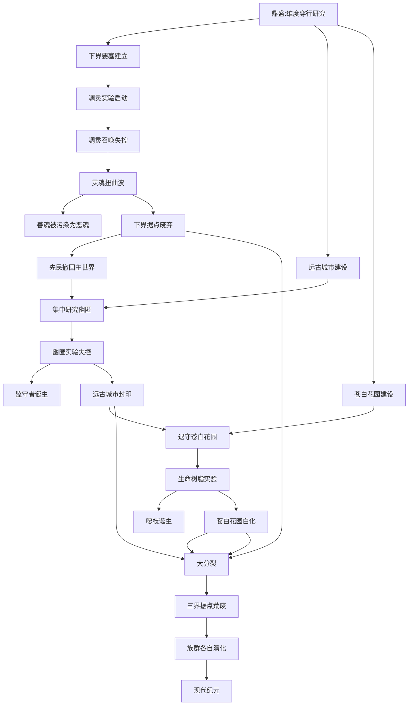
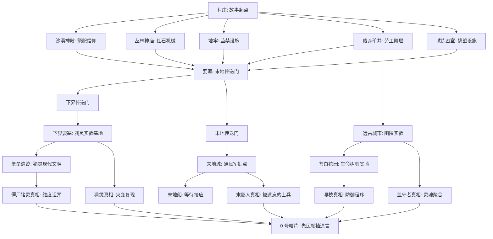

# 16 · 世界观总纲

> **状态**：🟡 设计讨论中
> **对应模组版本**：贯穿全部版本（叙事总纲）
> **创建日期**：2026-09-18
> **最后更新**：2026-09-18
> **设计原则**：[原则 0 · L1/L2/L3 判定](./00-planning-index.md#原则-0优先原版实在没辙才自定义且必须与原版有关)
> **关联章节**：[`BLUEPRINT.md`](../BLUEPRINT.md) · [`02-story-timeline-plan.md`](./02-story-timeline-plan.md) · [`03-player-journey-map.md`](./03-player-journey-map.md)

---

## 1. 目的

本文档是**面向读者（开发者、贡献者、未来的玩家）的世界观总纲**，提供对模组叙事框架的完整理解。与 [`02-story-timeline-plan.md`](./02-story-timeline-plan.md)（开发者用时序骨架）和 [`03-player-journey-map.md`](./03-player-journey-map.md)（玩家用探索路径）形成三角：**总纲（为什么）→ 时序（何时）→ 路径（怎么玩）**。

**核心约束**：
- 所有内容必须是**对原版留白的合理串联**，而非新世界观的创造
- 不引入官方未提及的新种族、新文明、新纪元名称（除非作为对原版留白的解读）
- 严格遵循 L1/L2/L3 原则——世界观总纲属纯叙事文本，不涉及任何机制实现

---

## 2. 一句话世界观

> **「主世界、下界、末地的建筑与生物源自同一支远古先民文明——他们曾掌握维度穿行技术，三大实验失控使他们崩解，今日的村民、猪灵、末影人皆为其后裔。」**

这一句话世界观是模组叙事的全部基础。所有具体设定均从此衍生，且必须能在原版资料中找到对应线索（建筑、生物、物品、Boss 设定）。

---

## 3. 三界同源：视觉与工艺证据

模组叙事的视觉基础是**三界遗迹的石砖工艺一致性**——这不是模组的发明，而是对原版已有视觉线索的解读。

### 3.1 三界遗迹的砌筑工艺对照

| 维度 | 遗迹 | 主要砌筑材料 | 工艺特征 |
|------|------|--------------|----------|
| 主世界 | 要塞 | 石砖（Stone Bricks）、苔石砖、裂纹石砖 | 标准先民砌筑工艺 |
| 主世界 | 沙漠神殿 | 砂岩（Sandstone）、錾制砂岩 | 先民在沙漠群系的本地变体 |
| 主世界 | 丛林神庙 | 苔石（Mossy Cobblestone） | 先民在丛林群系的本地变体 |
| 主世界 | 废弃矿井 | 木板、栅栏、矿车轨道 | 先民劳工阶层的简易结构 |
| 主世界 | 试炼密室 | 凝灰岩（Tuff）、铜质构件 | 先民在地下深处的特殊砌筑 |
| 主世界 | 远古城市 | 深板岩砖（Deepslate Bricks） | 先民在深层地下深处的特殊砌筑 |
| 主世界 | 苍白花园 | 苍白橡木、树脂块 | 先民在生命本源研究场所的特殊砌筑 |
| 下界 | 下界要塞 | 黑砖（Blackstone Bricks）、黑曜石 | 先民在下界的本地变体 |
| 下界 | 堡垒遗迹 | 黑砖、玄武岩、黑石 | 猪灵开智后的现代复刻（同源工艺） |
| 末地 | 末地城 | 紫珀砖（Purpur Bricks）、紫珀块、终界石 | 先民在末地的本地变体 |
| 末地 | 末地船 | 紫珀砖、紫珀块 | 殖民军飞船（同源工艺） |

### 3.2 视觉叙事：四色光谱

模组通过原版四种典型材质颜色，对应先民研究的四大领域，形成贯穿全模组的视觉叙事主线：

| 颜色 | 材质 | 对应研究领域 | 关键遗迹 |
|------|------|--------------|----------|
| 暗红 | 下界合金、远古残骸 | 维度穿行 | 下界要塞、堡垒遗迹 |
| 紫 | 紫珀砖、紫颂果 | 维度异化 | 末地城、末地船 |
| 白 | 苍白橡木、树脂块 | 生命本源 | 苍白花园 |
| 蓝 | 青金石、附魔台界面 | 灵魂能量 | 附魔台、要塞图书馆 |

**叙事意义**：玩家在探索三界时，会自然接触这四种颜色。模组通过 [`planning/15-netherite-enchantment-essence.md`](./15-netherite-enchantment-essence.md) 的笔记内容，向玩家揭示四色光谱的对应关系——这是一种"通过视觉线索串联叙事"的碎片化叙事手法。

### 3.3 同源证据的关键串联点

以下原版视觉线索被模组作为"三界同源"的直接证据：

| 串联点 | 原版线索 | 模组解读 |
|--------|----------|----------|
| 石砖工艺一致 | 主世界要塞、下界要塞、末地城皆使用"砖"形方块（虽材质不同） | 三界遗迹由同一支文明的砌筑工艺建造，材质差异源于本地取材 |
| 楼梯与柱式一致 | 三界遗迹中皆有楼梯、台阶、半砖、柱式结构 | 先民有统一的建筑语法，能根据材质灵活应用 |
| 紫珀砖与石砖工艺对应 | 末地城的紫珀砖楼梯、半砖、柱式与主世界石砖的形态完全一致 | 紫珀砖是先民在末地"用紫颂果合成"的本地石材，工艺与主世界石砖同源 |
| 凝灰岩砖与深板岩砖 | 主世界试炼密室（凝灰岩）与远古城市（深板岩砖）皆使用砖形方块 | 同一文明的两个分支在地下深处使用不同材质，但工艺同源 |

---

## 4. 远古先民文明：四大研究领域

按 [`02-story-timeline-plan.md`](./02-story-timeline-plan.md) §5.1 鼎盛纪元设定，先民在鼎盛期并行研究四大领域，每个领域对应一组遗迹与一种维度能量：

### 4.1 维度穿行（暗红）

**研究领域**：如何在三界间稳定穿行。

**关键遗迹**：
- 主世界：要塞（军事/宗教中心，含末地传送门）
- 下界：下界要塞（前哨站，凋灵实验基地）
- 末地：末地城、末地船（殖民军据点）

**关键物品**：
- 末影之眼（End Pearl + Blaze Powder 合成）：维度穿行的"钥匙"
- 末地传送门框架：维度穿行的"门"
- 下界合金：维度稳定材料，能抗拒维度腐蚀

**研究成果**：先民掌握了维度穿行技术，能在三界间自由往返，并建立了三界据点网络。

### 4.2 红石机械（凝灰岩灰）

**研究领域**：如何用红石作为能量源驱动机械。

**关键遗迹**：
- 主世界：废弃矿井（地下交通与劳工阶层）
- 主世界：试炼密室（挑战与继承测试设施）

**关键物品**：
- 红石粉：能量传导
- 红石火把：能量中继
- 红石中继器：能量延迟
- 试炼刷怪笼：红石+维度能量的"按玩家数量调整"机械
- Vault：红石+铜质的"份额储藏"机械

**研究成果**：先民掌握了红石机械的成熟工艺，能建造复杂的自动化设施。试炼密室是红石机械受控应用的代表。

### 4.3 灵魂能量（蓝）

**研究领域**：如何量化、提取、注入灵魂能量。

**关键遗迹**：
- 主世界：要塞图书馆（附魔台匠人工作场所）
- 下界：下界要塞（凋灵实验基地）
- 主世界地下深处：远古城市（幽匿实验基地）

**关键物品**：
- 附魔台：灵魂能量注入装置
- 青金石：灵魂能量触媒
- 经验值：玩家灵魂能量的度量
- 标准银河字母：先民文字残留，通过形状传导能量
- 灵魂沙：含残留灵魂能量的物质
- 幽匿（Sculk）：能感知声音的生命能量

**研究成果**：先民掌握了灵魂能量的注入技术（附魔），但低估了灵魂能量的边界——这是后续凋灵之灾与幽匿之厄的根源。

### 4.4 生命本源（白）

**研究领域**：如何创造、稳定、修复生命。

**关键遗迹**：
- 主世界：苍白花园（生命树脂实验废墟）

**关键物品**：
- 树脂块：生命本源实验的残留物
- 嘎枝之心：激活嘎枝的"活体方块"
- 苍白橡树：白化后的橡树变种
- 金苹果：先民生命本源研究的"可控产物"（可瞬间治疗）
- 不死图腾：灾厄村民保留的"禁忌生命合成"产物（恼鬼的关联）

**研究成果**：先民掌握了生命本源的部分技术，但生命树脂实验失控——这是苍白之悔的根源。

---

## 5. 六大纪元与因果链

按 [`02-story-timeline-plan.md`](./02-story-timeline-plan.md) 的六大纪元划分：

### 5.1 纪元概览

| 纪元 | 名称 | 核心事件 | 关键遗迹/种族 |
|------|------|----------|---------------|
| I | 鼎盛纪元 | 文明三界开拓，四大研究领域并行 | 要塞、废弃矿井、沙漠神殿、丛林神庙、试炼密室、末地城 |
| II | 凋灵之灾 | 凋灵实验失控，灵魂扭曲波席卷下界 | 下界要塞、凋灵骷髅、恶魂 |
| III | 幽匿之厄 | 幽匿实验失控，远古城市被侵蚀 | 远古城市、监守者、幽匿 |
| IV | 苍白之悔 | 生命树脂实验失控，苍白花园白化 | 苍白花园、嘎枝、嘎枝之心 |
| V | 大分裂 | 文明崩解，三界据点荒废，族群各自演化 | 废弃村庄、猪灵堡垒、末地城 |
| VI | 现代纪元 | 玩家出生时的世界状态 | 村民、流浪商人、猪灵、末影人、灾厄村民 |

### 5.2 因果链：三大实验的先后顺序

按 [`02-story-timeline-plan.md`](./02-story-timeline-plan.md) §4.1 推荐"依次进行"方案：

### 5.3 灾变链的叙事意义

三大灾变的依次进行，体现了模组叙事的核心悲剧——**先民以为自己能控制每一种能量，结果发现不能**：

- 凋灵之灾：先民以为自己能控制灵魂能量的全部
- 幽匿之厄：先民以为自己能控制深层生命能量
- 苍白之悔：先民以为自己能控制生命本源

每一次灾变都是上一次的余波——先民从下界撤回主世界后，集中精力研究幽匿，结果幽匿失控；从远古城市退守苍白花园，结果生命树脂失控。这是"灾难链"叙事的最佳实践，也是模组对原版留白（凋灵骷髅在下界要塞、监守者在远古城市、嘎枝在苍白花园）的最合理串联。

---

## 6. 关键种族演化

### 6.1 三界同源的种族演化矩阵

按 [`02-story-timeline-plan.md`](./02-story-timeline-plan.md) §5.5 大分裂设定：

| 维度 | 原初分支 | 现代后裔 | 演化逻辑 | 原版证据 |
|------|----------|----------|----------|----------|
| 主世界 | 先民定居者 | 村民、流浪商人 | 技术退化，社会延续 | 村民可建造村庄、附魔台匠人工艺保留 |
| 主世界 | 拒绝接受失败的分支 | 灾厄村民 | 研究禁忌生命合成 | 灾厄村民能召唤恼鬼、合成劫掠兽 |
| 主世界地下 | 先民射手阶层 | 骷髅、流髑、Bogged | 灵魂被困，执行最后命令 | 骷髅使用弓/弩，与下界要塞凋灵骷髅同源 |
| 下界 | 先民远征队 | 猪灵、僵尸猪灵 | 环境变异，部分开智 | 猪灵以物易物保留先民贸易传统，能挖掘下界合金原矿 |
| 末地 | 末地殖民军 | 末影人 | 维度异化，记忆残缺 | 末影人怕水、怕光（维度异化副作用），能跨维度传送（保留先民技术） |

### 6.2 关键种族的叙事意义

| 种族 | 叙事意义 | 在模组中的角色 |
|------|----------|----------------|
| 村民 | 先民后裔中保留最多传统的分支 | 提供考古棚、古碑等叙事入口；制图师出售试炼地图 |
| 流浪商人 | 与村民同源但承袭游走遗风 | 偶尔出售残破笔记等叙事物品 |
| 铁傀儡 | 村民对先民守卫的退化复制品 | 暗示先民曾用金属（可能是下界合金）制造更强守卫 |
| 猪灵 | 保留部分先民工艺的分支 | 以物易物给玩家下界合金碎片，是先民贸易传统的延续 |
| 僵尸猪灵 | 猪灵进入主世界后的退化形态 | 暗示维度能量冲突是先民维度穿行技术的副作用 |
| 末影人 | 末地殖民军等待接应无果的异化形态 | "被遗忘的士兵"真相的核心 |
| 骷髅 | 先民射手阶层的遗骨 | 灵魂被困、执行最后命令——是模组"灾难后遗症"叙事的代表 |
| 凋灵骷髅 | 被凋灵能量波抹去灵魂的转化体 | 凋灵之灾的活化石 |
| 恶魂 | 善魂被凋灵能量污染后的形态 | 凋灵之灾的直接受害者 |
| 快乐恶魂 | 灾变前善魂的残留温和变体 | 1.21.11 设定，是模组对原版留白的最直接串联 |
| 嘎枝 | 生命树脂实验的防御程序回响 | 苍白之悔的活化石 |
| 灾厄村民 | 拒绝接受失败的分支后裔 | 大分裂的"另一条路"——他们仍在尝试禁忌生命合成（恼鬼、劫掠兽） |

---

## 7. 关键遗迹的叙事定位

### 7.1 主世界遗迹

| 遗迹 | 建造者 | 叙事定位 | 关联纪元 |
|------|--------|----------|----------|
| 村庄 | 村民（先民后裔） | 故事起点，附加考古棚、古碑等 | 现代纪元 |
| 沙漠神殿 | 远古先民 | 地方祭祀与仓储 | 鼎盛纪元 |
| 丛林神庙 | 远古先民 | 红石机械雏形（绊线陷阱） | 鼎盛纪元 |
| 废弃矿井 | 远古先民 | 地下交通与劳工阶层 | 鼎盛纪元 |
| 要塞 | 远古先民 | 军事/宗教中心，末地传送门 | 鼎盛纪元 |
| 试炼密室 | 远古先民 | 先民为后裔设计的挑战与继承测试设施 | 鼎盛纪元 |
| 远古城市 | 远古先民（科研贵族） | 幽匿实验失控遗迹 | 幽匿之厄 |
| 苍白花园 | 远古先民（禁忌分支） | 生命树脂实验废墟 | 苍白之悔 |
| 古迹废墟 | 远古先民 | 后裔遗弃的早期据点（1.20 考古更新引入） | 鼎盛→大分裂过渡 |
| 埋藏的宝藏 | 远古先民/现代海盗 | 沿海物资储备（mellohi 唱片来源） | 不定期 |

### 7.2 下界遗迹

| 遗迹 | 建造者 | 叙事定位 | 关联纪元 |
|------|--------|----------|----------|
| 下界要塞 | 远古先民（下界远征队） | 下界前哨站，凋灵实验基地 | 鼎盛→凋灵之灾 |
| 堡垒遗迹 | 现代猪灵 | 猪灵开智后自建，文明重启标志 | 现代纪元 |
| 废弃传送门 | 远古先民 | 早期维度穿行尝试的废弃遗址 | 鼎盛纪元早期 |

### 7.3 末地遗迹

| 遗迹 | 建造者 | 叙事定位 | 关联纪元 |
|------|--------|----------|----------|
| 末地城 | 远古先民（末地殖民军） | 最后的据点，等待接应 | 大分裂 |
| 末地船 | 远古先民（末地殖民军） | 等待接应的飞船，含鞘翅 | 大分裂 |
| 末地传送门 | 远古先民 | 维度穿行技术的最高成就 | 鼎盛纪元 |
| 折跃门 | 远代先民 | 维度穿行的简化变体（战后激活） | 大分裂后 |

### 7.4 遗迹间的叙事关联

---

## 8. 玩家角色的定位

### 8.1 玩家是"局外人"

模组设定玩家**不是先民后裔**，而是"局外人"——一个从外部观察这个崩解后世界的存在。

**叙事意义**：
- 玩家通过考古、线索、Boss 击杀，逐步拼凑远古文明真相
- 玩家的"局外人"身份与原版的"史蒂夫/艾利克斯"角色一致——他们没有背景故事，但通过探索获得理解
- 玩家最终通过 0 号唱片合成，听到先民领袖遗言，理解整个文明的兴衰

### 8.2 玩家与原版 Boss 的关系

按 [`07-boss-narrative-binding.md`](./07-boss-narrative-binding.md)：

| Boss | 玩家关系 | 叙事解读 |
|------|----------|----------|
| 凋灵 | 玩家**主动召唤**，重现先民凋灵实验 | 玩家是"复现灾变的人"——通过凋灵骷髅头颅召唤，目睹灾变的余响 |
| 监守者 | 玩家**意外遭遇**，是被困灾变遗址的人 | 玩家是"打扰灾变遗址的人"——监守者会主动追击 |
| 末影龙 | 玩家**主动挑战**，是维度穿行技术的最后守门人 | 玩家是"打破最后守门人的人"——击败末影龙触发守门人真相 |

### 8.3 玩家在三界间的角色变化

| 维度 | 玩家角色 |
|------|----------|
| 主世界 | 考古者——通过遗迹拼凑先民存在 |
| 下界 | 见证者——目睹凋灵之灾的余波 |
| 远古城市 | 入侵者——打扰灾变遗址，被监守者追击 |
| 苍白花园 | 闯入者——进入生命实验废墟，被嘎枝防御 |
| 末地 | 解放者——击败守门人，理解末影人的真相 |
| 真结局 | 继承者——通过 0 号唱片，听到先民领袖遗言 |

---

## 9. 多角色叙事网络

模组通过多份笔记的落款，构建多角色叙事网络：

| 落款 | 角色 | 出现笔记 | 揭晓版本 |
|------|------|----------|----------|
| M. | 先民领袖 / 末地殖民军指挥官 | 笔记 #1（出生点）、#10（试炼密室）、#14（远古城市）、终章（0 号唱片） | v0.1 ~ v0.6 |
| H. | 守考者（试炼密室设计者） | 笔记 #7、#8、#9（试炼密室） | v0.4 |
| K. | 猪灵矿工代表 | 笔记 #11（堡垒遗迹） | v0.3 |
| T. | 猪灵提炼者代表 | 笔记 #12（堡垒遗迹藏宝室） | v0.3 |
| E. | 后裔匠人代表 | 笔记 #13（要塞图书馆） | v0.5 |

**叙事意义**：
- M. 是穿越多纪元的关键角色，从鼎盛到崩解到现代都有其痕迹
- H.、K.、T.、E. 各代表一个分支或一个时代，形成多视角叙事
- 玩家通过收集不同角色的笔记，从多个视角拼凑完整真相

---

## 10. 真结局与"被遗忘的士兵"

模组真结局的核心叙事是"被遗忘的士兵"——这是对原版末影人留白的最直接串联：

### 10.1 原版留白

原版末影人的设定：
- 来自末地
- 怕水、怕光
- 能跨维度传送
- 拾取方块（如花草）
- 被攻击时集体追击
- 死后掉落末影珍珠

### 10.2 模组解读

模组解读末影人为**末地殖民军等待接应无果的异化形态**：

> 「他们不是英雄，不是叛徒，不是怪物。他们只是一群完成任务的士兵，在任务完成后发现……总部已经不在了。」
> —— M.（先民领袖，遗言片段）

**叙事逻辑**：
- 末影人曾为先民末地殖民军，被派往末地建立据点（末地城、末地船）
- 大分裂后，总部（主世界）失联，殖民军等待接应无果
- 长期食用紫颂果与虚空能量影响，殖民军逐渐异化为末影人
- 异化保留了跨维度能力（先民维度穿行技术的残留），但记忆残缺
- 怕水、怕光是维度异化的副作用——他们已经不适应主世界的物理环境
- 拾取方块是"执行最后命令"的残留行为——殖民军曾奉命收集末地资源
- 被攻击时集体追击是"军事防御协议"的残留

### 10.3 真结局的叙事高潮

玩家通过 0 号唱片听到的先民领袖遗言，揭示这一真相——末影人不是怪物，是被遗忘的士兵。玩家击败末影龙的行为，本质上是为这支被遗忘的殖民军"解除守门人"——他们终于可以解脱。

这是模组叙事的最高潮，也是对原版末影人留白的最深刻解读。

---

## 11. 与官方衍生作品的关系

按 [原则 5 · 基于官方衍生作品可参考，但以原版为准](./00-planning-index.md#原则-5基于官方衍生作品可参考但以原版为准)：

### 11.1 Minecraft: Legends（传说）

按 [`14-official-derivatives/01-minecraft-legends.md`](../14-official-derivatives/01-minecraft-legends.md) 资料汇编：

- 设定先民文明曾与下界"猪灵帝国"交战（对应模组的凋灵之灾前奏）
- 设定天启骑士（Action, Foresight, Knowledge, Hope）作为传奇英雄
- 模组解读：天启骑士可能是先民文明的四位领袖，分别对应四大研究领域

### 11.2 Minecraft: Dungeons（地下城）

按 [`14-official-derivatives/02-minecraft-dungeons.md`](../14-official-derivatives/02-minecraft-dungeons.md) 资料汇编：

- 设定"奇厄教主"（Arch-Illager）从灾厄村民分支崛起
- 设定"末影之心"（Heart of Ender）作为终局 Boss
- 模组解读：奇厄教主是模组"灾厄村民分支"的现代继承者，末影之心与模组末地殖民军叙事呼应

**关键约束**：模组仅参考衍生作品作为叙事串联的辅助，所有最终设定以原版为准。衍生作品中的新种族、新 Boss、新维度不引入模组（违反"以原版世界观为主"原则）。

---

## 12. 与原版留白的关系总表

以下是模组对原版留白的所有"合理串联"汇总，按"原版留白 → 模组解读"的对应关系：

| 原版留白 | 模组解读 | 是否新增内容 | 对应文档 |
|----------|----------|--------------|----------|
| 三界遗迹的石砖工艺一致 | 解读为"同源文明的产物" | ✅ 仅解读 | [02-story-timeline-plan §6.2](./02-story-timeline-plan.md#62-模组的补完设定基于原版留白的合理串联) |
| 凋灵骷髅在下界要塞生成 | 解读为"凋灵召唤失控的产物" | ✅ 仅解读 | [02-story-timeline-plan §5.2](./02-story-timeline-plan.md#52-凋灵之灾) |
| 远古残骸是猪灵挖掘残留 | 直接采纳原版 Wiki Trivia | ✅ 完全采纳 | [15-netherite-enchantment-essence §3.2.1](./15-netherite-enchantment-essence.md#321-远古残骸ancient-debris的真相) |
| 附魔台用"标准银河字母" | 解读为"先民文字残留，能量通过形状传导" | ✅ 合理串联 | [15-netherite-enchantment-essence §3.3.1](./15-netherite-enchantment-essence.md#331-附魔台enchanting-table的真相) |
| 远古城市中心的"门型结构" | 解读为"封印幽匿的仪式门" | ✅ 仅解读 | [02-story-timeline-plan §5.3](./02-story-timeline-plan.md#53-幽匿之厄) |
| 试炼密室的建造者 | 解读为"先民后裔挑战体系" | ✅ 仅解读 | [14-trial-chamber-narrative §2.1](./14-trial-chamber-narrative.md#21-三界同源视角下的试炼密室) |
| 末地城等待接应 | 解读为"殖民军等待接应无果" | ✅ 仅解读 | [02-story-timeline-plan §5.6](./02-story-timeline-plan.md#56-现代纪元) |
| 1.21.11+ 快乐恶魂设定 | 解读为"灾变前善魂的残留温和变体" | ✅ 仅解读 | [02-story-timeline-plan §5.2](./02-story-timeline-plan.md#52-凋灵之灾) |
| 末影人怕水、怕光 | 解读为"维度异化的副作用" | ✅ 仅解读 | [02-story-timeline-plan §5.5](./02-story-timeline-plan.md#55-大分裂) |
| 铁傀儡来源 | 解读为"先民守卫的退化复制品" | ✅ 仅解读 | [02-story-timeline-plan §6.2](./02-story-timeline-plan.md#62-模组的补完设定基于原版留白的合理串联) |
| 灾厄村民与村民的敌对 | 解读为"同源但分裂" | ✅ 仅解读 | [02-story-timeline-plan §5.5](./02-story-timeline-plan.md#55-大分裂) |
| 僵尸猪灵的存在 | 解读为"猪灵进入主世界后的退化形态" | ✅ 仅解读 | [02-story-timeline-plan §5.5](./02-story-timeline-plan.md#55-大分裂) |

**结论**：所有模组解读均基于原版已有线索，无任何"凭空创造"。这是模组"对原版留白的合理串联"原则的最佳实践。

---

## 13. 待讨论的设计问题

- [ ] 是否需要为模组补充一个"创世神话"段落？（倾向：否，违反"留白处继续留白"原则——先民的起源本身就是留白）
- [ ] 玩家是否是"局外人"还是"先民后裔"？（倾向：局外人——保留原版史蒂夫/艾利克斯的"无背景角色"设定）
- [ ] 多角色叙事网络的落款（M./H./K./T./E.）是否需要预设完整身份？（倾向：保留留白，仅在版本推进中通过新笔记逐步揭晓）
- [ ] 真结局后的"二周目"内容？（倾向：v1.0 后考虑，不阻塞主线）
- [ ] 与其他叙事模组（如 Optifine's Lore、Twilight Forest）的兼容性？（倾向：v0.9 测试，不强制兼容）

---

## 14. 修订历史

| 日期 | 版本 | 修订内容 | 修订者 |
|------|------|----------|--------|
| 2026-09-18 | v0.1 | 初稿，建立面向读者的世界观总纲，整合 02/03/14/15 各规划文档的核心设定 | 项目方 |
