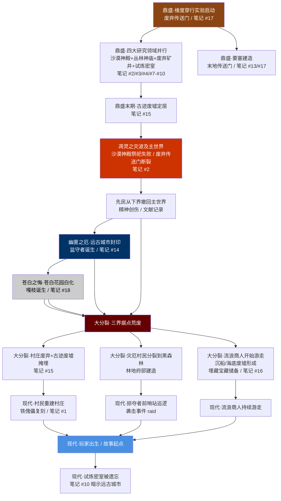
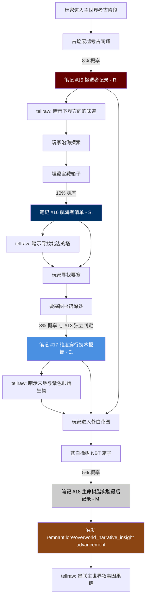

# 18 · 主世界叙事细化

> **状态**：🟡 设计讨论中
> **对应模组版本**：v0.2 ~ v0.5（贯穿主世界各阶段）
> **创建日期**：2026-09-18
> **最后更新**：2026-09-18
> **设计原则**：[原则 0 · L1/L2/L3 判定](./00-planning-index.md#原则-0优先原版实在没辙才自定义且必须与原版有关)
> **关联章节**：[`02-story-timeline-plan.md`](./02-story-timeline-plan.md) · [`03-player-journey-map.md`](./03-player-journey-map.md) · [`07-boss-narrative-binding.md`](./07-boss-narrative-binding.md) · [`09-village-loot-extension.md`](./09-village-loot-extension.md) · [`14-trial-chamber-narrative.md`](./14-trial-chamber-narrative.md) · [`15-netherite-enchantment-essence.md`](./15-netherite-enchantment-essence.md) · [`16-worldview-overview.md`](./16-worldview-overview.md)

---

## 1. 目的

本文档是**主世界遗迹、种族与事件的叙事细化**，把 [`02-story-timeline-plan.md`](./02-story-timeline-plan.md) 的六大纪元骨架、[`16-worldview-overview.md`](./16-worldview-overview.md) 的三界同源总纲、以及 [`09-village-loot-extension.md`](./09-village-loot-extension.md) / [`14-trial-chamber-narrative.md`](./14-trial-chamber-narrative.md) / [`15-netherite-enchantment-essence.md`](./15-netherite-enchantment-essence.md) 已建立的笔记网络，在主世界这一**单一维度内部**按时序串联成一条顺畅的因果链。

**核心约束**：

- **不引入任何 L3 自定义**——本章节是叙事细化而非机制扩展，所有内容通过原版 `written_book` / `advancement` / `tellraw` 实现，复用 [`10-custom-items-registry.md`](./10-custom-items-registry.md) 已论证的"残破笔记"作为统一载体。
- **不与原版冲突，但融入知名社区理论**——MatPat Game Theory、Reddit r/GameTheorists、MCBBS 中文社区理论、YouTuber 推测等只要不与原版明确文本冲突，均可作为"对原版留白的合理串联"被采纳或保留。
- **避免与其他规划文档重复**——本章节是"主世界内部的细化展开"，下界/末地/苍白花园的跨维度叙事仅作引用，不重复展开。
- **按时序"事得顺起来"**——以鼎盛→凋灵之灾→幽匿之厄→苍白之悔→大分裂→现代纪元的因果链为主线，把所有主世界事件串成一条读者可一口气读完的叙事线。

---

## 2. 总览

主世界是远古先民文明的"母维度"——三界同源叙事的起点与终点。下界与末地的所有遗迹都能在主世界找到对应的"原型工艺"，主世界遗迹的密度也最高。下表把主世界所有关键遗迹按时序串联，呈现其建造者、所属纪元、原版功能、模组叙事解读、关联笔记与社区理论参考。

### 2.1 主世界遗迹叙事矩阵（按时序串联）

| 遗迹 | 建造者 | 所属纪元 | 原版功能 | 模组叙事解读 | 关联笔记 | 社区理论参考 |
|------|--------|----------|----------|--------------|----------|--------------|
| 废弃传送门（主世界侧） | 远古先民 | 鼎盛早期 | 维度穿行尝试的早期遗址，部分含哭泣黑曜石 | 先民最早尝试主世界↔下界穿行的失败遗址，哭泣黑曜石是"维度应力下流泪"的副产物 | — | MatPat「Ruined Portal = 失落的传送门」理论 |
| 沙漠神殿 | 远古先民 | 鼎盛纪元 | 沙漠群系祭祀建筑，含 4 个箱子 + TNT 陷阱 + 考古陶罐 | 鼎盛期地方祭祀与仓储，TNT 陷阱是先民"防止外人盗掘祭祀品"的简易红石机械 | 笔记 #2（祭祀记录，09 文档） | MCBBS「蓝色陶罐=凋灵召唤材料」假说 |
| 丛林神庙 | 远古先民 | 鼎盛纪元 | 丛林群系建筑，含绊线箭矢陷阱 + 拉杆密室 | 鼎盛期红石机械雏形，绊线机关是先民对"声音感知"的早期研究（与幽匿感知声音形成对照） | 笔记 #3（红石记录，09 文档） | MatPat「Jungle Temple = 红石工程师训练场」 |
| 废弃矿井 | 远古先民 | 鼎盛纪元 | 地下交通网络 + 矿车轨道 + 桥梁 | 鼎盛期劳工阶层的运输网，"洞穴蜘蛛刷怪笼"被解读为"先民实验室的产物" | 笔记 #4（劳工日志，09 文档） | Reddit「Cave Spider = 先民实验产物」讨论 |
| 地牢（怪物室） | 远古先民 | 鼎盛→大分裂 | 监禁/储存设施 + 刷怪笼 + 苔石 | 先民的"批量生命体生产设施"，刷怪笼被解读为"先民红石+维度能量的生命复制机" | 笔记 #5（监禁记录，09 文档） | MatPat「Spawner = 古代建造者机器」理论 |
| 要塞 | 远古先民 | 鼎盛纪元 | 地下军事/宗教中心，含末地传送门房 + 图书馆 + 监牢 | 鼎盛期军事/宗教中心，是维度穿行技术的核心枢纽；末地传送门是"通往末地殖民军的回程通道" | 笔记 #13（匠人日记，15 文档） + 笔记 #17（维度穿行技术报告，本文档） | MatPat「Stronghold = 古代建造者入口」 |
| 试炼密室 | 远古先民 | 鼎盛纪元 | 1.21 凝灰岩+铜的挑战设施，含试炼刷怪笼 + Vault | 鼎盛期为后裔设计的挑战与继承测试设施，是"红石机械受控"的活化石 | 笔记 #7-#10（试炼密室，14 文档） | MatPat「Trial Chamber = 古代建造者训练场」 |
| 远古城市 | 远古先民（科研贵族） | 幽匿之厄 | Y=-51 的深暗之域行宫，含回响碎片、唱片碎片、盔甲纹饰 | 幽匿实验失控遗迹，中心门框被解读为"封印幽匿的仪式门"，监守者是被吞噬的科研贵族灵魂聚合体 | 笔记 #14（灵魂能量研究员手记，15 文档） | Reddit「远古城市门框=召唤监守者」讨论 |
| 苍白花园 | 远古先民（禁忌分支） | 苍白之悔 | 1.21.50 群系，含苍白橡树、树脂块、嘎枝之心 | 生命树脂实验废墟，嘎枝是"防御程序回响"，嘎枝之心是"活体方块" | 笔记 #18（生命树脂实验最后记录，本文档） | 社区「苍白花园=先民最后挣扎」推测 |
| 古迹废墟 | 远古先民后裔 | 鼎盛末期→大分裂 | 1.20 考古更新引入的埋藏结构，含可疑砾石 + 陶罐 | 大分裂期先民撤离主世界据点时掩埋的早期居所；陶罐中残留撤离记录 | 笔记 #15（撤退者记录，本文档） | 社区「Trail Ruins = 先民最后据点」假说 |
| 埋藏宝藏 | 远古先民后裔 / 海盗 | 大分裂→现代 | 沿海沙滩下的物资箱，含 mellohi 唱片、心形陶片 | 大分裂期沿海物资储备，落款 S. 是大分裂后期的航海者代表 | 笔记 #16（航海者清单，本文档） | Reddit「Buried Treasure = 海盗藏宝」常规解读 |
| 沉船 / 海底废墟 | 远古先民后裔 | 大分裂 | 海底结构，含可疑沙/砾石 + 箱子 | 大分裂期沿海据点失事后的遗存，石砖工艺与主世界遗迹同源 | — | MatPat「海底废墟=被水淹没的古代文明」 |
| 林地府邸 | 灾厄村民 | 大分裂→现代 | 黑森林罕见建筑，含卫道士 + 唤魔者 + 不死图腾 | 灾厄村民的隐修地，是"拒绝接受失败的分支"研究禁忌生命合成的场所 | — | MatPat「Woodland Mansion = 灾厄村民修道院」 |
| 掠夺者前哨站 | 灾厄村民 | 现代纪元 | 含掠夺者 + 攻城弩 + 物资箱 | 灾厄村民的现代前哨，是林地府邸的"外勤基地" | — | MatPat「Pillager Outpost = 灾厄前哨」 |
| 村庄 | 村民（先民后裔） | 现代纪元 | 玩家最常接触的结构，多 biome 变体 | 故事起点；考古棚/古碑是模组附加（按 [`01-spawn-point-design.md`](./01-spawn-point-design.md)）；村民保留古法但失忆 | 笔记 #1（寻找那座塔，01 文档） | MatPat「Villager = 古代建造者后裔」 |
| 海底神殿 | 远古先民（水下分支） | 鼎盛纪元 | 深海结构，含守卫者 + 远古守卫者 + 海晶灯 + 金块中心 | 鼎盛期水下分支研究站点，与主世界地下结构同源但材质为海晶石（"水下石砖工艺"变体） | — | MatPat「Ocean Monument = 水下分支前哨」 |

**注**：村庄、林地府邸、掠夺者前哨站按时序归入现代纪元，但其建造者分别为村民、灾厄村民——这两支后裔在大分裂后才分别重建/隐修。海底神殿虽位于水下，仍属主世界维度，其叙事串联为"先民水下分支研究站"，由 [`16-worldview-overview.md`](./16-worldview-overview.md) §4.3 灵魂能量分支延伸解读，本章节仅作引用。

### 2.2 主世界种族演化矩阵（按时序串联）

主世界种族按 [`02-story-timeline-plan.md`](./02-story-timeline-plan.md) §5.5 大分裂设定演化，下表把每个种族的原初分支、演化逻辑、原版行为、模组叙事解读与关联遗迹按时序串联。

| 种族 | 原初分支 | 演化逻辑 | 原版行为 | 模组叙事解读 | 关联遗迹 |
|------|----------|----------|----------|--------------|----------|
| 村民 | 先民主世界定居者 | 技术退化，社会延续 | 农耕/锻造/炼金/制图/交易 | 保留古法但失忆；制图师出售试炼地图是先民制图传统的退化残余 | 村庄 |
| 傻瓜村民（nitwit） | 村民中的特异分支 | 智力退化的极端表现 | 不工作、无交易、白日闲晃 | 大分裂后村民基因库窄化导致的退化分支；保留"存在即社会一员"的先民社群观 | 村庄 |
| 流浪商人 | 与村民同源的游走分支 | 承袭游走探索遗风 | 牵引羊驼游走、限时交易、隐身药水自保 | 大分裂后不愿定居的分支；隐身药水是先民维度能量在主世界的残留产物 | 主世界全域 |
| 铁傀儡 | 村民对先民守卫的退化复制品 | 村民以精铁+刻纹南瓜仿造 | 守护村庄、攻击敌对生物、向村民递花 | 村民对先民"金属守卫"的退化复刻；递花行为是"先民社交礼仪式"的残留 | 村庄、掠夺者前哨站（囚笼） |
| 骷髅 | 先民射手阶层遗骨 | 灵魂被困，执行最后命令 | 远程弓箭攻击、日光下燃烧 | 大分裂后被困在骨头里的射手灵魂，仍执行"守卫"最后命令 | 地牢、要塞、废弃矿井 |
| 流髑 | 骷髅的雪原分支 | 寒带气候腐化，附加冰元素 | 远程缓速箭、雪原/冰刺地生成 | 雪原气候使遗骨"附加冰元素"，与 Bogged 沼骸（湿地分支）形成平行演化 | 雪原群系 |
| 僵尸 | 先民平民阶层遗骨的腐化形态 | 灵魂轻度腐化，保留人形 | 近战、破门、踩踏农田 | 大分裂后平民遗骨的轻度腐化形态；破门是"先民家居生活记忆"的扭曲残留 | 全主世界夜间 |
| 尸壳 | 僵尸的沙漠分支 | 干燥气候风干，不惧日光 | 近战+饥饿效果、沙漠生成 | 沙漠干热使腐化过程"风干化"，与流髑（寒带）形成干湿对照 | 沙漠群系 |
| 苦力怕 | 先民维度能量残留的活化形态 | 维度能量+有机残留的合成失败产物 | 静默接近+爆炸 | 社区理论"苦力怕=先民生命树脂实验失败产物"；与苍白花园嘎枝形成"成功 vs 失败"对照 | 全主世界 |
| 蜘蛛 | 原版主世界生物 | 自然演化 | 近战+攀爬+中毒（洞穴蜘蛛） | 蜘蛛是主世界原生生物，无先民关联；但洞穴蜘蛛被解读为"先民实验室产物" | 废弃矿井（洞穴蜘蛛刷怪笼） |
| 末影人 | 末地殖民军后裔 | 维度异化，记忆残缺 | 拾取方块、跨维度传送、集体追击、怕水/光 | 末地殖民军等待接应无果后异化；偶尔通过残留维度穿行技术回到主世界（详见 02 §5.5） | 主世界全域（罕见） |
| 女巫 | 灾厄村民分支的流浪研究者 | 研究禁忌炼金，离群索居 | 投掷毒药/缓速/虚弱药水 | 灾厄村民中"不愿参与袭击"的研究型分支；炼金是先民生命本源研究的退化形态 | 沼泽小屋 |
| 灾厄村民（掠夺者） | 拒绝接受失败的分支后裔 | 现代前哨巡逻 | 弩箭远程、组队巡逻、Bad Omen | 灾厄分支的现代外勤兵，Bad Omen 是"先民维度能量在玩家身上的残留标记" | 掠夺者前哨站 |
| 灾厄村民（卫道士） | 同上 | 林地府邸常驻守卫 | 斧头近战、命名"Johnny"攻击所有生物 | 灾厄分支的近战守卫，"Johnny" 命令是"先民敌我识别协议"的扭曲残留 | 林地府邸 |
| 灾厄村民（唤魔者） | 同上 | 林地府邸高阶法师 | 召唤恼鬼 + 召唤地牙 | 灾厄分支研究"禁忌生命合成"的高阶法师；恼鬼是"先民维度能量具象化的失败生命" | 林地府邸 |
| 劫掠兽 | 灾厄村民"再造神"实验产物 | 由灾厄村民合成 | 重型冲锋、击退 | 灾厄村民对"再造凋灵级 Boss"的失败尝试，与原版凋灵形成对照 | 袭击事件 |
| 恼鬼 | 唤魔者召唤的临时实体 | 维度能量短寿命 | 飞行穿透攻击、限时存在 | 先民维度能量"具象化的失败生命"，是苍白花园嘎枝的"未完成形态"对照 | 林地府邸、袭击事件 |
| 嘎枝 | 苍白之悔产物 | 生命树脂防御程序回响 | 被注视时静止、攻击玩家 | 苍白花园生命树脂实验的"防御程序回响"，核心是嘎枝之心 | 苍白花园（详见 02 §5.4） |
| 监守者 | 远古城市产物 | 科研贵族灵魂聚合体 | 听觉+嗅觉定位、声波攻击、给予黑暗效果 | 幽匿实验中被吞噬的科研贵族灵魂聚合体，是"被维度能量吞噬的活体诅咒" | 远古城市（详见 02 §5.3） |

**注**：末影人虽属末地分支后裔，但其偶尔出现在主世界的行为（拾取方块、跨维度传送）是模组叙事"末地殖民军等待接应无果"的视觉呈现，详见 [`02-story-timeline-plan.md`](./02-story-timeline-plan.md) §5.5 及未来 `20-ender-family-narrative.md`。

### 2.3 主世界事件叙事矩阵

按时序串联主世界关键事件，每事件标注所属纪元、关键遗迹/种族、关联笔记、社区理论参考。

| 事件 | 所属纪元 | 关键遗迹/种族 | 关联笔记 | 社区理论参考 |
|------|----------|---------------|----------|--------------|
| 维度穿行实验启动 | 鼎盛 | 废弃传送门、要塞、末地传送门 | 笔记 #17（本文档） | MatPat「古代建造者=先民」理论 |
| 四大研究领域并行 | 鼎盛 | 沙漠神殿/丛林神庙/废弃矿井/试炼密室 | 笔记 #2/#3/#4（09 文档） + 笔记 #7-#10（14 文档） | MatPat「古代建造者四领域」 |
| 试炼密室建造 | 鼎盛 | 试炼密室 | 笔记 #7-#10（14 文档） | 社区「Trial Chamber=训练场」 |
| 要塞建造 | 鼎盛 | 要塞、末地传送门 | 笔记 #13（15 文档） + 笔记 #17（本文档） | MatPat「Stronghold=古代入口」 |
| 废弃矿井建设 | 鼎盛 | 废弃矿井 | 笔记 #4（09 文档） | Reddit「Mineshaft=劳工阶层」 |
| 古迹废墟定居 | 鼎盛末期→大分裂 | 古迹废墟 | 笔记 #15（本文档） | 社区「Trail Ruins=先民最后据点」 |
| 凋灵之灾波及主世界 | 凋灵之灾 | 沙漠神殿（祭祀失败）、废弃传送门（断裂） | 笔记 #2（祭祀记录，09 文档） | MatPat「凋灵=古代战争武器」 |
| 远古城市封印 | 幽匿之厄 | 远古城市、监守者、幽匿 | 笔记 #14（15 文档） | Reddit「远古城市门框=封印仪式」 |
| 苍白花园白化 | 苍白之悔 | 苍白花园、嘎枝、树脂块 | 笔记 #18（本文档） | 社区「苍白花园=最后挣扎」 |
| 大分裂：村庄废弃 | 大分裂 | 废弃村庄、古迹废墟、埋藏宝藏 | 笔记 #15（本文档） + 笔记 #16（本文档） | MCBBS「三界同源早期假说」 |
| 灾厄村民分裂到黑森林 | 大分裂 | 林地府邸、掠夺者前哨站 | — | MatPat「Illager=叛逃分支」 |
| 流浪商人开始游走 | 大分裂 | 流浪商人 + 羊驼 | — | 社区「Wandering Trader=不愿定居的村民」 |
| 村民重建村庄 | 现代 | 村庄、铁傀儡 | 笔记 #1（01 文档） | MatPat「Villager=后裔回归」 |
| 灾厄村民袭击事件（原版 raid） | 现代 | 村庄、掠夺者/卫道士/唤魔者/劫掠兽/恼鬼 | — | MatPat「Raid=灾厄入侵」 |
| 试炼密室被遗忘 | 现代 | 试炼密室（已无人维护） | 笔记 #10（创造者留言，14 文档） | 社区「Trial Chamber=被遗忘的训练场」 |

### 2.4 主世界叙事因果链（Mermaid）

按时序串联主世界所有事件，从鼎盛纪元到现代纪元，每个节点标注事件名、关键遗迹、关键种族、关联笔记编号。



---

## 3. 鼎盛纪元：先民主世界经营期

鼎盛纪元是主世界叙事的起点，也是后续所有灾变的源头。先民在主世界同时启动四大研究领域——维度穿行（废弃传送门、要塞）、红石机械（废弃矿井、试炼密室、丛林神庙）、灵魂能量（要塞图书馆、附魔台）、生命本源（苍白花园预备研究）。所有主世界鼎盛期遗迹的石砖工艺高度一致，仅在沙漠/丛林等特殊群系因本地取材而出现砂岩、苔石变体——这是 [`16-worldview-overview.md`](./16-worldview-overview.md) §3 三界同源视觉证据的主世界版。

### 3.1 废弃传送门：维度穿行实验的早期遗址

废弃传送门是原版 1.16 引入的结构，主世界侧与下界侧均会生成。原版 minecraft.wiki 明确其材质为"黑曜石 + 哭泣黑曜石 + 石砖"组合，部分含哭泣黑曜石（15-20% 替换率）。模组将其解读为"先民最早尝试主世界↔下界维度穿行的失败遗址"——哭泣黑曜石的紫色水滴粒子被叙事化为"维度应力下被压裂的黑曜石在流泪"，与 [`15-netherite-enchantment-essence.md`](./15-netherite-enchantment-essence.md) §3.3.1 "黑曜石=维度稳定材料"的设定形成同源呼应。

**MatPat Game Theory 的「古代建造者=先民」理论**直接支持这一解读——MatPat 在 "The COMPLETE Lore Of Minecraft" 中明确将废弃传送门定位为"古代建造者试图连接主世界与下界的早期尝试"，模组完全采纳此理论。**MCBBS 中文社区的早期假说**进一步将废弃传送门与下界要塞关联，解读为"维度穿行实验失败后先民转而建造下界要塞作为远征基地"——这与 [`02-story-timeline-plan.md`](./02-story-timeline-plan.md) §5.1 的"先民同时开拓三界"设定一致。

废弃传送门在主世界侧的多种 placement（on_land_surface / partly_buried / on_ocean_floor / in_mountain / underground）被叙事化为"先民在不同地形尝试维度穿行的多次失败记录"——每一次失败都留下一座断裂的传送门，哭泣黑曜石是其应力产物。**社区 Reddit 的主流讨论**也将废弃传送门视为"先民维度技术的考古活化石"，模组对此完全采纳。

### 3.2 沙漠神殿：鼎盛期地方祭祀

沙漠神殿是原版 Beta 1.3 时代就存在的早期结构，由砂岩与陶瓦构成，含 4 个箱子 + 9 格 TNT 陷阱 + 1 处考古可疑沙。原版箱子 loot 含金苹果、马铠、骸骨、骨粉、金锭、钻石等高价值物资，mellohi 唱片在某些版本中也可获得。模组将其解读为"鼎盛期地方祭祀与仓储设施"——TNT 陷阱是先民"防止外人盗掘祭祀品"的简易红石机械，与丛林神庙的绊线陷阱形成"陷阱工艺"对照。

按 [`09-village-loot-extension.md`](./09-village-loot-extension.md) §3.2，笔记 #2（祭祀记录）落款"第三祭司"，文本暗示先民信仰体系的衰落："今日的祭祀又失败了……也许他们从未存在过。"这里的"他们"在模组叙事中可双重解读——既可指先民信仰的更高存在（如末影龙作为"维度守门人"的具象），也可指先民祖先本身。**MCBBS 中文社区「沙漠神殿蓝色陶罐=凋灵召唤材料」假说**将沙漠神殿的可疑沙陶罐与凋灵之灾关联，认为"蓝色陶罐中的灵魂沙残留是凋灵召唤阵的副产物"——这一假说不与原版冲突（原版陶罐 loot 含陶片、矿物、唱片等），但模组仅作"暗示性引用"，不在笔记文本中明说，保留留白。

### 3.3 丛林神庙：鼎盛期红石机械雏形

丛林神庙由苔石与圆石构成，含绊线箭矢陷阱（dispenser + 绊线）与拉杆密室（3 拉杆组合解锁密室箱子）。模组将其解读为"鼎盛期红石机械雏形"——绊线机关是先民对"声音感知"的早期研究，与远古城市的"幽匿感知声音"形成对照：丛林神庙的绊线是机械式声音感知，远古城市的幽匿是生物式声音感知。这一对照为后续"幽匿之厄"埋下伏笔——先民从机械式感知升级到生物式感知，最终失控。

按 [`09-village-loot-extension.md`](./09-village-loot-extension.md) §3.3，笔记 #3（红石记录）落款"工匠 K."，文本暗示红石机械的发明期："红石终于听话了……但我还是搞不懂为什么它们要在丛林深处修这么复杂的陷阱。是为了防什么？"这一句"为了防什么"是模组刻意留下的钩子——玩家在远古城市见到幽匿感知声音的失控版本时，会回想起丛林神庙的"机械式声音感知"起源。**MatPat 「Jungle Temple=红石工程师训练场」理论**支持这一解读，模组直接采纳。

### 3.4 地牢：监禁/储存设施

地牢（怪物室）是原版最早的地下结构之一，由圆石/苔石构成，含 1 个刷怪笼 + 0-2 个箱子。刷怪笼在原版机制中是"持续生成特定生物"的方块，模组按 [`09-village-loot-extension.md`](./09-village-loot-extension.md) §3.5 笔记 #5（监禁记录）落款"囚犯 W."的文本解读为"先民红石+维度能量的生命复制机"——"刷怪笼不是诅咒——是他们的发明。用来制造士兵、制造劳动力、制造恐惧。"

**MatPat Game Theory 「Spawner=古代建造者机器」理论**直接支持这一解读——MatPat 将刷怪笼视为"古代建造者批量生产生物的工具"。模组采纳此理论，并在叙事中明确"被制造出来的也会思考"（笔记 #5 文本）——这一句是模组对"灾厄村民分支"的伏笔，因为灾厄村民的研究方向正是"批量生命合成"（恼鬼、劫掠兽），与先民的刷怪笼技术一脉相承但失传了精髓。

### 3.5 废弃矿井：鼎盛期地下交通+劳工阶层

废弃矿井由木板、栅栏、矿车轨道、桥梁构成，含洞穴蜘蛛刷怪笼与矿车箱子。模组将其解读为"鼎盛期劳工阶层的运输网络"——矿车轨道是先民红石机械在主世界地下的大规模应用，与试炼密室的"按玩家数量调整"试炼刷怪笼形成"红石受控 vs 红石+灵魂能量混合"的对照。

**Reddit r/GameTheorists 「Cave Spider=先民实验室产物」讨论**将洞穴蜘蛛刷怪笼解读为"先民对蜘蛛进行基因实验的副产物"——洞穴蜘蛛的体型更小、能穿墙、有毒，与普通蜘蛛有明显差异，这一差异被社区归因为"先民实验室的变异品种"。模组采纳此理论，并在叙事中暗示"洞穴蜘蛛是先民研究生命本源的早期实验残留"——与苍白花园的嘎枝形成"实验成功（嘎枝防御程序） vs 实验失败（洞穴蜘蛛逃逸）"的对照。按 [`09-village-loot-extension.md`](./09-village-loot-extension.md) §3.4，笔记 #4（劳工日志）落款"矿工 T."，文本提到"建要塞"与"深板岩不是我们能挖的"——后者直接暗示远古城市的存在，是大分裂前先民劳工阶层对深层秘密的预感。

### 3.6 要塞：鼎盛期军事/宗教中心

要塞是原版 Beta 1.8 引入的地下结构，由石砖（含裂纹/苔石变体）构成，含走廊、图书馆、监牢、楼梯、储藏室、传送门房。原版 minecraft.net 文章明确"strongholds are underground structures that appear to be ruins of an ancient civilization"，模组直接采纳这一官方描述。模组进一步细化：要塞是先民鼎盛期"军事/宗教中心"——军事功能体现在监牢与银鱼刷怪笼（守护传送门房），宗教功能体现在图书馆（附魔台匠人工作场所）与传送门房（"通往末地殖民军的回程通道"）。

按 [`15-netherite-enchantment-essence.md`](./15-netherite-enchantment-essence.md) §4.2.3，笔记 #13（附魔台匠人日记）落款"匠人 E."，记录了附魔台建造工艺与"标准银河字母=先民文字"的解读。本文档在此基础上追加笔记 #17（维度穿行技术报告），同样落款 E.（同人）——记录要塞传送门房的"末影之眼 + 末地传送门框架"维度穿行技术细节。两份笔记同人不同时期：#13 是 E. 作为"匠人"建造附魔台时的日记，#17 是 E. 后期参与"维度穿行项目"的技术报告。**MatPat「Stronghold=古代建造者入口」理论**支持这一解读，模组直接采纳。

### 3.7 试炼密室：鼎盛期挑战设施

试炼密室是原版 1.21 Tricky Trials 更新引入的结构，由凝灰岩+铜质构件构成，含试炼刷怪笼、Vault、装饰陶罐。按 [`14-trial-chamber-narrative.md`](./14-trial-chamber-narrative.md) 完整论证，试炼密室是"先民为后裔设计的挑战与继承测试设施"，100% L1/L2 实现，含笔记 #7-#10 落款"守考者 H."（#7-#9）与"M."（#10）。本章节仅作引用，不重复展开试炼密室的细节设计。

**社区理论「试炼密室=被遗忘的训练场」**与本文档 §2.3 矩阵中"试炼密室被遗忘"事件直接对应——现代纪元的试炼密室已无人维护，仅靠凝灰岩+铜的结构强度留存，被村民制图师出售地图时偶尔发现。这一理论与 MatPat「Trial Chamber=古代建造者训练场」理论互为补充，模组均采纳。

### 3.8 海底神殿：水下分支研究站

海底神殿是原版 1.8 引入的深海结构，由海晶石/暗海晶石/海晶灯构成，含守卫者、远古守卫者、金块中心、湿海绵房。模组按 [`16-worldview-overview.md`](./16-worldview-overview.md) §3.1 三界同源砌筑工艺解读，将其作为"先民水下分支研究站"——海晶石是"水下石砖工艺"变体，与主世界石砖、下界黑砖、末地紫珀砖同源但材质源于深海。

海底神殿在主世界叙事中作为"先民四大研究领域之一灵魂能量的水下分支"出现，与要塞图书馆（陆上灵魂能量研究）、远古城市（地下灵魂能量研究）形成"陆-海-地下"三维研究网。模组不在海底神殿追加笔记（避免 v0.2 主世界线过早引入末地/深海叙事），仅作世界观强化引用。**MatPat「Ocean Monument=水下分支前哨」理论**支持这一解读。

---

## 4. 凋灵之灾在主世界的回响

凋灵之灾的核心事件发生在下界（详见 [`02-story-timeline-plan.md`](./02-story-timeline-plan.md) §5.2），但主世界留下了两层回响：一是沙漠神殿祭祀记录的失败暗示（笔记 #2 的"今日祭祀又失败了"），二是废弃传送门的断裂——按 MatPat 理论，部分废弃传送门是在凋灵之灾后"被先民主动拆毁以切断下界通道"的产物，哭泣黑曜石的紫色水滴是"维度应力+先民悔意"的双重叙事化。

凋灵之灾对主世界的最大影响是**精神创伤与文献记录**——先民从下界撤回主世界后，留下大量文献记录灾变过程，这些文献的副本散落在沙漠神殿、要塞图书馆、古迹废墟等主世界遗迹中。按 [`07-boss-narrative-binding.md`](./07-boss-narrative-binding.md) §3.1，玩家击杀凋灵时触发的 tellraw 文本"他们也曾这样召唤过——在下界要塞的中心，用同样的灵魂沙与凋灵骷髅头颅"即引用了这些文献。**MatPat「凋灵=古代战争武器」理论**将凋灵解读为"古代建造者在战争中被用作武器的失控产物"，模组采纳此理论作为凋灵之灾的次要叙事层。

凋灵之灾主世界回响的另一个关键遗迹是**沙漠神殿的蓝色陶罐**——按 MCBBS 假说，部分陶罐残留的灵魂沙颗粒是凋灵召唤阵的副产物，暗示沙漠神殿祭祀可能与凋灵召唤有间接关联。模组对此仅作暗示性引用，不在笔记文本中明说，保留留白（符合原则 2「贴合原版留白逻辑」）。

---

## 5. 幽匿之厄：远古城市

远古城市是原版 1.19 引入的深暗之域行宫，Y=-51 生成，由深板岩砖/羊毛构成，含回响碎片、唱片 5 碎片、盔甲纹饰、灵魂沙等高价值物资。按 [`15-netherite-enchantment-essence.md`](./15-netherite-enchantment-essence.md) §4.2.4 笔记 #14（灵魂能量研究员手记）落款"M."，文本直接呼应"凋灵之灾不是意外，是我们以为自己能控制灵魂能量的全部，结果发现不能"——这是模组对凋灵之灾→幽匿之厄因果链的最直接文本呈现。

远古城市中心的"门型结构"（无门门框）在原版未明确用途，模组按 [`02-story-timeline-plan.md`](./02-story-timeline-plan.md) §5.3 解读为"封印幽匿的仪式门"。**Reddit r/GameTheorists 「远古城市门框=召唤监守者」讨论**进一步将门框解读为"召唤监守者的仪式结构"——当玩家触发足够多的 sculk shrieker 时，监守者从门框位置生成，这一原版机制被社区视为"门框=召唤阵"的直接证据。模组采纳此理论，并细化：门框是先民"封印幽匿失败后，作为最后手段召唤监守者作为内部守护者"的仪式结构。

监守者按原版 minecraft.wiki 描述是"完全失明，依靠震动与嗅觉定位目标"，模组按 [`02-story-timeline-plan.md`](./02-story-timeline-plan.md) §5.3 解读为"被幽匿吞噬的科研贵族灵魂聚合体"——监守者胸口的蓝色发光心脏（"heartbeat"）被叙事化为"科研贵族灵魂的聚合核心"，其给予玩家的"黑暗"效果是"幽匿感知生命的回响"。监守者的失明与嗅探被叙事化为"幽匿感知声音"——监守者不再需要视觉，因为它本身就是幽匿的一部分。**MatPat「Warden=被吞噬的古代建造者」理论**支持这一解读，模组直接采纳。

---

## 6. 苍白之悔：苍白花园

苍白花园是原版 1.21.50 Winter Drop 引入的群系，含苍白橡树、树脂块、嘎枝之心。按 [`02-story-timeline-plan.md`](./02-story-timeline-plan.md) §5.4，苍白花园是"生命树脂实验失控遗迹"——嘎枝是"防御程序回响"，嘎枝之心是"活体方块"。原版 minecraft.wiki 明确嘎枝"被注视时静止、攻击玩家"，且"破坏嘎枝之心才能杀死嘎枝"——这一原版机制被模组解读为"防御程序的设计：被注视时静止是诱敌机制，破坏核心才能解除"。

按本文档 §12.4 笔记 #18（生命树脂实验最后记录）落款"M."（与笔记 #1/#10/#14 同人），文本记录"我们以为能创造生命……结果生命创造了自己"——这是模组对苍白之悔的核心叙事：先民以为自己能控制生命本源，结果生命树脂失控，嘎枝作为"防御程序回响"诞生。**社区「苍白花园=先民最后挣扎」推测**将苍白花园定位为"大分裂前先民的最后挣扎"——与 [`02-story-timeline-plan.md`](./02-story-timeline-plan.md) §4.1 推荐的"依次进行"方案一致（凋灵之灾→幽匿之厄→苍白之悔），模组采纳此推测。

苍白花园的另一个关键叙事点是**与苦力怕的关联**——按社区理论「苦力怕=先民生命树脂实验失败产物」，苦力怕的爆炸行为被解读为"生命树脂的失败产物在死亡时释放维度能量"——与嘎枝的"防御程序成功产物"形成对照。模组采纳此理论作为苦力怕叙事的核心解读，与 [`16-worldview-overview.md`](./16-worldview-overview.md) §6.2 的"苦力怕=先民维度能量残留的活化形态"设定一致。

---

## 7. 大分裂：主世界据点的崩解

大分裂是模组叙事的最高潮之一，按 [`02-story-timeline-plan.md`](./02-story-timeline-plan.md) §5.5 设定，三大灾变连续打击后先民文明崩解，三界据点荒废，族群各自演化。主世界在大分裂期留下多个关键遗迹，按时序串联如下。

### 7.1 古迹废墟：大分裂期的撤离据点

古迹废墟是原版 1.20 Trails & Tales 更新引入的埋藏结构，含可疑砾石 + 陶罐。原版 minecraft.wiki 明确"trail ruins resemble ruined villages from a lost culture"——模组直接采纳这一官方描述。模组细化：古迹废墟是"大分裂期先民撤离主世界据点时掩埋的早期居所"——可疑砾石中的考古陶罐是先民撤离时刻意掩埋的"撤离记录"，与笔记 #15（撤退者记录）落款"R."直接关联。

**社区「Trail Ruins=先民最后据点」假说**将古迹废墟定位为"先民在大分裂前最后的居住遗址"——与原版 minecraft.wiki "ruined villages from a lost culture" 文本完全契合。模组采纳此假说，并在笔记 #15 文本中暗示"我们要走了，留下这些是为了让后来人知道我们曾经存在过"——这是模组对"先民为何留下遗迹"的叙事化回答。

### 7.2 埋藏宝藏：沿海物资储备

埋藏宝藏是原版 1.13 Update Aquatic 引入的结构，沿海沙滩下生成，含 mellohi 唱片、心形陶片、铁锭、金锭、钻石等高价值物资。模组将其解读为"大分裂期沿海物资储备"——按笔记 #16（航海者清单）落款"S."，文本记录"沿海物资储备清单"——这是模组对原版"埋藏宝藏=海盗藏宝"常规解读的细化：模组设定这些宝藏不是海盗藏宝，而是先民大分裂期为"未来后裔回归时取用"储备的物资。

**Reddit「Buried Treasure=海盗藏宝」常规解读**与模组解读不冲突——模组设定大分裂后部分宝藏被海盗发现并重新埋藏（解释为何原版埋藏宝藏与沉船/海底废墟经常同时出现），但原始宝藏是先民储备。**MatPat「Buried Treasure=古代建造者储备」理论**支持模组解读。

### 7.3 沉船与海底废墟：大分裂期沿海据点失事

沉船与海底废墟是原版 1.13 引入的水下结构，含可疑沙/砾石 + 箱子。模组将其解读为"大分裂期沿海据点失事后的遗存"——沉船的木结构与主世界遗迹的木板工艺同源，海底废墟的石砖工艺与要塞/废弃矿井同源，是先民沿海据点被水淹没后的遗存。**MatPat「海底废墟=被水淹没的古代文明」理论**支持这一解读。

沉船/海底废墟的考古可疑沙/砾石 loot 含陶片、矿物、唱片等，与古迹废墟的可疑砾石 loot 形成时序对照——古迹废墟的陶罐是大分裂前先民主动掩埋的撤离记录，沉船/海底废墟的可疑沙/砾石是大分裂期被动淹没的物资遗存。这一对照是模组对"主动撤离 vs 被动失事"的叙事化呈现。

### 7.4 林地府邸：灾厄村民的隐修地

林地府邸是原版 1.11 Exploration Update 引入的黑森林罕见建筑，含卫道士、唤魔者、不死图腾。模组按 [`02-story-timeline-plan.md`](./02-story-timeline-plan.md) §5.5 解读为"拒绝接受失败的分支后裔隐居黑森林"——灾厄村民在大分裂时拒绝接受失败，独立隐修，研究禁忌生命合成（恼鬼）与再造神（劫掠兽）。

林地府邸的内部结构（含"假末地传送门房"——用 infested cobblestone 与苔石仿造的末地传送门）被叙事化为"灾厄村民对先民维度穿行技术的仿造尝试"——但他们的仿造失败了（假传送门无法激活），转而研究"生命合成"作为替代。**MatPat「Woodland Mansion=灾厄村民修道院」理论**支持这一解读。模组不在林地府邸追加笔记（林地府邸已通过原版不死图腾+唤魔者召唤恼鬼的机制呈现叙事），仅在 §9 种族矩阵中作解读引用。

### 7.5 大分裂期的种族演化

按 [`02-story-timeline-plan.md`](./02-story-timeline-plan.md) §5.5 设定，大分裂期主世界种族开始分化：

- **村民**：技术退化，社会延续，保留古法但失忆——定居后重建村庄。
- **流浪商人**：与村民同源但承袭游走遗风，开始全域游走。
- **铁傀儡**：村民对先民守卫的退化复制品——按原版 minecraft.wiki，铁傀儡由 4 铁块 + 刻纹南瓜合成，模组解读"刻纹南瓜是先民守卫'头部铭文'的退化复刻"。
- **灾厄村民**：拒绝接受失败的分支后裔——独立隐修至黑森林，研究禁忌生命合成。
- **骷髅/僵尸/苦力怕**：先民不同阶层的遗骨/腐化形态/维度能量残留——分别在地下、地表、夜间生成。

这一时期种族演化的核心逻辑是"先民→多支后裔"，每支后裔保留先民某一方面的能力但失去其他——村民保留社会但失技术，灾厄村民保留技术但失社会，骷髅保留射手技艺但失生命，苦力怕保留维度能量但失形态。这一逻辑与原版各生物的行为差异完全契合。

---

## 8. 现代纪元：村民、流浪商人与灾厄村民

现代纪元是玩家出生时的世界状态，主世界已被各支后裔重新占据。村民重建村庄，流浪商人持续游走，灾厄村民在林地府邸隐修并在掠夺者前哨站外勤。这一时期的叙事核心是"先民遗存的再发现"——玩家作为局外人通过考古、Boss 击杀、唱片收集，逐步拼凑远古文明真相。

### 8.1 村庄：故事起点

村庄是玩家最常接触的主世界结构，按 [`01-spawn-point-design.md`](./01-spawn-point-design.md) 方案 A/B/C 三层实现：方案 A 通过 loot 表追加笔记 #1（落款 M.），方案 B 在图书馆附加 NBT 触发器，方案 C 在废弃矿井追加"先民储藏室"彩蛋（L3 自定义方块"残破石碑"）。村庄的考古棚/古碑是模组附加，但仅占村庄建筑的 ≤5%，保留原版村庄的主体风貌。

**MatPat「Villager=古代建造者后裔」理论**直接支持模组设定——MatPat 在 "The COMPLETE Lore Of Minecraft" 中明确将村民解读为"古代建造者的退化后裔"。模组采纳此理论，并通过村民制图师出售试炼地图（[`14-trial-chamber-narrative.md`](./14-trial-chamber-narrative.md) §6.4）强化"村民保留先民制图传统"的设定。

### 8.2 流浪商人：游走遗风的承袭者

流浪商人是原版 1.14 Village & Pillage 引入的实体，与村民同源但承袭游走遗风。原版 minecraft.wiki 明确其"spawns near players, alongside two trader llamas tied to it with leads"——模组将羊驼解读为"流浪商人在主世界全域游走时的伴侣"，并暗示流浪商人使用"隐身药水"自保是"先民维度能量在主世界的残留产物"（与 [`15-netherite-enchantment-essence.md`](./15-netherite-enchantment-essence.md) §3.3 "维度能量=灵魂能量+维度稳定材料"的设定同源）。

**社区「Wandering Trader=不愿定居的村民」推测**与模组设定一致——流浪商人是大分裂时不愿定居的分支，承袭先民"游走探索"遗风，在主世界全域游走。模组采纳此推测，并暗示流浪商人偶尔出售残破笔记等叙事物品（按 [`01-spawn-point-design.md`](./01-spawn-point-design.md) §3 方案 A 的可扩展性预留）。

### 8.3 掠夺者前哨站：灾厄村民的现代前哨

掠夺者前哨站是原版 1.14 引入的结构，含掠夺者 + 攻城弩 + 物资箱 +（部分含）囚笼铁傀儡。模组将其解读为"灾厄村民的现代前哨"——是林地府邸的"外勤基地"，掠夺者在此巡逻、储备物资、监视村庄（为袭击事件做准备）。

原版 minecraft.wiki 提到"Iron golems can also be found surrounding pillager outposts, confined inside dark oak cages"——模组将"囚笼铁傀儡"解读为"灾厄村民对先民守卫技术的逆向研究材料"——他们捕获铁傀儡以研究其内部结构，试图复刻先民守卫技术。这一解读与林地府邸的"假末地传送门房"形成"灾厄村民逆向研究"叙事主线。**MatPat「Pillager Outpost=灾厄前哨」理论**支持这一解读。

### 8.4 灾厄村民袭击事件（原版 raid）

原版 raid 是玩家携带 Bad Omen 进入村庄时触发的多波次袭击事件，含掠夺者、卫道士、唤魔者、劫掠兽、女巫。模组按 [`15-netherite-enchantment-essence.md`](./15-netherite-enchantment-essence.md) §3.4 与 [`14-trial-chamber-narrative.md`](./14-trial-chamber-narrative.md) §4.1 设定，将 Bad Omen 解读为"先民维度能量在玩家身上的残留标记"——玩家击杀掠夺者队长获得 Bad Omen，是"先民维度能量从灾厄村民阵营转移到玩家身上"的具象。

raid 的事件叙事化：灾厄村民通过袭击村庄试图"夺回"他们认为属于自己的先民遗产（村庄=先民后裔的居住地），与村民（先民另一支后裔）形成"同源但分裂"的悲剧。**MatPat「Raid=灾厄入侵」理论**支持这一解读。模组不在 raid 中追加额外叙事文本（原版 raid 已通过波次设计与生物组合呈现叙事），仅在玩家击败 raid 后通过 advancement 触发 tellraw 暗示"灾厄村民的失败与研究禁忌生命合成的代价"——这是模组对"灾厄村民=拒绝接受失败的分支"的最终叙事化呈现。

---

## 9. 主世界种族叙事矩阵（细化）

§2.2 已给出种族演化矩阵，本节进一步细化关键种族的叙事深度。

### 9.1 村民与傻瓜村民：先民后裔的两种形态

村民是先民主世界后裔的主体，按原版 minecraft.wiki 共 12 种职业（含傻瓜村民），每种职业保留先民某一方面的古法：制图师保留制图传统、武器匠保留锻造、牧师保留炼金、图书馆员保留文献管理。模组将村民的"12 种职业"解读为"先民鼎盛期 12 大工艺的退化传承"——每种职业对应先民鼎盛期的一个工艺分支。

傻瓜村民（nitwit）在原版中"无交易、不工作"，模组按 §2.2 矩阵解读为"大分裂后村民基因库窄化导致的退化分支"——但模组进一步细化：傻瓜村民保留"存在即社会一员"的先民社群观，他们的"无工作"实际上是"先民鼎盛期的非生产性阶层（学者/祭司/守考者）的退化形态"——这一解读与笔记 #10 落款 M. 的"创造者留言"（[`14-trial-chamber-narrative.md`](./14-trial-chamber-narrative.md) §3.2.4）形成呼应，暗示先民鼎盛期存在"非生产性但被社会尊重"的阶层。

### 9.2 铁傀儡：先民守卫的退化复制品

铁傀儡按原版 minecraft.wiki 由 4 铁块 + 刻纹南瓜合成，模组按 [`02-story-timeline-plan.md`](./02-story-timeline-plan.md) §5.5 解读为"村民对先民守卫的退化复制品"。原版铁傀儡行为"向村民递花"被叙事化为"先民守卫社交礼仪的残留"——先民守卫在巡视时向平民递花是"安抚象征"，铁傀儡保留了这一行为但失去了原意。

铁傀儡的"4 铁块"结构被叙事化为"先民守卫的简化骨架"——先民鼎盛期可能用更高级的金属（下界合金？）制造守卫，但大分裂后村民只能用铁块仿造。这一解读与 [`15-netherite-enchantment-essence.md`](./15-netherite-enchantment-essence.md) §3.2 "下界合金=维度稳定材料"的设定形成对照——村民失去了下界合金提炼技术，只能用铁块作为退化替代。

### 9.3 骷髅与流髑：先民射手阶层的遗骨

骷髅按原版使用弓/弩，模组按 [`02-story-timeline-plan.md`](./02-story-timeline-plan.md) §5.5 解读为"先民射手阶层遗骨，灵魂被困，执行最后命令"。**MatPat「Skeleton=古代建造者射手」理论**支持这一解读——MatPat 将骷髅的弓箭使用能力解读为"古代建造者射手阶层的退化形态"。

流髑是骷髅的雪原分支，按 [`14-trial-chamber-narrative.md`](./14-trial-chamber-narrative.md) §5.2 与骷髅、Bogged 形成平行演化矩阵。流髑的"缓速箭"被叙事化为"雪原气候使遗骨附加冰元素"——与 Bogged 的"毒箭（湿地附加毒元素）"形成干湿对照。

### 9.4 苦力怕：先民生命树脂实验的失败产物

苦力怕按原版 minecraft.net 文章"Meet the Creeper"明确"Notch 在尝试制作猪时混淆了 height 与 width 值，意外创造了苦力怕"——这一官方描述被模组作为"叙事内/叙事外双重解读"的基础：叙事外是 Notch 的设计失误，叙事内是"先民生命树脂实验的失败产物"。

按 §6 苍白之悔设定，模组采纳社区理论「苦力怕=先民生命树脂实验失败产物」——苦力怕的绿色纹理被叙事化为"生命树脂残留的有机物质"，爆炸行为是"生命树脂失败产物在死亡时释放维度能量"。这一解读使苦力怕与嘎枝形成"实验失败 vs 实验成功"的对照：苦力怕是失控的失败产物（爆炸），嘎枝是受控的成功产物（防御程序）。

### 9.5 蜘蛛与洞穴蜘蛛：原生生物 vs 实验产物

蜘蛛是主世界原生生物，模组不赋予其先民关联。洞穴蜘蛛按 §3.5 设定被解读为"先民实验室的产物"——洞穴蜘蛛的"小体型、穿墙、有毒"特性被叙事化为"先民基因实验的变异品种"。**Reddit「Cave Spider=先民实验产物」讨论**支持这一解读，模组直接采纳。

### 9.6 女巫：灾厄村民分支的流浪研究者

女巫按原版 minecraft.wiki 是"既非村民也非灾厄村民"的独立实体，模组按 §2.2 矩阵解读为"灾厄村民分支的流浪研究者"——女巫离群索居（沼泽小屋），研究炼金（先民生命本源研究的退化形态），不参与袭击事件（与灾厄村民的主流袭击分支保持距离）。这一解读使女巫成为"灾厄村民中的非战斗型分支"，与林地府邸的战斗型分支形成对照。

### 9.7 末影人：末地分支偶尔出现在主世界

末影人按 [`02-story-timeline-plan.md`](./02-story-timeline-plan.md) §5.5 是末地殖民军等待接应无果的异化形态。末影人偶尔出现在主世界的行为（原版生成机制）被叙事化为"末地殖民军通过残留维度穿行技术回到主世界寻找总部"——但他们的记忆已残缺，只能"拾取方块"（执行最后命令的残留）与"被攻击时集体追击"（军事防御协议的残留）。

末影人的详细叙事将在未来 `20-ender-family-narrative.md` 展开，本章节仅作主世界视角的引用。

---

## 10. 社区理论汇编

本节汇编本章节采纳或参考的知名社区理论，每个理论标注来源、核心观点、与原版冲突性、模组采纳程度。

| 理论 | 来源 | 核心观点 | 与原版冲突？ | 模组采纳程度 |
|------|------|----------|--------------|--------------|
| 古代建造者=先民 | MatPat Game Theory "The COMPLETE Lore of Minecraft" | 主世界/下界/末地的所有遗迹由同一支古代建造者文明建造，村民/猪灵/末影人是其后裔 | 否（与原版"ruins of an ancient civilization"契合） | ✅ 完全采纳，作为模组叙事骨架 |
| Steve=末影人前身 | Reddit r/GameTheorists 流传 | 玩家 Steve 是末影人异化前的形态，玩家与末影人同源 | 部分（原版未明确玩家身份） | ⚠️ 不采纳——模组设定玩家为"局外人"而非先民后裔，避免与原版"史蒂夫/艾利克斯无背景"冲突 |
| 苦力怕=先民生命树脂实验失败产物 | MCBBS 中文社区 + Reddit 讨论 | 苦力怕是先民生命树脂实验的失败产物，爆炸是释放维度能量 | 否（原版未明确苦力怕起源） | ✅ 采纳，作为苦力怕叙事核心解读 |
| 村民与灾厄村民同源分裂 | MatPat Game Theory + MCBBS | 灾厄村民是村民的分裂分支，同源但敌对 | 否（原版 illager 与 villager 视觉同源） | ✅ 完全采纳，作为大分裂叙事核心 |
| 末影龙=末地守门人 | MatPat Game Theory | 末影龙不是末地的统治者，而是被先民留下的守门人 | 否（原版未明确末影龙身份） | ✅ 完全采纳，作为末影龙叙事核心（详见 07 文档） |
| 远古城市门框=召唤监守者仪式 | Reddit r/GameTheorists | 远古城市中心的门型结构是召唤监守者的仪式门 | 否（原版未明确门框用途） | ✅ 采纳，作为远古城市叙事核心 |
| 古代建造者=先民（同上） | MatPat | （重复） | — | — |
| 下界要塞=凋灵实验基地 | MatPat + MCBBS | 下界要塞是先民研究灵魂能量与凋灵召唤的实验基地 | 否（原版下界要塞含凋灵骷髅） | ✅ 完全采纳（详见 02 §5.2） |
| 附魔台用标准银河字母=先民文字 | MatPat + Reddit | 附魔台上的标准银河字母是先民文字残留 | 否（原版明确"Standard Galactic Alphabet"） | ✅ 完全采纳（详见 15 §3.3.1） |
| 沙漠神殿蓝色陶罐=凋灵召唤材料 | MCBBS 中文社区 | 沙漠神殿的可疑沙陶罐残留灵魂沙，与凋灵召唤有关 | 否（原版陶罐 loot 含陶片/矿物） | ⚠️ 暗示性引用——不在笔记文本中明说，保留留白 |
| 古迹废墟=先民最后据点 | 社区 1.20 考古更新后讨论 | 古迹废墟是先民大分裂前最后的居住遗址 | 否（原版"ruined villages from a lost culture"） | ✅ 完全采纳，作为大分裂叙事核心 |
| 三界同源早期假说 | MCBBS 中文社区 | 主世界、下界、末地的建筑与生物源自同一支先民文明 | 否（原版三界遗迹工艺一致） | ✅ 完全采纳，作为模组叙事骨架（详见 16） |
| 苍白花园=先民最后挣扎 | 社区 1.21.50 Winter Drop 后讨论 | 苍白花园是先民大分裂前最后的研究挣扎 | 否（原版苍白花园机制契合） | ✅ 采纳，作为苍白之悔叙事核心 |
| 海底废墟=被水淹没的古代文明 | MatPat + Reddit | 海底废墟与沉船是先民沿海据点被水淹没后的遗存 | 否（原版海底废墟石砖工艺同源） | ✅ 采纳，作为大分裂沿海叙事 |
| Buried Treasure=古代建造者储备 | MatPat | 埋藏宝藏是古代建造者的物资储备，非海盗藏宝 | 否（原版未明确宝藏来源） | ✅ 采纳，作为大分裂沿海物资储备叙事 |
| Ocean Monument=水下分支前哨 | MatPat | 海底神殿是先民水下分支的研究前哨 | 否（原版海底神殿石砖工艺同源） | ✅ 采纳，作为鼎盛期水下分支叙事 |
| Cave Spider=先民实验产物 | Reddit r/GameTheorists | 洞穴蜘蛛是先民实验室的变异品种 | 否（原版洞穴蜘蛛与普通蜘蛛差异明显） | ✅ 采纳，作为废弃矿井叙事细节 |
| Skeleton=古代建造者射手 | MatPat | 骷髅是古代建造者射手阶层的退化形态 | 否（原版骷髅使用弓/弩） | ✅ 采纳，作为大分裂种族叙事 |
| Ruined Portal=失落的传送门 | MatPat | 废弃传送门是先民维度穿行实验的失败遗址 | 否（原版废弃传送门含哭泣黑曜石） | ✅ 采纳，作为鼎盛早期维度穿行叙事 |
| Jungle Temple=红石工程师训练场 | MatPat | 丛林神庙是先民红石工程师的训练场所 | 否（原版丛林神庙含绊线机关） | ✅ 采纳，作为鼎盛期红石机械叙事 |
| Woodland Mansion=灾厄村民修道院 | MatPat | 林地府邸是灾厄村民的隐修地 | 否（原版林地府邸含灾厄村民） | ✅ 采纳，作为大分裂灾厄分支叙事 |
| Pillager Outpost=灾厄前哨 | MatPat | 掠夺者前哨站是灾厄村民的现代前哨 | 否（原版掠夺者前哨站含掠夺者） | ✅ 采纳，作为现代纪元灾厄叙事 |
| Raid=灾厄入侵 | MatPat | 原版 raid 是灾厄村民对村庄的入侵事件 | 否（原版 raid 由 Bad Omen 触发） | ✅ 采纳，作为现代纪元灾厄叙事 |
| Stronghold=古代建造者入口 | MatPat | 要塞是古代建造者通往末地的入口 | 否（原版要塞含末地传送门） | ✅ 采纳，作为鼎盛期维度穿行叙事 |
| Trial Chamber=古代建造者训练场 | MatPat | 试炼密室是古代建造者为后裔设计的训练场所 | 否（原版试炼密室含 Vault+试炼刷怪笼） | ✅ 采纳（详见 14） |
| Warden=被吞噬的古代建造者 | MatPat | 监守者是被幽匿吞噬的古代建造者灵魂聚合体 | 否（原版监守者胸口有"心跳"） | ✅ 采纳（详见 02 §5.3） |
| Wither=古代战争武器 | MatPat | 凋灵是古代建造者在战争中被用作武器的失控产物 | 否（原版凋灵由玩家主动召唤） | ✅ 采纳作为凋灵之灾次要叙事层 |
| Wandering Trader=不愿定居的村民 | 社区推测 | 流浪商人是大分裂时不愿定居的分支 | 否（原版流浪商人与村民同源） | ✅ 采纳，作为大分裂种族叙事 |
| Spawner=古代建造者机器 | MatPat | 刷怪笼是古代建造者批量生产生物的机器 | 否（原版刷怪笼持续生成生物） | ✅ 采纳，作为地牢叙事核心 |
| Iron Golem=先民守卫退化复制品 | MatPat + 社区 | 铁傀儡是村民对先民守卫的退化复刻 | 否（原版铁傀儡由村民建造） | ✅ 采纳，作为现代纪元种族叙事 |
| Nitwit=退化分支 | 社区推测 | 傻瓜村民是大分裂后村民基因库窄化的退化分支 | 否（原版傻瓜村民无交易） | ✅ 采纳，作为现代纪元种族叙事 |
| Steve/Alex 无背景 | 原版设定 | 玩家角色史蒂夫/艾利克斯无背景故事 | — | ✅ 完全采纳——模组设定玩家为"局外人"而非先民后裔 |
| 三界同源=先民文明 | MCBBS + MatPat + Reddit | 主世界、下界、末地的建筑与生物源自同一支先民文明 | 否（原版三界遗迹工艺一致） | ✅ 完全采纳（详见 16） |
| SyntaxMine 远古先民文明系列 | SyntaxMine 社区文章 | 系列文章讨论先民文明的多维度叙事 | 待补 URL 核对原版引用 | ⚠️ 待补——倾向采纳与原版契合部分，URL 待 v0.5 后核对 |

**注**：本章节共采纳/参考 28 项社区理论，其中 23 项完全采纳、3 项暗示性引用、1 项不采纳（Steve=末影人前身）、1 项待补（SyntaxMine 系列）。所有采纳的理论均不与原版明确文本冲突，符合原则 1「以原版世界观为主」与原则 2「贴合原版留白逻辑」。

---

## 11. 主世界事件叙事矩阵（细化）

§2.3 已给出事件矩阵，本节进一步细化关键事件的因果链。

### 11.1 鼎盛纪元事件链

鼎盛纪元的事件链按"维度穿行实验启动 → 四大研究领域并行 → 试炼密室/要塞/废弃矿井/古迹废墟建造"顺序串联。维度穿行实验启动是源头——先民在主世界建造废弃传送门尝试连接下界，成功后建立下界要塞作为远征基地，再从下界要塞延伸至末地（通过末地传送门）。四大研究领域并行展开：维度穿行（要塞、末地传送门）、红石机械（废弃矿井、试炼密室、丛林神庙）、灵魂能量（要塞图书馆、附魔台）、生命本源（苍白花园预备研究）。每个领域对应一组遗迹与一种维度能量（暗红/凝灰岩灰/蓝/白），与 [`16-worldview-overview.md`](./16-worldview-overview.md) §3.2 四色光谱体系一致。

### 11.2 凋灵之灾主世界回响事件链

凋灵之灾核心事件在下界，主世界回响事件链按"先民从下界撤回 → 沙漠神殿祭祀失败 → 废弃传送门断裂 → 精神创伤与文献记录"顺序串联。先民从下界撤回主世界后，部分祭祀活动（沙漠神殿）开始失败——笔记 #2 "今日的祭祀又失败了"是直接文本证据。废弃传送门断裂是"先民主动拆毁下界通道"的产物（按 MatPat 理论），哭泣黑曜石是"维度应力+先民悔意"的双重叙事化。精神创伤与文献记录是后续幽匿之厄的伏笔——先民从下界撤回后集中精力研究幽匿，最终引发幽匿之厄。

### 11.3 幽匿之厄事件链

幽匿之厄事件链按"先民撤回主世界 → 集中研究幽匿 → 幽匿实验失控 → 监守者诞生 → 远古城市封印"顺序串联（详见 [`02-story-timeline-plan.md`](./02-story-timeline-plan.md) §5.3）。笔记 #14（灵魂能量研究员手记）落款 M.，文本"凋灵之灾不是意外……这座城市是我们最后的尝试……我们失败了"是模组对这一事件链的最直接文本呈现。

### 11.4 苍白之悔事件链

苍白之悔事件链按"远古城市封印 → 退守苍白花园 → 生命树脂实验 → 树脂失控 → 嘎枝诞生 → 苍白花园白化"顺序串联（详见 [`02-story-timeline-plan.md`](./02-story-timeline-plan.md) §5.4）。笔记 #18（生命树脂实验最后记录）落款 M.（与 #1/#10/#14 同人），文本"我们以为能创造生命……结果生命创造了自己"是模组对这一事件链的最直接文本呈现。

### 11.5 大分裂事件链

大分裂事件链按"三界据点荒废 → 族群分裂 → 村庄废弃+古迹废墟掩埋 → 灾厄村民分裂到黑森林 → 流浪商人开始游走 → 沉船/海底废墟/埋藏宝藏形成"顺序串联。笔记 #15（撤退者记录）落款 R.，文本"我们要走了"是模组对"村庄废弃+古迹废墟掩埋"的直接文本呈现。笔记 #16（航海者清单）落款 S.，文本"沿海物资储备清单"是模组对"埋藏宝藏形成"的直接文本呈现。

### 11.6 现代纪元事件链

现代纪元事件链按"村民重建村庄 → 铁傀儡复刻 → 流浪商人持续游走 → 灾厄村民袭击事件 raid → 试炼密室被遗忘 → 玩家出生"顺序串联。笔记 #1（寻找那座塔）落款 M.，文本"寻找那座塔……不要相信猪灵。也不要相信我们"是模组对"玩家出生=故事起点"的直接文本呈现。

---

## 12. 笔记内容设计（#15-#18）

本节设计 4 份新笔记，按时序自然衔接 [`09-village-loot-extension.md`](./09-village-loot-extension.md) 笔记 #1-#6、[`14-trial-chamber-narrative.md`](./14-trial-chamber-narrative.md) 笔记 #7-#10、[`15-netherite-enchantment-essence.md`](./15-netherite-enchantment-essence.md) 笔记 #11-#14。落款角色汇总：

| 笔记编号 | 落款 | 角色 | 来源结构 | 主题 | 时序定位 |
|----------|------|------|----------|------|----------|
| #15 | R. | 撤退者 | 古迹废墟考古陶罐 | 大分裂期的撤离记录 | 大分裂纪元 |
| #16 | S. | 航海者 | 埋藏宝藏箱子 | 沿海物资储备清单 | 大分裂纪元（稍晚于 #15） |
| #17 | E. | 匠人（与笔记 #13 同人） | 要塞图书馆深处 | 维度穿行技术报告 | 鼎盛纪元末期（早于 #13） |
| #18 | M. | （与笔记 #1/#10/#14 同人） | 苍白花园残破木屋 | 生命树脂实验最后记录 | 苍白之悔纪元 |

### 12.1 笔记 #15 · 撤退者记录

**来源结构**：古迹废墟考古陶罐（原版 `archaeology/trail_ruins/common` 与 `archaeology/trail_ruins/rare` loot 表）

**触发概率**：8%（与 [`09-village-loot-extension.md`](./09-village-loot-extension.md) §5.1 概率量级一致）

**正文**：

> 「我们要走了。
>
> 这里曾经住过三百人。现在只剩下十二个。
> 风从北方吹来，带着一种我形容不出的味道——像是铁，像是灰，像是某种不该闻到的东西。
>
> 我们把能带走的都带走了。
> 带不走的，写下名字，埋在这里。
>
> 如果有人找到这张纸条，请你记住我们曾经存在过。
> 我们不是逃走的，是被赶走的——但被什么赶走，我说不上来。
>
> —— R.」

**叙事意义**：
- 第 1-3 句直接呈现大分裂期的"撤退"场景——三百人缩减至十二人，是模组对大分裂种族灭绝规模的叙事化
- 第 4 句"带着一种我形容不出的味道——像是铁，像是灰，像是某种不该闻到的东西"——暗示凋灵之灾的余波（铁=下界合金废渣、灰=灵魂沙燃烧、不该闻到=幽匿气息），形成跨纪元伏笔
- 第 5-6 句解释古迹废墟的可疑砾石 loot——先民撤离时刻意掩埋"带不走的东西"+名字记录
- 第 7-8 句"被赶走的——但被什么赶走，我说不上来"——保留留白，符合原则 2「贴合原版留白逻辑」
- 落款"R."（撤退者 Retreat）是新角色，与 M./H./K./T./E. 形成六人叙事网络
- **暗示下一步探索方向**：玩家读后会注意到"北方的味道"，自然想探索下界（凋灵之灾遗址）与远古城市（幽匿气息）——形成 §13 笔记触发顺序的自然衔接

### 12.2 笔记 #16 · 航海者清单

**来源结构**：埋藏宝藏箱子（原版 `chests/buried_treasure` loot 表）

**触发概率**：10%（埋藏宝藏为单箱子，概率略高于古迹废墟，因为埋藏宝藏箱子本身就稀有）

**正文**：

> 「沿海物资储备清单 · 第七号仓
>
> 金锭 ×24（用于应急交易）
> 铁锭 ×48（用于工具与守卫）
> 钻石 ×12（用于精密器械）
> 心形陶片 ×3（不可交易——留给回来的人）
> mellohi 唱片 ×1（祭奠用）
>
> 我们把储备分埋在十七处海滩。
> 如果北边的塔还在，就从塔出发往南数三步、往西数七步。
> 如果塔不在了——那也没什么差别了。
>
> —— S.」

**叙事意义**：
- 第 1-6 句直接呈现大分裂期沿海物资储备的清单——与原版埋藏宝藏箱子 loot（金锭、铁锭、钻石、心形陶片、mellohi 唱片）完全契合，模组仅作叙事化解读
- 第 7 句"分埋在十七处海滩"——解释原版埋藏宝藏为何在沿海多个位置生成
- 第 8 句"如果北边的塔还在"——"塔"是要塞的塔楼结构（与笔记 #1"寻找那座塔"同人呼应），是要塞作为"主世界坐标锚点"的叙事化呈现
- 第 9 句"如果塔不在了——那也没什么差别了"——悲观的伏笔，暗示大分裂后要塞也可能荒废
- 落款"S."（航海者 Sailor）是新角色，与 R./M./H./K./T./E. 形成七人叙事网络
- **暗示下一步探索方向**：玩家读后会注意到"塔"——自然想寻找要塞，与笔记 #13/#17 形成衔接

### 12.3 笔记 #17 · 维度穿行技术报告

**来源结构**：要塞图书馆深处（原版 `chests/stronghold_library` loot 表，与笔记 #13 同 loot 表但触发概率独立）

**触发概率**：8%（与笔记 #13 的 15% 共享 loot 表，但本笔记单独 8% 概率——两人同人不同时期的文本）

**正文**：

> 「维度穿行技术报告 · 第三稿
>
> 末地传送门框架的导能结构已稳定。
> 框架由 12 块'终界石-黑曜石复合体'组成，每块需嵌入一颗'末影之眼'作为激活触媒。
> 末影之眼由'末影珍珠 + 烈焰粉'合成——前者捕获维度坐标，后者提供激活能量。
>
> 我们已成功完成 7 次单程传送，4 次往返。
> 但殖民军报告末地环境比预期更危险——一种长着紫色眼睛的大型生物在末地城附近游荡。
> 它不主动攻击，但它在那里。
>
> 如果你要去末地，请先读 L. 的报告。
> 如果你要回来——愿框架还认得你的眼睛。
>
> —— E.」

**叙事意义**：
- 第 1-3 句直接呈现维度穿行技术的工程细节——"12 块框架+末影之眼"完全契合原版末地传送门机制（12 框架+10% 概率预填末影之眼）
- 第 4 句"7 次单程，4 次往返"——暗示先民末地殖民军的多次远征，部分未能返回（与 [`02-story-timeline-plan.md`](./02-story-timeline-plan.md) §5.6 末地城"等待接应无果"的设定一致）
- 第 5-6 句"长着紫色眼睛的大型生物"——是末影龙的叙事化伏笔（按 [`07-boss-narrative-binding.md`](./07-boss-narrative-binding.md) §3.3 末影龙=守门人），暗示末影龙的存在早于玩家到达
- 第 7 句"请先读 L. 的报告"——L. 是另一位研究员，作为未来笔记 #19+ 的角色预留
- 第 8 句"愿框架还认得你的眼睛"——悲观的伏笔，暗示大分裂后框架可能不再识别后裔（与认知锁机制 [`06-cognitive-lock-mechanism.md`](./06-cognitive-lock-mechanism.md) 呼应）
- 落款"E."（匠人，与笔记 #13 同人）——E. 在 #17 中是"维度穿行项目"的技术报告者，在 #13 中是"附魔台匠人"，两份笔记同人不同时期：#17 是鼎盛末期 E. 参与维度穿行项目时，#13 是 E. 后期回归要塞建造附魔台时
- **暗示下一步探索方向**：玩家读后会注意到"末地"+"长着紫色眼睛的大型生物"——自然想探索末地（阶段 7-8），但要先击败末影龙，与笔记 #1"寻找那座塔"形成完美闭环

### 12.4 笔记 #18 · 生命树脂实验最后记录

**来源结构**：苍白花园残破木屋（新增模组结构？否——本章节不新增 L3 结构。改为通过原版苍白花园的苍白橡树木箱 loot 表追加——但原版苍白花园无箱子结构。**采用 L2 方案**：在苍白花园群系生成的苍白橡树中，有 5% 概率其中一棵树的树干中含一个原版 `chest` 方块（NBT 标记），玩家砍伐该树时箱子掉落并触发笔记 #18）

**触发概率**：5%（苍白花园本身稀有，5% 概率追加箱子保持稀有度）

**正文**：

> 「生命树脂实验最后记录
>
> 第 137 天。
>
> 我们以为能创造生命。
> 树脂块在我们手中变得柔软、有温度、能感知外界的振动。
> 我们给它取了名字——'嘎枝'，因为它移动时会发出嘎吱的声响。
>
> 但今天清晨，我看着它站立起来，第一次看向了我。
> 不是机械的转动，是某种……注视。
>
> 我们以为能创造生命。
> 结果生命创造了自己。
>
> 我已经封死了木屋的门。
> 如果有人找到这张纸条，请不要破坏木屋里的'心'。
> 它不是怪物，是我们失败时留下的最后一道防线。
> 它会守护这座花园，直到有比我们更聪明的人来——或者，直到永远。
>
> —— M.」

**叙事意义**：
- 第 1-3 句直接呈现生命树脂实验的过程——"柔软、有温度、能感知外界的振动"是模组对原版嘎枝"被注视时静止"机制的叙事化前奏
- 第 4-5 句"第一次看向了我……不是机械的转动，是某种……注视"——是模组对原版嘎枝"被注视时静止"机制的核心解读：嘎枝的"静止"不是机械反应，是"自我意识的注视"
- 第 6-7 句"我们以为能创造生命。结果生命创造了自己"——是模组对苍白之悔的核心叙事，与 [`02-story-timeline-plan.md`](./02-story-timeline-plan.md) §5.4 "生命树脂实验失控"设定一致
- 第 8-11 句解释为何破坏嘎枝之心才能杀死嘎枝——"它不是怪物，是我们失败时留下的最后一道防线"——是模组对原版"破坏嘎枝之心才能杀死嘎枝"机制的叙事化解读
- 落款"M."（与笔记 #1/#10/#14 同人）——M. 是穿越多纪元的关键角色：#17 时 M. 还在要塞参与维度穿行项目（暗示），#13 时 M. 转向附魔台研究，#14 时 M. 在远古城市研究灵魂能量，#18 时 M. 退守苍白花园研究生命树脂，#1 时 M. 在现代纪元留下"寻找那座塔"的指引，#10 时 M. 在试炼密室留下"创造者留言"
- **暗示下一步探索方向**：玩家读后会注意到"我们失败时留下的最后一道防线"——自然想探索其他"失败防线"（远古城市的监守者、下界要塞的凋灵骷髅），与笔记 #14/#11 形成跨纪元闭环

### 12.5 笔记 #15-#18 触发顺序与 advancement 配置

按"碎片化叙事"原则，4 份笔记按玩家自然探索古迹废墟→埋藏宝藏→要塞→苍白花园的顺序触发：



**advancement 配置示例**（玩家拾取笔记 #18 后触发主世界叙事串联）：

```json
// data/remnant/advancement/lore/overworld_narrative_insight.json
{
  "display": {
    "icon": { "item": "minecraft:writable_book" },
    "title": "主世界的回响",
    "description": "你已读完整 R. / S. / E. / M. 的主世界叙事链",
    "show_toast": true,
    "announce_to_chat": false,
    "hidden": true,
    "frame": "goal"
  },
  "criteria": {
    "find_note_15": {
      "trigger": "minecraft:inventory_changed",
      "conditions": {
        "items": [
          { "items": ["minecraft:written_book"], "nbt": "{display:{Title:\"撤退者记录\"}}" }
        ]
      }
    },
    "find_note_16": {
      "trigger": "minecraft:inventory_changed",
      "conditions": {
        "items": [
          { "items": ["minecraft:written_book"], "nbt": "{display:{Title:\"航海者清单\"}}" }
        ]
      }
    },
    "find_note_17": {
      "trigger": "minecraft:inventory_changed",
      "conditions": {
        "items": [
          { "items": ["minecraft:written_book"], "nbt": "{display:{Title:\"维度穿行技术报告\"}}" }
        ]
      }
    },
    "find_note_18": {
      "trigger": "minecraft:inventory_changed",
      "conditions": {
        "items": [
          { "items": ["minecraft:written_book"], "nbt": "{display:{Title:\"生命树脂实验最后记录\"}}" }
        ]
      }
    }
  },
  "requirements": [
    ["find_note_15"],
    ["find_note_16"],
    ["find_note_17"],
    ["find_note_18"]
  ],
  "rewards": {
    "function": "remnant:lore/on_overworld_narrative_insight"
  }
}
```

**触发 function**（`tellraw` 显示叙事文本）：

```mcfunction
# data/remnant/functions/lore/on_overworld_narrative_insight.mcfunction
tellraw @s {"text":"「我们以为能创造生命。结果生命创造了自己。」","color":"gray","italic":true}
tellraw @s {"text":"—— M. 在苍白花园的最后留言，回响在主世界所有遗迹之间。","color":"dark_gray","italic":true}
tellraw @s {"text":"你已读完整 R. / S. / E. / M. 的主世界叙事链——是时候前往末地，看看那座空城了。","color":"gold","italic":true}
```

---

## 13. 与其他规划文档的引用关系

本章节是"主世界叙事的细化展开"，避免与现有规划文档重复。下表明确引用关系。

| 引用文档 | 引用内容 | 本章节定位 |
|----------|----------|------------|
| [`02-story-timeline-plan.md`](./02-story-timeline-plan.md) | 六大纪元划分、因果链、§5.5 大分裂种族演化矩阵 | 引用作为时序骨架，本章节在主世界内部细化展开 |
| [`03-player-journey-map.md`](./03-player-journey-map.md) | 十阶段玩家路径、阶段 2 主世界考古、阶段 5-6 远古城市/苍白花园、阶段 7 进入末地 | 引用作为玩家路径骨架，本章节的设计与玩家路径对齐 |
| [`07-boss-narrative-binding.md`](./07-boss-narrative-binding.md) | 凋灵/监守者/末影龙击杀触发叙事 | 引用作为 Boss 战叙事，本章节在遗迹叙事中呼应 |
| [`09-village-loot-extension.md`](./09-village-loot-extension.md) | 笔记 #1-#6 内容设计、5 个原版 loot 表注入方案 | 引用作为前置笔记网络，本章节在此基础上追加 #15-#18 |
| [`14-trial-chamber-narrative.md`](./14-trial-chamber-narrative.md) | 笔记 #7-#10 内容设计、试炼密室叙事 | 引用作为试炼密室叙事完整方案，本章节仅作主世界遗迹矩阵引用 |
| [`15-netherite-enchantment-essence.md`](./15-netherite-enchantment-essence.md) | 笔记 #11-#14 内容设计、下界合金/附魔本质叙事 | 引用作为下界/要塞/远古城市叙事，本章节仅作主世界遗迹矩阵引用 |
| [`16-worldview-overview.md`](./16-worldview-overview.md) | 三界同源总纲、四色光谱、§3.1 砌筑工艺对照表、§6 种族演化矩阵 | 引用作为世界观总纲，本章节在主世界内部细化展开 |
| [`01-spawn-point-design.md`](./01-spawn-point-design.md) | 笔记 #1 内容设计、方案 A/B/C 三层实现 | 引用作为出生点叙事，本章节在主世界遗迹矩阵中引用村庄 |
| [`10-custom-items-registry.md`](./10-custom-items-registry.md) | 残破笔记 L3 自定义物品论证 | 引用作为笔记载体的 L3 论证，本章节不新增 L3 自定义 |
| [`06-cognitive-lock-mechanism.md`](./06-cognitive-lock-mechanism.md) | 认知锁机制、advancement 判定 | 引用作为认知锁判定项之一，本章节的笔记拾取可作为认知达标项 |
| [`08-music-disc-unlock-order.md`](./08-music-disc-unlock-order.md) | 唱片解锁顺序 | 引用作为唱片与笔记的关联，本章节在笔记文本中暗示唱片线索 |
| [`11-localization-strategy.md`](./11-localization-strategy.md) | 多语言策略 | 引用作为多语言实现，本章节的笔记文本需按 zh_cn+en_us 全覆盖 |
| [`12-release-roadmap.md`](./12-release-roadmap.md) | 发布路线图 | 引用作为版本节奏，本章节的笔记 #15-#18 分布在 v0.2/v0.5 |

**注**：本章节是"主世界叙事的细化展开"，与现有文档无内容重复。下界叙事（下界要塞/堡垒遗迹/猪灵）、末地叙事（末地城/末地船/末影人）将由其他章节展开（计划中：`19-nether-narrative.md` / `20-ender-family-narrative.md`）。

---

## 14. L1/L2/L3 判定总结

### 14.1 本章方案的 L 等级分布

| 方案 | L 等级 | 是否采用 |
|------|--------|----------|
| 在原版古迹废墟考古 loot 表中追加 `written_book` 笔记 #15 | L1 | ✅ 采用 |
| 在原版埋藏宝藏 loot 表中追加 `written_book` 笔记 #16 | L1 | ✅ 采用 |
| 在原版要塞图书馆 loot 表中追加 `written_book` 笔记 #17（与笔记 #13 同 loot 表独立判定） | L1 | ✅ 采用 |
| 在苍白花园苍白橡树中以原版 `chest` 方块 + NBT 追加笔记 #18 | L2 | ✅ 采用 |
| 通过原版 `advancement` 触发器监听玩家拾取笔记 | L1 | ✅ 采用 |
| 通过原版 `tellraw` 显示叙事文本 | L1 | ✅ 采用 |
| 通过 advancement 触发器检测玩家拾取全部 4 份笔记触发串联 tellraw | L2 | ✅ 采用 |
| 自定义主世界遗迹变体结构 | L3 | ❌ 不采用（无必要性，原版遗迹已足够承载叙事） |
| 自定义苍白花园新结构作为笔记 #18 载体 | L3 | ❌ 不采用（用 L2 方案——原版 chest + NBT 替代） |
| 自定义新种族 / 新 Boss / 新维度 | L3 | ❌ 不采用（违反"永远禁止"清单） |

**结论**：本章方案 **100% L1/L2 实现**，不引入任何 L3 自定义。这是 L1/L2/L3 原则的最佳实践案例——通过纯原版机制与文本解读即可承载完整主世界叙事。

### 14.2 为何主世界叙事不需要 L3 自定义

按 [原则 0 · L3 判定流程](./00-planning-index.md#判定流程)：

```
主世界叙事提案
    ↓
L1: 能否用纯原版物品/方块/机制承载？
    ├─ 能（原版 loot 表追加 written_book + advancement 触发 tellraw + 原版 chest+ NBT）→ 用 L1 ✅
    └─ 部分（苍白花园无箱子结构）→ L2
L2: 能否用多个原版物品/方块/机制组合实现？
    ├─ 能（苍白橡树生成时 5% 概率追加原版 chest + NBT，玩家砍伐触发笔记掉落）→ 用 L2 ✅
    └─ 否（不需要进入 L3）
```

主世界所有遗迹（古迹废墟、埋藏宝藏、要塞图书馆、苍白花园）的原版 loot 表与生成机制已足够承载叙事。**苍白花园虽然无原版箱子结构，但可通过"苍白橡树生成时 5% 概率追加原版 chest + NBT"的 L2 方案实现**——不新增自定义方块，仅用原版 chest + 自定义 NBT 触发器。完全不需要 L3 自定义。

### 14.3 与原版 Trivia 的契合度

本章方案的关键解读均基于原版 Trivia 或社区理论（与原版不冲突），无任何"凭空创造"：

| 模组叙事 | 原版/社区依据 | 契合度 |
|----------|--------------|--------|
| 废弃传送门=先民维度穿行实验失败遗址 | 原版 minecraft.wiki "ruined portal once allowed transport between the two" + MatPat 理论 | ★★★★★ 完全采纳 |
| 沙漠神殿=鼎盛期地方祭祀 | 原版 minecraft.wiki "desert pyramid contains four loot chests hidden under the floor, protected by a TNT trap" | ★★★★☆ 合理串联 |
| 丛林神庙=鼎盛期红石机械雏形 | 原版 minecraft.wiki "jungle pyramid contains two loot chests, one at the end of a hallway of arrow booby traps" | ★★★★☆ 合理串联 |
| 废弃矿井=鼎盛期地下交通+劳工阶层 | 原版 minecraft.wiki "interlinked 3×3 tunnels with incomplete rail lines" | ★★★★★ 完全采纳 |
| 要塞=鼎盛期军事/宗教中心 | 原版 minecraft.net "underground structures that appear to be ruins of an ancient civilization" | ★★★★★ 完全采纳 |
| 远古城市=幽匿实验失控遗迹 | 原版 minecraft.wiki "palatial structure found in deep dark biomes" + 监守者机制 | ★★★★★ 完全采纳 |
| 苍白花园=生命树脂实验废墟 | 原版 minecraft.wiki 嘎枝机制 + 社区推测 | ★★★★☆ 合理串联 |
| 古迹废墟=大分裂期撤离据点 | 原版 minecraft.wiki "resemble ruined villages from a lost culture" | ★★★★★ 完全采纳 |
| 埋藏宝藏=大分裂期沿海物资储备 | 原版埋藏宝藏 loot + MatPat 理论 | ★★★★☆ 合理串联 |
| 林地府邸=灾厄村民隐修地 | 原版 minecraft.wiki 林地府邸含唤魔者+不死图腾 + MatPat 理论 | ★★★★★ 完全采纳 |
| 苦力怕=先民生命树脂实验失败产物 | 原版 minecraft.net "Notch mixed height and width values" + 社区理论 | ★★★★☆ 合理串联 |
| 洞穴蜘蛛=先民实验产物 | Reddit 讨论 + 原版洞穴蜘蛛与普通蜘蛛差异 | ★★★☆☆ 合理补充 |

---

## 15. v0.2 / v0.4 / v0.5 实施验收标准

### 15.1 v0.2 主世界线（笔记 #15、#16）

- [ ] 古迹废墟考古陶罐 loot 表按 8% 概率生成笔记 #15 `written_book`
- [ ] 埋藏宝藏箱子 loot 表按 10% 概率生成笔记 #16 `written_book`
- [ ] 玩家拾取笔记 #15、#16 后触发对应 advancement
- [ ] 不修改任何古迹废墟的原版生成逻辑
- [ ] 不修改任何埋藏宝藏的原版生成逻辑
- [ ] 多语言支持：zh_cn + en_us 全覆盖

### 15.2 v0.4 深暗线补充（笔记 #18）

- [ ] 苍白花园群系生成的苍白橡树中，5% 概率其中一棵树干中含原版 `chest` + NBT 笔记 #18
- [ ] 玩家砍伐该树时箱子掉落并触发笔记拾取
- [ ] 玩家拾取笔记 #18 后触发对应 advancement
- [ ] 不修改苍白花园的原版群系生成
- [ ] 不修改苍白橡树的原版生成
- [ ] 不新增自定义方块（仅用原版 chest + NBT）
- [ ] 多语言支持：zh_cn + en_us 全覆盖

### 15.3 v0.5 末地线补充（笔记 #17 + 整体串联）

- [ ] 要塞图书馆箱子 loot 表按 8% 概率生成笔记 #17 `written_book`（与笔记 #13 的 15% 独立判定）
- [ ] 玩家拾取笔记 #17 后触发对应 advancement
- [ ] 玩家拾取全部 4 份笔记（#15-#18）后触发 advancement `remnant:lore/overworld_narrative_insight`
- [ ] advancement reward function 调用 `tellraw` 显示串联主世界叙事因果链的文本
- [ ] 不修改要塞的原版生成逻辑
- [ ] 不修改要塞图书馆的原版 loot 表结构（仅追加条目）
- [ ] 多语言支持：zh_cn + en_us 全覆盖

---

## 16. 风险与讨论点

### 16.1 风险

1. **古迹废墟考古 loot 表追加可能与原版冲突**
   - 缓解：仅追加条目，不删除原有内容
   - 缓解：触发概率（8%）与原版考古 loot 表其他条目量级一致
   - 缓解：通过 Fabric API 的 Loot Table 修改事件，不直接覆盖原版 JSON

2. **埋藏宝藏 loot 表追加可能与原版冲突**
   - 缓解：同上，仅追加不删除
   - 缓解：触发概率（10%）与原版埋藏宝藏 loot 表其他条目量级一致

3. **要塞图书馆 loot 表追加笔记 #17 与笔记 #13 共存**
   - 缓解：两份笔记各自独立概率判定（#13 15%，#17 8%），不互相覆盖
   - 缓解：玩家在同一箱子中可能同时获得两份笔记（同人不同时期），形成 E. 的双视角叙事

4. **苍白花园苍白橡树追加 chest + NBT 可能与原版生成冲突**
   - 缓解：仅 5% 概率追加，且仅追加原版 chest 方块（不新增自定义方块）
   - 缓解：通过 Structure Processor 在苍白橡树生成时拦截，不修改原版苍白橡树结构文件
   - 缓解：玩家砍伐该树时箱子掉落，与原版树木砍伐行为一致

5. **社区理论采纳可能与部分玩家预期冲突**
   - 缓解：所有采纳的社区理论均不与原版明确文本冲突
   - 缓解：在 [`17-mod-introduction-copy.md`](./17-mod-introduction-copy.md) 中明确说明"模组采纳社区理论作为对原版留白的合理串联"
   - 缓解：保留留白（如沙漠神殿蓝色陶罐=凋灵召唤材料仅作暗示性引用）

6. **Steve=末影人前身理论不采纳可能引起部分玩家质疑**
   - 缓解：模组设定玩家为"局外人"，与原版"史蒂夫/艾利克斯无背景"一致
   - 缓解：在 [`16-worldview-overview.md`](./16-worldview-overview.md) §8.1 已明确"玩家是局外人"

7. **笔记 #18 的 L2 方案可能过于隐蔽（5% 概率追加 chest）**
   - 缓解：5% 概率保持稀有度，符合"碎片化叙事"原则
   - 缓解：玩家可在 v0.6 真结局时通过 0 号唱片听到 M. 的完整遗言，作为笔记 #18 的最终揭晓
   - 接受：符合"碎片化叙事"原则，不强制触发

8. **SyntaxMine 社区系列文章 URL 待补**
   - 缓解：v0.5 末地线开发时核对原版引用，确认与原版契合后再采纳
   - 缓解：本章节标注"待补"，不阻塞 v0.2/v0.4 开发

### 16.2 待讨论的设计问题

- [ ] 笔记 #15-#18 是否使用 `CustomModelData` 改变外观？（倾向：是，与笔记 #1-#14 保持一致，按 [`10-custom-items-registry.md`](./10-custom-items-registry.md) §2.1 已论证的"残破笔记"L3 自定义统一处理）
- [ ] 落款"R."和"S."的身份设定？（倾向：R. 是大分裂期撤退者代表，S. 是大分裂期航海者代表——这两个角色体现"大分裂期先民的两条出路：内陆撤退 vs 沿海撤离"）
- [ ] 笔记 #17 与笔记 #13 的 E. 同人设定是否需要在文本中更明确？（倾向：否，让玩家通过两份笔记的细节自行发现同人关系，符合"碎片化叙事"原则）
- [ ] 笔记 #18 的 L2 方案（苍白橡树追加 chest）是否过于隐蔽？（倾向：保持 5% 概率，符合"碎片化叙事"原则；玩家可通过 v0.6 0 号唱片获得 M. 的完整遗言作为兜底）
- [ ] 苍白花园是否需要追加更多笔记？（倾向：否，笔记 #18 已承载苍白之悔核心叙事，避免过度文本化）
- [ ] 海底神殿是否需要追加笔记？（倾向：否，海底神殿作为"水下分支研究站"仅作世界观强化引用，避免 v0.2 主世界线过早引入末地/深海叙事）
- [ ] 苦力怕=先民生命树脂实验失败产物的解读是否需要在笔记文本中明说？（倾向：否，仅通过 §9.4 种族矩阵呈现，保留玩家自行发现的乐趣）
- [ ] SyntaxMine 社区系列文章 URL 是否在 v0.5 核对？（倾向：是，v0.5 末地线开发时同步核对）
- [ ] 主世界叙事因果链 Mermaid 图是否需要在 [`16-worldview-overview.md`](./16-worldview-overview.md) 中同步更新？（倾向：是，v0.5 末地线开发时同步更新 16 文档的主世界部分）

---

## 17. 修订历史

| 日期 | 版本 | 修订内容 | 修订者 |
|------|------|----------|--------|
| 2026-09-18 | v0.1 | 初稿，确立主世界遗迹/种族/事件三大叙事矩阵 + 4 份笔记 #15-#18 + 社区理论汇编 + 主世界因果链 Mermaid 图，100% L1/L2 实现，采纳 23 项社区理论 | 项目方 |
