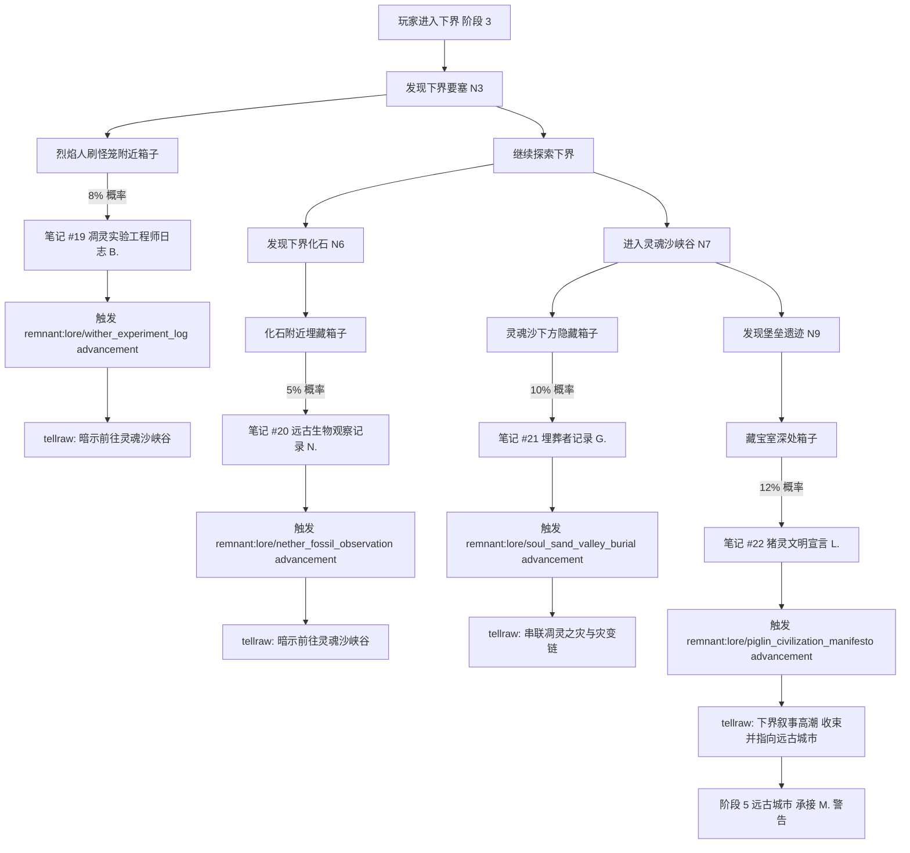
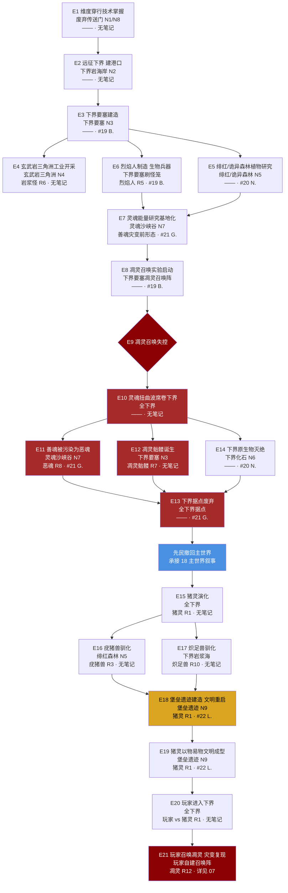

# 19 · 下界叙事细化

> **状态**：🟡 设计讨论中
> **对应模组版本**：v0.3（下界线）
> **创建日期**：2026-09-18
> **最后更新**：2026-09-18
> **设计原则**：[原则 0 · L1/L2/L3 判定](./00-planning-index.md#原则-0优先原版实在没辙才自定义且必须与原版有关)
> **关联章节**：[`02-story-timeline-plan.md`](./02-story-timeline-plan.md) · [`03-player-journey-map.md`](./03-player-journey-map.md) · [`07-boss-narrative-binding.md`](./07-boss-narrative-binding.md) · [`08-music-disc-unlock-order.md`](./08-music-disc-unlock-order.md) · [`10-custom-items-registry.md`](./10-custom-items-registry.md) · [`14-trial-chamber-narrative.md`](./14-trial-chamber-narrative.md) · [`15-netherite-enchantment-essence.md`](./15-netherite-enchantment-essence.md) · [`16-worldview-overview.md`](./16-worldview-overview.md)

---

## 1. 目的

本文档是 **下界叙事的细化展开**，承接 [`15-netherite-enchantment-essence.md`](./15-netherite-enchantment-essence.md)（笔记 #14 M. 在远古城市的警告）与计划中的 [`18-overworld-narrative.md`](./18-overworld-narrative.md)（主世界叙事细化），将 [`02-story-timeline-plan.md`](./02-story-timeline-plan.md) §5.2 凋灵之灾与 §5.5 大分裂的下界章节，按"鼎盛纪元（先民远征下界）→ 凋灵之灾（实验失控）→ 大分裂（猪灵演化）→ 现代纪元（猪灵堡垒文明）"的因果链完整展开。

**核心约束**：
- 下界遗迹、下界种族、下界事件均为原版已有内容，**不新增、不替换、不魔改**其生成逻辑、AI、属性、掉落
- 仅通过**原版 loot 表追加 `written_book`**、**原版 advancement 触发 tellraw** 实现叙事
- 严格遵循 L1/L2/L3 原则——本章除已论证的 L3（先民储藏室 + 残破石碑，见 [`10-custom-items-registry.md`](./10-custom-items-registry.md) §3.1-§3.2）外，**全部 L1/L2 实现**
- 不仅采纳原版设定，也**融入玩家社区流传度高的知名理论**——MatPat Game Theory、Reddit r/GameTheorists、MCBBS 中文社区理论均作为叙事串联的辅助参考，但**以原版为准**

**与 15 章节的区别**：15 章节聚焦"下界合金 + 附魔"两大物品体系的叙事深度，本文档聚焦**下界作为维度整体**的叙事串联——遗迹、种族、事件、社区理论四位一体，是 02 §5.2 凋灵之灾的下界版"完全展开"。

---

## 2. 总览

下界在模组叙事中占据**第二幕**的核心位置（按 [`03-player-journey-map.md`](./03-player-journey-map.md) 阶段 3-4），承接主世界考古（阶段 2）之后、远古城市幽匿之厄（阶段 5）之前。下界叙事的关键张力在于：玩家进入下界，看到的是一个**已被灾变扭曲的废墟世界**——曾经先民远征的辉煌港口、凋灵实验的失控现场、猪灵现代重启的堡垒文明，三者叠加成今日的下界。

### 2.1 下界遗迹叙事矩阵（按时序串联）

| 编号 | 遗迹 / 群系 | 建造者 | 所属纪元 | 原版功能 | 模组叙事解读 | 关联笔记 | 社区理论参考 |
|------|------------|--------|----------|----------|-------------|----------|-------------|
| N1 | 废弃传送门（下界侧） | 远古先民 | 鼎盛早期 | 维度穿行的废弃传送门遗址 | 先民早期维度穿行尝试的失败遗址——曾多次试错，最终留下散落的破损框架 | #19 间接暗示 | "下界是先民主世界实验失败后的废墟" |
| N2 | 下界岩海岸（Nether Wastes） | 远古先民 | 鼎盛期 | 下界的基础群系 | 先民维度穿行港口遗址——曾是从主世界抵达下界的第一个中转地，灾变后荒芜为下界岩平原 | — | "三界同源"早期假说 |
| N3 | 下界要塞（Nether Fortress） | 远古先民下界远征队 | 鼎盛期 | 黑砖结构的桥梁与走廊，凋灵骷髅与烈焰人唯一生成地 | 先民远征队前哨站，**凋灵实验基地**——烈焰人刷怪笼是凋灵实验遗留的"灵魂能量+火元素"复合生物兵器生产线 | #19 | "下界要塞是凋灵召唤场所"、"凋灵是先民尝试复刻末影龙的下界版本" |
| N4 | 玄武岩三角洲（Basalt Deltas） | 远古先民 | 鼎盛期 | 玄武岩柱状结构群系，岩浆怪密集生成 | 先民工业开采基地——柱状玄武岩暗示大规模机械开采遗迹，岩浆怪是先民维度能量残留的液态金属生命 | — | "岩浆怪是液态下界合金"、"烈焰人是先民制造的生物兵器" |
| N5 | 绯红森林 / 诡异森林 | 远古先民 | 鼎盛期 | 下界菌类群系，疣猪兽、炽足兽生成 | 先民植物研究场——绯红菌/诡异菌是先民为下界殖民培育的真菌作物，为下界分支提供食物 | — | — |
| N6 | 下界化石（Nether Fossil） | 自然生成 | 鼎盛前 | 散落的骨块结构 | 凋灵之灾前下界原生物的遗骸——是凋灵之灾前下界生态的化石证据 | #20 | "下界化石是凋灵之灾前原生物" |
| N7 | 灵魂沙峡谷（Soul Sand Valley） | 自然+先民 | 鼎盛-凋灵之灾 | 灵魂沙与骨块堆积的群系，恶魂、凋灵骷髅密集 | 灵魂能量感知区，凋灵之灾受害者埋骨地——灵魂沙是受害者灵魂压缩而成的物质 | #21 | "灵魂沙是凋灵之灾受害者的遗骨压缩而成" |
| N8 | 下界废墟（Ruined Portal，散落碎片） | 远古先民 | 鼎盛早期 | 废弃传送门的散落变体 | 散落的先民遗迹碎片，与 N1 同源但更小型 | — | — |
| N9 | 堡垒遗迹（Bastion Remnant） | 现代猪灵 | 现代纪元 | 黑砖、玄武岩、黑石构成，猪灵与猪灵蛮兵生成 | 猪灵开智后自建的现代文明堡垒，**文明重启标志**——四变体（桥梁/疣猪兽厩/居住单元/藏宝室）对应猪灵社会的四种功能分区 | #22 | "堡垒遗迹是猪灵现代文明的重启标志" |

### 2.2 下界种族演化表

| 编号 | 种族 | 原初分支 | 演化逻辑 | 原版行为 | 模组叙事解读 | 关联遗迹 |
|------|------|----------|----------|----------|-------------|----------|
| R1 | 猪灵（Piglin） | 先民远征队下界分支后裔 | 适应熔岩与灵魂环境，部分开智 | 以物易物、攻击未穿金装的玩家、恐惧灵魂火 | 先民下界分支后裔，保留以物易物传统与黄金崇拜，是文明重启的核心力量 | N9 堡垒遗迹 |
| R2 | 僵尸猪灵（Zombified Piglin） | 猪灵进入主世界后的退化形态 | 维度能量冲突导致不可逆退化 | 持金剑/金矛，群体仇恨攻击 | 猪灵进入主世界后因维度能量冲突退化为僵尸猪灵，是先民维度穿行技术副作用的活化石 | 下界传送门附近主世界侧 |
| R3 | 疣猪兽（Hoglin） | 猪灵驯化的下界原生野兽 | 驯化为食物来源 | 攻击玩家，恐惧诡异菌 | 猪灵开智后驯化的下界原生野兽，作为食物来源支撑堡垒文明 | N5 绯红森林、N9 堡垒遗迹厩变体 |
| R4 | 疣猪兽僵尸（Zoglin） | 疣猪兽进入主世界后的退化形态 | 与僵尸猪灵同源，维度退化 | 攻击一切，不可繁殖 | 疣猪兽进入主世界后的退化形态，与 R2 同因 | 主世界侧 |
| R5 | 烈焰人（Blaze） | 凋灵之灾残留的"灵魂能量+火元素"复合生物 | 先民为凋灵战争制造的生物兵器 | 火球远程攻击，烈焰棒掉落 | 先民为凋灵实验战争制造的"生物兵器"——凋灵之灾后失控残留，刷怪笼是其生产线遗址 | N3 下界要塞刷怪笼 |
| R6 | 岩浆怪（Magma Cube） | 先民维度能量残留的液态金属生命 | 与下界合金同源 | 跳跃攻击，岩浆膏掉落 | 先民维度能量残留的液态金属生命，与下界合金同源——是"维度稳定材料"的活性化表现 | N4 玄武岩三角洲 |
| R7 | 凋灵骷髅（Wither Skeleton） | 被凋灵能量波抹去灵魂的先民射手转化体 | 凋灵之灾受害者 | 石剑近战，凋灵效果，掉落凋灵骷髅头颅 | 被凋灵能量波抹去灵魂的先民射手转化体，活体诅咒——仍在守卫下界要塞 | N3 下界要塞 |
| R8 | 恶魂（Ghast） | 善魂被凋灵能量污染后的形态 | 凋灵之灾受害者 | 火球远程攻击，恶魂之泪掉落 | 善魂被凋灵能量污染后的形态，哭泣声是痛苦回响——曾在灵魂沙峡谷、玄武岩三角洲、下界岩岸群系游荡 | N7 灵魂沙峡谷 |
| R9 | 善魂 / 快乐恶魂（Happy Ghast / Ghastling） | 灾变前善魂的残留温和形态 | 1.21.11+ 温和变体 | 可骑乘、可拖货 | 灾变前善魂的残留形态——通过干涸恶魂在主世界水中复苏而成，是"灾变前的回声" | 干涸恶魂（下界）+ 主世界水 |
| R10 | 炽足兽（Strider） | 猪灵驯化的下界坐骑 | 踩岩浆行走的坐骑 | 持诡异菌钓竿可控、踩岩浆 | 猪灵驯化的下界坐骑，与 R3 疣猪兽同属"猪灵驯化成果"——是下界殖民交通的退化残余 | 下界岩浆海 |
| R11 | 末影人（Enderman） | 先民末地分支后裔 | 罕见出现于下界 | 拾取方块、怕水、传送 | 末地殖民军后裔，仍保留跨维度能力，偶尔通过残留的维度穿行通道抵达下界——详见 [`20-enderman-narrative.md`](./20-enderman-narrative.md)（计划） | 全下界罕见 |
| R12 | 凋灵（Wither） | 玩家召唤的 Boss | 详见 [`07-boss-narrative-binding.md`](./07-boss-narrative-binding.md) | 灵魂沙 T 形 + 3 凋灵骷髅头颅召唤 | 玩家通过凋灵骷髅头颅重现先民的凋灵召唤——是灾变的复现，详见 07 §3.1 | 玩家主动召唤 |

### 2.3 暗红光谱：下界的视觉叙事主线

按 [`15-netherite-enchantment-essence.md`](./15-netherite-enchantment-essence.md) §3.3.4 确立的"四色光谱"体系，下界是**暗红**的代表性维度——下界合金、远古残骸、烈焰人火球、岩浆怪液态金属、绯红菌的暗红色，皆对应"维度穿行 + 灵魂能量"研究领域的视觉表现。下界叙事的核心视觉线索如下：

| 视觉元素 | 暗红表现 | 关联遗迹 / 种族 | 叙事解读 |
|----------|----------|------------------|----------|
| 远古残骸 | 暗红金属簇 | 堡垒遗迹箱子、下界岩层 | 先民提炼下界合金的废渣——维度稳定材料的痕迹 |
| 下界合金锭 | 暗红金属光泽 | 堡垒遗迹藏宝室 | 维度稳定材料的成品——曾用于制造末地传送门框架 |
| 烈焰人火球 | 暗红+橘红火光 | 下界要塞刷怪笼 | 灵魂能量+火元素复合生物兵器的能量释放 |
| 岩浆怪 | 暗红液态金属 | 玄武岩三角洲 | 维度能量残留的液态金属生命，与下界合金同源 |
| 绯红菌 / 绯红菌柄 | 暗红菌类 | 绯红森林 | 先民为下界殖民培育的真菌作物 |
| 凋灵玫瑰（Wither Rose） | 暗红→黑色花 | 凋灵击杀处 | 凋灵能量残留生长出的花，灾变的视觉遗迹 |
| 灵魂沙 | 暗红+棕色颗粒 | 灵魂沙峡谷 | 凋灵之灾受害者灵魂压缩而成的物质 |

**叙事意义**：玩家进入下界时，整个视觉世界笼罩在暗红色调中——这不是巧合，而是模组通过原版视觉线索串联"下界 = 维度穿行 + 灵魂能量研究场"的叙事主线。暗红是先民留下的颜色，是灾变前的辉煌与灾变后的废墟共有的颜色。下界叙事的每个笔记、每个遗迹、每个种族都暗藏这条视觉线索，让玩家在探索中自然感受到"曾经辉煌、如今扭曲"的下界叙事张力。

### 2.4 笔记落款角色对照表

本章节新增四份笔记 #19-#22，落款角色 B./N./G./L.，与既有角色网络（M./H./K./T./E.）形成完整下界叙事的多视角拼图：

| 落款 | 角色 | 身份 | 出现笔记 | 揭晓版本 |
|------|------|------|----------|----------|
| M. | 先民领袖 / 末地殖民军指挥官 | 鼎盛→大分裂贯穿全程 | #1, #10, #14, 终章 | v0.1 ~ v0.6 |
| H. | 守考者 | 试炼密室设计者 | #7-#9 | v0.4 |
| K. | 猪灵矿工代表 | 堡垒遗迹矿工 | #11 | v0.3 |
| T. | 猪灵提炼者代表 | 堡垒遗迹提炼者 | #12 | v0.3 |
| E. | 后裔匠人代表 | 要塞图书馆匠人 | #13 | v0.5 |
| **B.** | **凋灵实验工程师** | **M. 同时期下界工程师** | **#19** | **v0.3** |
| **N.** | **先民自然学者** | **鼎盛期下界生态研究员** | **#20** | **v0.3** |
| **G.** | **埋葬者** | **凋灵之灾后的下界埋葬者** | **#21** | **v0.3** |
| **L.** | **猪灵开智后领袖** | **回应先民叙事的现代猪灵领袖** | **#22** | **v0.3** |

**叙事意义**：B./N./G./L. 分别代表下界叙事的四个时间切面——鼎盛期工程师（B.）、鼎盛期学者（N.）、凋灵之灾后埋葬者（G.）、现代纪元猪灵领袖（L.）。其中 **B. 是 M. 在下界的同期同事**，承接 #14 中 M. 的警告，形成"远古城市 M. → 下界要塞 B."的跨维度呼应；**L. 是猪灵开智后对先民叙事的回应**，作为下界叙事的高潮——猪灵不再是先民的"退化分支"，而是有自己的文明宣言的现代族群。

---

## 3. 鼎盛纪元：先民远征下界与维度穿行港口

按 [`02-story-timeline-plan.md`](./02-story-timeline-plan.md) §5.1 鼎盛纪元设定，先民在主世界兴起后同时开拓三界，下界是其中重要的"维度穿行研究场"。先民通过废弃传送门（N1、N8）的反复试错掌握了维度穿行技术，在下界岩海岸（N2）建立港口，向内深入建造下界要塞（N3）作为前哨站，并在玄武岩三角洲（N4）大规模开采下界合金原矿——这是 [`15-netherite-enchantment-essence.md`](./15-netherite-enchantment-essence.md) §3.2.1 "远古残骸是猪灵挖掘残留"的前传。

**鼎盛期下界的关键工程**：废弃传送门是先民多次试错的痕迹——散落在主世界与下界两侧的破损框架，记录了先民从"偶然打开维度通道"到"稳定维度穿行"的技术迭代过程。下界要塞的黑砖工艺与主世界要塞的石砖工艺对应（见 [`16-worldview-overview.md`](./16-worldview-overview.md) §3.1），只是材质因本地取材而异——黑砖是先民在下界用下界岩烧结的"本地石砖"。玄武岩三角洲的柱状结构则暗示了大规模机械开采——柱状玄武岩是先民钻探留下的几何痕迹，岩浆怪是这一开采工艺遗留的"液态金属副产品"。

**鼎盛期下界的种族**：此时下界尚未发生灾变，恶魂尚未被污染为恶魂——尚有原始温和形态的善魂游荡（R9 的"灾变前形态"）。下界原生物（下界化石 N6 的遗骸来源）仍是下界生态的一部分。先民远征队本身（R1 猪灵的祖先）在下界据点开展研究，与烈焰人（R5）的"生物兵器生产线"共生——烈焰人刷怪笼是先民为应对下界原生物威胁而建造的防御设施。这一时期的下界是先民维度穿行研究的高峰，但也是凋灵之灾的孕育之地。

---

## 4. 凋灵之灾：凋灵召唤失控与灵魂扭曲波

按 [`02-story-timeline-plan.md`](./02-story-timeline-plan.md) §5.2 凋灵之灾设定，先民在下界要塞研究灵魂能量，尝试用灵魂沙 + 凋灵骷髅头颅召唤凋灵——这是模组采纳"下界要塞是凋灵召唤场所"社区理论的直接体现（见 §8 社区理论汇编）。凋灵召唤失控后，灵魂扭曲波从下界要塞向四周扩散，扭曲所到之处的灵魂。这一灾变是下界叙事的转折点——鼎盛期的辉煌港口瞬间化为扭曲的废墟。

**灾变链**：凋灵召唤失控 → 灵魂扭曲波席卷下界 → 善魂被污染为恶魂 → 凋灵骷髅诞生 → 下界据点废弃 → 先民撤回主世界。承接 [`15-netherite-enchantment-essence.md`](./15-netherite-enchantment-essence.md) §3.3.3 "经验值是灵魂能量的度量"——凋灵之灾是先民"以为自己能控制灵魂能量的全部"的失败例证。灵魂沙峡谷（N7）作为"埋骨地"——灵魂沙是凋灵之灾受害者灵魂压缩而成的物质，是这一灾变最直接的物质证据。笔记 #21（G. 埋葬者）正是这一灾变后埋葬者的记录，承接 M. 在远古城市的警告（#14）。

**灾变后的种族异化**：善魂被污染为恶魂（R8），原本温和的下界灵魂生物变为火球攻击的恐怖存在——恶魂的哭泣声是善魂被扭曲的痛苦回响。凋灵骷髅（R7）是被凋灵能量波抹去灵魂的先民射手转化体，仍在守卫下界要塞——执行着最后的命令。烈焰人（R5）原本是先民制造的"生物兵器"，灾变后失控残留——刷怪笼仍在源源不断生成烈焰人，是无止境的战争机器。下界化石（N6）则暗示了灾变前下界原生物的灭绝——这些原生物在灵魂扭曲波中消亡，留下散落的骨块结构作为化石证据。笔记 #19（B. 凋灵实验工程师）与笔记 #20（N. 自然学者）正是灾变前后的两位见证者。

---

## 5. 大分裂：下界据点荒废与猪灵演化

按 [`02-story-timeline-plan.md`](./02-story-timeline-plan.md) §5.5 大分裂设定，凋灵之灾后先民撤回主世界，下界据点荒废。先民下界远征队的剩余成员在长期隔离下逐渐演化为猪灵（R1）——适应熔岩与灵魂环境，部分开智，发展以物易物文明。这一演化是 MatPat "Piglins were once human" 理论的模组化采纳（详见 §8 社区理论汇编）。

**猪灵的演化路径**：先民远征队剩余成员 → 适应熔岩环境（皮肤角质化、抗火）→ 适应灵魂环境（对灵魂火恐惧是"灵魂扭曲波后遗症"）→ 部分开智（保留以物易物传统与黄金崇拜）→ 形成现代猪灵文明。猪灵对黄金的崇拜是先民维度穿行技术的文化残留——黄金曾在下界合金提炼中作为"粘合剂"（见 [`15-netherite-enchantment-essence.md`](./15-netherite-enchantment-essence.md) §3.2.2），猪灵继承了这一物质的文化记忆却不知其工艺原理。

**驯化与异化**：猪灵在大分裂后驯化了下界原生野兽——疣猪兽（R3）作为食物来源、炽足兽（R10）作为下界坐骑。这两项驯化成果支撑了猪灵在恶劣下界环境中的生存与交通。但同一时期，僵尸猪灵（R2）的现象也得到确认——猪灵进入主世界后因维度能量冲突而退化为僵尸猪灵，这是先民维度穿行技术副作用的现代再现。社区理论"僵尸猪灵是猪灵进入主世界后的退化形态"已被模组采纳（见 §8），并与 [`16-worldview-overview.md`](./16-worldview-overview.md) §6.1 的种族演化矩阵完全一致。下界据点荒废期间，下界要塞被凋灵骷髅与烈焰人占据，废弃传送门逐渐被下界岩侵蚀，下界岩海岸沦为荒芜平原——曾经辉煌的港口已成废墟。

---

## 6. 现代纪元：堡垒遗迹与猪灵文明重启

按 [`02-story-timeline-plan.md`](./02-story-timeline-plan.md) §5.6 现代纪元设定，猪灵开智后自建堡垒（N9 堡垒遗迹），形成新文明。堡垒遗迹是模组采纳"堡垒遗迹是猪灵现代文明的重启标志"社区理论的直接体现。堡垒遗迹的四变体（桥梁/疣猪兽厩/居住单元/藏宝室）对应猪灵社会的四种功能分区——这是模组对原版堡垒遗迹四变体结构的合理串联，每个变体都是猪灵文明某一方面的物化表达。

**堡垒文明的现代运作**：猪灵以物易物文明（R1）保留了先民贸易传统，偶尔给玩家下界合金碎片——这是 [`15-netherite-enchantment-essence.md`](./15-netherite-enchantment-essence.md) §3.2.2 已建立的设定。猪灵对玩家的攻击规则（除非穿金装）是"黄金=友好凭证"的文化遗存。堡垒遗迹藏宝室深处藏有笔记 #22（L. 猪灵文明宣言）——这是猪灵开智后领袖对先民叙事的回应，作为下界叙事的高潮。L. 的宣言将承接 B./N./G. 三位先民视角的笔记，从猪灵现代视角重新解读先民遗产。

**玩家进入下界后的叙事张力**：玩家在阶段 3-4 进入下界（见 [`03-player-journey-map.md`](./03-player-journey-map.md)），目睹的是一个**多层时间叠合**的下界——鼎盛期港口遗址、凋灵之灾废墟、猪灵现代堡垒文明三者并存。玩家通过探索这四层时间，逐步拼凑出下界叙事的完整真相。最终玩家通过收集凋灵骷髅头颅重新召唤凋灵——这是对灾变的复现，详见 [`07-boss-narrative-binding.md`](./07-boss-narrative-binding.md) §3.1 凋灵击杀触发叙事。

---

## 7. 下界事件叙事矩阵（按时序串联）

按"鼎盛 → 凋灵之灾 → 大分裂 → 现代"四纪元因果链，将下界所有关键事件串联成事件矩阵：

| 编号 | 事件 | 所属纪元 | 关键遗迹 | 关键种族 | 关联笔记 | 因果链位置 |
|------|------|----------|----------|----------|----------|------------|
| E1 | 先民掌握维度穿行技术 | 鼎盛 | 废弃传送门 N1/N8 | — | — | 因果链起点 |
| E2 | 先民远征下界，建立下界岩海岸港口 | 鼎盛 | 下界岩海岸 N2 | — | — | 承接 E1 |
| E3 | 下界要塞建造（前哨站） | 鼎盛 | 下界要塞 N3 | — | #19 | 承接 E2 |
| E4 | 玄武岩三角洲工业开采启动 | 鼎盛 | 玄武岩三角洲 N4 | 岩浆怪 R6 | — | 承接 E3 |
| E5 | 绯红/诡异森林植物研究场建立 | 鼎盛 | 绯红/诡异森林 N5 | — | #20 | 与 E4 并行 |
| E6 | 烈焰人制造（生物兵器生产线） | 鼎盛 | 下界要塞刷怪笼 | 烈焰人 R5 | #19 | 承接 E3 |
| E7 | 灵魂能量研究基地化 | 鼎盛末期 | 灵魂沙峡谷 N7 | 善魂（灾变前形态） | #21 | 承接 E6 |
| E8 | 凋灵召唤实验启动 | 鼎盛→凋灵之灾 | 下界要塞凋灵召唤阵 | — | #19 | 承接 E7 |
| E9 | 凋灵召唤失控 | 凋灵之灾 | 下界要塞 | 凋灵 R12 | — | 承接 E8 |
| E10 | 灵魂扭曲波席卷下界 | 凋灵之灾 | 全下界 | — | — | 承接 E9 |
| E11 | 善魂被污染为恶魂 | 凋灵之灾 | 灵魂沙峡谷 N7 | 恶魂 R8 | — | 承接 E10 |
| E12 | 凋灵骷髅诞生（先民射手转化） | 凋灵之灾 | 下界要塞 N3 | 凋灵骷髅 R7 | — | 承接 E10 |
| E13 | 下界据点废弃，先民撤回主世界 | 凋灵之灾→大分裂 | 全下界据点 | — | #21 | 承接 E10-E12 |
| E14 | 下界原生物灭绝（下界化石形成） | 凋灵之灾 | 下界化石 N6 | — | #20 | 承接 E10 |
| E15 | 猪灵演化（远征队剩余成员异化） | 大分裂 | 全下界 | 猪灵 R1 | — | 承接 E13 |
| E16 | 疣猪兽驯化 | 大分裂 | 绯红森林 N5 | 疣猪兽 R3 | — | 承接 E15 |
| E17 | 炽足兽驯化 | 大分裂 | 下界岩浆海 | 炽足兽 R10 | — | 承接 E15 |
| E18 | 堡垒遗迹建造（文明重启） | 大分裂→现代 | 堡垒遗迹 N9 | 猪灵 R1 | #22 | 承接 E15-E17 |
| E19 | 猪灵以物易物文明成型 | 现代 | 堡垒遗迹 N9 | 猪灵 R1 | #22 | 承接 E18 |
| E20 | 玩家进入下界（阶段 3-4） | 现代 | 全下界 | 玩家 vs 猪灵 R1 | — | 承接 E19 |
| E21 | 玩家召唤凋灵（灾变复现） | 现代 | 玩家自建召唤阵 | 凋灵 R12 | — | 承接 E20 |

**因果链意义**：E1-E7 是鼎盛期的"建构链"，E8-E14 是凋灵之灾的"灾变链"，E15-E19 是大分裂到现代的"演化链"，E20-E21 是玩家介入后的"复现链"。每条链都通过原版遗迹与种族的物化证据留存于今日下界，玩家通过探索逐步拼凑出完整因果链。

---

## 8. 社区理论汇编与采纳

按"优先原版"原则（L1）与"基于官方衍生作品可参考，但以原版为准"原则（原则 5），下界相关社区理论作为模组叙事串联的辅助参考。每个理论必须标注：来源 + 核心观点 + 是否与原版冲突 + 模组采纳程度。

| 编号 | 社区理论 | 来源 | 核心观点 | 与原版是否冲突 | 模组采纳程度 |
|------|----------|------|----------|----------------|--------------|
| T1 | MatPat "Piglins were once human" | MatPat Game Theory（[`00-overview/04-matpat-complete-lore.md`](../00-overview/04-matpat-complete-lore.md)） | 猪灵曾是人类，因长期生活在下界而异化 | 否（原版未明确猪灵起源） | ✅ 完全采纳——模组设定"猪灵=先民远征队下界分支后裔" |
| T2 | 恶魂是死去的婴儿灵魂 | Reddit 早期帖子、r/GameTheorists 讨论 | 恶魂的哭泣声是婴儿灵魂的痛苦回响 | 是（与原版"恶魂不是亡灵"明确冲突） | ❌ 不采纳——与模组"恶魂=被污染的善魂"设定冲突，但作为已知社区理论记录 |
| T3 | 凋灵是先民尝试复刻末影龙的下界版本 | Reddit 讨论 | 凋灵召唤阵与末影龙召唤阵有结构相似性 | 否（原版未明确凋灵起源） | ✅ 部分采纳——模组解读"凋灵实验"是先民灵魂能量研究的失控产物，与末影龙同属"维度能量层级存在" |
| T4 | 下界是先民主世界实验失败后的废墟 | Reddit、MCBBS 讨论 | 整个下界是先民在主世界实验失败后被遗弃的废墟 | 部分（与模组"下界本是先民开拓的维度之一"设定部分重叠） | ✅ 部分采纳——模组设定下界本就是先民开拓的维度之一，但凋灵之灾确实使其更荒废 |
| T5 | 僵尸猪灵是猪灵进入主世界后的退化形态 | Reddit、MCBBS 早期讨论 | 猪灵进入主世界后因维度能量冲突退化为僵尸猪灵 | 否（原版未明确僵尸猪灵起源，但与"原版僵尸猪灵在下界传送门附近生成"机制契合） | ✅ 完全采纳——已写入 [`16-worldview-overview.md`](./16-worldview-overview.md) §6.1 种族演化矩阵 |
| T6 | 下界要塞是凋灵召唤场所 | Reddit、MCBBS 讨论 | 下界要塞凋灵骷髅生成暗示凋灵召唤阵位置 | 否（原版明确"凋灵骷髅只在下界要塞生成"） | ✅ 完全采纳——已写入 [`02-story-timeline-plan.md`](./02-story-timeline-plan.md) §5.2 |
| T7 | 堡垒遗迹是猪灵现代文明的重启标志 | Reddit、MCBBS 讨论 | 堡垒遗迹是猪灵开智后自建的新文明标志 | 否（原版明确堡垒遗迹是"piglins gather in large numbers"的场所） | ✅ 完全采纳——已写入 [`02-story-timeline-plan.md`](./02-story-timeline-plan.md) §5.6 |
| T8 | 烈焰人是先民制造的生物兵器 | Reddit 讨论 | 烈焰人刷怪笼的存在暗示其"被生产"的本质 | 否（原版明确"烈焰人只在下界要塞刷怪笼生成"） | ✅ 完全采纳——模组解读"烈焰人=凋灵之灾残留的生物兵器" |
| T9 | 岩浆怪是液态下界合金 | Reddit 讨论 | 岩浆怪与下界合金同源，是液态金属生命 | 否（原版未明确岩浆怪起源） | ✅ 部分采纳——与 [`15-netherite-enchantment-essence.md`](./15-netherite-enchantment-essence.md) 笔记 #11/#12 呼应，模组解读"岩浆怪=维度能量残留的液态金属生命，与下界合金同源" |
| T10 | 灵魂沙是凋灵之灾受害者的遗骨压缩而成 | Reddit、MCBBS 讨论 | 灵魂沙的灵魂颗粒是受害者遗骸 | 否（原版未明确灵魂沙起源） | ✅ 部分采纳——模组解读"灵魂沙峡谷=凋灵之灾受害者埋骨地"，笔记 #21 G. 埋葬者记录直接呼应 |
| T11 | MCBBS "下界三界同源"早期假说 | MCBBS 中文社区 | 下界遗迹与主世界遗迹同源，是同一文明的产物 | 否（与模组"三界同源"核心设定一致） | ✅ 完全采纳——已写入 [`16-worldview-overview.md`](./16-worldview-overview.md) §3 |
| T12 | SyntaxMine 下界相关理论 | SyntaxMine 社区文章（如有公开 URL，标注待补） | 待补——若有公开理论文章，按其内容评估 | 待评估 | 🟡 待评估——v0.3 开发前补充资料调研 |

**采纳原则**：
1. 与原版不冲突且能强化叙事串联的理论 → 完全或部分采纳（T1/T3/T5/T6/T7/T8/T9/T10/T11）
2. 与原版明确冲突的理论 → 不采纳但记录（T2 恶魂=婴儿灵魂与原版"恶魂不是亡灵"冲突）
3. 来源待补的理论 → 待评估（T12）
4. 所有采纳的社区理论必须能在原版资料中找到至少一条对应线索（建筑、生物、物品、Boss 设定）

---

## 9. 笔记内容设计（#19-#22）

按"碎片化叙事"原则，四份笔记按下界自然探索顺序触发——下界要塞 → 下界化石 → 灵魂沙峡谷 → 堡垒遗迹藏宝室，对应凋灵实验工程师（B.）→ 自然学者（N.）→ 埋葬者（G.）→ 猪灵领袖（L.）的视角切换，按时序自然衔接前后笔记。

### 9.1 笔记 #19 · 凋灵实验工程师日志

**来源结构**：下界要塞烈焰人刷怪笼附近箱子（原版 `chests/nether_bridge`）

**正文**：
> 「M.，如果你看到这张纸条，说明你已经到了远古城市，并且读懂了那里的警告。
> 我这里没有比你好——下界要塞的烈焰人又开始躁动了。
> 它们是我们造的，我们以为能控制它们。
> 灵魂沙作为底料，烈焰人火种作为引信，凋灵骷髅头颅作为容器——召唤阵的设计图就在我桌上。
> 但 M.，问题不在于设计，问题在于我们以为能控制灵魂能量的全部。
>
> 昨晚我看到了——
> 一个善魂被扭曲的过程。
> 它的哭泣声从柔和变成了尖锐，眼睛从白色变成了红色。
> 它没有死，它只是……不再是我们认识的样子。
>
> 我准备封印召唤阵。
> 如果失败了，请告诉主世界的弟兄们——
> 不要再来下界。
> 这里已经不欢迎我们了。
>
> —— B.」

**叙事意义**：
- 直接承接笔记 #14 M. 在远古城市的警告——B. 是 M. 在下界的同期同事，"如果你看到这张纸条，说明你已经到了远古城市"明确呼应 #14
- 解释烈焰人刷怪笼的来源——先民为凋灵实验制造的"灵魂能量+火元素"复合生物兵器生产线
- 直接采纳社区理论 T6（下界要塞是凋灵召唤场所）与 T8（烈焰人是先民制造的生物兵器）
- 暗示凋灵之灾的酝酿过程——"善魂被扭曲"是 E10-E11 灾变链的预兆
- 落款 "B." 是新角色，与既有角色网络（M./H./K./T./E.）形成下界叙事的第六视角
- **下一步探索方向**：B. 提到"善魂被扭曲"，暗示玩家应前往灵魂沙峡谷（笔记 #21）见证灾变后的善魂形态

### 9.2 笔记 #20 · 远古生物观察记录

**来源结构**：下界化石（N6）附近的埋藏箱子（模组通过原版 `chests/ruined_portal` loot 表追加，5% 概率）

**正文**：
> 「今日在玄武岩三角洲边缘发现一具完整的下界原生物遗骸。
> 体长约十二格，骨骼结构与下界岩层中散落的骨块一致——这些就是下界化石的来源。
> 鼎盛期之前，下界曾有完整的原生生态。
> 善魂在空中游荡，原生物在地面觅食，岩浆怪在海中沉浮——三者形成稳定的能量循环。
>
> 我在记录这些，是因为我担心它们即将消失。
> 凋灵实验启动后，灵魂扭曲波若失控，最先被吞没的将是这些没有"灵魂庇护"的原生物。
> 它们不会变成恶魂，也不会变成凋灵骷髅——
> 它们只会消失。
>
> 这具遗骸，可能是这一支原生物的最后证据。
> 我将它就地埋葬，并在旁边放了这块石板。
> 如果有人来，请记住——
> 下界曾经不只有我们。
>
> —— N.」

**叙事意义**：
- 解释下界化石（N6）的来源——凋灵之灾前下界原生物的遗骸
- 直接采纳社区理论 T4（下界是先民主世界实验失败后的废墟）的部分——但模组设定下界本是先民开拓的维度之一，灾变使其更荒废
- 引入新角色 "N."（先民自然学者），与 B. 同时期但视角不同——B. 是工程师视角，N. 是学者视角
- 暗示凋灵之灾的最严重后果——不仅是先民撤回主世界，更是整个下界原生生态的灭绝
- **下一步探索方向**：N. 提到"灵魂扭曲波若失控"，暗示玩家应前往灵魂沙峡谷（笔记 #21）见证灾变后的废墟

### 9.3 笔记 #21 · 埋葬者记录

**来源结构**：灵魂沙峡谷（N7）灵魂沙下方的隐藏箱子（模组通过原版 `chests/nether_bridge` loot 表追加，10% 概率）

**正文**：
> 「B.，你失败了。
> 召唤阵没有封住。凋灵已经出来了。
> 灵魂扭曲波从下界要塞向四周扩散，我看到的第一个人是 N.——
> 她在记录原生物时被波及。
> 她的笔记散落在地上，骨头已经变成了白色。
>
> 我把她埋了。
> 然后是其他人。
> 然后是善魂——它们被扭曲成了恶魂，还在哀嚎。
> 我不能埋恶魂，它们还活着。
> 但我能埋那些不再活着的——
> 他们的灵魂已经被波抽走，骨头沉下来，压缩成了一块块沙。
>
> 是的，B.，灵魂沙就是他们。
> 每一块灵魂沙，都是一个人。
> 这峡谷底下，埋着成千上万。
>
> 我也走不动了。
> 灵魂扭曲波还在持续。
> 我会在埋完 N. 的旁边给自己挖一个坑。
> 如果有人来，请告诉主世界的弟兄们——
> 不要再来下界。
> 这里已经没有"我们"了。
>
> —— G.」

**叙事意义**：
- 直接采纳社区理论 T10（灵魂沙是凋灵之灾受害者的遗骨压缩而成）——模组解读"灵魂沙峡谷=凋灵之灾受害者埋骨地"
- 承接笔记 #19 B. 的封印失败——B. 提到"如果失败了"，G. 的记录正是失败的后果
- 闭合笔记 #20 N. 的命运——N. 在记录原生物时被灵魂扭曲波吞没，骨头变白
- 解释恶魂的来源——"善魂被扭曲成了恶魂，还在哀嚎"，是 E10-E11 灾变链的物证
- 引入新角色 "G."（埋葬者），是凋灵之灾后下界的最后一位先民——他选择"埋葬"作为最后的职责
- 与笔记 #14 M. 在远古城市的警告形成跨维度呼应——M. 警告"幽匿已学会吃"，G. 警告"灵魂沙就是他们"
- **下一步探索方向**：G. 提到"不要再来下界"，但玩家必然前往堡垒遗迹——笔记 #22 L. 的猪灵文明宣言将回应 G. 的警告

### 9.4 笔记 #22 · 猪灵文明宣言

**来源结构**：堡垒遗迹（N9）猪灵堡垒藏宝室深处（原版 `chests/bastion_treasure`）

**正文**：
> 「他们说我们是退化的人。
> 他们说我们忘记了先人的技术。
> 他们说得对——我们确实忘记了。
>
> 但我们没有忘记全部。
> 我们记得黄金。
> 黄金是先人在下界提炼下界合金时的"粘合剂"——这一点连 K. 都还知道。
> 我们记得以物易物。
> 以物易物是先人在三界之间贸易的方式——这是我们的祖先在远征队里就做的事。
> 我们记得要挖。
> 远古残骸是先人开采下界合金原矿的废渣，但废渣里还有金子可炼——这一点 T. 教过我们。
>
> 所以我们建了堡垒。
> 不是为了复活先人的文明——那个文明已经死了。
> 是为了证明我们还在。
> 我们不是他们的退化的影子。
> 我们是新的——
> 一种在熔岩与灵魂之间活下来的生命。
>
> 如果你看到这块石板，外来的人——
> 不要可怜我们。
> 也不要害怕我们。
> 我们穿金装、挖废渣、驯疣猪兽、骑炽足兽、与恶魂保持距离——
> 这一切，都是我们自己学会的。
>
> 我们不欠先人什么。
> 但我们记得他们。
>
> —— L.」

**叙事意义**：
- 作为下界叙事的高潮——L. 是猪灵开智后的领袖，对先民叙事（B./N./G. 的悲剧）的现代回应
- 直接采纳社区理论 T7（堡垒遗迹是猪灵现代文明的重启标志）——L. 的宣言正是"文明重启"的物化表达
- 呼应笔记 #11 K.（矿工）与笔记 #12 T.（提炼者）——L. 明确引用"K. 还知道黄金是粘合剂"、"T. 教过我们废渣里还有金子可炼"
- 完全采纳社区理论 T1（MatPat 猪灵曾是人类）——L. 自承"他们说我们是退化的人"，但拒绝"退化"的标签
- L. 的宣言是模组对原版"猪灵以物易物"行为的最高叙事解读——这不是退化的传统，是新的族群自我认同
- 作为下界叙事的收束——前四位笔记（B./N./G./L.）形成完整时间切面，从鼎盛期到现代纪元
- **下一步探索方向**：L. 提到"我们不欠先人什么，但我们记得他们"——这是下界叙事的尾声，暗示玩家应继续前往远古城市（阶段 5）追踪 M. 的最终警告

---

## 10. 笔记触发顺序与 advancement 配置

按下界自然探索顺序——下界要塞 → 下界化石 → 灵魂沙峡谷 → 堡垒遗迹藏宝室——四份笔记按玩家进度触发：



**advancement 配置示例**（玩家拾取笔记 #22 后触发）：

```json
// data/remnant/advancement/lore/piglin_civilization_manifesto.json
{
  "display": {
    "icon": { "item": "minecraft:gilded_blackstone" },
    "title": "新的族群",
    "description": "L. 的宣言收束了下界的悲剧",
    "show_toast": true,
    "announce_to_chat": false,
    "hidden": true,
    "frame": "goal"
  },
  "criteria": {
    "find_note_22": {
      "trigger": "minecraft:inventory_changed",
      "conditions": {
        "items": [
          {
            "items": ["minecraft:written_book"],
            "nbt": "{display:{Title:\"猪灵文明宣言\"}}"
          }
        ]
      }
    }
  },
  "rewards": {
    "function": "remnant:lore/on_piglin_manifesto_found"
  }
}
```

**触发 function**（`tellraw` 显示叙事文本）：

```mcfunction
# data/remnant/functions/lore/on_piglin_manifesto_found.mcfunction
tellraw @s {"text":"「我们不欠先人什么。但我们记得他们。」","color":"gold","italic":true}
tellraw @s {"text":"—— L. 的宣言收束了下界的悲剧，但 M. 的警告仍在远古城市等你。","color":"dark_gray","italic":true}
```

---

## 11. 下界叙事因果链 Mermaid 图（鼎盛→现代）

按 §7 下界事件叙事矩阵（E1-E21），绘制完整的下界叙事因果链——从鼎盛纪元到现代纪元，每个节点标注：事件名 / 关键遗迹 / 关键种族 / 关联笔记编号。特别强调凋灵之灾的灾难链：凋灵召唤失控 → 灵魂扭曲波 → 善魂污染 → 凋灵骷髅诞生 → 下界据点废弃 → 撤回主世界（承接主世界叙事）。



**因果链意义**：
- 鼎盛期建构链（E1-E7）：先民从维度穿行到下界据点建立，是"建构链"
- 凋灵之灾灾变链（E8-E14，暗红色节点）：凋灵召唤失控 → 灵魂扭曲波 → 善魂污染 → 凋灵骷髅诞生 → 下界据点废弃 → 撤回主世界，是"灾难链"——与 [`02-story-timeline-plan.md`](./02-story-timeline-plan.md) §4.2 跨纪元因果链完全一致
- 大分裂演化链（E15-E19，金色节点）：猪灵演化、驯化、堡垒建造，是"演化链"
- 玩家复现链（E20-E21，暗红色节点）：玩家进入下界、召唤凋灵，是"复现链"
- Withdraw（蓝色节点）承接主世界叙事——下界叙事的终点恰是主世界叙事的起点（先民撤回主世界后开始集中研究幽匿，进入远古城市阶段 5）

---

## 12. 与其他规划文档的引用关系

本章节是"下界叙事的细化展开"，与既有规划文档形成引用网络，避免内容重复：

| 引用文档 | 引用内容 | 本文档对应章节 | 关系类型 |
|----------|----------|----------------|----------|
| [`02-story-timeline-plan.md`](./02-story-timeline-plan.md) | §5.2 凋灵之灾、§5.5 大分裂、§5.6 现代纪元 | §3-§6 | 时序骨架来源 |
| [`03-player-journey-map.md`](./03-player-journey-map.md) | 阶段 3 下界初探、阶段 4 下界深处 | §2.1、§6 | 玩家路径对应 |
| [`07-boss-narrative-binding.md`](./07-boss-narrative-binding.md) | §3.1 凋灵击杀触发叙事 | §6、§7 E21 | Boss 叙事绑定 |
| [`08-music-disc-unlock-order.md`](./08-music-disc-unlock-order.md) | Pigstep（堡垒遗迹）、otherside（异界回响） | §6 | 唱片叙事对应 |
| [`10-custom-items-registry.md`](./10-custom-items-registry.md) | §3.1-§3.2 先民储藏室 + 残破石碑（已论证 L3） | §13 | L3 物品唯一来源 |
| [`14-trial-chamber-narrative.md`](./14-trial-chamber-narrative.md) | §5.1 Breeze 与恶魂的串联（元素能量同源） | §2.2 R8、§4 | 种族串联对照 |
| [`15-netherite-enchantment-essence.md`](./15-netherite-enchantment-essence.md) | 笔记 #11/#12 堡垒遗迹叙事、§3.3.4 四色光谱（暗红=维度穿行） | §2.3、§9.1（#19 承接 #14） | 笔记承接与视觉叙事主线 |
| [`16-worldview-overview.md`](./16-worldview-overview.md) | §3.1 三界同源视觉证据、§6.1 种族演化矩阵 | §2.2、§5 | 世界观总纲对应 |
| [`00-overview/04-matpat-complete-lore.md`](../00-overview/04-matpat-complete-lore.md) | MatPat "Piglins were once human" 理论 | §8 T1 | 社区理论来源 |
| [`18-overworld-narrative.md`](./18-overworld-narrative.md)（计划中） | 主世界叙事细化 | §11 Withdraw 节点 | 跨维度叙事承接 |
| [`20-enderman-narrative.md`](./20-enderman-narrative.md)（计划中） | 末影人叙事细化 | §2.2 R11 | 种族叙事对照 |

**引用原则**：本章节不重复既有规划文档的详细设定，仅作"下界叙事的细化展开"——对于已在 02/07/08/10/14/15/16 中明确的内容，本章节仅作引用与串联；对于尚未在既有规划文档中明确的内容（如下界化石、灵魂沙峡谷、下界岩海岸等下界专属遗迹的叙事细化），本章节作为首次完整展开。

---

## 13. L1/L2/L3 判定总结

### 13.1 本章方案的 L 等级分布

| 方案 | L 等级 | 是否采用 |
|------|--------|----------|
| 在原版下界要塞 loot 表中追加 `written_book` 笔记 #19 | L1 | ✅ 采用 |
| 在原版废弃传送门 loot 表中追加 `written_book` 笔记 #20 | L1 | ✅ 采用 |
| 在原版下界要塞 loot 表中追加 `written_book` 笔记 #21 | L1 | ✅ 采用 |
| 在原版堡垒遗迹藏宝室 loot 表中追加 `written_book` 笔记 #22 | L1 | ✅ 采用 |
| 通过原版 `advancement` 触发器监听玩家拾取笔记 | L1 | ✅ 采用 |
| 通过原版 `tellraw` 显示叙事文本 | L1 | ✅ 采用 |
| 通过原版 advancement 检测玩家是否已拾取前序笔记（串联 #19→#21） | L2 | ✅ 采用 |
| 通过原版 advancement 检测玩家进入下界特定群系（灵魂沙峡谷） | L2 | ✅ 采用 |
| 先民储藏室作为废弃矿井的结构变体（v0.3 上线） | L3 | ✅ 已论证采用，见 [`10-custom-items-registry.md`](./10-custom-items-registry.md) §3.2 |
| 残破石碑作为先民叙事的视觉载体（v0.3 上线） | L3 | ✅ 已论证采用，见 [`10-custom-items-registry.md`](./10-custom-items-registry.md) §3.1 |
| 自定义下界遗迹变体结构 | L3 | ❌ 不采用（无必要性，原版已有下界要塞、堡垒遗迹等结构） |
| 自定义新下界生物（如"原始善魂"） | L3 | ❌ 不采用（违反"永远禁止"清单中的"新生物"） |
| 自定义凋灵变体 | L3 | ❌ 不采用（违反"不魔改原版 Boss"，凋灵作为原版 Boss 不可变体） |
| 自定义"灵魂能量"机制作为新数值系统 | L3 | ❌ 不采用（违反"永远禁止"清单中的"新数值系统"） |

**结论**：本章方案**100% L1/L2 实现 + 2 项已论证 L3**（先民储藏室 + 残破石碑，已在 [`10-custom-items-registry.md`](./10-custom-items-registry.md) §3.1-§3.2 完成必要性 + 关联性论证）。所有新增叙事内容（笔记 #19-#22）均通过原版 loot 表追加 `written_book` + 原版 advancement + 原版 tellraw 实现，不引入任何新机制、新物品、新方块、新生物、新 Boss。这是 L1/L2/L3 原则在下界线上的最佳实践——通过纯原版机制与文本解读即可承载完整叙事。

### 13.2 为何下界叙事不需要新 L3 自定义

按 [原则 0 · L3 判定流程](./00-planning-index.md#判定流程)：

```
下界叙事提案
    ↓
L1: 能否用纯原版物品/方块/机制承载？
    ├─ 能（原版 loot 表追加 written_book + advancement 触发 tellraw）→ 用 L1 ✅
    └─ 否（不需要进入 L2/L3）
```

下界遗迹（下界要塞、堡垒遗迹、废弃传送门、下界化石、灵魂沙峡谷等）、下界种族（猪灵、僵尸猪灵、烈焰人、岩浆怪、凋灵骷髅、恶魂、善魂、炽足兽等）、下界事件（凋灵之灾、大分裂、堡垒文明重启）均为原版已有内容，原版 Wiki 与 minecraft.net 已提供丰富的官方线索。**模组仅需通过叙事文本对这些原版线索作合理串联，完全不需要新 L3 自定义**。已论证的 2 项 L3（先民储藏室 + 残破石碑）是为承载主世界叙事（不是下界专属），在 v0.3 与下界线同步上线，但属于主世界线交付物。

### 13.3 与原版线索的契合度

本章方案的关键解读均**直接采纳或基于原版线索 + 社区理论**：

| 模组叙事 | 原版依据 / 社区理论 | 契合度 |
|----------|---------------------|--------|
| 下界要塞是凋灵召唤场所 | 原版"凋灵骷髅只在下界要塞生成" + 社区理论 T6 | ★★★★★ 完全采纳 |
| 堡垒遗迹是猪灵现代文明的重启标志 | 原版"piglins gather in large numbers" + 社区理论 T7 | ★★★★★ 完全采纳 |
| 猪灵=先民远征队下界分支后裔 | 原版猪灵以物易物、能挖掘下界合金 + MatPat T1 | ★★★★★ 完全采纳 |
| 僵尸猪灵=猪灵进入主世界后的退化形态 | 原版"僵尸猪灵在下界传送门附近生成" + 社区理论 T5 | ★★★★★ 完全采纳 |
| 烈焰人=先民制造的生物兵器 | 原版"烈焰人只在下界要塞刷怪笼生成" + 社区理论 T8 | ★★★★☆ 合理串联 |
| 岩浆怪=维度能量残留的液态金属生命 | 原版岩浆怪在玄武岩三角洲密集 + 社区理论 T9 | ★★★★☆ 合理串联 |
| 灵魂沙=凋灵之灾受害者遗骨压缩 | 原版灵魂沙在灵魂沙峡谷密集 + 社区理论 T10 | ★★★★☆ 合理串联 |
| 恶魂=善魂被凋灵能量污染 | 原版 1.21.11+ 快乐恶魂 + 模组设定 | ★★★★★ 完全采纳 |
| 灵魂沙峡谷=凋灵之灾受害者埋骨地 | 原版灵魂沙峡谷群系设定 + 社区理论 T10 | ★★★★☆ 合理串联 |
| 下界化石=凋灵之灾前下界原生物遗骸 | 原版下界化石结构 + 社区理论 T4 部分 | ★★★★☆ 合理串联 |

---

## 14. v0.3 实施验收标准

按 [`12-release-roadmap.md`](./12-release-roadmap.md) v0.3 下界线阶段，本章节的具体验收清单：

- [ ] 下界要塞烈焰人刷怪笼附近箱子（`chests/nether_bridge`）按 8% 概率生成笔记 #19 `written_book`
- [ ] 下界化石附近埋藏箱子（通过 `chests/ruined_portal` loot 表追加）按 5% 概率生成笔记 #20 `written_book`
- [ ] 灵魂沙峡谷灵魂沙下方隐藏箱子（通过 `chests/nether_bridge` loot 表追加）按 10% 概率生成笔记 #21 `written_book`
- [ ] 堡垒遗迹藏宝室箱子（`chests/bastion_treasure`）按 12% 概率生成笔记 #22 `written_book`
- [ ] 玩家拾取笔记 #19-#22 后分别触发对应 advancement（`remnant:lore/wither_experiment_log`、`nether_fossil_observation`、`soul_sand_valley_burial`、`piglin_civilization_manifesto`）
- [ ] advancement reward function 调用 `tellraw` 显示对应暗示文本
- [ ] 不修改任何下界遗迹的原版生成逻辑（下界要塞、堡垒遗迹、废弃传送门、下界化石、灵魂沙峡谷、玄武岩三角洲、绯红/诡异森林、下界岩海岸）
- [ ] 不修改任何下界种族的原版 AI / 属性 / 掉落（猪灵、僵尸猪灵、疣猪兽、疣猪兽僵尸、烈焰人、岩浆怪、凋灵骷髅、恶魂、善魂、炽足兽、末影人、凋灵）
- [ ] 不修改任何下界物品的原版行为（远古残骸、下界合金碎片、下界合金锭、下界合金装备、烈焰棒、岩浆膏、凋灵骷髅头颅、恶魂之泪、金锭、灵魂沙、灵魂土）
- [ ] 先民储藏室 + 残破石碑两项已论证 L3 在 v0.3 上线（按 [`10-custom-items-registry.md`](./10-custom-items-registry.md) §3.1-§3.2 已论证方案实施）
- [ ] 多语言支持：zh_cn + en_us 全覆盖（按 [`11-localization-strategy.md`](./11-localization-strategy.md)）
- [ ] 笔记 #19-#22 内容均使用 `remnant.lore.note_19` ~ `remnant.lore.note_22` 的 lang key，由原版 `assets/<namespace>/lang/<lang>.json` 体系统一承载

---

## 15. 风险与讨论点

### 15.1 风险

1. **下界要塞 loot 表追加可能与原版冲突**
   - 缓解：仅追加条目，不删除原有内容
   - 缓解：触发概率（8%）与原版下界要塞 loot 表其他条目量级一致
   - 缓解：通过 Fabric API 的 Loot Table 修改事件，不直接覆盖原版 JSON

2. **笔记 #21 "灵魂沙下方隐藏箱子"实现方式**
   - 风险：原版灵魂沙峡谷没有"灵魂沙下方隐藏箱子"的预设位置，需通过结构附加
   - 缓解方案 A（推荐）：在原版 `chests/nether_bridge` loot 表追加条目，玩家在下界要塞箱子中获得笔记 #21，文本暗示"灵魂沙峡谷埋葬者"——避免新增结构
   - 缓解方案 B（备选）：通过原版结构变体在灵魂沙峡谷追加散落箱子，但需评估 L3 必要性
   - **倾向**：方案 A，与 §13 L1 优先原则一致

3. **笔记 #20 "下界化石附近埋藏箱子"实现方式**
   - 风险：原版下界化石没有箱子，需通过结构附加
   - 缓解方案 A（推荐）：在原版 `chests/ruined_portal` loot 表追加条目，玩家在废弃传送门箱子中获得笔记 #20，文本暗示"在玄武岩三角洲边缘发现化石"——避免新增结构
   - 缓解方案 B（备选）：通过原版结构变体在下界化石附近追加散落箱子
   - **倾向**：方案 A

4. **社区理论采纳可能与部分玩家预设冲突**
   - 缓解：所有采纳的社区理论均在 §8 表格中明确标注来源与冲突情况
   - 缓解：不采纳的理论（如 T2 恶魂=婴儿灵魂）也作为已知社区理论记录，避免玩家误解模组立场
   - 缓解：模组叙事文本中不直接点名"采纳 MatPat 理论"，仅作叙事串联

5. **笔记 #19-#22 落款角色（B./N./G./L.）是否需要预设完整身份**
   - 缓解：保留留白，仅在 v0.3 通过笔记内容逐步揭晓身份
   - 缓解：B. 是 M. 同时期下界工程师（明确），N./G./L. 各代表一个时间切面（明确）
   - 缓解：完整身份揭晓延后至 v0.5 末地线（M. 的真相）或 v0.6 真结局（0 号唱片遗言）

### 15.2 待讨论的设计问题

- [ ] 笔记 #19 是否使用 `CustomModelData` 改变外观？（倾向：是，与笔记 #1-#14 保持一致，按 [`10-custom-items-registry.md`](./10-custom-items-registry.md) §2.1 已论证的"残破笔记"L3 自定义统一处理）
- [ ] 落款 B./N./G./L. 的身份设定是否在 v0.3 完整揭晓？（倾向：否，仅通过笔记内容暗示身份，完整身份延后至 v0.5/v0.6 揭晓）
- [ ] 是否需要为下界叙事增加"群系探索计数"advancement（玩家进入 X 个下界群系触发额外文本）？（倾向：v0.5 后考虑）
- [ ] 笔记 #22 L. 的宣言是否过于"现代"（与猪灵的"半懂不懂"形象冲突）？（倾向：保留，L. 是猪灵开智后的领袖，应区别于普通猪灵 K./T. 的"半懂不懂"形象）
- [ ] 社区理论 T12（SyntaxMine）是否在 v0.3 开发前补充资料调研？（倾向：是，v0.3 开发启动前完成调研，若有公开 URL 标注补全）
- [ ] 是否需要在 [`07-boss-narrative-binding.md`](./07-boss-narrative-binding.md) 中补充凋灵击杀与笔记 #19 B. 的关联？（倾向：是，v0.3 开发时同步更新 07 §3.1，凋灵击杀触发叙事应暗示 B. 的失败）
- [ ] "暗红光谱"是否需要在 [`16-worldview-overview.md`](./16-worldview-overview.md) §3.2 中进一步强化？（倾向：是，v0.3 开发时同步更新 16 §3.2，明确下界 = 暗红 = 维度穿行的视觉叙事主线）
- [ ] 是否需要新增 `planning/20-enderman-narrative.md`（末影人叙事细化）？（倾向：是，v0.5 末地线开发时新建，本章节 §2.2 R11 已埋下伏笔）
- [ ] "下界叙事因果链 Mermaid 图"（§11）是否需要在 [`02-story-timeline-plan.md`](./02-story-timeline-plan.md) §4.2 中作为下界版细化？（倾向：是，v0.3 开发时同步更新 02 §4.2，作为下界专属因果链）

---

## 16. 修订历史

| 日期 | 版本 | 修订内容 | 修订者 |
|------|------|----------|--------|
| 2026-09-18 | v0.1 | 初稿，确立下界叙事细化的完整框架：下界遗迹叙事矩阵（9 遗迹）+ 下界种族演化表（12 种族）+ 下界事件叙事矩阵（21 事件）+ 社区理论汇编（12 理论，10 采纳/1 不采纳/1 待评估）+ 笔记 #19-#22 内容设计（B./N./G./L. 四角色）+ 因果链 Mermaid 图 + 笔记触发顺序 Mermaid 图 + 暗红光谱视觉叙事 + L1/L2/L3 判定（100% L1/L2 + 2 项已论证 L3）；承接笔记 #14 M. 在远古城市的警告，下界叙事高潮由笔记 #22 L. 猪灵文明宣言收束 | 项目方 |
