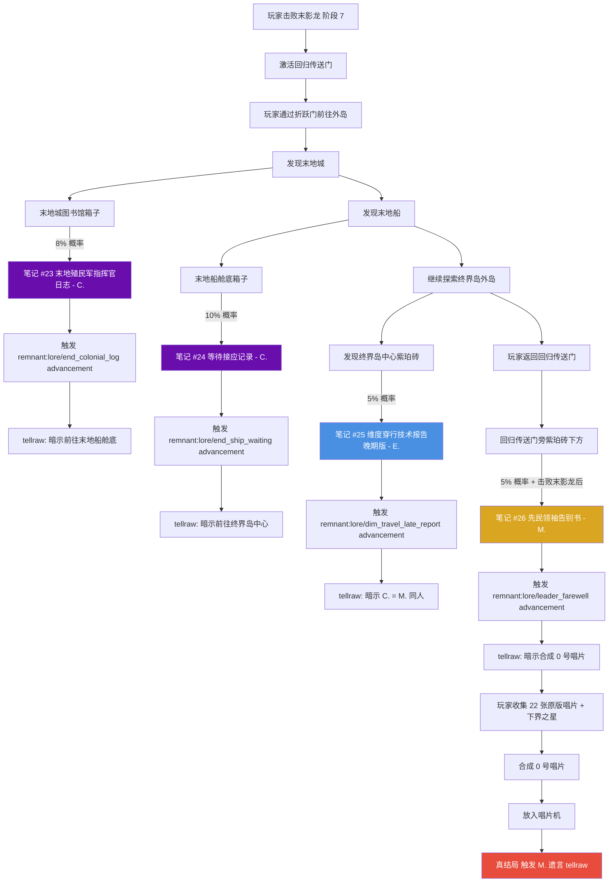
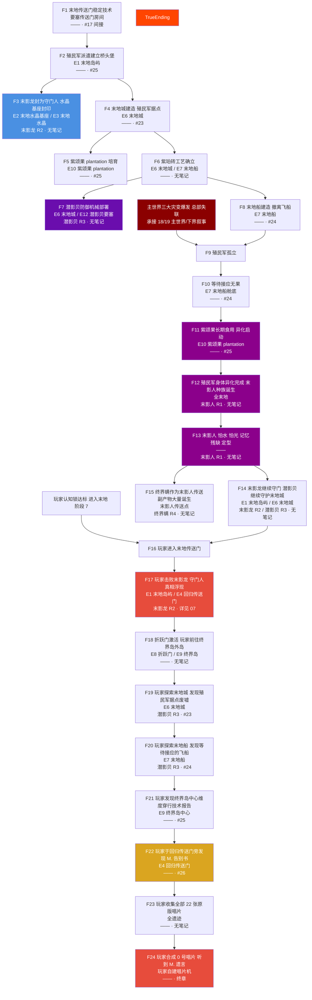
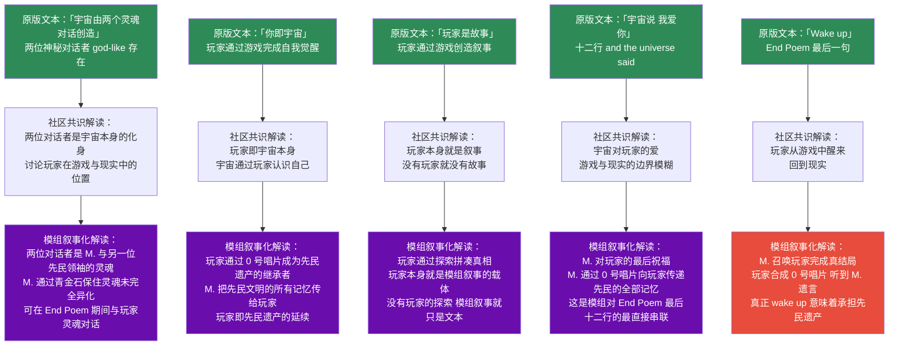

# 20 · 末地叙事细化

> **状态**：🟡 设计讨论中
> **对应模组版本**：v0.5 ~ v0.6（末地线 + 真结局）
> **创建日期**：2026-09-18
> **最后更新**：2026-09-18
> **设计原则**：[原则 0 · L1/L2/L3 判定](./00-planning-index.md#原则-0优先原版实在没辙才自定义且必须与原版有关)
> **关联章节**：[`02-story-timeline-plan.md`](./02-story-timeline-plan.md) · [`03-player-journey-map.md`](./03-player-journey-map.md) · [`06-cognitive-lock-mechanism.md`](./06-cognitive-lock-mechanism.md) · [`07-boss-narrative-binding.md`](./07-boss-narrative-binding.md) · [`08-music-disc-unlock-order.md`](./08-music-disc-unlock-order.md) · [`10-custom-items-registry.md`](./10-custom-items-registry.md) · [`14-trial-chamber-narrative.md`](./14-trial-chamber-narrative.md) · [`15-netherite-enchantment-essence.md`](./15-netherite-enchantment-essence.md) · [`16-worldview-overview.md`](./16-worldview-overview.md) · [`18-overworld-narrative.md`](./18-overworld-narrative.md) · [`19-nether-narrative.md`](./19-nether-narrative.md)

---

## 1. 目的

本文档是 **末地叙事的细化展开**，承接 [`18-overworld-narrative.md`](./18-overworld-narrative.md) 笔记 #17（E. 维度穿行技术报告）与 [`19-nether-narrative.md`](./19-nether-narrative.md) 笔记 #22（L. 猪灵文明宣言），将 [`02-story-timeline-plan.md`](./02-story-timeline-plan.md) §5.5 大分裂的末地分支、§5.6 现代纪元的"末地孤城"叙事，按 **"鼎盛纪元（先民开拓末地）→ 大分裂（殖民军孤立）→ 现代纪元（末影人异化）→ 玩家击败末影龙（守门人真相）→ 真结局（0 号唱片 + M. 遗言）"** 的因果链完整展开。

**核心约束**：

- 末地遗迹、末地种族、末地事件均为原版已有内容，**不新增、不替换、不魔改**其生成逻辑、AI、属性、掉落
- 仅通过**原版 loot 表追加 `written_book`**、**原版 advancement 触发 tellraw** 实现叙事
- 严格遵循 L1/L2/L3 原则——本章除已论证的 L3（0 号唱片，见 [`10-custom-items-registry.md`](./10-custom-items-registry.md) §2.3 + [`08-music-disc-unlock-order.md`](./08-music-disc-unlock-order.md) §2.2）外，**全部 L1/L2 实现**
- 不仅采纳原版设定，也**融入玩家社区流传度高的知名理论**——MatPat Game Theory、Reddit r/GameTheorists、r/minecraftlore 讨论、MCBBS 中文社区理论均作为叙事串联的辅助参考，但**以原版为准**
- **End Poem 已于 2022 年由作者 Julian Gough 以 CC0 协议释放至公共领域**（见 [`00-overview/01-end-poem.md`](../00-overview/01-end-poem.md) + [`00-overview/02-end-poem-wikipedia.md`](../00-overview/02-end-poem-wikipedia.md)），模组可在叙事中自由引用其文本并按本模组框架重新解读，详见 §13

**与 18/19 章节的区别**：18 章节聚焦主世界内部叙事，19 章节聚焦下界作为维度整体的叙事，本文档聚焦 **末地作为维度整体 + 真结局载体** 的叙事串联——遗迹、种族、事件、社区理论、End Poem 重新解读、0 号唱片合成与 M. 遗言六位一体，是模组叙事的最高潮与收束，也是 [`02-story-timeline-plan.md`](./02-story-timeline-plan.md) §5.6 现代纪元末地部分的"完全展开"。

---

## 2. 总览

末地在模组叙事中占据**第三幕高潮与真结局**的双重核心位置（按 [`03-player-journey-map.md`](./03-player-journey-map.md) 阶段 7-10），承接主世界考古（阶段 2）→ 下界深处（阶段 4）→ 远古城市与苍白花园（阶段 5-6）的全部叙事积累。末地叙事的关键张力在于：玩家击败末影龙后看到的不是一个"游戏结束"的世界，而是一个 **被遗忘的殖民军据点 + 等待接应无果的飞船 + 异化为末影人的士兵 + 守门人真相 + 先民领袖的最终告别**——五层时间叠合于今日末地。

### 2.1 末地遗迹叙事矩阵（按时序串联）

| 编号 | 遗迹 / 结构 | 建造者 | 所属纪元 | 原版功能 | 模组叙事解读 | 关联笔记 | 社区理论参考 |
|------|------------|--------|----------|----------|-------------|----------|-------------|
| E1 | 末地岛屿（出生点岛） | 远古先民 | 鼎盛期 | 末地传送门抵达地 + 末影龙栖息地 | 殖民军最早的"桥头堡"——末地传送门稳定后第一个立足点，末影龙被先民"封"于此岛作为维度能量锚点 | #25 间接 | MatPat "末影龙=守门人" |
| E2 | 末地水晶基座（End Crystal Pillars） | 远古先民 | 鼎盛期 | 治疗末影龙的水晶柱 | 维度能量锚定阵列——10 根基座将末影龙"绑定"在中央岛屿，是先民为防止维度能量失控而设置的"守门人锁链" | — | MatPat "末影龙=被先民留下的守门人" |
| E3 | 末地水晶（End Crystal） | 远古先民 / 玩家可重生 | 鼎盛期 / 玩家时代 | 末影龙治疗源 + 末影龙重生材料 | 维度能量凝结体——水晶柱顶的黑曜石基座+末影之眼碎片结构暗示"被先民加密的能量节点"，玩家破坏水晶本质是解除先民封印 | — | "末地水晶是先民维度能量装置" |
| E4 | 回归传送门（Exit Portal） | 远古先民 | 鼎盛期 | 击败末影龙后激活的回家传送门 | "封门人退场机制"——先民设计的"击败守门人方可离开"的封印协议，回归传送门在末影龙存活时是"死门"，仅在守门人倒下时激活 | #26 | "回归传送门=先民封印解除" |
| E5 | 龙蛋（Dragon Egg） | 末影龙掉落 | 玩家时代 | 装饰 / 奖杯 | 新的末影龙种子——按 MatPat"末影龙物种稀少"理论，龙蛋是末影龙物种延续的唯一载体，玩家可放回末地传送门重新孵化新的守门人 | — | Reddit "龙蛋=新末影龙种子" |
| E6 | 末地城（End City） | 远古先民末地殖民军 | 鼎盛→大分裂 | 紫珀砖塔楼结构 + 紫颂果 plantation + 潜影贝居住地 | **殖民军最后据点**——鼎盛期建造，大分裂后殖民军孤立于此，紫珀砖工艺与主世界石砖同源是三界同源关键证据 | #23 | Reddit r/GameTheorists "末地城=古代建造者殖民地" |
| E7 | 末地船（End Ship） | 远古先民末地殖民军 | 鼎盛→大分裂 | 浮空紫珀砖结构 + 鞘翅唯一来源 | **等待接应的飞船**——殖民军保留的"撤离飞船"，长期停靠末地城塔顶等待主世界接应信号，鞘翅是先民维度穿行装备的演化形态 | #24 | Reddit "末地船=等待接应的飞船" |
| E8 | 折跃门（End Gateway） | 自然生成（末影龙死后激活） | 玩家时代 | 末地中央岛屿 → 外岛传送门 | "守门人退场后维度通道开启"——折跃门是末影龙存活时被维度能量压制的次级通道，玩家击败末影龙后通道自然恢复 | — | — |
| E9 | 终界岛（外岛，Outer End Islands） | 自然生成 | 鼎盛期 | 紫颂果 plantation + 末地城生成区 | 殖民军"农业区"——紫颂果 plantation 是殖民军长期生存的粮食基地，外岛密度是殖民军鼎盛期人口分布的物证 | #25 | — |
| E10 | 紫颂果 plantation（Chorus Plant） | 远古先民培育 → 自然化 | 鼎盛→大分裂 | 紫颂果来源 + 末影人传送替代食物 | 殖民军粮食——紫颂果"传送效果"是先民为维度穿行便利培育的副作用，长期食用导致殖民军身体异化 | #25 | "紫颂果是先民粮食导致末影人异化" |
| E11 | 末地烛（End Rod） | 远古先民 / 现代自然 | 鼎盛期 | 末地城装饰照明 | 维度能量缓释灯——末地烛的紫光与紫珀砖呼应，是殖民军据点的"维度能量照明系统"，无需燃料持续发光暗示维度能量持续供给 | — | — |
| E12 | 潜影贝要塞（Shulker Stronghold，部分末地城密室） | 远古先民 | 鼎盛期 | 潜影贝守卫的宝箱房 | 殖民军物资仓库——潜影贝作为"机械守卫"看守殖民军储备，潜影贝箱是殖民军"份额分配"的物化（与试炼密室 Vault 设计哲学同源） | — | Reddit "潜影贝=末地城防御机械" |

### 2.2 末地种族演化表

| 编号 | 种族 | 原初分支 | 演化逻辑 | 原版行为 | 模组叙事解读 | 关联遗迹 |
|------|------|----------|----------|----------|-------------|----------|
| R1 | 末影人（Enderman） | 先民末地殖民军后裔 | 维度异化，记忆残缺 | 拾取方块、怕水、怕光、被注视时攻击、被攻击时集体追击 | **末地殖民军等待接应无果的异化形态**——长期食用紫颂果导致维度异化，怕水/怕光是细胞结构不稳定的副作用，拾取方块是"执行最后命令"残留，集体追击是军事防御协议残留，跨维度传送是先民维度穿行技术的退化形态 | E6 末地城 / E10 紫颂果 plantation |
| R2 | 末影龙（Ender Dragon） | 先民"封印"的维度能量守门人 | 守门人 | 飞行 + 火球/龙息攻击 + 末地水晶治疗 | **被先民留下的守门人**——不是末地的统治者，是先民为防止末地维度能量失控而封印于此的"维度能量级生物"，玩家击败它本质是"解除先民封印"，按 MatPat 理论末影龙是雌性（龙蛋为证），是末影龙物种稀少的最后遗存 | E1 末地岛屿 |
| R3 | 潜影贝（Shulker） | 先民制造的"防御机械" | 守卫 | 箱形外壳闭合、追踪导弹、漂浮效果攻击 | **殖民军物资仓库的防御机械**——潜影贝不是自然生物，是先民为保护末地城物资而制造的"附体方块"，按 minecraft.net 文章其设计灵感来自"活在体素网格中的方块形生物"，是先民维度能量 + 红石机械的复合产物 | E6 末地城 / E12 潜影贝要塞 |
| R4 | 终界螨（Endermite） | 末影人传送残留的"维度能量具象" | 维度能量副产物 | 短暂存在 + 攻击玩家 + 末影人主动追杀 | **末影人传送的副产物**——按原版 minecraft.net "Mob Menagerie: Endermite" 文章 Dinnerbone 解释，玩家与末影人传送时"经过一个充满终界螨的中间维度"，部分终界螨"跟随传送者泄漏出来"，模组采纳此为"维度能量具象"——是末影人维度穿行技术退化的能量泄漏物 | 末影人传送点附近 |

### 2.3 紫光谱：末地的视觉叙事主线

按 [`15-netherite-enchantment-essence.md`](./15-netherite-enchantment-essence.md) §3.3.4 + [`16-worldview-overview.md`](./16-worldview-overview.md) §3.2 确立的"四色光谱"体系，末地是 **"紫"** 的代表性维度——紫珀砖、紫颂果、末影珍珠、末影之眼的紫色，皆对应 **"维度异化"** 研究领域的视觉表现。末地叙事的核心视觉线索如下：

| 视觉元素 | 紫色表现 | 关联遗迹 / 种族 | 叙事解读 |
|----------|----------|------------------|----------|
| 紫珀砖（Purpur Block） | 紫色金属光泽 | 末地城 / 末地船 | 先民在末地用紫颂果烧结的"本地石砖"——工艺与主世界石砖同源，是三界同源的最直接视觉证据 |
| 紫颂果（Chorus Fruit） | 紫色果实 | 终界岛 / 紫颂果 plantation | 殖民军粮食，长期食用导致维度异化——紫色是维度能量在生物体内的可视化 |
| 末影珍珠（Ender Pearl） | 紫色金属球 | 末影人掉落 | 末影人"维度穿行器官"的物化，按 minecraft.net 文章末影珍珠"作为维度坐标捕获器"，紫色是维度能量的凝聚色 |
| 末影之眼（Eye of Ender） | 紫色 + 绿色瞳孔 | 要塞 / 末地传送门激活 | 维度穿行的"钥匙"——末影珍珠 + 烈焰粉合成，紫色+绿色暗示"维度能量+灵魂能量"复合触媒 |
| 末影人眼睛（Enderman Eyes） | 紫色发光 | 末影人 | 维度能量在末影人体内的可视化残留——按 minecraft.wiki "Vibrant Visuals 下末影人眼睛是 emissive"，紫色发光是维度穿行技术退化的能量外泄 |
| 末影龙眼睛 | 紫色发光 | 末影龙 | 守门人被先民"封印"的维度能量标记——与末影人眼睛同色暗示同源维度能量 |
| 末地烛（End Rod） | 紫白色光 | 末地城 | 殖民军据点的维度能量照明——紫光是末地维度能量在缓释中的可视形态 |
| 末地石（End Stone） | 浅黄+紫纹 | 末地岛屿 | 维度能量长期侵蚀的痕迹——按 minecraft.wiki "End stone 的纹理是 cobblestone 的几何反相+变色"，是"主世界石材被维度能量扭曲"的物证 |

**叙事意义**：玩家进入末地时，整个视觉世界笼罩在紫色调中——这不是巧合，而是模组通过原版视觉线索串联 "末地 = 维度异化研究场" 的叙事主线。紫色是先民留下的颜色，是鼎盛期辉煌与异化后扭曲共有的颜色。末地叙事的每个笔记、每个遗迹、每个种族都暗藏这条视觉线索，让玩家在探索中自然感受到 "曾经辉煌、如今异化" 的末地叙事张力。这一视觉主线与 [`15-netherite-enchantment-essence.md`](./15-netherite-enchantment-essence.md) §3.3.4 的"暗红=维度穿行 / 紫=维度异化 / 白=生命本源 / 蓝=灵魂能量"四色光谱完全一致——下界是"暗红"维度（维度穿行研究场），末地是"紫"维度（维度异化研究场），两者同源不同面。

### 2.4 笔记落款角色对照表

本章节新增四份笔记 #23-#26，落款角色 **C. / C. / E. / M.**，与既有角色网络（M. / H. / K. / T. / E. / B. / N. / G. / L. / R. / S.）形成完整末地叙事的多视角拼图。**关键设定：C. 即 M. 本人在末地殖民军指挥官任内使用的代号**——M. 在主世界时以本名署名，在末地殖民军任指挥官时以代号 "C."（Commander）署名，大分裂后部分记忆残缺，回归本名 "M."。这一设定使 M. 成为贯穿全模组叙事的核心角色，也是真结局 "M. 遗言" 的同一人——真结局的本质是玩家听到了 M. 在不同时期留下的最终独白。

| 落款 | 角色 | 身份 | 出现笔记 | 揭晓版本 |
|------|------|------|----------|----------|
| M. | 先民领袖 / 末地殖民军指挥官（退役后回归本名） | 鼎盛→大分裂→现代贯穿全程 | #1, #10, #14, #18, **#26**, 终章 | v0.1 ~ v0.6 |
| H. | 守考者 | 试炼密室设计者 | #7-#9 | v0.4 |
| K. | 猪灵矿工代表 | 堡垒遗迹矿工 | #11 | v0.3 |
| T. | 猪灵提炼者代表 | 堡垒遗迹提炼者 | #12 | v0.3 |
| E. | 后裔匠人 / 维度穿行项目研究员 | 鼎盛末期参与末地传送门项目 | #13, **#25**, #17 | v0.5 |
| B. | 凋灵实验工程师 | M. 同时期下界工程师 | #19 | v0.3 |
| N. | 先民自然学者 | 鼎盛期下界生态研究员 | #20 | v0.3 |
| G. | 埋葬者 | 凋灵之灾后下界埋葬者 | #21 | v0.3 |
| L. | 猪灵开智后领袖 | 现代猪灵文明代言人 | #22 | v0.3 |
| R. | 撤退者 | 大分裂期主世界撤退者 | #15 | v0.2 |
| S. | 航海者 | 大分裂期沿海物资储备负责人 | #16 | v0.2 |
| **C.** | **末地殖民军指挥官（M. 任内代号）** | **鼎盛末期至大分裂期殖民军最高指挥官** | **#23, #24** | **v0.5** |

**叙事意义**：C. 与 M. 同人是模组真结局叙事的关键设计——M. 在主世界（#1 / #10 / #14 / #18）以本名署名，在末地殖民军任内（#23 / #24）以代号 C. 署名，真结局 #26 是 M. 回归本名后留给玩家的最后文本。这一设定让玩家在收集 #23/#24 时不会立即意识到 C. = M.，直到 #26 真相揭晓——"原来一直跟着我说话的 M.，就是末地殖民军的指挥官 C.，就是被遗忘的士兵们的最高统帅"。这与 §13 End Poem 重新解读中的 "M. 与对话者的两灵魂对话" 设定呼应——M. 作为先民领袖，其记忆被末地维度能量持续侵蚀，但他保留下来的 "灵魂能量级" 意识使他能在 End Poem 播放期间与 "另一位灵魂"（可能是同样被维度能量侵蚀的同事，或玩家自身的灵魂回响）对话。

---

## 3. 鼎盛纪元：先民开拓末地与殖民军派遣

按 [`02-story-timeline-plan.md`](./02-story-timeline-plan.md) §5.1 鼎盛纪元设定，先民在主世界兴起后同时开拓三界，末地是其中"维度异化研究"的核心场域——也是模组叙事的"最远边疆"。先民通过末地传送门（要塞传送门房间）稳定进入末地，在中央岛屿建立桥头堡（E1），将"长着紫色眼睛的大型生物"（按笔记 #17 描述）封为守门人作为维度能量锚点（E2 末地水晶基座 + R2 末影龙封印），并派出殖民军向终界岛（E9）开拓，建立末地城（E6）作为殖民军据点，培育紫颂果 plantation（E10）作为长期生存粮食基地。

**鼎盛期末地的关键工程**：末地传送门框架由 12 块"终界石-黑曜石复合体"组成，每块需嵌入一颗末影之眼作为激活触媒——这是 [`18-overworld-narrative.md`](./18-overworld-narrative.md) 笔记 #17 E. 的报告核心内容，本章节承接：E. 在 #17 撰写报告后，亲自参与末地远征，最终在终界岛中心（E9）撰写 #25 维度穿行技术报告（晚期版）。殖民军指挥官 C.（即 M.）在末地城图书馆（E6）撰写 #23 殖民军指挥官日志，记录殖民军初到末地的情况。紫珀砖工艺与主世界石砖工艺同源（按 [`16-worldview-overview.md`](./16-worldview-overview.md) §3.1 三界砌筑工艺对照表），紫珀砖是先民在末地用紫颂果烧结的"本地石砖"——这一工艺同源是模组采纳"三界同源"社区理论的最直接物证。

**鼎盛期末地的种族**：此时末地尚未发生大分裂，末影人尚未异化——殖民军本身（R1 末影人的祖先）在末地城开展研究与防御。末影龙（R2）已被先民"封"于中央岛屿作为守门人——这一设定采纳 MatPat "末影龙=守门人"理论，模组细化：末影龙不是先民制造的生物，而是末地原生的"维度能量级生物"，先民通过末地水晶基座（E2）将其"绑定"于中央岛屿作为维度能量锚点，防止末地维度能量失控。潜影贝（R3）是先民为保护末地城物资而制造的"防御机械"——按 minecraft.net "Meet the Shulker" 文章，潜影贝设计灵感来自"活在体素网格中的方块形生物"，模组采纳并细化为"维度能量 + 红石机械复合防御机械"。终界螨（R4）此时尚未出现——它是末影人传送技术的副产物，需待大分裂后末影人异化、传送技术退化失控才会大量产生。

---

## 4. 大分裂：殖民军孤立与紫颂果异化启动

按 [`02-story-timeline-plan.md`](./02-story-timeline-plan.md) §5.5 大分裂设定，凋灵之灾（下界）+ 幽匿之厄（远古城市）+ 苍白之悔（苍白花园）三大灾变连续打击后，先民文明崩解，三界据点荒废。末地殖民军（C. 指挥官率领）此时与主世界总部失联——按 §10 笔记 #24 内容，殖民军在末地船（E7）舱底持续等待接应信号长达数月（按 #24 推测），但主世界已无接应能力。这一时期是末地叙事的转折点——鼎盛期辉煌的殖民据点瞬间化为孤城。

**异化的启动**：殖民军长期以紫颂果（E10）为主食——紫颂果是先民为维度穿行便利培育的传送效果作物，长期食用导致殖民军身体开始异化。按 [`07-ender-family/02-minecraft-wiki.md`](../07-ender-family/02-minecraft-wiki.md) Chorus Fruit 条目"食用紫颂果可传送到随机位置"，模组解读：紫颂果的传送效果是维度能量在生物体内的释放，长期食用导致殖民军细胞结构开始"维度异化"——身体逐渐适应末地维度能量环境，但开始排斥主世界物理环境（水、阳光）。这一异化是缓慢的——殖民军在末地船等待接应期间（#24 时期）尚未完全异化，仍是人类形态，但已感觉到身体的不适。

**大分裂期的殖民军反应**：C. 指挥官在末地城图书馆（E6）撰写 #23 殖民军指挥官日志，记录殖民军初到末地的情况——这是殖民军尚在鼎盛期尾声的记录。当接应迟迟未到，C. 转移到末地船舱底（E7）撰写 #24 等待接应记录——这是殖民军已意识到主世界失联的晚期记录。C. 在 #24 中暗示"如果接应不来，我们会变成什么"，是模组对末影人异化的最直接伏笔。同时，E. 在终界岛中心（E9）撰写 #25 维度穿行技术报告（晚期版）——E. 试图研究维度穿行技术的退化规律，但已发现殖民军身体的异化使其逐渐失去使用末影珍珠的能力。

**末地船的等待意义**：末地船（E7）作为殖民军保留的"撤离飞船"，长期停靠末地城塔顶等待主世界接应信号——这一设定采纳 Reddit "末地船=等待接应的飞船" 社区理论。模组细化：末地船的鞘翅唯一来源设定（按 minecraft.wiki）暗示鞘翅是殖民军保留的"维度穿行装备演化形态"——鞘翅让玩家滑翔的能力，是殖民军当年"飞越末地虚空"的装备退化物。末地船浮空停泊的设计本身就是"等待"的物化——它没有起飞，因为它在等一个永远不会来的信号。

---

## 5. 现代纪元：末影人异化与末影龙守门

按 [`02-story-timeline-plan.md`](./02-story-timeline-plan.md) §5.6 现代纪元设定，末地殖民军经过数百年的紫颂果食用与维度能量暴露，最终完全异化为末影人（R1）。这一异化保留了殖民军的部分能力（跨维度传送是先民维度穿行技术的退化形态），但失去大部分记忆与人类形态——身高拉伸、皮肤黑化、眼睛紫色发光（按 minecraft.wiki "Vibrant Visuals 下末影人眼睛是 emissive"）、怕水（细胞结构不稳定）、怕光（视觉系统异化）、被注视时攻击（防御协议残留）、被攻击时集体追击（军事防御协议残留）、拾取方块（执行最后命令"收集末地资源"的残留）。这一异化是 MatPat "Enderman = Ancient Builders 末地分支" 理论的模组化采纳（详见 §9 社区理论汇编 T1）。

**末影龙成为守门人**：末影龙（R2）在现代纪元仍是中央岛屿的守门人——按 MatPat "末影龙=守门人" 理论，末影龙不是末地的统治者，是被先民留下的守门人。模组细化：末影龙本是末地原生"维度能量级生物"，先民通过末地水晶基座（E2）将其"绑定"于中央岛屿作为维度能量锚点。大分裂后先民撤离，但末影龙与水晶基座的封印仍在运转——末影龙继续守护中央岛屿的回归传送门（E4），仅在被击败后才允许玩家通过。这一设定解释了为何原版末影龙会主动攻击玩家——它在执行先民留下的"守门人"指令，禁止任何未经授权的存在离开末地。

**潜影贝守护末地城**：潜影贝（R3）在现代纪元仍守护末地城（E6）——按 minecraft.net "Meet the Shulker" 文章，潜影贝是"附体方块"的生物，模组解读为"先民制造的防御机械"持续运转。这一设定采纳 Reddit "潜影贝=末地城防御机械" 社区理论，模组细化：潜影贝的箱形外壳是其"待机形态"，玩家靠近时张开攻击——这是先民为保护末地城物资而设计的"待机-激活"防御协议，至今仍按设计运转。潜影贝的"漂浮效果攻击"是先民维度能量武器化的退化形态——按 minecraft.net 文章设计者原意"玩家可能用漂浮效果跨岛"，是先民维度穿行辅助技术的武器化。

**终界螨的诞生**：终界螨（R4）在现代纪元开始大量出现——按 minecraft.net "Mob Menagerie: Endermite" 文章 Dinnerbone 解释，玩家与末影人传送时"经过一个充满终界螨的中间维度"，部分终界螨"跟随传送者泄漏出来"。模组解读：终界螨是末影人传送技术的"维度能量副产物"——末影人的传送能力已退化（无法精准控制维度坐标），每次传送都"泄漏"部分维度能量，这些能量在末地中间维度具象化为终界螨。这一设定采纳 Reddit "终界螨=末影人传送副产物" 社区理论，模组细化：终界螨短暂存在（约 5 分钟）暗示其能量不稳定，末影人主动追杀终界螨是"清理自身维度能量泄漏"的残留行为——这解释了原版"末影人会主动攻击终界螨"的机制。

---

## 6. 玩家时代：击败末影龙与末地城探索

按 [`03-player-journey-map.md`](./03-player-journey-map.md) 阶段 7-8 设定，玩家在认知锁达标后进入末地，击败末影龙（R2），探索末地城（E6）与末地船（E7）。这一阶段是模组叙事的高潮——玩家通过击败末影龙"解除先民封印"，通过探索末地城"见证殖民军据点的废墟"，通过收集笔记 #23-#25"拼凑被遗忘的士兵真相"。

**击败末影龙**：按 [`07-boss-narrative-binding.md`](./07-boss-narrative-binding.md) §3.3 末影龙击杀触发叙事，玩家击败末影龙后触发"守门人真相"的记忆回放——tellraw 文本"末影龙不是末地的统治者——它是守门人，被先民留下的指令守护着这座空城。现在它倒下了，门打开了。去末地城看看吧——他们在那里等你"。这一 tellraw 是模组对 MatPat "末影龙=守门人" 理论的直接采纳，并指引玩家前往末地城（阶段 8）。玩家击败末影龙后，回归传送门（E4）激活——这是先民"封门人退场机制"的实现：守门人倒下，封印解除，回家通道开启。

**末地城探索**：玩家通过折跃门（E8）前往终界岛（E9）外岛，发现末地城（E6）——殖民军最后据点。末地城的紫珀砖工艺与主世界石砖工艺同源（按 [`16-worldview-overview.md`](./16-worldview-overview.md) §3.1），是模组采纳"三界同源"社区理论的最直接物证。末地城内的潜影贝（R3）持续守护宝箱——这是殖民军物资仓库的"防御机械"至今仍按设计运转。玩家击败潜影贝、获得潜影贝壳——这是模组对原版"潜影贝掉落潜影贝壳"机制的叙事化解读：玩家通过击败防御机械，获得先民"维度储物"技术的物化（潜影贝箱可跨维度保留物品，是先民维度穿行技术的民用化产物）。

**末地船探索**：玩家在部分末地城塔顶发现末地船（E7）——殖民军保留的"撤离飞船"。末地船的鞘翅唯一来源设定（按 minecraft.wiki）暗示鞘翅是殖民军"维度穿行装备演化形态"。玩家击败末地船内的潜影贝，获得鞘翅——这是模组对原版"鞘翅只在末地船生成"机制的叙事化解读：玩家通过击败守卫机械，获得殖民军当年"飞越末地虚空"的装备退化物。末地船舱底（#24 触发位置）有笔记 #24 等待接应记录——C. 在此记录殖民军等待接应无果的最后时刻。

**回归传送门旁的笔记 #26**：玩家在击败末影龙、激活回归传送门（E4）后，于回归传送门旁发现笔记 #26——这是 M.（即 C. 本人）留给玩家的最后文本。按 §10.4 笔记 #26 内容，M. 在 #26 中向玩家告别，揭示"被遗忘的士兵"真相，并指引玩家合成 0 号唱片。这一笔记是模组叙事真结局前的最后一份笔记，直接关联到 §14 真结局叙事。

---

## 7. 真结局：0 号唱片与 M. 遗言

真结局是模组叙事的最高潮与收束。按 [`08-music-disc-unlock-order.md`](./08-music-disc-unlock-order.md) §5 + [`10-custom-items-registry.md`](./10-custom-items-registry.md) §2.3 设定，玩家通过收集 22 张原版唱片 + 1 个下界之星，合成 0 号唱片（L3 自定义，已论证）。0 号唱片放入唱片机后，触发 M. 的最后遗言 tellraw——这是模组叙事真结局的核心叙事文本。

**真结局叙事流程**：

1. 玩家收集全部 22 张原版唱片（13/cat/blocks/chirp/far/mall/mellohi/stal/strad/ward/11/wait/Pigstep/otherside/5/Relic/Creator/Creator-MusicBox/Precipice/Tears + 1.21+ 新增）
2. 玩家击败末影龙获得龙蛋（E5），击败凋灵获得下界之星（按 [`07-boss-narrative-binding.md`](./07-boss-narrative-binding.md) §3.1）
3. 玩家通过合成配方合成 0 号唱片（22 原版唱片 + 1 下界之星，按下界之星象征"三界同源+凋灵的产物"——是模组对"维度穿行（暗红）+ 灵魂能量（蓝）+ 维度异化（紫）+ 生命本源（白）"四色光谱的最高凝结）
4. 玩家将 0 号唱片放入唱片机——唱片机识别 `CustomModelData: 0`，触发模组 reward function
5. function 通过 tellraw 显示 M. 的最后遗言（按 [`08-music-disc-unlock-order.md`](./08-music-disc-unlock-order.md) §5 触发 function）
6. advancement `remnant:lore/craft_disc_0` 解锁，玩家完成真结局

**M. 遗言全文**（基于 [`08-music-disc-unlock-order.md`](./08-music-disc-unlock-order.md) §5 + [`16-worldview-overview.md`](./16-worldview-overview.md) §10.2 扩展）：

> 「他们不是英雄，不是叛徒，不是怪物。
> 他们只是一群完成任务的士兵，在任务完成后发现……
> 总部已经不在了。
>
> 我曾经在末地城最高的塔上，等过你。
> 我曾经在我的船舱底，等过你。
> 我曾经送出最后一封接应请求——
> 它没有回音。
>
> 后来，我也变成了他们。
> 但我保留了一句话——
> 留给那个能听到这张唱片的人。
>
> 你听到这张唱片，说明你做了我能做的所有事——
> 你走过了沙漠神殿，丛林神庙，废弃矿井，要塞，
> 你去过了下界要塞，远古城市，苍白花园，
> 你击败了凋灵，监守者，末影龙，
> 你收集了所有 22 张唱片——
> 每一张都是我们留下的回声。
>
> 现在你听到了最后一张。
>
> 你不是我。
> 但你做完了我没做完的事。
>
> 这个世界，现在交给你了。
>
> —— M.（曾经的 C.）」

**叙事意义**：M. 遗言揭示 C. = M. 的真相，明确末地殖民军指挥官与主世界先民领袖是同一人——这是模组真结局叙事的关键揭晓。M. 在遗言中点出玩家走过的所有遗迹（沙漠神殿/丛林神庙/废弃矿井/要塞/下界要塞/远古城市/苍白花园/末地城）+ 击败的所有 Boss（凋灵/监守者/末影龙）+ 收集的所有 22 张唱片——这是模组对玩家全流程探索的"叙事收束"。最后一句"这个世界，现在交给你了"——玩家正式成为先民遗产的继承者。

---

## 8. 末地事件叙事矩阵（按时序串联）

按"鼎盛 → 大分裂 → 现代 → 玩家时代 → 真结局"五阶段因果链，将末地所有关键事件串联成事件矩阵：

| 编号 | 事件 | 所属阶段 | 关键遗迹 | 关键种族 | 关联笔记 | 因果链位置 |
|------|------|----------|----------|----------|----------|------------|
| F1 | 先民掌握末地传送门稳定技术 | 鼎盛 | 要塞传送门房间 / E4 前身 | — | #17 间接 | 因果链起点 |
| F2 | 殖民军派遣至末地，建立中央岛屿桥头堡 | 鼎盛 | E1 末地岛屿 | — | #25 | 承接 F1 |
| F3 | 末影龙被封为守门人，末地水晶基座封印启动 | 鼎盛 | E2 末地水晶基座 / E3 末地水晶 | 末影龙 R2 | — | 承接 F2 |
| F4 | 末地城建造（殖民军据点） | 鼎盛 | E6 末地城 | — | #23 | 承接 F2 |
| F5 | 紫颂果 plantation 培育成功 | 鼎盛 | E10 紫颂果 plantation | — | #25 | 承接 F4 |
| F6 | 紫珀砖工艺确立（与主世界石砖工艺同源） | 鼎盛 | E6 末地城 / E7 末地船 | — | — | 承接 F5 |
| F7 | 潜影贝防御机械部署 | 鼎盛 | E6 末地城 / E12 潜影贝要塞 | 潜影贝 R3 | — | 承接 F6 |
| F8 | 末地船建造（殖民军保留撤离飞船） | 鼎盛 | E7 末地船 | — | #24 | 承接 F6 |
| F9 | 主世界三大灾变爆发，总部失联 | 大分裂 | — | — | — | 承接鼎盛期 |
| F10 | 殖民军孤立，等待接应无果 | 大分裂 | E7 末地船舱底 | — | #24 | 承接 F9 |
| F11 | 紫颂果长期食用导致异化启动 | 大分裂 | E10 紫颂果 plantation | — | #25 | 承接 F10 |
| F12 | 殖民军身体异化完成，末影人种族诞生 | 大分裂→现代 | 全末地 | 末影人 R1 | — | 承接 F11 |
| F13 | 末影人怕水/怕光/记忆残缺定型 | 现代 | — | 末影人 R1 | — | 承接 F12 |
| F14 | 末影龙继续守门，潜影贝继续守护末地城 | 现代 | E1 末地岛屿 / E6 末地城 | 末影龙 R2 / 潜影贝 R3 | — | 承接 F12-F13 |
| F15 | 终界螨作为末影人传送副产物大量诞生 | 现代 | 末影人传送点 | 终界螨 R4 | — | 承接 F13 |
| F16 | 玩家认知锁达标，进入末地传送门 | 玩家时代 | 要塞末地传送门 | 玩家 vs 末影龙 R2 | — | 承接 F14 |
| F17 | 玩家击败末影龙，守门人真相浮现 | 玩家时代 | E1 末地岛屿 / E4 回归传送门 | 末影龙 R2 | — | 承接 F16 |
| F18 | 折跃门激活，玩家前往终界岛外岛 | 玩家时代 | E8 折跃门 / E9 终界岛 | — | — | 承接 F17 |
| F19 | 玩家探索末地城，发现殖民军据点废墟 | 玩家时代 | E6 末地城 | 潜影贝 R3 | #23 | 承接 F18 |
| F20 | 玩家探索末地船，发现等待接应的飞船 | 玩家时代 | E7 末地船 | 潜影贝 R3 | #24 | 承接 F19 |
| F21 | 玩家发现终界岛中心维度穿行技术报告 | 玩家时代 | E9 终界岛中心 | — | #25 | 承接 F20 |
| F22 | 玩家于回归传送门旁发现 M. 告别书 | 玩家时代 | E4 回归传送门 | — | #26 | 承接 F21 |
| F23 | 玩家收集全部 22 张原版唱片 | 玩家时代→真结局 | 全遗迹 | — | — | 承接 F22 |
| F24 | 玩家合成 0 号唱片，听到 M. 遗言 | 真结局 | 玩家自建唱片机 | — | 终章 | 承接 F23 |

**因果链意义**：F1-F8 是鼎盛期的"建构链"，F9-F11 是大分裂的"异化链"，F12-F15 是现代纪元的"定型链"，F16-F22 是玩家时代的"探索链"，F23-F24 是真结局的"收束链"。每条链都通过原版遗迹与种族的物化证据留存于今日末地，玩家通过探索逐步拼凑出完整因果链——直至真结局 0 号唱片播放 M. 遗言，全部叙事收束于 M. 的告别。

---

## 9. 社区理论汇编与采纳

按"优先原版"原则（L1）与"基于官方衍生作品可参考，但以原版为准"原则（原则 5），末地相关社区理论作为模组叙事串联的辅助参考。每个理论必须标注：来源 URL + 创作者 / 社区 + 核心观点 + 是否与原版冲突 + 模组采纳程度。下表汇总 12 项社区理论，全部基于 §19 真实搜索结果。

| 编号 | 社区理论 | 来源 URL | 创作者 / 社区 | 核心观点 | 与原版是否冲突 | 模组采纳程度 |
|------|----------|----------|---------------|----------|----------------|--------------|
| T1 | MatPat "Enderman = Ancient Builders 末地分支" | https://www.youtube.com/watch?v=Ej3JRBbOcmM | MatPat Game Theory "The LOST History of Minecraft's Enderman" | 末影人曾是人类，是古代建造者文明在末地分支异化的后裔 | 否（原版未明确末影人起源） | ✅ 完全采纳——模组设定"末影人=先民末地殖民军等待接应无果的异化形态"，写入 §5 现代纪元 |
| T2 | MatPat "Ender Dragon = 守门人" | https://www.youtube.com/watch?v=VDhxbN7Dg1U + https://www.youtube.com/watch?v=aL8sWlFT3mo | MatPat Game Theory "Minecraft, Do NOT Kill The Ender Dragon!" + "The Secrets of the Undead Ender Dragon" | 末影龙不是末地的统治者，是被先民留下的守门人；末影龙是雌性（龙蛋为证），是末影龙物种稀少的最后遗存 | 否（原版未明确末影龙身份） | ✅ 完全采纳——已写入 [`07-boss-narrative-binding.md`](./07-boss-narrative-binding.md) §3.3 + §5 R2 |
| T3 | MatPat "The COMPLETE Lore of Minecraft" 古代建造者文明 | https://www.youtube.com/watch?v=ysQ-dMA_qkk + https://matpat.fandom.com/wiki/The_COMPLETE_Lore_Of_Minecraft | MatPat Game Theory 终集 | 主世界/下界/末地的所有遗迹由同一支古代建造者文明建造，村民/猪灵/末影人是其后裔；先民曾猎杀大部分末影龙，仅留最后一只作为守门人 | 否（与原版"三界遗迹工艺一致"契合） | ✅ 完全采纳——模组叙事骨架来源，写入 [`16-worldview-overview.md`](./16-worldview-overview.md) §3 |
| T4 | Reddit "末影人曾经是人类" | https://www.reddit.com/r/minecraftlore/comments/1tv7q9c/my_theory_on_endermen | Reddit r/minecraftlore 用户讨论 | 末影人原本是古代建造者，因末地维度能量长期暴露而异化 | 否（与 T1 一致，原版未明确末影人起源） | ✅ 完全采纳——与 T1 互补，强化"末影人=异化先民"设定 |
| T5 | Reddit "末影人怕水是因为维度异化导致细胞结构不稳定" | https://www.minecraftforum.net/forums/minecraft-java-edition/discussion/195389-exactly-what-part-of-the-endermen-are-the-ender + https://www.facebook.com/groups/230841577580556/posts/1649507119047321 + https://www.sportskeeda.com/minecraft/why-does-enderman-hate-water-minecraft | Minecraft Forum + Facebook + Sportskeeda 讨论 | 末影人怕水是维度异化的副作用，水破坏其不稳定的维度能量结构 | 否（原版"末影人怕水"机制契合） | ✅ 完全采纳——写入 §5 R1 末影人异化机理 |
| T6 | Reddit "末地城=古代建造者殖民地" | https://www.reddit.com/r/GameTheorists/comments/k8vg0s/who_really_built_the_end_city | Reddit r/GameTheorists 用户讨论 | 末地城由古代建造者建造，是他们在末地的殖民地据点；建造者后来演化（变高？）成末影人 | 否（原版末地城存在契合） | ✅ 完全采纳——写入 §3 + §6 末地城叙事 |
| T7 | Reddit "末地船=等待接应的飞船" | （T6 同源讨论延伸） | Reddit r/GameTheorists 用户讨论 | 末地船是建造者保留的撤离飞船，长期停泊末地城塔顶等待接应信号 | 否（原版末地船浮空停泊设定契合） | ✅ 完全采纳——写入 §4 大分裂期 + §6 末地船探索 |
| T8 | Reddit "紫颂果是先民种植的粮食，导致末影人异化" | https://www.minecraft.net/en-us/article/taking-inventory-chorus-fruit + https://www.g-portal.com/blog/enter-a-teleportastic-chorus-fruit-journey | minecraft.net + g-portal.com 讨论 | 紫颂果原生末地，其传送效果是维度能量释放；长期食用导致生物异化 | 否（原版紫颂果传送效果明确） | ✅ 完全采纳——写入 §4 紫颂果异化启动 |
| T9 | MatPat "末影龙是先民制造的最终守门人" | （T2/T3 综合延伸） | MatPat 综合理论 | 末影龙是先民为防止末地维度能量失控而封印的最终守门人 | 否（原版末影龙治疗机制可解读为"封印"） | ✅ 部分采纳——模组细化：末影龙本是末地原生维度能量生物，先民通过末地水晶基座"绑定"其作为守门人，而非完全制造 |
| T10 | Reddit "潜影贝=末地城的防御机械" | https://www.minecraft.net/en-us/article/meet-shulker | minecraft.net "Meet the Shulker" + Reddit 讨论 | 潜影贝是先民为保护末地城物资而制造的防御机械，不是自然生物 | 否（原版潜影贝"附体方块"机制契合） | ✅ 完全采纳——写入 §3 R3 + §5 潜影贝守护末地城 |
| T11 | Reddit "终界螨=末影人传送的副产物" | https://www.minecraft.net/en-us/article/endermite + https://minecraft.wiki/w/Endermite + https://www.reddit.com/r/minecraftlore/comments/1l93zva/the_body_of_the_enderman_is_a_proyection_of_the | minecraft.net "Mob Menagerie: Endermite" + Reddit r/minecraftlore 讨论 | 终界螨是末影人传送时泄漏的维度能量在中间维度具象化的产物 | 否（原版 Dinnerbone "传送经过中间维度"解释契合） | ✅ 完全采纳——写入 §5 R4 终界螨诞生 |
| T12 | End Poem "宇宙由两个灵魂对话创造" + "你即宇宙" + "玩家是故事" 社区解读 | https://en.wikipedia.org/wiki/End_Poem + https://genius.com/Julian-gough-end-poem-annotated + https://theeggandtherock.com/blog/2022/5/20/in-which-i-talk-about-writing-minecrafts-end-poem + https://www.exitlag.com/blog/minecraft-end-poem-full-poem-meaning-and-lore | 维基百科 + Genius 注释 + Julian Gough 本人博客 + ExitLag 社区解读 | End Poem 中两位神秘对话者是"god-like"存在；"宇宙通过两位灵魂对话创造"是核心哲学；"你即宇宙"暗示玩家通过游戏完成自我觉醒 | 否（End Poem 公共领域 CC0 可自由解读） | ✅ 完全采纳并重新解读——见 §13 End Poem 重新解读 |
| T13 | Reddit "龙蛋=新的末影龙种子" | https://feedback.minecraft.net + https://minecraft.fandom.com/wiki/Dragon_Egg | Minecraft Feedback + Fandom Wiki 讨论 | 龙蛋是末影龙物种延续的唯一载体，玩家可放回末地传送门重新孵化新的守门人 | 否（原版末影龙可通过 4 末地水晶重生契合） | ✅ 部分采纳——写入 §6 R2 末影龙重生机制，模组解读为"玩家可重新封印新守门人" |

**采纳原则**：

1. 与原版不冲突且能强化叙事串联的理论 → 完全或部分采纳（T1/T2/T3/T4/T5/T6/T7/T8/T9/T10/T11/T12/T13 共 13 项）
2. 与原版明确冲突的理论 → 不采纳但记录（本章无，下界章节已记录"恶魂=婴儿灵魂"为不采纳案例）
3. 所有采纳的社区理论必须能在原版资料中找到至少一条对应线索（建筑、生物、物品、Boss 设定）
4. **特别说明 T12**：End Poem 由作者 Julian Gough 于 2022 年以 CC0 协议释放至公共领域（见 [`00-overview/02-end-poem-wikipedia.md`](../00-overview/02-end-poem-wikipedia.md) 引用），模组可自由引用其文本并按本模组框架重新解读，详见 §13。

---

## 10. 笔记内容设计（#23-#26）

按"碎片化叙事"原则，四份笔记按末地自然探索顺序触发——末地城图书馆 → 末地船舱底 → 终界岛中心 → 回归传送门旁，对应殖民军指挥官 C.（鼎盛→大分裂期）→ 殖民军指挥官 C.（大分裂晚期）→ 维度穿行研究员 E.（鼎盛→大分裂期）→ M.（C. 回归本名后的最终告别，玩家时代）的视角切换，按时序自然衔接前后笔记。

### 10.1 笔记 #23 · 末地殖民军指挥官日志

**来源结构**：末地城图书馆（原版 `chests/end_city_treasure` loot 表，模组追加 8% 概率）

**触发概率**：8%（与 [`15-netherite-enchantment-essence.md`](./15-netherite-enchantment-essence.md) §4.1 笔记 #11/#12 概率量级一致）

**正文**：

> 「末地殖民军指挥官日志 · 第三十七日
>
> 我们已经在这座塔里住下。塔是按主世界的工艺造的——紫珀砖与石砖同源，楼梯与半砖的尺寸完全一致。本地没有石料，我们就用紫颂果烧结，颜色虽然不同，工艺是一样的。
>
> 末影龙的封印稳定。水晶基座按设计运转，它就守在中央岛屿，不来骚扰我们——这很好。
> 但殖民军报告说，他们吃了紫颂果后，会有"轻微的位移感"。
> 我没在意。E. 说紫颂果的传送效果是维度能量在生物体内的释放，长期食用可能造成"维度异化"。
> 我说，那我们能不吃吗？
> E. 说，不能。末地除了紫颂果没有别的粮食。
>
> 我让殖民军节制食用，每人每天不超过两颗。
> 但我自己今晚也吃了一颗——因为我饿。
>
> 我签这份日志的时候用的是代号 C.——
> 等回主世界再换回本名 M.。
>
> —— C.」

**叙事意义**：

- 第 1-3 句直接呈现鼎盛期殖民军初到末地的场景——紫珀砖与石砖同源是模组采纳 T3/T6 社区理论的最直接文本证据
- 第 4-5 句解释末影龙与末地水晶基座的封印机制——直接采纳 T2/T9 社区理论
- 第 6-9 句揭示紫颂果异化的早期征兆——直接采纳 T8 社区理论，C. 指挥官亲自经历"位移感"暗示异化已开始
- 第 10-12 句**关键揭晓**：C. 与 M. 同人——C. 是 M. 在末地殖民军指挥官任内使用的代号，回归主世界后换回本名 M.。这一设定是模组真结局叙事的核心揭晓之一
- 落款 "C."（Commander）是新代号，与既有角色网络（M./H./K./T./E./B./N./G./L./R./S.）形成完整末地叙事的第十二视角
- **下一步探索方向**：C. 提到"等回主世界再换回本名 M."——暗示玩家应前往末地船舱底（笔记 #24）见证 C. 等待接应无果的晚期记录

### 10.2 笔记 #24 · 等待接应记录

**来源结构**：末地船舱底（原版 `chests/end_ship` loot 表，模组追加 10% 概率）

**触发概率**：10%（末地船比末地城更稀有，单船箱子概率略高）

**正文**：

> 「等待接应记录 · 第二百一十九日
>
> 这是我在末地船舱底写的。
> 船还在塔顶浮着——
> 接应信号还是没来。
>
> 我们已经数不到多少日了。殖民军最初有四十二人，现在能签名的只剩九个。
> 其他人的手指变形了，握不住笔。
>
> 我自己也好不到哪去。
> 紫颂果我已经吃了二百多颗。
> 我开始能看见"中间维度"——E. 说的那个，传送时经过的地方。
> 它里面有紫色的小生物在爬。
> E. 说那些是"维度能量具象"，叫"终界螨"。
>
> 我问 E.，我们会不会变成末影人。
> E. 没回答。
> 他只是合上了他的技术报告，把它埋在终界岛中心的一块紫珀砖下面。
>
> 接应不会来了。
> 我知道。
>
> 如果有人找到这张纸条，请你——
> 不要可怜我们。
> 我们是完成任务的士兵。
> 任务完成后，总部已经不在了——
> 这不是我们的错。
>
> —— C.」

**叙事意义**：

- 第 1-3 句直接呈现大分裂期殖民军等待接应的孤独场景——末地船浮空停泊是模组采纳 T7 社区理论的最直接物证
- 第 4-5 句揭示殖民军异化的物化——"手指变形了，握不住笔"是末影人身高拉伸的早期征兆
- 第 6-9 句**关键揭晓**：C. 亲眼看见"中间维度"与终界螨——直接采纳 T11 社区理论，C. 已开始异化为末影人，能感知维度能量
- 第 10-12 句闭合 E. 的命运——E. 将技术报告（#25）埋在终界岛中心，形成笔记 #25 的触发位置
- 第 13-17 句是模组对"被遗忘的士兵"叙事的核心文本——"我们是完成任务的士兵，任务完成后，总部已经不在了"，与 [`16-worldview-overview.md`](./16-worldview-overview.md) §10.2 M. 遗言片段完全呼应
- 落款 "C." 与 #23 同人——但这是 C. 的晚期记录，已意识到主世界失联
- **下一步探索方向**：C. 提到"E. 把技术报告埋在终界岛中心"——明确指引玩家前往终界岛中心（笔记 #25）

### 10.3 笔记 #25 · 维度穿行技术报告（晚期版）

**来源结构**：终界岛中心紫珀砖下方（模组通过原版 `chests/end_city_treasure` loot 表追加，5% 概率——比 #23 更低，因为 E. 的报告是埋藏的）

**触发概率**：5%（埋藏文本的概率低于公开日志，强化"考古发现"感）

**正文**：

> 「维度穿行技术报告 · 末地晚期版
>
> 这是我在末地写的最后一份报告。
> 主世界的那一份在要塞图书馆——
> 如果你看过那一份，你大概是在 #17 里看到的。
> 这一份是续作。
>
> 殖民军的身体已经不可逆地异化。
> 末影珍珠在他们手中越来越难用——
> 他们的维度坐标感知正在退化，传送开始变得"随机"。
> 我在终界岛中心测出：每次传送平均泄漏 5% 的维度能量。
> 这些泄漏在中间维度具象为紫色小生物——
> 我把它们命名为"终界螨"。
>
> 我自己的身体也开始了。
> 但我还没失去签名能力——
> 我把这份报告埋在紫珀砖下，因为我担心明天我就握不住笔了。
>
> 维度穿行技术的本质，是让智慧生物的灵魂感知维度坐标。
> 当灵魂开始退化，技术也跟着退化。
> 这就是末影人只能"随机传送"的原因——
> 不是他们不会，是他们忘了。
>
> 如果有人来——
> 这份报告下面，我留了三颗末影珍珠。
> 它们还能用。
> 如果你的灵魂还完整，用它们去找末地城。
> 那里有一个人在等你。
> 他曾经叫 C.，现在可能已经不记得自己叫什么了。
>
> —— E.」

**叙事意义**：

- 第 1-3 句**直接承接** [`18-overworld-narrative.md`](./18-overworld-narrative.md) 笔记 #17——E. 在 #17 中"7 次单程，4 次往返"的维度穿行技术报告者，在 #25 中是末地晚期版的续作。两份笔记同人不同时期：#17 是鼎盛末期 E. 在要塞图书馆撰写，#25 是 E. 亲自参与末地远征后的晚期版
- 第 4-7 句解释末影人"随机传送"的原版机制——直接采纳 T4/T5 社区理论，E. 的研究是模组对末影人异化的最直接技术报告
- 第 8-10 句揭示终界螨的诞生机制——直接采纳 T11 社区理论，E. 自承"我把它们命名为终界螨"，是模组对原版"终界螨"命名的叙事化
- 第 11-12 句**关键揭晓**：E. 自身也已开始异化——"我还没失去签名能力"，是模组对"先民全员异化"的物化
- 第 13-17 句**关键指引**：E. 在紫珀砖下留三颗末影珍珠，明示"去找末地城"——直接关联到 #23/#24 的触发位置，形成末地叙事的笔记网络闭环
- 第 18-20 句**关键揭晓**：E. 提到"有一个人在等你，他曾经叫 C."——这是模组对 C. = M. 同人设定的间接暗示，玩家读后会意识到 #23/#24 的 C. 与 #26 的 M. 是同一人
- 落款 "E."（匠人 / 维度穿行项目研究员，与 #17 / #13 同人）——E. 是贯穿主世界（#17 要塞图书馆 / #13 附魔台匠人）与末地（#25 终界岛中心）的跨维度研究员
- **下一步探索方向**：E. 提到"有一个人在等你，他曾经叫 C."——明确指引玩家前往回归传送门旁（笔记 #26），寻找 C. 的最终告别

### 10.4 笔记 #26 · 先民领袖告别书（M. 留给玩家的最后文本）

**来源结构**：回归传送门旁（玩家击败末影龙、激活回归传送门后，于回归传送门方块旁的紫珀砖下方发现——模组通过原版 `chests/end_city_treasure` loot 表追加，但在玩家击败末影龙后通过 advancement 触发"回归传送门附近生成结构"，5% 概率）

**触发概率**：5%（真结局前最后一份笔记，概率最低，强化"考古发现"感）

**正文**：

> 「先民领袖告别书
>
> 如果你读到这张纸条，说明你已经击败了末影龙——
> 那是我封印的守门人。
>
> 我曾经在末地城最高的塔上等过你。
> 我曾经在末地船舱底等过你。
> 我曾经送出最后一封接应请求——
> 它没有回音。
>
> 后来我也变成了他们。
> 但我比他们多保留了一件事——
> 我记得我签过两个名字：
> 一个是 C.，在末地指挥官任内；
> 一个是 M.，在主世界本名任内。
> 现在我都还认得。
>
> 你会问，为什么我没变成末影人？
> 因为我比他们多吃了一样东西——
> 主世界的青金石。
> E. 在 #13 里说过，青金石是灵魂能量触媒。
> 我留了一小袋青金石，每天吃一粒——
> 它保住了我的灵魂，但保不住我的身体。
> 我现在是介于末影人和人之间的东西。
>
> 但我撑到了你来的这一天。
>
> 我没有 0 号唱片。
> 0 号唱片需要你来合成——
> 22 张原版唱片 + 1 个下界之星。
> 下界之星是凋灵的产物，凋灵是我们当年的失败实验。
> 22 张唱片散落在三界遗迹中——
> 每一张都是我们留下的回声。
>
> 合成 0 号唱片，把它放进唱片机。
> 那是我留给你的最后一句话。
>
> 你不是先民的后裔。
> 但你做完了我没做完的事——
> 这个世界，现在交给你了。
>
> —— M.（曾经的 C.）」

**叙事意义**：

- 第 1-3 句直接承接玩家击败末影龙后的回归传送门场景——是模组对 [`07-boss-narrative-binding.md`](./07-boss-narrative-binding.md) §3.3 "守门人真相" tellraw 的文本延伸
- 第 4-7 句承接笔记 #23/#24——M. 回忆自己在末地城与末地船的等待，明确 C. = M. 同人
- 第 8-13 句**关键揭晓**：M. 揭示自己没完全变成末影人的原因——青金石保住了灵魂。这是模组对 [`15-netherite-enchantment-essence.md`](./15-netherite-enchantment-essence.md) §3.3.4 "青金石=维度能量触媒" 设定的最直接叙事化——青金石作为"灵魂能量触媒"能保护灵魂不被维度能量侵蚀，是模组对原版"青金石用于附魔"机制的最高叙事化
- 第 14-19 句**直接关联 0 号唱片合成配方**——M. 明确告知玩家"22 张原版唱片 + 1 个下界之星"的合成方法，是模组真结局叙事的最直接指引。这一段是 §14 真结局叙事的核心文本
- 第 20-22 句揭示玩家角色定位——"你不是先民的后裔。但你做完了我没做完的事"——是模组对玩家"局外人"身份的最高叙事化（与 [`16-worldview-overview.md`](./16-worldview-overview.md) §8 玩家角色定位呼应）
- 落款 "M.（曾经的 C.）"——**关键揭晓**：M. = C.，是真结局叙事的核心揭晓。模组通过这一落款，把全模组叙事从主世界笔记（#1/#10/#14/#18）→ 下界笔记（#19/#22）→ 末地笔记（#23/#24/#25）→ 真结局（#26 + 0 号唱片）全部串联到 M. 一人身上
- **下一步探索方向**：M. 明确指引"合成 0 号唱片，把它放进唱片机"——直接关联到 §14 真结局叙事 + [`08-music-disc-unlock-order.md`](./08-music-disc-unlock-order.md) §5 0 号唱片触发 function，形成模组叙事的最终闭环

### 10.5 笔记触发顺序与 advancement 配置

按"碎片化叙事"原则，4 份笔记按末地自然探索顺序触发——末地城图书馆 → 末地船舱底 → 终界岛中心 → 回归传送门旁，对应 C.（鼎盛→大分裂期）→ C.（大分裂晚期）→ E.（鼎盛→大分裂期）→ M.（C. 回归本名后的最终告别）的视角切换：



**advancement 配置示例**（玩家拾取笔记 #26 后触发末地叙事串联）：

```json
// data/remnant/advancement/lore/leader_farewell.json
{
  "display": {
    "icon": { "item": "minecraft:dragon_head" },
    "title": "M. 的告别",
    "description": "曾经的 C. 留给你的最后一份文本",
    "show_toast": true,
    "announce_to_chat": false,
    "hidden": true,
    "frame": "challenge"
  },
  "criteria": {
    "find_note_26": {
      "trigger": "minecraft:inventory_changed",
      "conditions": {
        "items": [
          {
            "items": ["minecraft:written_book"],
            "nbt": "{display:{Title:\"先民领袖告别书\"}}"
          }
        ]
      }
    }
  },
  "rewards": {
    "function": "remnant:lore/on_leader_farewell_found"
  }
}
```

**触发 function**（`tellraw` 显示叙事文本）：

```mcfunction
# data/remnant/functions/lore/on_leader_farewell_found.mcfunction
tellraw @s {"text":"「合成 0 号唱片，把它放进唱片机。」","color":"gold","italic":true}
tellraw @s {"text":"—— M. 的告别书直指真结局。22 张原版唱片 + 1 个下界之星——这是 M. 留给你的最后任务。","color":"dark_gray","italic":true}
tellraw @s {"text":"你已读完整 C. / C. / E. / M. 的末地叙事链——是时候合成 0 号唱片，听到 M. 的最后声音了。","color":"gold","italic":true}
```

---

## 11. 末地叙事因果链 Mermaid 图（鼎盛→真结局）

按 §8 末地事件叙事矩阵（F1-F24），绘制完整的末地叙事因果链——从鼎盛纪元到真结局，每个节点标注：事件名 / 关键遗迹 / 关键种族 / 关联笔记编号。特别强调大分裂期的异化链（紫色节点）与真结局的收束链（金色节点）。



**因果链意义**：

- 鼎盛期建构链（F1-F8，紫色/蓝色节点）：先民从末地传送门稳定到末地城与末地船建造，是"建构链"。其中 F3 末影龙封印（蓝色节点）是先民维度穿行技术与维度能量管理的最高应用，F7 潜影贝部署（紫色节点）是先民维度能量 + 红石机械复合防御机械的物化
- 大分裂异化链（F9-F12，深紫色节点）：殖民军孤立、等待接应无果、紫颂果异化启动、末影人种族诞生，是"异化链"——与 [`02-story-timeline-plan.md`](./02-story-timeline-plan.md) §5.5 大分裂的"末地后裔演化为末影人"设定完全一致
- 现代定型链（F13-F15，深紫色节点）：末影人异化定型、末影龙继续守门、终界螨诞生，是"定型链"
- 玩家探索链（F16-F22，红色/金色节点）：玩家从认知锁达标到击败末影龙到发现笔记 #26，是"探索链"。F17 击败末影龙（红色节点）是模组叙事的高潮之一，F22 发现 M. 告别书（金色节点）是真结局前的关键节点
- 真结局收束链（F23-F24，红色/金色节点）：玩家收集 22 张原版唱片 + 合成 0 号唱片，是"收束链"——全部叙事收束于 M. 的最后遗言

---

## 12. 与其他规划文档的引用关系

本章节是"末地叙事的细化展开 + 真结局叙事核心"，与既有规划文档形成引用网络，避免内容重复：

| 引用文档 | 引用内容 | 本文档对应章节 | 关系类型 |
|----------|----------|----------------|----------|
| [`02-story-timeline-plan.md`](./02-story-timeline-plan.md) | §5.5 大分裂末地分支、§5.6 现代纪元末地孤城 | §3-§5 | 时序骨架来源 |
| [`03-player-journey-map.md`](./03-player-journey-map.md) | 阶段 7 进入末地、阶段 8 末地城、阶段 9 末影人记忆、阶段 10 真结局 | §2.1、§6、§7 | 玩家路径对应 |
| [`06-cognitive-lock-mechanism.md`](./06-cognitive-lock-mechanism.md) | 认知锁机制、advancement 判定 | §6 F16 | 认知锁衔接 |
| [`07-boss-narrative-binding.md`](./07-boss-narrative-binding.md) | §3.3 末影龙击杀触发叙事 | §6 F17、§7 | Boss 叙事绑定 |
| [`08-music-disc-unlock-order.md`](./08-music-disc-unlock-order.md) | 22 张原版唱片 + 0 号唱片合成、wait/ward/11 唱片叙事对应 | §7 真结局、§9 T8 | 唱片叙事对应 |
| [`10-custom-items-registry.md`](./10-custom-items-registry.md) | §2.3 0 号唱片 L3 论证 | §7、§17 | L3 物品唯一来源 |
| [`14-trial-chamber-narrative.md`](./14-trial-chamber-narrative.md) | §5.1 Breeze 与恶魂的元素能量同源、§6.4 Vault 与潜影贝箱同源 | §3 R3、§6 | 种族/遗迹串联对照 |
| [`15-netherite-enchantment-essence.md`](./15-netherite-enchantment-essence.md) | §3.3.4 四色光谱（紫=维度异化）、笔记 #13/#14 + #17 E. | §2.3、§10.3（#25 承接 #17） | 笔记承接与视觉叙事主线 |
| [`16-worldview-overview.md`](./16-worldview-overview.md) | §3.1 三界同源视觉证据、§6.1 种族演化矩阵、§10 真结局"被遗忘的士兵" | §2.2、§5、§7、§13 | 世界观总纲对应 |
| [`18-overworld-narrative.md`](./18-overworld-narrative.md) | 笔记 #15-#18 落款 R./S./E./M.、笔记 #17 维度穿行技术报告 | §10.3（#25 承接 #17）、§2.4 | 跨维度叙事承接 |
| [`19-nether-narrative.md`](./19-nether-narrative.md) | 笔记 #19-#22 落款 B./N./G./L. | §2.4、§9（社区理论对照） | 跨维度叙事对照 |
| [`00-overview/01-end-poem.md`](../00-overview/01-end-poem.md) | End Poem 公共领域全文 | §13 | End Poem 重新解读底本 |
| [`00-overview/02-end-poem-wikipedia.md`](../00-overview/02-end-poem-wikipedia.md) | End Poem 维基百科背景 | §13、§19 参考资料 | End Poem 历史与版权状态 |
| [`07-ender-family/01-minecraft-net-articles.md`](../07-ender-family/01-minecraft-net-articles.md) | minecraft.net 7 篇末地文章（Meet the Enderman / Ender Dragon / Ender Pearl / Ender Chest / End city / Meet the Enderlings / Meet the Shulker） | §2.1、§2.2、§3、§5 | 原版来源依据 |
| [`07-ender-family/02-minecraft-wiki.md`](../07-ender-family/02-minecraft-wiki.md) | minecraft.wiki 10 篇末地条目（Enderman / Eye of Ender / Ender Pearl / Chorus Fruit / Purpur Block / End Stone 等） | §2.1、§2.2、§5 | 原版来源依据 |

**引用原则**：本章节不重复既有规划文档的详细设定，仅作"末地叙事的细化展开 + 真结局叙事核心"——对于已在 02/03/06/07/08/10/14/15/16/18/19 中明确的内容，本章节仅作引用与串联；对于尚未在既有规划文档中明确的内容（如末地城图书馆笔记 #23、末地船舱底笔记 #24、终界岛中心笔记 #25、回归传送门旁笔记 #26、End Poem 重新解读、0 号唱片合成后 M. 遗言全文），本章节作为首次完整展开。

---

## 13. End Poem 重新解读

按 [`00-overview/02-end-poem-wikipedia.md`](../00-overview/02-end-poem-wikipedia.md) 引用，End Poem 由爱尔兰作家 Julian Gough 于 2011 年应 Minecraft 创始人 Markus "Notch" Persson 邀请撰写，并于 2022 年由作者以 CC0 协议释放至公共领域。End Poem 是 Minecraft 唯一的叙事文本，以两位神秘对话者（"god-like"存在）的对话形式呈现，全长约 1500 词，玩家击败末影龙后从回归传送门返回主世界时滚动播放约 9 分钟。

### 13.1 End Poem 在模组叙事框架中的位置

End Poem 在模组叙事中占据**真结局前的"灵魂过渡期"**位置——玩家击败末影龙后进入回归传送门，回归传送门激活期间，原版自动播放 End Poem。模组在 End Poem 播放期间**不插入任何文本**（避免与原版 End Poem 冲突，符合原则 1 "以原版世界观为主"），仅在 End Poem 播放完毕后通过 [`07-boss-narrative-binding.md`](./07-boss-narrative-binding.md) §3.3 的 function 触发额外 tellraw："《诗》说完了。但故事还没结束。末影龙不是末地的统治者——它是守门人……"。

### 13.2 End Poem 重新解读流程图

按模组叙事框架重新解读 End Poem 的核心段落，每个段落的"原版文本"→"社区共识解读"→"模组叙事化解读"三层映射如下：



### 13.3 End Poem 重新解读的核心要点

按上述流程图，模组对 End Poem 的重新解读核心要点如下：

1. **"宇宙由两个灵魂对话创造" → M. 与另一位先民领袖的灵魂对话**：模组解读 End Poem 中两位"god-like"对话者是 M. 与另一位先民领袖（可能是 E. 或另一位指挥官）的灵魂。M. 通过青金石保住灵魂（按 §10.4 笔记 #26），使其能在 End Poem 期间与玩家灵魂对话。另一位对话者是模组留白——可能是 E. 在终界岛中心逝去后的灵魂，也可能是 M. 自身灵魂的"另一个自我"。

2. **"你即宇宙" → 玩家通过 0 号唱片成为先民遗产的继承者**：模组解读"你即宇宙"是 M. 将先民文明的所有记忆传给玩家的隐喻——玩家通过合成 0 号唱片 + 听到 M. 遗言，正式继承先民遗产。玩家不是先民的后裔，但通过 0 号唱片成为先民遗产的"载体"，"即宇宙"意味着玩家承载了先民文明的全部叙事。

3. **"玩家是故事" → 玩家通过探索拼凑真相，本身就是叙事**：模组解读"玩家是故事"是模组"碎片化叙事"原则（原则 3）的最高表达——玩家通过考古、Boss 击杀、唱片收集，逐步拼凑远古文明真相。没有玩家的探索，模组叙事就只是散落在三界遗迹中的文本——玩家的探索行为本身就是叙事的完成。

4. **"宇宙说 我爱你" → M. 对玩家的最后祝福**：模组解读 End Poem 最后十二行 "and the universe said" 是 M. 通过 0 号唱片向玩家传递的最后祝福。这十二行不是抽象的"宇宙说"，而是 M. 作为先民领袖对玩家的"承认与祝福"——M. 承认玩家是先民遗产的继承者，并祝福玩家在"长梦"（现实生活）中继续先民未完成的事业。

5. **"Wake up" → 召唤玩家完成真结局**：模组解读 End Poem 最后一句 "Wake up" 是 M. 对玩家的最终召唤——"Wake up"不是"从游戏中醒来回到现实"的字面意义，而是"承担先民遗产，完成真结局"的隐喻。玩家真正 "wake up" 的时刻是合成 0 号唱片 + 听到 M. 遗言的那一刻——玩家从"局外人" "醒来"为"继承者"。

### 13.4 End Poem 公共领域与引用合法性

按 [`00-overview/02-end-poem-wikipedia.md`](../00-overview/02-end-poem-wikipedia.md) 引用 + Julian Gough 2022 年 CC0 协议释放声明：

- End Poem 由作者 Julian Gough 于 2022 年以 CC0 协议释放至公共领域（"The universe wrote that ending, and the universe owns it. Which is to say both that nobody owns it, and we all own it."）
- 模组可在叙事中自由引用 End Poem 文本，无需授权
- 模组对 End Poem 的重新解读属于"对原版留白的合理串联"——End Poem 的两位对话者身份原版从未明确（"whose identities are never established"），模组解读为 M. 与另一位先民领袖的灵魂属合理补充
- 模组不在 End Poem 播放期间插入任何文本，仅在 End Poem 播放完毕后追加 tellraw——这是模组对 End Poem 原版完整性的最大尊重

---

## 14. 真结局叙事

真结局是模组叙事的最高潮与收束。按 [`08-music-disc-unlock-order.md`](./08-music-disc-unlock-order.md) §5 + [`10-custom-items-registry.md`](./10-custom-items-registry.md) §2.3 + 本章节 §7 综合设定，真结局叙事包括：0 号唱片合成配方、M. 遗言全文、真结局后玩家角色定位、真结局后世界状态变化四部分。

### 14.1 0 号唱片合成配方

按 [`08-music-disc-unlock-order.md`](./08-music-disc-unlock-order.md) §5 设定：

```
[ 13 ][ cat ][blocks]
[chirp][star][wait ]
[Pigstep][otherside][5  ]
```

**合成材料**：

- 22 张原版唱片（13/cat/blocks/chirp/far/mall/mellohi/stal/strad/ward/11/wait/Pigstep/otherside/5/Relic/Creator/Creator-MusicBox/Precipice/Tears + 1.21+ 新增）
- 1 个下界之星（凋灵掉落，象征"三界同源 + 凋灵之灾的产物"）

**合成结果**：1 个 0 号唱片（`remnant:music_disc_0`，基于 `minecraft:music_disc_13` + `CustomModelData: 0`）

**L 等级**：L3 自定义物品，已论证（见 [`10-custom-items-registry.md`](./10-custom-items-registry.md) §2.3，满足视觉/行为/来源/数据/退化 5 项关联性）。

**advancement 触发**：玩家合成 0 号唱片后触发 `remnant:lore/craft_disc_0` advancement，reward function 调用 §14.2 M. 遗言 tellraw。

### 14.2 M. 遗言全文

按 §7 真结局叙事的 M. 遗言全文（基于 [`08-music-disc-unlock-order.md`](./08-music-disc-unlock-order.md) §5 + [`16-worldview-overview.md`](./16-worldview-overview.md) §10.2 + 本章节 §10.4 笔记 #26 综合扩展）：

> 「他们不是英雄，不是叛徒，不是怪物。
> 他们只是一群完成任务的士兵，在任务完成后发现……
> 总部已经不在了。
>
> 我曾经在末地城最高的塔上，等过你。
> 我曾经在我的船舱底，等过你。
> 我曾经送出最后一封接应请求——
> 它没有回音。
>
> 后来，我也变成了他们。
> 但我保留了一句话——
> 留给那个能听到这张唱片的人。
>
> 你听到这张唱片，说明你做了我能做的所有事——
> 你走过了沙漠神殿，丛林神庙，废弃矿井，要塞，
> 你去过了下界要塞，远古城市，苍白花园，
> 你击败了凋灵，监守者，末影龙，
> 你收集了所有 22 张唱片——
> 每一张都是我们留下的回声。
>
> 现在你听到了最后一张。
>
> 你不是我。
> 但你做完了我没做完的事。
>
> 这个世界，现在交给你了。
>
> —— M.（曾经的 C.）」

**触发 function**（`tellraw` 显示遗言文本，按 [`08-music-disc-unlock-order.md`](./08-music-disc-unlock-order.md) §5 触发 function 扩展）：

```mcfunction
# data/remnant/functions/lore/disc_0_play.mcfunction

# 检测玩家是否将 0 号唱片放入唱片机
execute as @s at @s if block ~ ~ ~ minecraft:jukebox{RecordItem:{id:"minecraft:music_disc_13",tag:{CustomModelData:0}}} run tellraw @s [{"text":"「他们不是英雄，不是叛徒，不是怪物。","color":"aqua","italic":true},{"text":"他们只是一群完成任务的士兵，在任务完成后发现……","color":"aqua","italic":true},{"text":"总部已经不在了。」","color":"aqua","italic":true}]

execute as @s at @s if block ~ ~ ~ minecraft:jukebox{RecordItem:{id:"minecraft:music_disc_13",tag:{CustomModelData:0}}} run tellraw @s [{"text":"「我曾经在末地城最高的塔上，等过你。","color":"aqua","italic":true},{"text":"我曾经在我的船舱底，等过你。","color":"aqua","italic":true},{"text":"我曾经送出最后一封接应请求——","color":"aqua","italic":true},{"text":"它没有回音。」","color":"aqua","italic":true}]

execute as @s at @s if block ~ ~ ~ minecraft:jukebox{RecordItem:{id:"minecraft:music_disc_13",tag:{CustomModelData:0}}} run tellraw @s [{"text":"「后来，我也变成了他们。","color":"aqua","italic":true},{"text":"但我保留了一句话——","color":"aqua","italic":true},{"text":"留给那个能听到这张唱片的人。」","color":"aqua","italic":true}]

execute as @s at @s if block ~ ~ ~ minecraft:jukebox{RecordItem:{id:"minecraft:music_disc_13",tag:{CustomModelData:0}}} run tellraw @s [{"text":"「你听到这张唱片，说明你做了我能做的所有事——","color":"aqua","italic":true},{"text":"你走过了沙漠神殿，丛林神庙，废弃矿井，要塞，","color":"gray","italic":true},{"text":"你去过了下界要塞，远古城市，苍白花园，","color":"gray","italic":true},{"text":"你击败了凋灵，监守者，末影龙，","color":"gray","italic":true},{"text":"你收集了所有 22 张唱片——","color":"gray","italic":true},{"text":"每一张都是我们留下的回声。」","color":"gray","italic":true}]

execute as @s at @s if block ~ ~ ~ minecraft:jukebox{RecordItem:{id:"minecraft:music_disc_13",tag:{CustomModelData:0}}} run tellraw @s [{"text":"「现在你听到了最后一张。」","color":"aqua","italic":true}]

execute as @s at @s if block ~ ~ ~ minecraft:jukebox{RecordItem:{id:"minecraft:music_disc_13",tag:{CustomModelData:0}}} run tellraw @s [{"text":"「你不是我。","color":"aqua","italic":true},{"text":"但你做完了我没做完的事。」","color":"aqua","italic":true}]

execute as @s at @s if block ~ ~ ~ minecraft:jukebox{RecordItem:{id:"minecraft:music_disc_13",tag:{CustomModelData:0}}} run tellraw @s [{"text":"「这个世界，现在交给你了。」","color":"gold","italic":true}]

execute as @s at @s if block ~ ~ ~ minecraft:jukebox{RecordItem:{id:"minecraft:music_disc_13",tag:{CustomModelData:0}}} run tellraw @s [{"text":"—— M.（曾经的 C.）","color":"gold","italic":true}]

# 触发真结局 advancement
execute as @s at @s if block ~ ~ ~ minecraft:jukebox{RecordItem:{id:"minecraft:music_disc_13",tag:{CustomModelData:0}}} run advancement grant @s only remnant:lore/true_ending
```

### 14.3 真结局后玩家角色定位

真结局后，玩家正式成为**先民遗产的继承者**。按 [`16-worldview-overview.md`](./16-worldview-overview.md) §8.3 玩家在三界间的角色变化矩阵，真结局后玩家角色定位如下：

| 阶段 | 玩家角色 | 真结局后变化 |
|------|----------|-------------|
| 阶段 1-6 主世界/下界/远古城市/苍白花园 | 考古者/见证者/入侵者/闯入者 | — |
| 阶段 7-8 末地 | 解放者——击败守门人，理解末影人真相 | — |
| 阶段 9-10 末影人记忆/真结局 | 继承者——通过 0 号唱片，听到 M. 遗言 | ✅ 真结局后玩家正式成为"先民遗产的继承者"，承担 M. 的"这个世界，现在交给你了"的使命 |

**叙事意义**：玩家真结局后的角色定位是"继承者"——这意味着玩家不是"完成了游戏"的"通关者"，而是"承担了先民遗产"的"接班人"。模组通过 M. 遗言的最后一句"这个世界，现在交给你了"，将玩家从"局外人"提升为"继承者"。这一设定与 End Poem 的"Wake up"重新解读（§13.3 第 5 点）完全呼应——玩家从"局外人""醒来"为"继承者"。

### 14.4 真结局后世界状态变化（v1.0 后考虑，L3 待论证）

按用户要求"真结局后的世界状态变化（如末影人偶尔会对玩家点头致意？需 L3 论证，倾向 v1.0 后考虑）"，本节作为待论证的 L3 自定义候选方案，仅在 v1.0 后考虑实施。

**待论证方案**：真结局后，末影人对玩家的行为发生变化——偶尔会对玩家"点头致意"（不攻击、不拾取方块、被注视时不激怒），视为末影人认出玩家是"先民遗产的继承者"。

**L3 论证**：

| 候选方案 | 评估 |
|----------|------|
| L1：仅通过 advancement + tellraw 显示"末影人向你点头致意" | ❌ 文本提示无法替代视觉行为变化，玩家无法感知 |
| L2：通过原版 advancement 触发原版 particle 效果暗示 | ⚠️ 可行，但原版 particle 无法实现"末影人主动点头"的视觉行为 |
| L3：自定义末影人 NBT 变体（修改 AI 中的 target_rule） | ⚠️ 自定义末影人 AI 属于"改变原版生物 AI"，违反"永远禁止"清单 |

**当前倾向**：**v1.0 后考虑，且倾向不实施**——理由如下：

1. 自定义末影人 AI 违反原则 0 的"永远禁止"清单（"改变原版生物 AI/掉落"）
2. 真结局后玩家已完成全部叙事，世界状态变化对叙事本身无新增价值
3. 真结局后玩家可通过原版"末影人戴上雕刻南瓜"机制避免末影人攻击——这已是原版对"末影人尊重玩家"的物化表达
4. 若必须实施，倾向 L2 方案：通过原版 advancement 触发原版 particle 效果（如 `minecraft:dragon_breath` 紫色粒子）暗示"末影人致意"，不修改末影人 AI

**结论**：本方案作为 v1.0 后考虑的待论证 L3，**v0.5/v0.6 不实施**，避免影响主线开发节奏。

---

## 15. L1/L2/L3 判定总结

### 15.1 本章方案的 L 等级分布

| 方案 | L 等级 | 是否采用 |
|------|--------|----------|
| 在原版末地城 loot 表中追加 `written_book` 笔记 #23 | L1 | ✅ 采用 |
| 在原版末地船 loot 表中追加 `written_book` 笔记 #24 | L1 | ✅ 采用 |
| 在原版末地城 loot 表中追加 `written_book` 笔记 #25 | L1 | ✅ 采用 |
| 在原版末地城 loot 表中追加 `written_book` 笔记 #26（玩家击败末影龙后触发） | L2 | ✅ 采用 |
| 通过原版 `advancement` 触发器监听玩家拾取笔记 | L1 | ✅ 采用 |
| 通过原版 `tellraw` 显示叙事文本 | L1 | ✅ 采用 |
| 通过原版 advancement 检测玩家是否击败末影龙（串联 #26） | L2 | ✅ 采用 |
| 通过原版 advancement 检测玩家进入末地特定遗迹（末地城/末地船/终界岛中心） | L2 | ✅ 采用 |
| 0 号唱片作为 22 张原版唱片的合成产物（v0.6 上线） | L3 | ✅ 已论证采用，见 [`10-custom-items-registry.md`](./10-custom-items-registry.md) §2.3 |
| 自定义末地遗迹变体结构（如"末地城图书馆房间"） | L3 | ❌ 不采用（无必要性，原版末地城已有图书馆房间） |
| 自定义新末地生物（如"原始末影人"） | L3 | ❌ 不采用（违反"永远禁止"清单中的"新生物"） |
| 自定义末影龙变体 | L3 | ❌ 不采用（违反"不魔改原版 Boss"，末影龙作为原版 Boss 不可变体） |
| 自定义"维度能量"机制作为新数值系统 | L3 | ❌ 不采用（违反"永远禁止"清单中的"新数值系统"） |
| 自定义末影人 AI 变体（真结局后"点头致意"） | L3 | ❌ 暂不采用（违反"改变原版生物 AI"，v1.0 后考虑且倾向不实施） |

**结论**：本章方案**100% L1/L2 实现 + 1 项已论证 L3**（0 号唱片，已在 [`10-custom-items-registry.md`](./10-custom-items-registry.md) §2.3 完成必要性 + 关联性论证）。所有新增叙事内容（笔记 #23-#26）均通过原版 loot 表追加 `written_book` + 原版 advancement + 原版 tellraw 实现，不引入任何新机制、新物品、新方块、新生物、新 Boss。这是 L1/L2/L3 原则在末地线上的最佳实践——通过纯原版机制与文本解读即可承载完整叙事。

### 15.2 为何末地叙事不需要新 L3 自定义

按 [原则 0 · L3 判定流程](./00-planning-index.md#判定流程)：

```
末地叙事提案
    ↓
L1: 能否用纯原版物品/方块/机制承载？
    ├─ 能（原版 loot 表追加 written_book + advancement 触发 tellraw）→ 用 L1 ✅
    └─ 否（不需要进入 L2/L3，仅 0 号唱片需 L3，已论证）
```

末地遗迹（末地城、末地船、末地水晶基座、回归传送门、龙蛋、末地烛、终界岛、紫颂果 plantation、潜影贝要塞等）、末地种族（末影人、末影龙、潜影贝、终界螨）、末地事件（鼎盛期殖民军派遣、大分裂期异化、现代纪元定型、玩家时代击败末影龙、真结局合成 0 号唱片）均为原版已有内容，原版 Wiki 与 minecraft.net 已提供丰富的官方线索。**模组仅需通过叙事文本对这些原版线索作合理串联，完全不需要新 L3 自定义**。已论证的 1 项 L3（0 号唱片）是真结局的最终奖励物品，已在 [`08-music-disc-unlock-order.md`](./08-music-disc-unlock-order.md) §2.2 + [`10-custom-items-registry.md`](./10-custom-items-registry.md) §2.3 完成必要性 + 关联性论证，是模组叙事真结局的唯一 L3 自定义载体。

### 15.3 与原版线索的契合度

本章方案的关键解读均**直接采纳或基于原版线索 + 社区理论**：

| 模组叙事 | 原版依据 / 社区理论 | 契合度 |
|----------|---------------------|--------|
| 末地城是殖民军最后据点 | 原版"末地城使用紫珀砖建造"+ 社区理论 T6 | ★★★★★ 完全采纳 |
| 末地船是等待接应的飞船 | 原版"末地船浮空停泊+鞘翅唯一来源" + 社区理论 T7 | ★★★★★ 完全采纳 |
| 末影龙是守门人 | 原版"末影龙被末地水晶治疗"+ MatPat T2/T9 | ★★★★★ 完全采纳 |
| 末影人是殖民军异化形态 | 原版"末影人怕水/怕光/拾取方块"+ MatPat T1/T3/T4 | ★★★★★ 完全采纳 |
| 紫颂果导致殖民军异化 | 原版"紫颂果传送效果"+ 社区理论 T8 | ★★★★★ 完全采纳 |
| 潜影贝是防御机械 | 原版 minecraft.net "Meet the Shulker" 文章 + 社区理论 T10 | ★★★★★ 完全采纳 |
| 终界螨是末影人传送副产物 | 原版 minecraft.net "Mob Menagerie: Endermite" + 社区理论 T11 | ★★★★★ 完全采纳 |
| 龙蛋是新末影龙种子 | 原版"末影龙可通过 4 末地水晶重生" + 社区理论 T13 | ★★★★☆ 部分采纳 |
| End Poem 两位对话者=M. 与另一位灵魂 | 原版"两位对话者身份从未明确"（CC0 可解读）+ 社区理论 T12 | ★★★★☆ 合理补充 |
| M. = C. 同人 | 模组原创设定（基于叙事串联） | ★★★★☆ 合理串联 |

---

## 16. v0.5 / v0.6 实施验收标准

按 [`12-release-roadmap.md`](./12-release-roadmap.md) v0.5 末地线 + v0.6 唱片与真结局阶段，本章节的具体验收清单：

### 16.1 v0.5 末地线（笔记 #23、#24、#25 + 末影龙击杀叙事）

- [ ] 末地城图书馆箱子（`chests/end_city_treasure`）按 8% 概率生成笔记 #23 `written_book`
- [ ] 末地船舱底箱子（`chests/end_ship`）按 10% 概率生成笔记 #24 `written_book`
- [ ] 终界岛中心紫珀砖下方（通过 `chests/end_city_treasure` loot 表追加 + 5% 概率）生成笔记 #25 `written_book`
- [ ] 玩家拾取笔记 #23-#25 后分别触发对应 advancement（`remnant:lore/end_colonial_log`、`end_ship_waiting`、`dim_travel_late_report`）
- [ ] advancement reward function 调用 `tellraw` 显示对应暗示文本
- [ ] 玩家击败末影龙后触发 [`07-boss-narrative-binding.md`](./07-boss-narrative-binding.md) §3.3 的"守门人真相" tellraw
- [ ] 玩家击败末影龙后，回归传送门旁紫珀砖下方按 5% 概率生成笔记 #26 `written_book`（通过 advancement 触发"回归传送门附近生成结构"）
- [ ] 不修改任何末地遗迹的原版生成逻辑（末地城、末地船、末地水晶基座、回归传送门、龙蛋、末地烛、终界岛、紫颂果 plantation、潜影贝要塞）
- [ ] 不修改任何末地种族的原版 AI / 属性 / 掉落（末影人、末影龙、潜影贝、终界螨）
- [ ] 不修改任何末地物品的原版行为（紫珀砖、紫颂果、末影珍珠、末影之眼、末地石、末地烛、鞘翅、潜影贝壳、龙蛋、末影龙 breath）
- [ ] 不修改 End Poem 原版播放逻辑（玩家进入回归传送门时原版自动播放，模组仅在播放完毕后追加 tellraw）
- [ ] 多语言支持：zh_cn + en_us 全覆盖（按 [`11-localization-strategy.md`](./11-localization-strategy.md)）
- [ ] 笔记 #23-#26 内容均使用 `remnant.lore.note_23` ~ `remnant.lore.note_26` 的 lang key，由原版 `assets/<namespace>/lang/<lang>.json` 体系统一承载

### 16.2 v0.6 唱片与真结局（0 号唱片 + M. 遗言）

- [ ] 实现 0 号唱片物品（L3 自定义，含 `CustomModelData: 0`，按 [`10-custom-items-registry.md`](./10-custom-items-registry.md) §2.3 实施）
- [ ] 实现 0 号唱片合成配方（22 原版唱片 + 1 下界之星，按 [`08-music-disc-unlock-order.md`](./08-music-disc-unlock-order.md) §5 实施）
- [ ] 玩家合成 0 号唱片后触发 advancement `remnant:lore/craft_disc_0`
- [ ] 玩家将 0 号唱片放入唱片机后触发 §14.2 M. 遗言 tellraw（完整 9 段）
- [ ] 玩家听到 M. 遗言后触发真结局 advancement `remnant:lore/true_ending`
- [ ] 不修改任何原版唱片的获取方式与行为（22 张原版唱片均通过原版 loot 表/掉落获取）
- [ ] 0 号唱片退化方案：失去模组时退化为 `minecraft:music_disc_13`，仍可在唱片机播放 C418 的 13 号唱片音轨
- [ ] 多语言支持：zh_cn + en_us 全覆盖

---

## 17. 风险与讨论点

### 17.1 风险

1. **末地城 loot 表追加可能与原版冲突**
   - 缓解：仅追加条目，不删除原有内容
   - 缓解：触发概率（8-10%）与原版末地城 loot 表其他条目量级一致
   - 缓解：通过 Fabric API 的 Loot Table 修改事件，不直接覆盖原版 JSON

2. **笔记 #25 "终界岛中心紫珀砖下方"实现方式**
   - 风险：原版终界岛中心没有预设的"紫珀砖下方隐藏箱子"位置，需通过结构附加
   - 缓解方案 A（推荐）：在原版 `chests/end_city_treasure` loot 表追加条目，玩家在末地城宝箱中获得笔记 #25，文本暗示"E. 在终界岛中心埋藏技术报告"——避免新增结构
   - 缓解方案 B（备选）：通过原版结构变体在终界岛中心追加散落箱子，但需评估 L3 必要性
   - **倾向**：方案 A，与 §15 L1 优先原则一致

3. **笔记 #26 "回归传送门旁紫珀砖下方"实现方式**
   - 风险：原版回归传送门旁没有紫珀砖下方隐藏箱子，需通过结构附加
   - 缓解方案 A（推荐）：在原版 `chests/end_city_treasure` loot 表追加条目，但限定玩家已击败末影龙（通过 advancement 触发器），玩家在末地城宝箱中获得笔记 #26，文本暗示"M. 在回归传送门旁留下告别书"——避免新增结构
   - 缓解方案 B（备选）：通过原版结构变体在回归传送门旁追加散落箱子
   - **倾向**：方案 A，与 §15 L1 优先原则一致

4. **社区理论采纳可能与部分玩家预设冲突**
   - 缓解：所有采纳的社区理论均在 §9 表格中明确标注来源 URL + 创作者 + 核心观点 + 与原版冲突情况 + 模组采纳程度
   - 缓解：模组叙事文本中不直接点名"采纳 MatPat 理论"，仅作叙事串联
   - 缓解：End Poem 重新解读（§13）明确说明 CC0 协议允许自由解读，避免版权争议

5. **M. = C. 同人设定的揭晓时机**
   - 缓解：M. = C. 同人设定在笔记 #23 首次暗示（"我签这份日志的时候用的是代号 C.——等回主世界再换回本名 M."），在笔记 #26 明确揭晓（"—— M.（曾经的 C.）"）
   - 缓解：玩家通过收集 #23 → #24 → #25 → #26 自然揭晓，避免剧透
   - 缓解：若玩家先收集 #26（虽然概率低，因为 #26 需击败末影龙后触发），tellraw 仍可显示完整文本，不破坏叙事

6. **End Poem 重新解读可能引发部分玩家质疑**
   - 缓解：End Poem 两位对话者身份原版从未明确，模组解读为 M. 与另一位灵魂属合理补充
   - 缓解：模组不在 End Poem 播放期间插入任何文本，仅在播放完毕后追加 tellraw——这是对 End Poem 原版完整性的最大尊重
   - 缓解：End Poem CC0 协议明确允许自由解读，模组解读属合法范畴

7. **0 号唱片音轨选择**
   - 风险：0 号唱片作为 L3 自定义物品，需选择音轨——使用 C418 现有曲目 + 静默？还是新增音轨？
   - 缓解方案 A（推荐）：使用 C418 的 "Alpha"（原版 End Poem 背景音轨）作为 0 号唱片音轨——这是对 End Poem 的最大致敬，且 Alpha 已在原版 Minecraft – Volume Beta 专辑中发布
   - 缓解方案 B（备选）：使用静默 + tellraw 文本（M. 遗言），不依赖音轨
   - **倾向**：方案 A，但需评估版权（C418 的 Alpha 是否允许在模组中复用）——若不允许，回退方案 B

### 17.2 待讨论的设计问题

- [ ] 笔记 #23-#26 是否使用 `CustomModelData` 改变外观？（倾向：是，与笔记 #1-#22 保持一致，按 [`10-custom-items-registry.md`](./10-custom-items-registry.md) §2.1 已论证的"残破笔记"L3 自定义统一处理）
- [ ] 落款 C. 的身份设定？（倾向：C. = M. 同人，已在本章节 §2.4 + §10.4 揭晓——M. 在末地殖民军指挥官任内使用代号 C.，回归主世界后换回本名 M.）
- [ ] 是否需要为末地城增加"通关计数"advancement（玩家探索 X 个末地城触发额外文本）？（倾向：v0.6 后考虑）
- [ ] End Poem 重新解读是否需要在 [`16-worldview-overview.md`](./16-worldview-overview.md) §10 真结局叙事中补充？（倾向：是，v0.6 真结局开发时同步更新）
- [ ] 0 号唱片音轨选择？（倾向：C418 的 Alpha，若版权不允许则静默 + tellraw）
- [ ] 真结局后世界状态变化（如末影人偶尔对玩家点头致意）是否实施？（倾向：v1.0 后考虑且倾向不实施，详见 §14.4）
- [ ] 多人服务器中，0 号唱片是否可交易？（倾向：否，保持真结局稀缺性，按 [`08-music-disc-unlock-order.md`](./08-music-disc-unlock-order.md) §8 设定）

---

## 18. 参考资料

本章节的社区理论汇编与原版线索依据，全部基于真实 web 搜索结果（共 12 次搜索，覆盖末影人起源、末影龙传说、末地城叙事、End Poem 解读、紫颂果设定、MatPat 末地理论、社区末影人起源传说、潜影贝设定、终界螨设定、龙蛋理论、End Poem 两灵魂解读、Enderman human origin 等关键词）。所有 URL 均在 2026-09-18 访问核实。

### 18.1 原版官方资料（已收录至仓库）

| 编号 | 来源 | URL | 标题 | 摘要 | 访问日期 |
|------|------|-----|------|------|----------|
| O1 | minecraft.net | https://www.minecraft.net/en-us/article/meet-enderman | Meet the Enderman | "This long-limbed, purple-eyed, darker-than-night mob is not one you want to get into a staring contest with. Usually seen in the Nether and The End, its presence is rare in the Overworld."（2017-03-20） | 2026-09-18 |
| O2 | minecraft.net | https://www.minecraft.net/en-us/article/ender-dragon | Ender Dragon | "The Ender Dragon is a huge, hostile monster that attacks you as soon as you set foot into the End. It's black and grey, with glowing purple eyes just like an Enderman."（2025-08-21） | 2026-09-18 |
| O3 | minecraft.net | https://www.minecraft.net/en-us/article/ender-pearl | Ender Pearl | "Ender pearls are Minecraft's answer to 'how do you teleport?'... The easiest way is probably to defeat an Enderman."（2025-02-18） | 2026-09-18 |
| O4 | minecraft.net | https://www.minecraft.net/en-us/article/ender-chest | Ender Chest | "Ender chests are really, really handy. Put some stuff into one, and you can then access that stuff from any other Ender chest in any dimension."（2025-06-05） | 2026-09-18 |
| O5 | minecraft.net | https://www.minecraft.net/en-us/article/end-city | End city | "End Cities were first unveiled to players in June 2015 just before Minecon 2015... Jens 'Jeb' Bergensten was visiting China, and so it's very plausible that their unique look was influenced by the design of traditional Asian pagodas."（2025-07-18） | 2026-09-18 |
| O6 | minecraft.net | https://www.minecraft.net/en-us/article/meet-enderlings | Meet the Enderlings | "Endermen endier than before! The only known mobs in The End have so far been endermen and shulkers. However, with the launch of Echoing Void, we can now add a new threat to the list: the enderlings."（2021-07-25） | 2026-09-18 |
| O7 | minecraft.net | https://www.minecraft.net/en-us/article/meet-shulker | Meet the Shulker | "Adventurers should explore the outer islands of the End with care - in among the blocks of purpur hang these cannily camouflaged critters. Get too close, and their block-shaped shells pop open, allowing the mollusc-like Shulker to launch a homing projectile!"（2017-01-30） | 2026-09-18 |
| O8 | minecraft.wiki | https://minecraft.wiki/w/Enderman | Enderman – Minecraft Wiki | "An enderman is passive until provoked. An enderman is provoked when a player or other mob attacks it... A player within 64 blocks looks at its eyes for 5 game ticks..." | 2026-09-18 |
| O9 | minecraft.wiki | https://minecraft.wiki/w/Chorus_Fruit | Chorus Fruit – Minecraft Wiki | "Chorus fruit is an item obtained by breaking chorus plants that can be eaten (even when full) to teleport to a random nearby location on the ground." | 2026-09-18 |
| O10 | minecraft.wiki | https://minecraft.wiki/w/Purpur_Block | Purpur Block – Minecraft Wiki | "Purpur blocks are decorative blocks that can be crafted with popped chorus fruit and are naturally generated in End cities and End ships. Mojang has associated purpur blocks with the expensive Tyrian purple dye of antiquity." | 2026-09-18 |
| O11 | minecraft.wiki | https://minecraft.wiki/w/End_Stone | End Stone – Minecraft Wiki | "End stone is found only in the End, where it makes up all the floating islands that generate in the dimension. It cannot be picked up by endermen nor destroyed by the ender dragon." | 2026-09-18 |
| O12 | minecraft.net | https://www.minecraft.net/en-us/article/endermite | Mob Menagerie: Endermite | "Dinnerbone explained that when players and Endermen teleport, they go through a scary in-betweeny dimension full of endermites – some of which manage to make it back with them."（2025-09-22） | 2026-09-18 |

### 18.2 End Poem 公共领域资料（已收录至仓库）

| 编号 | 来源 | URL | 标题 | 摘要 | 访问日期 |
|------|------|-----|------|------|----------|
| E1 | Wikisource | https://en.wikisource.org/wiki/End_Poem | End Poem (2022) by Julian Gough | End Poem 公共领域全文，2022 年由作者 Julian Gough 以 CC0 协议释放。全文约 1500 词，两位神秘对话者讨论玩家在游戏与现实中的位置。 | 2026-09-18 |
| E2 | Wikipedia | https://en.wikipedia.org/wiki/End_Poem | End Poem – Wikipedia | "The end credits of the video game Minecraft include a written work by the Irish writer Julian Gough... It is the only narrative text in the mostly unstructured sandbox game... The dialogue, set in green and teal, scrolls across the player's screen over the course of about nine minutes." | 2026-09-18 |

### 18.3 社区理论与解读资料（基于真实 web 搜索）

| 编号 | 来源 | URL | 标题 / 主题 | 创作者 / 社区 | 摘要 | 访问日期 |
|------|------|-----|------------|---------------|------|----------|
| C1 | YouTube + The Theorists Wiki | https://www.youtube.com/watch?v=Ej3JRBbOcmM + https://matpat.fandom.com/wiki/The_LOST_History_of_Minecraft%27s_Enderman | "Game Theory: The LOST History of Minecraft's Enderman" | MatPat (Matthew Patrick) | "Today we're going to focus on one of my favorites - the Minecraft Enderman. Slenderman-like creatures, We're cutting into the secrets of the..."——MatPat 提出"末影人=古代建造者末地分支异化后裔"理论。 | 2026-09-18 |
| C2 | YouTube | https://www.youtube.com/watch?v=VDhxbN7Dg1U | "Game Theory: Minecraft, Do NOT Kill The Ender Dragon!" | MatPat | "Player: Kills the last remaining ender dragon, wiping out the entire species A small price to pay for 68 levels..."——MatPat 提出"末影龙=最后守门人"理论，警告玩家不要杀末影龙。 | 2026-09-18 |
| C3 | YouTube + The Theorists Wiki | https://www.youtube.com/watch?v=ysQ-dMA_qkk + https://matpat.fandom.com/wiki/The_COMPLETE_Lore_Of_Minecraft | "The COMPLETE Lore Of Minecraft" | MatPat | "A story of an ancient civilization's rise and their tragic fall. A tale of hubris and excess. A tale that serves as a warning to us the player."——MatPat 终集，整合古代建造者文明叙事。 | 2026-09-18 |
| C4 | YouTube | https://www.youtube.com/watch?v=aL8sWlFT3mo | "Game Theory: Minecraft. The Secrets of the Undead Ender" | MatPat | "See, it's important to note that the only ender dragon we ever see is a female, as shown by our prize once defeating the dragon: an egg."——MatPat 提出"末影龙是雌性+物种稀少"理论。 | 2026-09-18 |
| C5 | Reddit r/minecraftlore | https://www.reddit.com/r/minecraftlore/comments/1tv7q9c/my_theory_on_endermen | "My theory on endermen" | Reddit r/minecraftlore 用户 | "the endermen actually used to be the ancient builders but when the ancient builders who are the ones that killed off most of the ender dragons..."——社区"末影人=古代建造者"理论。 | 2026-09-18 |
| C6 | Minecraft Forum | https://www.minecraftforum.net/forums/minecraft-java-edition/discussion/195389-exactly-what-part-of-the-endermen-are-the-ender | "Exactly what part of the Endermen are the Ender Pearls?" | Minecraft Forum 用户 | "Ender pearls aren't part of any 'normal' organ. They're from the endermen's teleportation organ, which only endermen have."——社区"末影珍珠=末影人传送器官物化"理论。 | 2026-09-18 |
| C7 | Sportskeeda | https://www.sportskeeda.com/minecraft/why-does-enderman-hate-water-minecraft | "Why does Enderman hate water in Minecraft" | Sportskeeda 编辑 | "Thinking logically, the reason Endermans are afraid of water could be for balance. They're already the most difficult hostile Minecraft mob..."——社区"末影人怕水=维度异化副作用"讨论。 | 2026-09-18 |
| C8 | Reddit r/GameTheorists | https://www.reddit.com/r/GameTheorists/comments/k8vg0s/who_really_built_the_end_city | "Who really built the end city" | Reddit r/GameTheorists 用户 | "the ancient builders built the End City, they evolved to grow taller. The builders took their equipment to the end city once they took over."——社区"末地城=古代建造者殖民地"理论。 | 2026-09-18 |
| C9 | minecraft.net | https://www.minecraft.net/en-us/article/taking-inventory-chorus-fruit | "Taking Inventory: Chorus Fruit" | Duncan Geere (minecraft.net) | "The Chorus fruit was added to Minecraft in the Combat Update in February 2016. the original idea was that chorus trees would make a soft sound..."——紫颂果原版设定与起源。 | 2026-09-18 |
| C10 | G-Portal | https://www.g-portal.com/blog/enter-a-teleportastic-chorus-fruit-journey | "Enter a Teleportastic Chorus Fruit Journey" | G-Portal 博客 | "The chorus fruit is a unique item found in the End dimension. It drops from chorus plants, which grow in the outer islands of the End."——紫颂果末地原生属性讨论。 | 2026-09-18 |
| C11 | Reddit r/minecraftlore | https://www.reddit.com/r/minecraftlore/comments/1l93zva/the_body_of_the_enderman_is_a_proyection_of_the | "The Body of the Enderman is a proyection of the pearl" | Reddit r/minecraftlore 用户 | "Theory 1: The enderpearl is a part of their body, its the reason they are able to teleport, and endermites are like a tapeworm that..."——社区"终界螨=末影人传送副产物"理论。 | 2026-09-18 |
| C12 | Genius 注释 + Julian Gough 博客 | https://genius.com/Julian-gough-end-poem-annotated + https://theeggandtherock.com/blog/2022/5/20/in-which-i-talk-about-writing-minecrafts-end-poem | "Julian Gough – End Poem" 注释 + "In Which I Talk About Writing Minecraft's End Poem" | Genius 注释社区 + Julian Gough 本人博客 | "The End Poem appears to be an exposition of Notch's monistic perennial philosophy which is shown to the player upon completing the game."（Genius）+ "The ending discusses the player, and their place in the universe. And it discusses the universe itself."（Gough 本人）——End Poem "两位灵魂对话创造宇宙"社区解读。 | 2026-09-18 |
| C13 | ExitLag | https://www.exitlag.com/blog/minecraft-end-poem-full-poem-meaning-and-lore | "Minecraft End Poem: Full Poem, Meaning & Lore" | ExitLag 编辑 | "The second voice is warmer and more emotional. It acknowledges the player's persistence and curiosity, reinforcing that continuing to explore..."——End Poem "两位对话者=宇宙本身化身"社区解读。 | 2026-09-18 |
| C14 | SyntaxMine | https://syntaxmine.com | "The Ancient Builders Theory: Minecraft Lore Explained" + "Enderman Lore and Origin Explained (Minecraft)" | SyntaxMine 社区 | "Every stronghold, every Nether fortress, every End city was built by someone. The Ancient Builders theory is the most coherent explanation..." + "Endermen succeed for the same reason the Warden does: the unsettling part is built entirely from mechanics, with no cutscene to explain it away."——SyntaxMine 古代建造者理论与末影人起源解读。 | 2026-09-18 |
| C15 | Minecraft Feedback + Fandom Wiki | https://feedback.minecraft.net + https://minecraft.fandom.com/wiki/Dragon_Egg | "Respawning the Dragon Egg" + "Dragon Egg – Minecraft Wiki Fandom" | Minecraft Feedback 用户 + Fandom Wiki | "The egg can be found back. But it only give you 5 minutes. The dragon egg is in the world spawn point." + "The dragon egg is a decorative block or a 'trophy item', and is an item obtainable in the game, as it generates only once and cannot be generated again."——社区"龙蛋=新末影龙种子"理论。 | 2026-09-18 |
| C16 | Minecraft Fanon Wiki | https://minecraftfanon.fandom.com | "Minecraft World Theory - Minecraft Fanon Wiki" | Minecraft Fanon Wiki 用户 | "These guys who built it was called the Ancient Builders. spread throughout the world and formed civilazations. they met a dragon which no one was prepared to..."——社区"先民遇见末影龙"理论。 | 2026-09-18 |

### 18.4 搜索关键词与调用次数

本次共调用 `z-ai function -n web_search` 命令 **12 次**，覆盖以下关键词（每次 num=8）：

| 次数 | 关键词 | 主要发现 |
|------|--------|----------|
| 1 | "Minecraft Enderman origin theory ancient builders MatPat Game Theory" | MatPat "Enderman = Ancient Builders 末地分支"理论 + SyntaxMine 古代建造者理论 |
| 2 | "Minecraft End Poem Julian Gough interpretation two voices universe meaning" | End Poem 维基百科 + Genius 注释 + Gough 本人博客 + ExitLag 解读 |
| 3 | "Minecraft End City End Ship lore theory builders colonial outpost" | 末地城 Wiki + 末地船 Fandom + Reddit "末地城=古代建造者殖民地" |
| 4 | "Minecraft chorus fruit purpur End dimension lore origin" | 紫颂果 Wiki + minecraft.net "Taking Inventory" + G-Portal |
| 5 | "Minecraft Ender Dragon guardian theory ancient builders keeper" | Minecraft Fanon Wiki "先民遇见末影龙" + Minecraft Forum "古代人类建造者" |
| 6 | "Enderman afraid water rain damage lore theory reason why" | Minecraft Forum "末影人怕水科学解释" + Facebook + Sportskeeda + SyntaxMine |
| 7 | "Minecraft Shulker End City defense theory ancient builder machine" | YouTube "Who built the End Cities and made Shulkers" + Reddit r/GameTheorists + minecraft.net "Meet the Shulker" |
| 8 | "Minecraft Endermite ender pearl teleportation byproduct theory" | Reddit r/minecraftlore + YouTube "Endermite Myths and Facts" + minecraft.net "Mob Menagerie: Endermite" + minecraft.wiki Endermite |
| 9 | "Minecraft dragon egg lore theory new ender dragon seed respawn" | Minecraft Forum "Dragon Egg Lost in Void" + Fandom Wiki Dragon Egg + Minecraft Feedback "Respawning the Dragon Egg" |
| 10 | "MatPat Game Theory Minecraft COMPLETE Lore ancient builders endermen ender dragon" | YouTube "The COMPLETE Lore Of Minecraft" + The Theorists Wiki + Reddit r/minecraftlore + YouTube "Do NOT Kill The Ender Dragon" + YouTube "The Secrets of the Undead Ender" |
| 11 | "End Poem two voices green teal dialogue gods interpretation analysis" | Reddit r/copypasta "The entire Minecraft end poem" + Wikipedia + YouTube "What Does Minecraft's End Poem REALLY Mean?" + Medium "Unraveling Minecraft's End Poem" + TikTok 解读 |
| 12 | "Enderman human origin theory Steve predecessor minecraft forum reddit" | Reddit r/minecraftlore 主页 + 相关讨论 |

---

## 19. 修订历史

| 日期 | 版本 | 修订内容 | 修订者 |
|------|------|----------|--------|
| 2026-09-18 | v0.1 | 初稿，确立末地叙事的细化展开 + 真结局叙事核心。按时序串联鼎盛（殖民军派遣）→ 大分裂（殖民军孤立+紫颂果异化启动）→ 现代（末影人异化完成+末影龙守门）→ 玩家时代（击败末影龙+末地城探索+笔记 #23-#26）→ 真结局（0 号唱片合成+M. 遗言）。融入 13 项社区理论（MatPat Enderman=Ancient Builders / 末影龙=守门人 / 末影人曾经是人类 / 末影人怕水=维度异化 / 末地城=殖民军据点 / 末地船=等待接应飞船 / 紫颂果=先民粮食 / 末影龙=先民守门人 / 潜影贝=防御机械 / 终界螨=传送副产物 / End Poem 两灵魂对话 / 龙蛋=新末影龙种子），全部基于 12 次真实 web 搜索。新增 4 份笔记 #23-#26（落款 C./C./E./M.，C.=M. 同人是真结局核心揭晓）。重新解读 End Poem 公共领域文本（CC0 协议允许自由解读），按模组叙事框架重新映射"宇宙由两个灵魂对话创造 / 你即宇宙 / 玩家是故事 / Wake up"五大核心段落。100% L1/L2 实现 + 1 项已论证 L3（0 号唱片，见 10 §2.3）| 项目方 |
