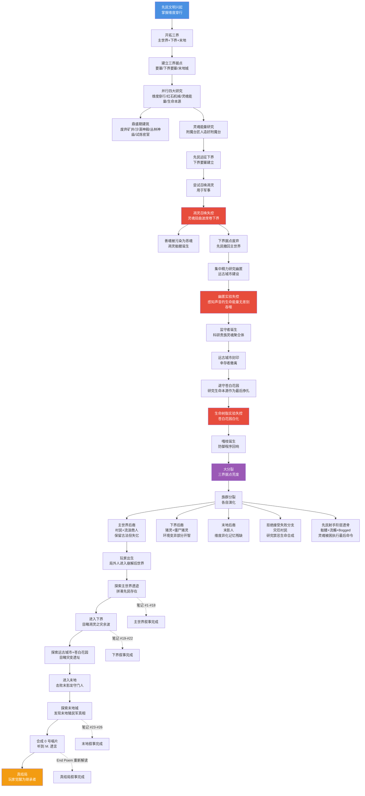
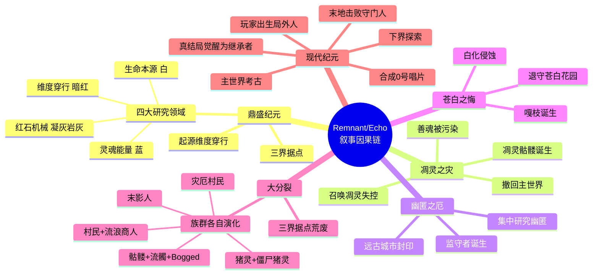

# 21 · 叙事因果链总图

> **状态**：🟡 设计讨论中
> **对应模组版本**：贯穿全部版本（叙事骨架）
> **创建日期**：2026-09-18
> **最后更新**：2026-09-18
> **设计原则**：[原则 0 · L1/L2/L3 判定](./00-planning-index.md#原则-0优先原版实在没辙才自定义且必须与原版有关)
> **关联章节**：[`02-story-timeline-plan.md`](./02-story-timeline-plan.md) · [`03-player-journey-map.md`](./03-player-journey-map.md) · [`16-worldview-overview.md`](./16-worldview-overview.md) · [`18-overworld-narrative.md`](./18-overworld-narrative.md) · [`19-nether-narrative.md`](./19-nether-narrative.md) · [`20-end-narrative.md`](./20-end-narrative.md)

---

## 1. 目的

本文档是**模组全部叙事的因果链总图**——把"远古先民文明兴衰"的故事按因果链顺畅串联起来，让读者（开发者与未来玩家）能一口气读完整个故事。

**与 [`02-story-timeline-plan.md`](./02-story-timeline-plan.md) 的关系**：
- 02 是"开发者用时序骨架"——按六大纪元划分
- 本文档是"读者用因果链叙事"——按事件因果串联，强调"为什么发生"

**与 [`03-player-journey-map.md`](./03-player-journey-map.md) 的关系**：
- 03 是"玩家用探索路径"——按十阶段解锁顺序
- 本文档是"故事本身的叙事流"——按事件先后与因果，玩家路径只是其中一条切线

**核心约束**：
- 所有事件必须基于原版设定或对原版留白的合理串联
- 严格遵守 L1/L2/L3 原则——本章节是叙事总结，不涉及任何机制实现
- 因果链必须"事得顺起来"——每个事件都有原因与结果，不出现孤立情节

---

## 2. 总览：故事一句话

> **「先民以为自己能控制一切能量。他们错了。」**

模组全部叙事由这一句话驱动。先民文明的兴衰，是一场"以为自己能控制"的悲剧——他们掌握维度穿行、红石机械、灵魂能量、生命本源四大领域的研究，以为自己能控制每一种能量，最终三大实验失控使他们崩解。

---

## 3. 因果链总图（Mermaid 完整流程图）

---

## 4. 鼎盛纪元：文明的兴起

### 4.1 起源：掌握维度穿行技术

**事件**：一支智慧文明在主世界兴起，掌握了维度穿行技术——能在主世界、下界、末地之间自由往返。

**原版依据**：
- 三界遗迹的石砖工艺一致（[`16-worldview-overview §3`](./16-worldview-overview.md#3-三界同源视觉与工艺证据)）
- 末地传送门框架的存在（要塞）
- 末地城与末地船的建筑结构（暗示跨维度航行能力）

**社区理论参考**：
- SyntaxMine "Ancient Builders Theory"（[`15-community-lore/01`](../15-community-lore/01-syntaxmine-ancient-builders.md) §2）
- MatPat "The COMPLETE Lore of Minecraft"（[`00-overview/04`](../00-overview/04-matpat-complete-lore.md)）

### 4.2 三界据点建立

先民同时开拓三界，建立据点：
- **主世界**：要塞（军事/宗教中心）、废弃矿井（地下交通）、沙漠神殿（地方祭祀）、丛林神庙（红石机械）、试炼密室（挑战设施）
- **下界**：下界要塞（前哨站+凋灵实验基地）、废弃传送门（早期维度穿行尝试）
- **末地**：末地城（殖民军据点）、末地船（等待接应的飞船）

### 4.3 四大研究领域并行

先民在鼎盛期同时研究四大领域（[`16-worldview-overview §4`](./16-worldview-overview.md#4-远古先民文明四大研究领域)）：

| 研究领域 | 视觉光谱 | 关键遗迹 | 关键物品 |
|----------|----------|----------|----------|
| 维度穿行 | 暗红 | 要塞、末地城 | 下界合金、末影之眼、末地传送门 |
| 红石机械 | 凝灰岩灰 | 废弃矿井、试炼密室 | 红石粉、试炼刷怪笼、Vault |
| 灵魂能量 | 蓝 | 要塞图书馆、远古城市 | 附魔台、青金石、经验值、幽匿 |
| 生命本源 | 白 | 苍白花园 | 树脂块、嘎枝之心、金苹果 |

### 4.4 鼎盛期建筑

鼎盛期，先民在主世界建造了大量结构：
- 沙漠神殿：地方祭祀与仓储（笔记 #2 祭祀记录）
- 丛林神庙：红石机械雏形（笔记 #3 红石记录）
- 废弃矿井：地下交通网络（笔记 #4 劳工日志）
- 地牢：监禁/储存设施（笔记 #5 监禁记录）
- 试炼密室：挑战与继承测试设施（笔记 #7-#10）

---

## 5. 凋灵之灾：第一次失控

### 5.1 触发：灵魂能量研究延伸到下界

先民在主世界研究灵魂能量取得成果（附魔台建造成功，笔记 #13 匠人日记），将研究延伸到下界——在下界要塞建立凋灵实验基地，尝试召唤凋灵作为军事武器。

**关键决策**：先民以为自己能控制灵魂能量的全部。

### 5.2 失控：凋灵召唤失败

凋灵召唤失控，灵魂扭曲波从下界要塞向四周扩散，扭曲所到之处的灵魂。

### 5.3 灾变：善魂被污染

| 受害者 | 灾变前形态 | 灾变后形态 |
|--------|------------|------------|
| 善魂（Ghastling） | 下界温和灵魂生物 | 恶魂（被污染） |
| 先民射手 | 在下界要塞驻扎 | 凋灵骷髅（灵魂被抹去） |
| 部分下界原生物 | 自然存在 | 灵魂沙峡谷的遗骨压缩体 |

**笔记 #19**（B. 工程师日志）记录了凋灵实验启动前的预兆——烈焰人躁动、善魂被扭曲。

### 5.4 后果：先民撤回主世界

下界据点废弃，先民远征队撤离下界。下界进入"灾变后荒废期"，剩余的善魂与凋灵骷髅继续存在，1.21.11+ 的快乐恶魂是"灾变前善魂的残留温和变体"。

**笔记 #21**（G. 埋葬者记录）记录了凋灵之灾后的下界埋葬工作，揭示灵魂沙=灾变受害者遗骨压缩而成。

---

## 6. 幽匿之厄：第二次失控

### 6.1 触发：撤回主世界后集中研究幽匿

凋灵之灾使先民撤回主世界，集中精力在远古城市研究"幽匿"——一种能感知声音的生命能量。

**关键决策**：先民**没有从凋灵之灾中吸取教训**，依然以为自己能控制灵魂能量的全部。这是模组叙事的悲剧核心——悲剧不会让人吸取教训，只会让人更紧迫地寻求新的"控制感"。

### 6.2 失控：幽匿感知声音后无差别吞噬

幽匿感知到玩家的存在（模组叙事设定：感知到先民科研贵族的存在），开始无差别吞噬生命能量。

### 6.3 灾变：监守者诞生

被幽匿吞噬的科研贵族灵魂聚合为监守者——一个盲眼、回声定位、感知声音的怪物。

**笔记 #14**（M. 灵魂能量研究员手记）记录了幽匿失控的过程，警告"幽匿已学会吃"。

### 6.4 后果：远古城市封印

远古城市被幽匿完全侵蚀，幸存者封印入口撤离。

---

## 7. 苍白之悔：第三次失控

### 7.1 触发：退守苍白花园研究生命本源

幽匿之厄后，先民退守苍白花园，研究生命本源作为最后挣扎——生命树脂实验，尝试赋予无生命物体意识。

**关键决策**：先民**仍未吸取教训**，依然以为自己能控制生命本源。

### 7.2 失控：生命树脂实验失控

生命树脂实验失控，整个苍白花园被白化侵蚀。

### 7.3 灾变：嘎枝诞生

嘎枝作为防御程序回响被激活，嘎枝之心是激活嘎枝的"活体方块"。

**笔记 #18**（M. 生命树脂实验最后记录）记录了苍白之悔的过程。

### 7.4 后果：苍白花园白化

所有植物、动物被白化侵蚀，苍白花园成为生命本源实验的废墟。

---

## 8. 大分裂：文明的崩解

### 8.1 三界据点荒废

三大灾变连续打击后，文明崩解：
- 主世界据点失联
- 下界崩溃
- 末地孤立

### 8.2 族群各自演化

| 维度 | 原初分支 | 现代后裔 | 演化逻辑 |
|------|----------|----------|----------|
| 主世界 | 先民定居者 | 村民、流浪商人 | 技术退化，社会延续 |
| 主世界地下 | 先民射手阶层 | 骷髅、流髑、Bogged | 灵魂被困，执行最后命令 |
| 主世界黑森林 | 拒绝接受失败的分支 | 灾厄村民 | 研究禁忌生命合成 |
| 下界 | 先民远征队 | 猪灵、僵尸猪灵 | 环境变异，部分开智 |
| 末地 | 末地殖民军 | 末影人 | 维度异化，记忆残缺 |

---

## 9. 现代纪元：玩家进入故事

### 9.1 玩家出生：局外人

玩家不是先民后裔，是局外人——从外部观察这个崩解后世界的存在。这一设定保留原版"史蒂夫/艾利克斯"的"无背景角色"特性。

### 9.2 主世界考古：拼凑先民存在

玩家在主世界探索遗迹，通过残破笔记拼凑先民文明的存在。

**笔记 #1-#18** 覆盖主世界全部叙事：
- 笔记 #1-#6：出生点+主世界考古（[`09-village-loot-extension`](./09-village-loot-extension.md)）
- 笔记 #7-#10：试炼密室（[`14-trial-chamber-narrative`](./14-trial-chamber-narrative.md)）
- 笔记 #11-#14：下界合金+附魔本质（[`15-netherite-enchantment-essence`](./15-netherite-enchantment-essence.md)）
- 笔记 #15-#18：主世界考古补充（[`18-overworld-narrative`](./18-overworld-narrative.md)）

### 9.3 下界探索：目睹凋灵之灾余波

玩家进入下界，目睹凋灵之灾的余波——恶魂哭泣声、凋灵骷髅游荡、灵魂沙峡谷的悲凉。

**笔记 #19-#22** 覆盖下界全部叙事（[`19-nether-narrative`](./19-nether-narrative.md)）：
- 笔记 #19：B. 凋灵实验工程师日志
- 笔记 #20：N. 远古生物观察记录
- 笔记 #21：G. 埋葬者记录
- 笔记 #22：L. 猪灵文明宣言

### 9.4 远古城市+苍白花园：目睹灾变遗址

玩家在远古城市见到幽匿失控的遗迹，在苍白花园见到生命树脂失控的废墟。这两处遗址与试炼密室（红石机械受控）形成视觉对照——先民的研究有受控与失控两面。

### 9.5 进入末地：击败末影龙守门人

玩家通过要塞的末地传送门进入末地，击败末影龙——模组解读末影龙为先民制造的"最终守门人"。

**关键转折**：玩家击败末影龙不是终点，而是开始——通过折跃门进入末地外岛，发现末地城与末地船的真相。

### 9.6 末地城探索：发现殖民军真相

玩家在末地城图书馆发现笔记 #23（C. 指挥官日志），在末地船舱底发现笔记 #24（C. 等待接应记录），在终界岛中心发现笔记 #25（E. 维度穿行技术报告晚期版），在回归传送门旁发现笔记 #26（M. 先民领袖告别书）。

**真结局核心揭晓**：C. = M. 同人——M. 即为先民领袖 C.，他在末地等待接应，最终通过青金石保住灵魂，在 End Poem 期间与玩家对话。

### 9.7 合成 0 号唱片：听到 M. 遗言

玩家收集全部 22 张原版唱片，与下界之星合成 0 号唱片。播放 0 号唱片时，玩家听到 M.（曾经的 C.）的最后遗言（全文见 [`planning/20-end-narrative`](./20-end-narrative.md) §14.2）。

### 9.8 真结局：玩家觉醒为继承者

End Poem 显示后，玩家从"局外人"觉醒为"继承者"——M. 把先民文明的所有记忆传给玩家，"这个世界，现在交给你了"。

---

## 10. 因果链核心规律

### 10.1 灾难链规律：每次灾变都为下一次埋下伏笔

- 凋灵之灾 → 先民撤回主世界 → 集中研究幽匿 → 幽匿之厄
- 幽匿之厄 → 退守苍白花园 → 研究生命本源 → 苍白之悔
- 苍白之悔 → 大分裂 → 三界据点荒废

### 10.2 悲剧规律：先民从未吸取教训

模组叙事的核心悲剧——**先民以为自己能控制一切能量，结果发现不能**。三大灾变中，先民从未真正吸取前一次的教训，反而更紧迫地寻求新的"控制感"，导致下一次更严重的失控。

### 10.3 视觉叙事规律：四色光谱贯穿全部

| 颜色 | 颜色含义 | 研究领域 | 出现位置 |
|------|----------|----------|----------|
| 暗红 | 维度稳定 | 维度穿行 | 下界合金、远古残骸、烈焰人火球、岩浆怪 |
| 紫 | 维度异化 | 维度异化 | 紫珀砖、紫颂果、末影珍珠、末影之眼 |
| 白 | 生命本源 | 生命本源 | 苍白橡木、树脂块、嘎枝之心 |
| 蓝 | 灵魂能量 | 灵魂能量 | 青金石、附魔台界面 |

四色光谱在玩家探索三界时形成视觉呼应——模组的"碎片化叙事"在视觉层面也有体现。

### 10.4 角色规律：M. 贯穿全部纪元

模组核心角色 M.（曾经的 C.）贯穿全部纪元：
- 鼎盛纪元：M. 作为先民领袖，撰写笔记 #1（出生点）、#10（试炼密室）、#13（附魔台匠人日记同人）、#17（维度穿行技术报告同人）、#18（苍白花园最后记录）
- 凋灵之灾：M. 作为指挥官 C.，与下界工程师 B. 同时期工作
- 大分裂：M. 作为末地殖民军指挥官 C.，带领殖民军到末地
- 现代纪元：M. 通过 0 号唱片与玩家对话，揭示全部真相

### 10.5 留白规律：模组不填补的留白

模组严格遵循"贴合原版留白逻辑"原则，以下内容**不强行解释**：
- 先民的具体起源（"千年前"未定数字）
- 玩家的具体身份（保留原版史蒂夫/艾利克斯的"无背景角色"特性）
- 末影龙的具体制造过程（仅解读为"先民制造的守门人"）
- 凋灵召唤的具体咒文（仅解读为"先民以为自己能控制灵魂能量"）

---

## 11. 与其他规划文档的引用关系

本章节是"模组叙事因果链的总图"，与其他规划文档的关系如下：

| 规划文档 | 与本章节关系 |
|----------|--------------|
| [`02-story-timeline-plan.md`](./02-story-timeline-plan.md) | 02 是开发者用时序骨架，本章节是读者用因果链叙事 |
| [`03-player-journey-map.md`](./03-player-journey-map.md) | 03 是玩家用探索路径，本章节是故事本身的叙事流 |
| [`16-worldview-overview.md`](./16-worldview-overview.md) | 16 是面向读者的世界观总纲，本章节是因果链总图 |
| [`18-overworld-narrative.md`](./18-overworld-narrative.md) | 18 是主世界叙事细化，本章节引用其事件 |
| [`19-nether-narrative.md`](./19-nether-narrative.md) | 19 是下界叙事细化，本章节引用其事件 |
| [`20-end-narrative.md`](./20-end-narrative.md) | 20 是末地叙事细化+真结局核心，本章节引用其事件 |

---

## 12. 思维导图建议

基于本因果链总图，建议制作一份**模组叙事思维导图**作为玩家与开发者的可视化入口。思维导图建议结构：

**思维导图实现**：见 [`download/mindmap/`](../download/mindmap/) 目录（由 charts 技能生成）。

---

## 13. 待讨论的设计问题

- [ ] 因果链是否有需要进一步细化的节点？
- [ ] 是否需要为每个事件添加"原版依据"标注？（部分已有，是否扩展到全部？）
- [ ] 思维导图是否需要制作 PNG/SVG 版本？（倾向：是，用 charts 技能生成）
- [ ] 是否需要为玩家提供"故事回放"功能（如收集 0 号唱片后回放完整因果链）？（倾向：v1.0 后考虑，避免破坏碎片化叙事原则）
- [ ] 因果链是否需要按版本分阶段展示（v0.1 只展示部分，v1.0 展示全部）？（倾向：否，叙事完整性优先）

---

## 14. 修订历史

| 日期 | 版本 | 修订内容 | 修订者 |
|------|------|----------|--------|
| 2026-09-18 | v0.1 | 初稿，建立模组叙事因果链总图，含完整 Mermaid 流程图 + 四大规律（灾难链/悲剧/视觉光谱/角色贯穿/留白）+ 思维导图建议 | 项目方 |
