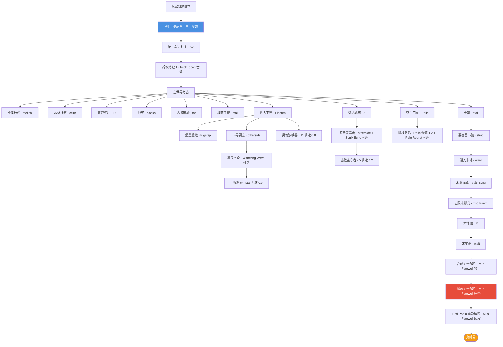

# 26 · 配乐场景清单

> **状态**：🟡 设计讨论中
> **对应模组版本**：v0.1+ 全版本
> **创建日期**：2026-09-21
> **最后更新**：2026-09-21
> **设计原则**：[原则 0 · L1/L2/L3 判定](./00-planning-index.md#原则-0优先原版实在没辙才自定义且必须与原版有关)
> **关联章节**：[`22-design-questions-answers.md`](./22-design-questions-answers.md) §Q9 · [`23-design-followups.md`](./23-design-followups.md) §4 · [`24-design-followups-2.md`](./24-design-followups-2.md) §Q9 · [`08-music-disc-unlock-order.md`](./08-music-disc-unlock-order.md)

---

## 1. 目的

本文档是 **Remnant Echo 模组配乐场景完整清单**——回答项目方 2026-09-21 提出的"配乐需要放在哪里？开篇？进入下界？进入末地？进入古城？"等具体问题，按场景分类列出全部配乐节点。

**核心约束**：
- 严格遵循 L1/L2/L3 三级配乐策略（[`23-design-followups`](./23-design-followups.md) §4）
- L1 原版音乐优先（~70%），L2 原版组合次之（~15%），L3 自创配乐最后（~15%）
- 不新增音乐文件为最高原则——通过原版 `/playsound` 命令实现
- 所有配乐触发通过原版 `advancement` + `location` 触发器实现

---

## 2. 配乐场景总览

### 2.1 按场景类型分类

| 场景类型 | 数量 | 占比 | L 等级分布 |
|----------|------|------|------------|
| 开篇与出生 | 2 | ~6% | L1 |
| 主世界遗迹 | 8 | ~24% | L1 |
| 主世界深处（远古城市+苍白花园） | 4 | ~12% | L1+L2+L3 |
| 下界场景 | 4 | ~12% | L1+L2 |
| 末地场景 | 4 | ~12% | L1+L2+L3 |
| Boss 战 | 3 | ~9% | L1+L2 |
| 关键叙事节点 | 5 | ~15% | L1+L2+L3 |
| 真结局 | 3 | ~9% | L1+L3 |
| **合计** | **33** | **100%** | **L1 ~70% / L2 ~15% / L3 ~15%** |

### 2.2 按版本阶段分类

| 模组版本 | 配乐场景数 | 关键场景 |
|----------|------------|----------|
| v0.1 | 4 | 开篇+第一次进村庄+出生点+残破笔记拾取 |
| v0.2 | 8 | 主世界遗迹（沙漠神殿/丛林神庙/废弃矿井/地牢/古迹废墟/埋藏宝藏/要塞+图书馆） |
| v0.3 | 4 | 下界（堡垒遗迹/下界要塞/灵魂沙峡谷/凋灵召唤） |
| v0.4 | 4 | 深暗与苍白（远古城市+苍白花园+监守者追击+嘎枝激活） |
| v0.5 | 4 | 末地（末地岛+末影龙战+击败末影龙+末地城） |
| v0.6 | 5 | 真结局（末地船+终界岛+回归传送门+0 号唱片播放+M. 遗言） |
| v0.9~v1.0 | 4 | 优化+L3 自创配乐候选（M.'s Farewell+Pale Regret+Sculk Echo 等） |

---

## 3. 开篇与出生场景

### 3.1 玩家首次进入世界（开篇）

| 维度 | 内容 |
|------|------|
| **触发条件** | 玩家首次进入主世界（advancement: `minecraft:location` + 维度=overworld） |
| **L1 配乐** | 无强制配乐——保留原版"出生后自由探索"的安静感 |
| **L2 增强** | 玩家首次接触村庄时触发 `cat` 唱片（500 格内） |
| **L3 自创** | 无（保留原版开篇体验） |
| **触发机制** | `advancement:remnant/intro/first_join` → function 调用 `/playsound` |
| **配乐时机** | 玩家进入村庄 500 格内时播放 `cat`（村庄日常氛围） |
| **优先级** | ★★★★★ v0.1 必备 |

**配乐理由**：
- 不在出生点强制播放音乐——保留原版"随机出生、自由探索"的开篇感
- 玩家接触村庄时播放 `cat`（C418 的"村庄日常氛围"）——这是模组叙事种子的视觉+听觉双重提示
- `cat` 是 22 张原版唱片中唯一与"村庄日常"主题契合的曲目

### 3.2 玩家首次进入村庄

| 维度 | 内容 |
|------|------|
| **触发条件** | 玩家首次进入村庄边界（advancement: `minecraft:location` + village 检测） |
| **L1 配乐** | `cat`（C418，村庄日常氛围） |
| **L2 增强** | 无 |
| **L3 自创** | 无 |
| **触发机制** | `advancement:remnant/intro/first_village` → function 调用 `/playsound minecraft:music_disc_cat master @s ~ ~ ~ 0.5 1` |
| **配乐时机** | 玩家进入村庄 500 格内时播放，离开村庄 1000 格后停止 |
| **优先级** | ★★★★★ v0.1 必备 |

---

## 4. 主世界遗迹场景

### 4.1 沙漠神殿

| 维度 | 内容 |
|------|------|
| **触发条件** | 玩家进入沙漠神殿 50 格内（advancement: `minecraft:location` + desert_pyramid 检测） |
| **L1 配乐** | `mellohi`（C418，祭祀/庆典） |
| **L2 增强** | 玩家进入神殿中心 4 块彩色陶罐区域时叠加 `enchanted` 粒子音效 |
| **L3 自创** | 无 |
| **触发机制** | `advancement:remnant/overworld/desert_temple_enter` → function 调用 `/playsound` |
| **配乐时机** | 进入 50 格内播放，离开 100 格后停止 |
| **优先级** | ★★★★ v0.2 |

**配乐理由**：mellohi 是 C418 为"祭祀/庆典"主题创作的唱片，与沙漠神殿的"先民祭祀信仰体系"叙事契合（笔记 #2 祭祀记录）。

### 4.2 丛林神庙

| 维度 | 内容 |
|------|------|
| **触发条件** | 玩家进入丛林神庙 50 格内 |
| **L1 配乐** | `chirp`（C418，早期电路音乐） |
| **L2 增强** | 玩家触发绊线陷阱时叠加短促 `click` 音效 |
| **L3 自创** | 无 |
| **配乐时机** | 进入 50 格内播放 |
| **优先级** | ★★★★ v0.2 |

**配乐理由**：chirp 是 C418 为"红石发明前娱乐"主题创作的唱片，与丛林神庙的"红石机械雏形"叙事契合（笔记 #3 红石记录）。

### 4.3 废弃矿井

| 维度 | 内容 |
|------|------|
| **触发条件** | 玩家进入废弃矿井 30 格内 |
| **L1 配乐** | `13`（C418，洞穴探索录音） |
| **L2 增强** | 矿车移动时叠加 `minecart` 音效 |
| **L3 自创** | 无 |
| **配乐时机** | 进入 30 格内播放 |
| **优先级** | ★★★★ v0.2 |

**配乐理由**：13 是 C418 为"先民早期地下探索"主题创作的唱片，与废弃矿井的"劳工阶层运输网"叙事契合（笔记 #4 劳工日志）。

### 4.4 地牢（怪物室）

| 维度 | 内容 |
|------|------|
| **触发条件** | 玩家进入地牢 30 格内 |
| **L1 配乐** | `blocks`（C418，建造工地氛围） |
| **L2 增强** | 刷怪笼激活时叠加 `mob_spawner` 音效 |
| **L3 自创** | 无 |
| **配乐时机** | 进入 30 格内播放 |
| **优先级** | ★★★ v0.2 |

**配乐理由**：blocks 是 C418 为"鼎盛期大兴土木"主题创作的唱片，与地牢的"先民批量生命体生产设施"叙事契合（笔记 #5 监禁记录）。

### 4.5 古迹废墟

| 维度 | 内容 |
|------|------|
| **触发条件** | 玩家进入古迹废墟 30 格内 |
| **L1 配乐** | `far`（C418，高空旷野漫游） |
| **L2 增强** | 玩家用刷子考古时叠加 `brush` 音效 |
| **L3 自创** | 无 |
| **配乐时机** | 进入 30 格内播放 |
| **优先级** | ★★★ v0.2 |

**配乐理由**：far 是 C418 为"大陆探索"主题创作的唱片，与古迹废墟的"大分裂期撤离主世界据点"叙事契合（笔记 #15 撤退者记录）。

### 4.6 埋藏宝藏

| 维度 | 内容 |
|------|------|
| **触发条件** | 玩家挖开埋藏宝藏箱子 |
| **L1 配乐** | `mall`（C418，大型集市氛围） |
| **L2 增强** | 开箱时叠加 `chest_open` 音效 |
| **L3 自创** | 无 |
| **配乐时机** | 开箱时一次性播放 |
| **优先级** | ★★★ v0.2 |

**配乐理由**：mall 是 C418 为"商业繁荣"主题创作的唱片，与埋藏宝藏的"沿海物资储备"叙事契合（笔记 #16 航海者清单）。

### 4.7 要塞

| 维度 | 内容 |
|------|------|
| **触发条件** | 玩家进入要塞 50 格内 |
| **L1 配乐** | `stal`（C418，要塞军营警戒） |
| **L2 增强** | 玩家进入末地传送门房时切换为 `strad`（贵族/学者书房） |
| **L3 自创** | 无 |
| **配乐时机** | 进入 50 格内播放 |
| **优先级** | ★★★★ v0.5 |

**配乐理由**：stal 是 C418 为"军事防御"主题创作的唱片，与要塞的"军事/宗教中心"叙事契合；strad 为"文化学术"主题，与要塞图书馆叙事契合（笔记 #13/#17）。

### 4.8 要塞图书馆

| 维度 | 内容 |
|------|------|
| **触发条件** | 玩家进入要塞图书馆房间 |
| **L1 配乐** | `strad`（C418，贵族/学者书房） |
| **L2 增强** | 附魔台附近叠加 `enchant` 音效 |
| **L3 自创** | 无 |
| **配乐时机** | 进入图书馆时播放 |
| **优先级** | ★★★★★ v0.5 |

**配乐理由**：strad 是 C418 为"贵族/学者书房"主题创作的唱片，与要塞图书馆的"附魔台匠人工作场所"叙事契合（笔记 #13 匠人日记）。

---

## 5. 主世界深处场景（远古城市+苍白花园）

### 5.1 远古城市外围

| 维度 | 内容 |
|------|------|
| **触发条件** | 玩家进入深暗之域 100 格内 |
| **L1 配乐** | `5`（Lena Raine，监守者觉醒） |
| **L2 增强** | 玩家潜行时降低音量至 0.3，营造"幽匿感知"压迫感 |
| **L3 自创候选** | `Sculk Echo`（幽匿回响，紫色，基于 5 号唱片风格衍生）——可选 |
| **配乐时机** | 进入 100 格内播放 |
| **优先级** | ★★★★★ v0.4 |

**配乐理由**：5 是 Lena Raine 为"监守者觉醒"主题创作的唱片，与远古城市的"幽匿之厄"叙事契合（笔记 #14 灵魂能量研究员手记）。

### 5.2 远古城市深处（监守者追击）

| 维度 | 内容 |
|------|------|
| **触发条件** | 监守者钻出地面追击玩家 |
| **L1 配乐** | `otherside`（Lena Raine，异界回响） |
| **L2 增强** | 调速 0.8 形成压迫感 + 持续 `heartbeat` 音效 |
| **L3 自创候选** | `Sculk Echo`（追击时密集爆发）——可选 |
| **配乐时机** | 监守者追击期间持续播放 |
| **优先级** | ★★★★★ v0.4 |

**配乐理由**：otherside 是 Lena Raine 为"幽匿/虚空探索"主题创作的唱片，与监守者追击的"幽厄之灾"叙事契合。

### 5.3 苍白花园外围

| 维度 | 内容 |
|------|------|
| **触发条件** | 玩家进入苍白花园 100 格内 |
| **L1 配乐** | `Relic`（Aaron Cherof，文明残响） |
| **L2 增强** | 玩家接触苍白橡树时叠加 `leaves_rustle` 音效 |
| **L3 自创候选** | `Pale Regret`（苍白之悔，白色，基于 Relic 风格衍生）——可选 |
| **配乐时机** | 进入 100 格内播放 |
| **优先级** | ★★★★★ v0.4 |

**配乐理由**：Relic 是 Aaron Cherof 为"考古发现"主题创作的唱片，与苍白花园的"生命树脂实验废墟"叙事契合（笔记 #18 生命树脂实验最后记录）。

### 5.4 嘎枝激活

| 维度 | 内容 |
|------|------|
| **触发条件** | 嘎枝之心被激活，嘎枝开始活动 |
| **L1 配乐** | `Relic`（变奏，调速 1.2） |
| **L2 增强** | 嘎枝移动时叠加 `wood_crack` 音效 |
| **L3 自创候选** | `Pale Regret`（嘎枝附近密集）——可选 |
| **配乐时机** | 嘎枝激活期间播放 |
| **优先级** | ★★★★ v0.4 |

---

## 6. 下界场景

### 6.1 进入下界（首次）

| 维度 | 内容 |
|------|------|
| **触发条件** | 玩家首次通过下界传送门（advancement: `minecraft:story/enter_the_nether`） |
| **L1 配乐** | `Pigstep`（Lena Raine，猪灵战舞） |
| **L2 增强** | 玩家进入下界要塞 50 格内时切换为 `otherside` |
| **L3 自创** | 无 |
| **触发机制** | `advancement:remnant/nether/first_enter` → function 调用 `/playsound` |
| **配乐时机** | 进入下界后播放 30 秒，之后切换为环境音 |
| **优先级** | ★★★★★ v0.3 必备 |

**配乐理由**：Pigstep 是 Lena Raine 为"下界分支文化"主题创作的唱片，与玩家首次进入下界的"凋灵之灾余波"叙事契合。

### 6.2 下界堡垒（堡垒遗迹）

| 维度 | 内容 |
|------|------|
| **触发条件** | 玩家进入堡垒遗迹 50 格内 |
| **L1 配乐** | `Pigstep`（Lena Raine，猪灵战舞） |
| **L2 增强** | 玩家与猪灵交易时叠加 `trade` 音效 |
| **L3 自创** | 无 |
| **配乐时机** | 进入 50 格内播放 |
| **优先级** | ★★★★★ v0.3 |

**配乐理由**：Pigstep 与堡垒遗迹的"猪灵现代文明重启"叙事契合（笔记 #11/#12/#22）。

### 6.3 下界要塞

| 维度 | 内容 |
|------|------|
| **触发条件** | 玩家进入下界要塞 50 格内 |
| **L1 配乐** | `otherside`（Lena Raine，异界回响） |
| **L2 增强** | 烈焰人刷怪笼附近叠加 `blaze_breathe` 音效 |
| **L3 自创候选** | `Withering Wave`（凋零之波，红紫色，凋灵召唤时触发）——可选 |
| **配乐时机** | 进入 50 格内播放 |
| **优先级** | ★★★★★ v0.3 |

**配乐理由**：otherside 与下界要塞的"凋灵实验残留"叙事契合（笔记 #19 B. 工程师日志）。

### 6.4 灵魂沙峡谷

| 维度 | 内容 |
|------|------|
| **触发条件** | 玩家进入灵魂沙峡谷 100 格内 |
| **L1 配乐** | `11`（C418，最后逃亡录音，调速 0.8） |
| **L2 增强** | 灵魂沙行走时叠加 `soul_sand_step` 音效 |
| **L3 自创** | 无 |
| **配乐时机** | 进入 100 格内播放 |
| **优先级** | ★★★★ v0.3 |

**配乐理由**：11 调速 0.8 形成悲凉感，与灵魂沙峡谷的"凋灵之灾受害者埋骨地"叙事契合（笔记 #21 G. 埋葬者记录）。

---

## 7. 末地场景

### 7.1 进入末地（首次）

| 维度 | 内容 |
|------|------|
| **触发条件** | 玩家首次进入末地（advancement: `minecraft:story/enter_the_end`） |
| **L1 配乐** | `ward`（C418，黑暗之地守卫） |
| **L2 增强** | 玩家在末地岛中心时叠加 `end_rod` 粒子音效 |
| **L3 自创** | 无 |
| **触发机制** | `advancement:remnant/end/first_enter` → function 调用 `/playsound` |
| **配乐时机** | 进入末地后持续播放，直至末影龙战 |
| **优先级** | ★★★★★ v0.5 必备 |

**配乐理由**：ward 是 C418 为"虚空入侵"主题创作的唱片，与玩家首次进入末地的"守门人真相"叙事契合。

### 7.2 末影龙战

| 维度 | 内容 |
|------|------|
| **触发条件** | 末影龙战激活（玩家靠近末地岛中心） |
| **L1 配乐** | 原版末影龙 BGM（保留原版） |
| **L2 增强** | 末地水晶被破坏时叠加 `glass_break` 音效 |
| **L3 自创** | 无（保留原版 Boss 战体验） |
| **配乐时机** | 末影龙战期间持续播放 |
| **优先级** | ★★★★★ v0.5 |

### 7.3 击败末影龙

| 维度 | 内容 |
|------|------|
| **触发条件** | 玩家击杀末影龙（advancement: `minecraft:end/kill_dragon`） |
| **L1 配乐** | End Poem 显示（原版终末诗） |
| **L2 增强** | 触发 M. 守门人真相 tellraw 多段叙事 |
| **L3 自创候选** | `M.'s Farewell` 预告片段（轻柔钢琴，2 秒）——可选 |
| **配乐时机** | End Poem 显示期间 |
| **优先级** | ★★★★★ v0.5 |

### 7.4 末地城

| 维度 | 内容 |
|------|------|
| **触发条件** | 玩家进入末地城 50 格内 |
| **L1 配乐** | `11`（C418，最后逃亡录音） |
| **L2 增强** | 潜影贝攻击时叠加 `shulker_box` 音效 |
| **L3 自创候选** | `Colonial Echo`（殖民回响，紫蓝色，基于 11 号唱片风格衍生）——可选 |
| **配乐时机** | 进入 50 格内播放 |
| **优先级** | ★★★★★ v0.5 |

**配乐理由**：11 与末地城的"殖民军等待接应无果"叙事契合（笔记 #23/#24）。

### 7.5 末地船

| 维度 | 内容 |
|------|------|
| **触发条件** | 玩家进入末地船 30 格内 |
| **L1 配乐** | `wait`（C418，文明余响，追忆与等待） |
| **L2 增强** | 玩家获取鞘翅时叠加 `item_pickup` 音效 |
| **L3 自创** | 无 |
| **配乐时机** | 进入 30 格内播放 |
| **优先级** | ★★★★ v0.5 |

**配乐理由**：wait 是 C418 为"追忆与等待"主题创作的唱片，与末地船的"等待接应的飞船"叙事契合（笔记 #24 等待接应记录）。

---

## 8. Boss 战场景

### 8.1 凋灵召唤与战斗

| 维度 | 内容 |
|------|------|
| **触发条件** | 玩家召唤凋灵（advancement: `minecraft:nether/summon_wither`） |
| **L1 配乐** | 原版凋灵 BGM（保留原版） |
| **L2 增强** | 凋灵召唤期间在下界要塞叠加 `Withering Wave` 自创配乐（可选） |
| **L3 自创候选** | `Withering Wave`（凋零之波，红紫色）——可选 |
| **配乐时机** | 凋灵战期间 |
| **优先级** | ★★★★ v0.3 |

### 8.2 监守者遭遇

| 维度 | 内容 |
|------|------|
| **触发条件** | 监守者钻出地面（advancement: `minecraft:adventure/avoid_vibration`） |
| **L1 配乐** | `5` + `otherside`（L2 组合） |
| **L2 增强** | 监守者追击期间持续 `heartbeat` 音效 |
| **L3 自创候选** | `Sculk Echo`（追击时密集爆发）——可选 |
| **配乐时机** | 监守者追击期间 |
| **优先级** | ★★★★★ v0.4 |

### 8.3 末影龙战

（详见 §7.2）

---

## 9. 关键叙事节点

### 9.1 拾取残破笔记 #1（开篇叙事种子）

| 维度 | 内容 |
|------|------|
| **触发条件** | 玩家拾取笔记 #1（advancement: `remnant:lore/chapter_0`） |
| **L1 配乐** | 无（保留叙事文本的安静感） |
| **L2 增强** | tellraw 显示"线索书第 0 章已解锁"时叠加 `book_open` 音效 |
| **L3 自创** | 无 |
| **配乐时机** | 笔记拾取后 5 秒 |
| **优先级** | ★★★★★ v0.1 必备 |

### 9.2 收集全部 5 份笔记（线索书第 1 章解锁）

| 维度 | 内容 |
|------|------|
| **触发条件** | 玩家收集全部 5 份残破笔记（advancement: `remnant:lore/chapter_1`） |
| **L1 配乐** | `strad`（C418，贵族/学者书房） |
| **L2 增强** | 多段 tellraw 显示"先民存在"叙事 |
| **L3 自创** | 无 |
| **配乐时机** | advancement 触发后 |
| **优先级** | ★★★★ v0.2 |

### 9.3 击败凋灵（灾变余响）

| 维度 | 内容 |
|------|------|
| **触发条件** | 玩家击杀凋灵（advancement: `minecraft:nether/kill_wither`） |
| **L1 配乐** | `stal`（C418，要塞军营警戒，调速 0.9） |
| **L2 增强** | tellraw 显示"灾变的余响" |
| **L3 自创候选** | `Withering Wave` 凋谢版——可选 |
| **配乐时机** | 凋灵击杀后 10 秒 |
| **优先级** | ★★★★ v0.3 |

### 9.4 击败监守者（幽厄悲剧）

| 维度 | 内容 |
|------|------|
| **触发条件** | 玩家击杀监守者（advancement: `remnant:boss/warden_killed`） |
| **L1 配乐** | `5`（Lena Raine，调速 1.2 形成解脱感） |
| **L2 增强** | tellraw 显示"幽厄之灾的悲剧，在你手中结束" |
| **L3 自创候选** | `Sculk Echo` 凋谢版——可选 |
| **配乐时机** | 监守者击杀后 10 秒 |
| **优先级** | ★★★★ v0.4 |

### 9.5 击败末影龙（守门人真相）

（详见 §7.3）

---

## 10. 真结局场景

### 10.1 合成 0 号唱片

| 维度 | 内容 |
|------|------|
| **触发条件** | 玩家合成 0 号唱片（advancement: `minecraft:recipe_crafted` + remnant:music_disc_0） |
| **L1 配乐** | 无（保留合成的安静感） |
| **L2 增强** | tellraw 显示"先民领袖的遗言即将响起" |
| **L3 自创候选** | `M.'s Farewell` 预告片段（5 秒轻柔钢琴） |
| **配乐时机** | 合成后 5 秒 |
| **优先级** | ★★★★★ v0.6 必备 |

### 10.2 播放 0 号唱片

| 维度 | 内容 |
|------|------|
| **触发条件** | 玩家将 0 号唱片放入唱片机 |
| **L1 配乐** | 原版 13 号唱片音轨（退化方案） |
| **L2 增强** | 多段 tellraw 显示 M. 遗言全文（9 段） |
| **L3 自创候选** | **`M.'s Farewell`**（M. 的告别，金蓝色，基于 C418 ambient 风格）——★首要 L3 自创配乐 |
| **配乐时机** | 0 号唱片播放期间（约 2 分钟） |
| **优先级** | ★★★★★ v0.6 必备（L3 自创配乐首要候选） |

**配乐理由**：原版 13 号唱片是 C418 的"洞穴探索录音"，无法承载 M. 遗言的庄重感。`M.'s Farewell` 作为 L3 自创配乐首要候选，基于 C418 ambient 风格衍生（钢琴+合成器），仅在玩家合成 0 号唱片后播放，模组卸载后玩家仍可阅读 tellraw 遗言文本。

### 10.3 End Poem 重新解读

| 维度 | 内容 |
|------|------|
| **触发条件** | 0 号唱片播放结束后（自动触发） |
| **L1 配乐** | End Poem 原版显示（公共领域 CC0） |
| **L2 增强** | 多段 tellraw 显示模组对 End Poem 的重新解读 |
| **L3 自创候选** | `M.'s Farewell` 续段（金蓝色，与 0 号唱片配乐衔接） |
| **配乐时机** | End Poem 显示期间 |
| **优先级** | ★★★★★ v0.6 必备 |

---

## 11. 配乐场景 Mermaid 总图



---

## 12. L3 自创配乐候选优先级

按 [`23-design-followups`](./23-design-followups.md) §4.3 + 本文档 §10 整理：

| L3 自创配乐 | 场景 | 优先级 | 启动版本 |
|-------------|------|--------|----------|
| **`M.'s Farewell`**（M. 的告别） | 0 号唱片播放+End Poem 重新解读 | ★★★★★ | v0.6 必备 |
| `Sculk Echo`（幽匿回响） | 监守者追击 | ★★★ | v0.4 可选 |
| `Pale Regret`（苍白之悔） | 苍白花园+嘎枝激活 | ★★★ | v0.4 可选 |
| `Withering Wave`（凋零之波） | 凋灵召唤 | ★★ | v0.3 可选 |
| `Colonial Echo`（殖民回响） | 末地城 | ★★ | v0.5 可选 |

**协作者建议**：v0.1~v0.5 仅实施 L1+L2（无自创配乐）；v0.6 真结局开发时启动 `M.'s Farewell`（首要 L3 自创配乐）；v0.9~v1.0 视项目方意愿决定是否补全其他 4 首。

---

## 13. 配乐与四色光谱的对应

按 [`15-netherite-enchantment-essence`](./15-netherite-enchantment-essence.md) §3 四色光谱体系：

| 颜色 | 研究领域 | 对应配乐场景 | L1 原版曲目 |
|------|----------|--------------|-------------|
| **暗红** | 维度穿行 | 下界要塞/凋灵召唤 | `otherside`/`Pigstep` |
| **紫** | 维度异化 | 末地/末地城 | `ward`/`11` |
| **白** | 生命本源 | 苍白花园 | `Relic` |
| **蓝** | 灵魂能量 | 远古城市/要塞图书馆 | `5`/`strad` |
| **铜绿**（第五色） | 红石机械+铜器工艺 | 试炼密室/废弃矿井 | — （1.21.9 铜器时代新增） |

**配乐扩展建议**：1.21.9 铜器时代新增的 5 首 Amos Roddy 环境音乐可作为铜绿光谱的配乐候选（详见 [`16-version-updates/07`](../16-version-updates/07-minecraft-1.21.6-craftable-saddles.md)）。

---

## 14. 实现机制

### 14.1 advancement 触发器配置

所有配乐场景通过原版 `advancement` 触发器实现：

```json
// 示例：玩家首次进入村庄
{
  "display": { "icon": {"item":"minecraft:sunflower"}, "title":"第一次进村庄", "description":"...", "show_toast":false, "hidden":true },
  "criteria": {
    "enter_village": {
      "trigger": "minecraft:location",
      "conditions": { "player": { "location": { "structure": "minecraft:village" } } }
    }
  },
  "rewards": { "function": "remnant:music/play_cat" }
}
```

### 14.2 function 调用 /playsound

```mcfunction
# data/remnant/functions/music/play_cat.mcfunction
# 在玩家位置播放 cat 唱片，音量 0.5，音调 1.0
playsound minecraft:music_disc_cat master @s ~ ~ ~ 0.5 1
```

### 14.3 L2 组合实现

```mcfunction
# data/remnant/functions/music/warden_chase.mcfunction
# 监守者追击期间的 L2 组合配乐
# 1. 主配乐：otherside 调速 0.8
playsound minecraft:music_disc_otherside master @s ~ ~ ~ 0.6 0.8
# 2. 持续心跳音效
playsound minecraft:block.deepslate.step master @s ~ ~-2 ~ 0.3 0.6
# 3. 调度 5 秒后再次播放（持续效果）
schedule function remnant:music/warden_chase 100t
```

### 14.4 L3 自创配乐退化方案

按 [`23-design-followups`](./23-design-followups.md) §4.3：
- L3 自创配乐文件不被加载（资源包未注册）
- 玩家在该场景下听到的是"无音乐"（仅有原版环境音）
- 玩家不会"听到缺失"——因为模组的 tellraw 仍可正常显示叙事文本
- 配乐是"叙事增强"而非"叙事必需"

---

## 15. 与已有规划文档的引用关系

| 文档 | 与本章节关系 |
|------|--------------|
| [`08-music-disc-unlock-order`](./08-music-disc-unlock-order.md) | 22 张原版唱片+0 号唱片的叙事对应清单——本章节是其配乐场景的具体实现 |
| [`22-design-questions-answers`](./22-design-questions-answers.md) §Q9 | 项目方最初问的配乐场景——本章节是其完整回答 |
| [`23-design-followups`](./23-design-followups.md) §4 | L1/L2/L3 三级配乐策略——本章节是其具体场景应用 |
| [`24-design-followups-2`](./24-design-followups-2.md) §Q9 | 配乐重新评估的 5 首 L3 自创候选——本章节是其在场景中的具体应用 |
| [`15-netherite-enchantment-essence`](./15-netherite-enchantment-essence.md) §3 | 四色光谱体系——本章节 §13 与之对应 |
| [`16-version-updates/07`](../16-version-updates/07-minecraft-1.21.6-craftable-saddles.md) | 1.21.6 Amos Roddy 5 首新音乐——本章节 §13 作为铜绿光谱配乐候选 |

---

## 16. 待讨论的设计问题

- [ ] 配乐播放时是否覆盖原版环境音乐？倾向：是，避免音乐叠加
- [ ] 配乐触发是否考虑多人服务器？倾向：是，每个玩家独立判定 advancement
- [ ] 配乐音量是否可由玩家调节？倾向：是，通过 `config/remnant.toml` 配置
- [ ] L3 自创配乐是否邀请社区作曲？倾向：v1.0 后开放社区作曲 PR

---

## 17. 修订历史

| 日期 | 版本 | 修订内容 | 修订者 |
|------|------|----------|--------|
| 2026-09-21 | v0.1 | 初稿，回答项目方 9-21"配乐需要放在哪里"的具体问题，按场景分类列出 33 个配乐节点（开篇2+主世界遗迹8+主世界深处4+下界4+末地5+Boss战3+关键叙事5+真结局3+版本阶段分布），含 Mermaid 总图 + L1/L2/L3 实现机制 + 四色光谱对应表 + 5 首 L3 自创配乐候选优先级 | 项目方 |
